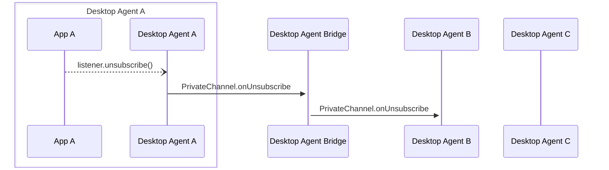

Desktop Agent bridging message exchange for the removal of a [`ContextHandler`](../../api/ref/Types#contexthandler) from a [`PrivateChannel`](../../api/ref/PrivateChannel). Generated by API calls:

- [`listener.unsubscribe()`](../../api/ref/Types#listener)
  - for [`Listener`](../../api/ref/Types#listener) objects returned by [`PrivateChannel`](../../api/ref/PrivateChannel) function:
    - [`addContextListener(handler: (contextType?: string) => void): Promise<Listener>`](../../api/ref/Channel#addcontextlistener) (inherited from `Channel`)
- [`PrivateChannel.disconnect()`](../../api/ref/PrivateChannel#disconnect)

[Message Exchange Type](../spec#individual-message-exchanges): **Request only**

:::caution

Some additional tracking of PrivateChannel metadata is required on the Desktop Agent that created each PrivateChannel and on any Desktop Agent interacting with it, in order to use these message exchanges. Please see the [relevant section of the Agent Bridging overview](../spec#privatechannels) for more details.

:::

When a `ContextListener` is removed from a `PrivateChannel` (via `listener.unsubscribe`) any applications that have added an `onSubscribe` handler MUST be notified. If the listener is on the agent that created that channel, it should forward the message onto all the registered listeners. If the listener is added on a remote agent it MUST send the message to the agent that created the channel which will repeat it onto the other listeners without modifying the source information.

## Message exchange



### Request message schemas

### Schema

- [https://fdc3.finos.org/schemas/next/bridging/privateChannelOnUnsubscribeAgentRequest.schema.json](/schemas/next/bridging/privateChannelOnUnsubscribeAgentRequest.schema.json)
- [https://fdc3.finos.org/schemas/next/bridging/privateChannelOnUnsubscribeBridgeRequest.schema.json](/schemas/next/bridging/privateChannelOnUnsubscribeBridgeRequest.schema.json)

### Example

```json
// DAB -> agent-B
{
    "type": "PrivateChannel.onUnsubscribe",
    "payload": {
        "channelId": "private-channel-ABC123",
        "contextType": "fdc3.instrument"
    },
    "meta": {
        "requestUuid": "<requestUuid>",
        "timestamp": "2020-03-...",
        "source": {
            "appId": "AnotherApp",
            "instanceId": "02e235ba-acad-4b66-4c3a-547073be23f1",
            "desktopAgent": "agent-B" //added by DAB
        },
        "destination": {
            "appId": "AChatApp",
            "instanceId": "02e575aa-4c3a-4b66-acad-155073be21f6",
            "desktopAgent": "agent-A"
        }
    }
}
```
