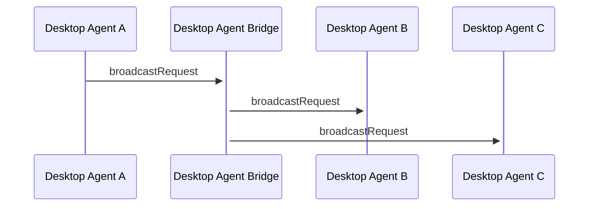

Desktop Agent bridging message exchange for a `broadcast()` API call on the [`DesktopAgent`](../../api/ref/DesktopAgent) or a [`Channel`](../../api/ref/Channel). Generated by API calls:

* [`fdc3.broadcast(context: Context)`](../../api/ref/DesktopAgent#broadcast)
* [`Channel.broadcast(context: Context)`](../../api/ref/Channel#broadcast)

:::caution

Broadcasts on a [`PrivateChannel`](../../api/ref/PrivateChannel) have a separate message exchange, see [`PrivateChannel.broadcast`](PrivateChannel.broadcast).

:::

[Message Exchange Type](../spec#individual-message-exchanges): **Request only**

E.g.

```javascript
fdc3.broadcast(contextObj);
```

or

```javascript
(await fdc3.getOrCreateChannel("myChannel")).broadcast(contextObj)
```

## Message exchange



## Request format

### Schema

[https://fdc3.finos.org/schemas/next/bridging/broadcastRequest.schema.json](/schemas/next/bridging/broadcastRequest.schema.json)

### Example

Outward message to the DAB:

```json
// agent-A -> DAB
{
    "type": "broadcastRequest",
    "payload": {
        "channel": "myChannel",
        "context": { /*contextObj*/ }
    },
    "meta": {
        "requestGuid": "<requestGuid>",
        "timestamp": "2022-03-...",
        "source": [{
            "appId": "agentA-app1",
            "instanceId": "c6ad5174-6f78-4582-8e96-728d93a4d7d7"
        }]
    }
}
```

which it repeats on to agent-B AND agent-C with the `source.desktopAgent` metadata added.

```json
// DAB -> agent-B
// DAB -> agent-C
{
    "type": "broadcastRequest",
    "payload": {
        "channel": "myChannel",
        "context": { /*contextObj*/}
    },
    "meta": {
        "requestGuid": "<requestGuid>",
        "timestamp": "2020-03-...",
        "source": [{
            "appId": "agentA-app1",
            "instanceId": "c6ad5174-6f78-4582-8e96-728d93a4d7d7",
            "desktopAgent": "agent-A" //added by DAB
        }]
    }
}
```
