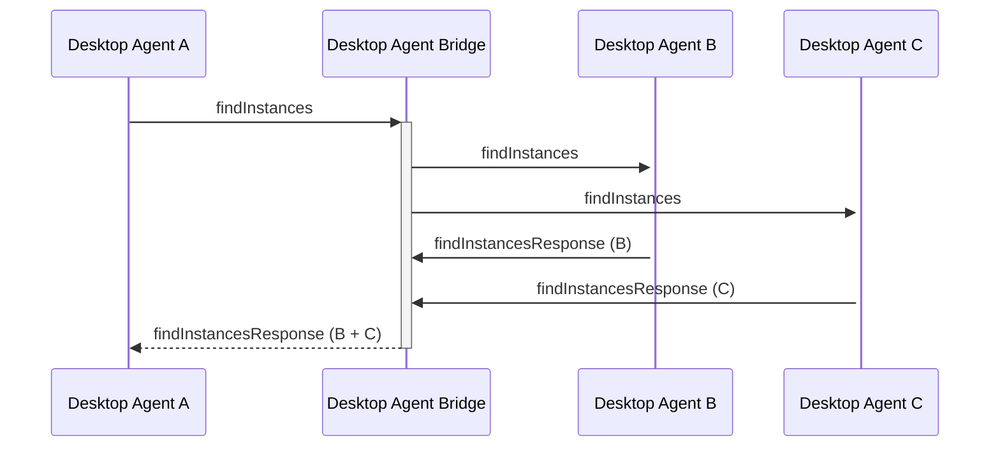

Desktop Agent bridging message exchange for a `findInstances` API call on the [`DesktopAgent`](../../api/ref/DesktopAgent). Generated by API calls:

* [`findInstances(app: AppIdentifier)`](../../api/ref/DesktopAgent#findinstances)

[Message Exchange Type](../spec#individual-message-exchanges): **Request Response (collated)** or **Request Response (single)**

E.g.

```javascript
// Retrieve a list of all instances of an application
let instances = await fdc3.findInstances({appId: "MyAppId"});

// Retrieve a list of instances of an application on a specified Desktop Agent
let instances = await fdc3.findInstances({appId: "MyAppId", desktopAgent: "agent-A"});
```

## Message exchange



## Request format

Outward message to the bridge:

```json
// agent-A -> DAB
{
    "type": "findInstances",
    "payload": {
        "app": {
            "appId": "myApp"
        }
    },
    "meta": {
        "requestGuid": "<requestGuid>",
        "timestamp": "2020-03-...",
        "source": {
            "appId": "AChatApp",
            "instanceId": "02e575aa-4c3a-4b66-acad-155073be21f6"
        }
    }
}
```

which is repeated on to the target agent as:

```json
// DAB -> agent-B
{
    "type": "findInstances",
    "payload": {
        "app": {
            "appId": "myApp"
        }
    },
    "meta": {
        "requestGuid": "<requestGuid>",
        "timestamp": 2020-03-...,
        "source": {
            "appId": "AChatApp",
            "instanceId": "02e575aa-4c3a-4b66-acad-155073be21f6",
            "desktopAgent": "agent-A" //added by DAB
        }
    }
}
```

If results should be constrained to a particular Desktop Agent, then set a `desktopAgent` field in `payload.app` and a matching `destination` field in `meta`:

```json
// agent-A -> DAB
{
    "type": "findInstances",
    "payload": {
        "app": {
            "appId": "myApp",
            "desktopAgent": "agent-B" // destination agent
        }
    },
    "meta": {
        "requestGuid": "<requestGuid>",
        "timestamp": "2020-03-...",
        "destination": { "desktopAgent": "agent-B"}, //destination agent
        "source": {
            "appId": "AChatApp",
            "instanceId": "02e575aa-4c3a-4b66-acad-155073be21f6"
        }
    }
}
```

The Desktop Agent Bridge should only forward the request to the requested Desktop Agent and handle the message exchange as a **Request Response (single)**.

## Response format

Response message from a Desktop Agent:

```json
// agent-B -> DAB
{
    "type":  "findInstancesResponse",
    "payload": {
        "appIdentifiers":  [
            { "appId": "myApp", "instanceId": "4bf39be1-a25b-4ad5-8dbc-ce37b436a344"},
            { "appId": "myApp", "instanceId": "4f10abb7-4df4-4fc6-8813-bbf0dc1b393d"},
        ]
    },
    "meta": {
        "requestGuid": "<requestGuid>",
        "responseGuid":  "<responseGuidAgentB>",
        "timestamp":  "2020-03-...",
    }
}
```

The bridge receives and collates the responses, augmenting each appIdentifier with a `desktopAgent` field, producing the following collated response which it sends back to agent-A:

```json
// DAB -> agent-A
{
    "type":  "findInstancesResponse",
    "payload": {
        "appIdentifiers":  [
            { "appId": "myApp", "instanceId": "4bf39be1-a25b-4ad5-8dbc-ce37b436a344", "desktopAgent": "agent-B"},
            //"desktopAgent" added by DAB
            { "appId": "myApp", "instanceId": "4f10abb7-4df4-4fc6-8813-bbf0dc1b393d", "desktopAgent": "agent-B" },
            { "appId": "myApp", "instanceId": "920b74f7-1fef-4076-adef-63b82bae0dd9", "desktopAgent": "agent-C" },
        ]
    },
    "meta": {
        "requestGuid": "<requestGuid>",
        "responseGuid":  "<responseGuidDAB>", 
        "timestamp":  "2020-03-...",
        "sources": [ //added by DAB
            { "desktopAgent": "agent-A" },
            { "desktopAgent": "agent-B" },
        ]
    }
}
```

:::info
If a target Desktop Agent was specified in the request (via a `desktopAgent` field in `payload.app`), then the DAB is not collating responses and does not need to generate a unique `meta.responseGuid` and can quote that given by the responding Desktop Agent.
:::

:::note
In the event that an agent times out or returns an error, where others respond, its `DesktopAgentIdentifier` should be added to the `meta.errorSources` element instead of `meta.sources`.
:::

Finally, agent-A combines the data received from the bridge, with its own local response to produce the response to the requesting application:

```json
// DAB -> agent-A
[
    { "appId": "myApp", "instanceId": "4bf39be1-a25b-4ad5-8dbc-ce37b436a344", "desktopAgent": "agent-B"},
    { "appId": "myApp", "instanceId": "4f10abb7-4df4-4fc6-8813-bbf0dc1b393d", "desktopAgent": "agent-B" },
    { "appId": "myApp", "instanceId": "920b74f7-1fef-4076-adef-63b82bae0dd9", "desktopAgent": "agent-C" },
    { "appId": "myApp", "instanceId": "688dbd5e-21dc-4469-b8cf-4b6a606f9a27" } //local response
]
```
