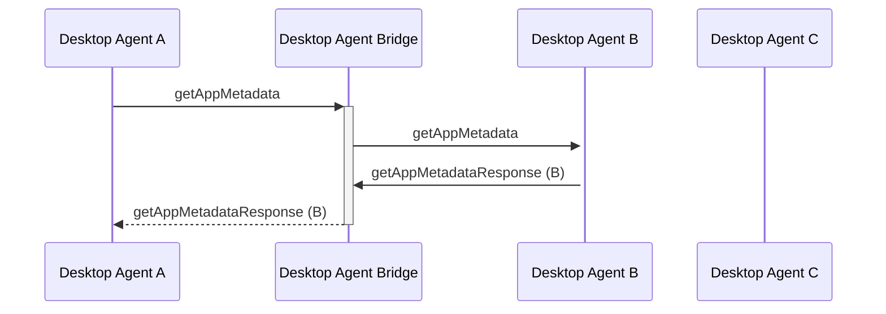

Desktop Agent bridging message exchange for a `getAppMetadata` API call on the [`DesktopAgent`](../../api/ref/DesktopAgent). Generated by API calls:

* [`getAppMetadata(app: AppIdentifier)`](../api/ref/DesktopAgent#getappmetadata)

[Message Exchange Type](../spec#individual-message-exchanges): **Request Response (single)**

E.g.

```javascript
let appIdentifier = { appId: "myApp@my.appd.com", desktopAgent: "agent-B" }
let appMetadata = await fdc3.getAppMetadata(appIdentifier);
```

:::info
`fdc3.getAppMetadata` calls should only involve the Desktop Agent Bridge where a `desktopAgent` field appears in the AppIdentifier being queried, all other calls should be handled locally by the Desktop Agent.
:::

## Message exchange



## Request format

Outward message to the bridge:

```json
// agent-A -> DAB
{
    "type": "getAppMetadata",
    "payload": {
        "app": {
            { "appId": "myApp@my.appd.com", "desktopAgent": "agent-B" }
        }
    },
    "meta": {
        "requestGuid": "<requestGuid>",
        "timestamp": "2020-03-...",
        "source": {
            "appId": "AChatApp",
            "instanceId": "02e575aa-4c3a-4b66-acad-155073be21f6"
        }
    }
}
```

which is repeated on to the target agent as:

```json
// DAB -> agent-B
{
    "type": "getAppMetadata",
    "payload": {
        "app": {
            { "appId": "myApp@my.appd.com", "desktopAgent": "agent-B" }
        }
    },
    "meta": {
        "requestGuid": "<requestGuid>",
        "timestamp": "2020-03-...",
        "source": {
            "appId": "AChatApp",
            "instanceId": "02e575aa-4c3a-4b66-acad-155073be21f6",
            "desktopAgent": "agent-A" //added by DAB
        }
    }
}
```

## Response format

Response message from a Desktop Agent:

```json
// agent-B -> DAB
{
    "type":  "getAppMetadataResponse",
    "payload": {
        "appMetadata": { 
            "appId": "myApp@my.appd.com",
            "name": "myApp",
            "version": "1.0",
            "title": "My example application",
            "tooltip": " A tooltip for the application that can be used to render UI elements.",
            "description": "A longer, multi-paragraph description for the application that could include mark-up.",
            "icons": [..],
            "screenshots": [...] 
        }
    },
    "meta": {
        "requestGuid": "<requestGuid>",
        "responseGuid":  "<responseGuidAgentB>",
        "timestamp":  "2020-03-...",
    }
}
```

The bridge receives the response, augments the appMetadata with a `desktopAgent` field, producing the following response which it sends back to agent-A:

```json
// DAB -> agent-A
{
    "type":  "getAppMetadataResponse",
    "payload": {
        "appMetadata": { 
            "appId": "myApp@my.appd.com",
            "name": "myApp",
            "version": "1.0",
            "title": "My example application",
            "tooltip": " A tooltip for the application that can be used to render UI elements.",
            "description": "A longer, multi-paragraph description for the application that could include mark-up.",
            "icons": [..],
            "screenshots": [...],
            "desktopAgent": "agent-B" //added by DAB
        }
    },
    "meta": {
        "requestGuid": "<requestGuid>",
        "responseGuid":  "<responseGuidAgentB>",
        "timestamp":  "2020-03-...",
    }
}
```
