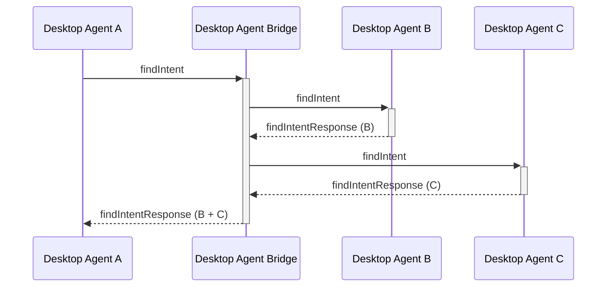
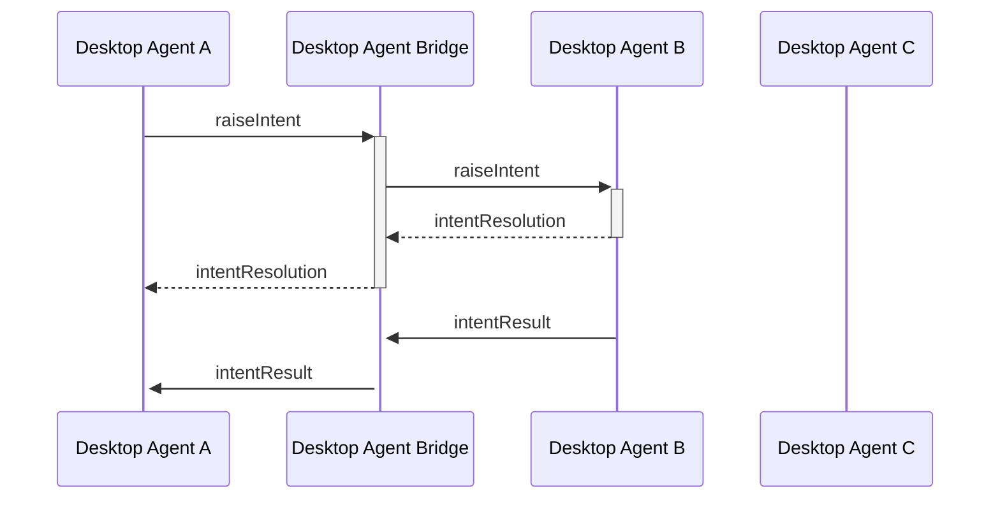
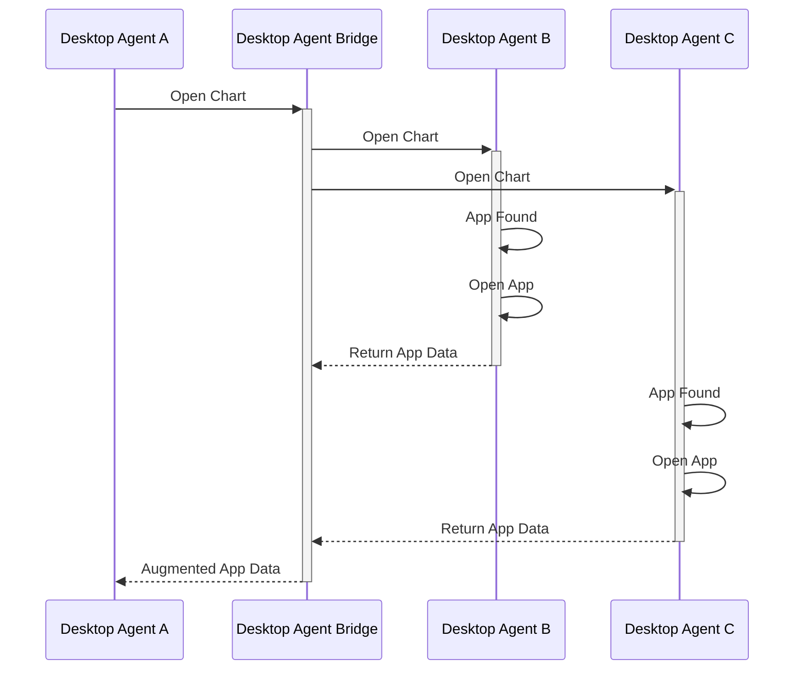
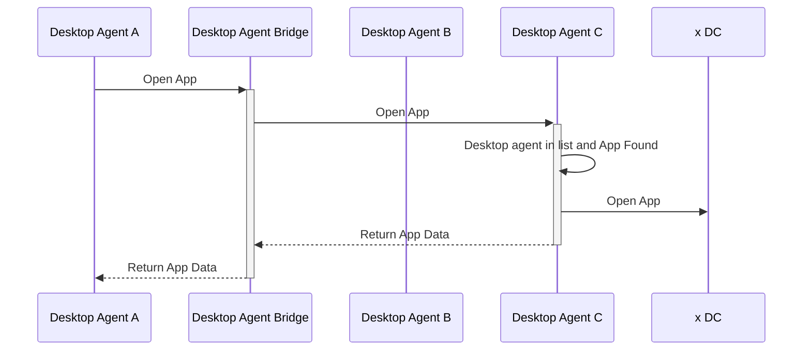
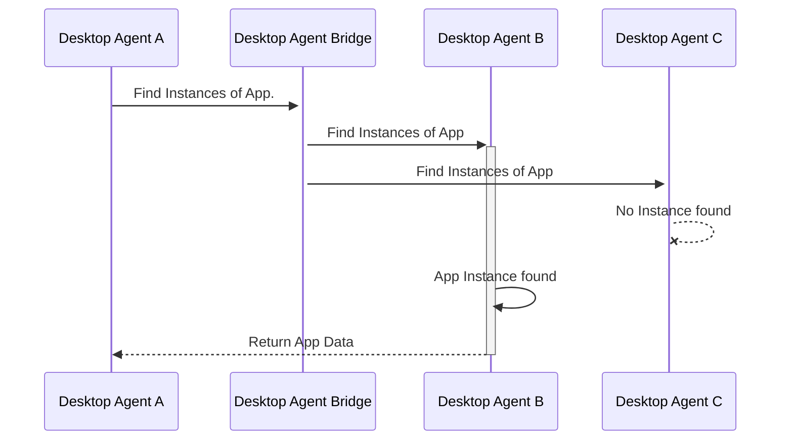

# Desktop Agent Bridging

In order to implement Desktop Agent Bridging some means for Desktop Agents to communicate with each other is needed. This spec assumes the Desktop Agent Bridging is implemented via a standalone bridge (instead of peer-to-peer or client/server topologies). Another assumption of this spec is that the data traffic will be over websocket connection.

This topology will be similar to a star topology on a network in which the Desktop Agent Bridge (DAB or simply bridge) will be the central node acting as a router.

The discovery, i.e. mechanism which allows us to discover which Desktop Agents (DA) are present in the "network" can be done via known port (TBD) or config.

How the data will flow from Desktop Agent (DA) over a bridge to other DA will be outlined below.

## Locating

A DAB will implement a "server" behavior by:

* receiving requests from clients
* route requests to clients
* route responses to clients

A DA will implement a "client" behavior by:

* forwarding requests to the bridge
* await response(s) from the bridge
* receive requests from the bridge

## Connecting

Desktop Agents should authenticate against the bridge, which needs to implement the authentication logic (TBD - access keys? JWT?).

The DAB is also responsible for assigning each DA a name. a name can be requested by a DA.

Whilst the DAB represents a single point of failure in this bridging configuration, a critical failure should only mean that a DA will operate as if it was the only DA in a machine.

## Interacting

With a standalone DAB, the message paths and message propagation should become simple to implement since messages will only from between a source and a destination with a DAB in the middle. A standalone DAB will also simplify the implementation for supporting multi-machine and Access Control Lists.  

### Handling FDC3 calls When Bridged

* DAs that are bridged will need to wait for responses from other DAs before responding to API calls.
  * for resilience, this may mean defining timeouts...

### Identifying Desktop Agents Identity and Message Sources

In order to target intents and perform other actions that require specific routing between DAs, DAs need to have an identity. Identities should be assigned to clients when they connect to the bridge, although they might request a particular identity. This allows for multiple copies of the same underlying desktop agent implementation to be bridged and ensures that id clashes can be avoided.

To prevent spoofing and to simplify the implementation of clients, sender identities for bridging messages should be added, by the bridge to `AppMetadata` objects embedded in them.

* Sender details to be added by the DAB to the embedded `AppMetadata` objects.
  * `AppMetadata` needs a new `desktopAgent` field
  * When a client connects to a DAB it should be assigned an identity of some sort, which can be used to augment messages with details of the agent
    * The DAB should do the assignments and could generate ids or accept them via config.
    * DAs don't need to know their own ids or even the ids of others, they just need to be able to pass around `AppMetadata` objects that contain them.

### Identifying Individual Messages

There are a variety of message types we'll need to send between bridged DAs, several of which will need to be replied to specifically (e.g. a `fdc3.raiseIntent` call should receive and `IntentResponse` when an app has been chosen and the intent and context delivered to it). Hence, messages also need a unique identity.

* GUIDs required to uniquely identify messages
  * To be referenced in replies

This means that each request that gets generated, should contain a request GUID, and every response to a request should contain a response GUID AND reference the request GUID. A response the does not reference a request GUID should be considered invalid.

### Forwarding of Messages from Other Agents

The DAB MUST be able to forward messages received from one DA on to others (excluding obviously the Desktop Agent where the request was originated). There are a few simple rules which determine whether a message needs to be forwarded:

* the message does not have a target Desktop Agent (e.g. findIntent)
  * If you are a DA, send it on to the bridge
  * The bridge will send it on to other known DAs (except the source of the message)

* If the message has a target Desktop Agent (e.g. response to findIntent)
  * The bridge will forward the message to it.

### Open Questions

* Do we need to make mandatory that a `fdc3.joinChannel` was invoked before you can return the current state of the channel?
* Bridging startup - Consider an app that joins a channel whose last context was sent before the bridge was created, then DA couldn’t send the correct initial context when the channel joined
  * Current context is ignored
  * Add an init flow where DAs share info about channels they have with context on them already - (this type of discovery of channels does not happen in FDC3 at the moment, therefore it would add significant complexity to the spec).
* How to handle slow responding DAs?

### AppMetadata

`AppMetadata` needs to be expanded to contain a `desktopAgent` field.

```typescript
interface AppMetadata {
  /** The unique app name that can be used with the open and raiseIntent calls. */
  readonly name: string;

  /** The unique application identifier located within a specific application directory instance. An example of an appId might be 'app@sub.root' */
  readonly appId?: string;

  /** The Version of the application. */
  readonly version?: string;

  /** An optional instance identifier, indicating that this object represents a specific instance of the application described.*/
  readonly instanceId?: string;

  /** An optional set of, implementation specific, metadata fields that can be used to disambiguate instances, such as a window title or screen position. Must only be set if `instanceId` is set. */
  readonly instanceMetadata?: Record<string, any>;

  /** A more user-friendly application title that can be used to render UI elements  */
  readonly title?: string;

  /**  A tooltip for the application that can be used to render UI elements */
  readonly tooltip?: string;

  /** A longer, multi-paragraph description for the application that could include mark-up */
  readonly description?: string;

  /** A list of icon URLs for the application that can be used to render UI elements */
  readonly icons?: Array<Icon>;

  /** A list of image URLs for the application that can be used to render UI elements */
  readonly images?: Array<string>;
  
  /** The type of result returned for any intent specified during resolution. 
   * May express a particular context type (e.g. "fdc3.instrument"), channel 
   * (e.g. "channel") or a channel that will receive a specified type 
   * (e.g. "channel<fdc3.instrument>"). */
  readonly resultType?: string | null;

  /** A string filled in by server on receipt of message, that represents 
   * the Desktop Agent that the app is available on. */
  readonly desktopAgent?: string;
}
```

### Generic request and response formats

For simplicity, in this spec the request and response GUID will be just `requestGUID` and `responseGUID`. A GUID/UUID 128-bit integer number used to uniquely identify resources should be used.

#### Request

```typescript
{
    /** FDC3 function name message relates to, e.g. "findIntent" */
    type:  string,
    /** Request body, containing the arguments to the function called.*/
    payload: {
        //example fields for specific messages... wouldn't be specified in base type
        channel?: string,
        intent?: string,
        context?: Context,
        //fields for other possible arguments
    },
    meta: {
        /** Unique guid for this request */
        requestGuid: string,
        /** Timestamp at which request was generated */
        timestamp:  date,
         /** AppMetadata source request received from */
        source?: AppMetadata
    }
}
```

#### Response

Responses will be differentiated by the presence of a `responseGuid` field and MUST reference the requestGuid that they are responding to.

```typescript
{
    /** FDC3 function name the original request related to, e.g. "findIntent" */
    type:  string,
    /** Response body */
    payload: {
        //example fields for specific messages... wouldn't be specified in base type
        intent?:  string,
        appIntent?:  AppIntent,
        //fields for other possible response values
    },
    meta: {
        /** Value from request*/
        requestGuid: string,
        /** Unique guid for this response */
        responseGuid:  string,
        /** Timestamp at which request was generated */
        timestamp:  Date,
        /** AppMetadata source request received from */
        source?: AppMetadata,
        /** AppMetadata destination response sent from */
        destination?: AppMetadata
    }
}
```

DAs should send these messages on to the bridge, which will add the `source.desktopAgent` metadata. Further, when processing responses, the bridge should also augment any `AppMetadata` objects in responses with the the same id applied to `source.desktopAgent`.

### Individual message exchanges

The sections below cover most scenarios for each of the Desktop Agent methods in order to explore how this protocol might work.

Each section assumes that we have 3 agents connected by a bridge:

* agent-A
* agent-B
* agent-C
* dab

## Context

### For broadcasts on channels

Only needs a single message (no response).

An app on agent-A does:

```javascript
fdc3.broadcast(contextObj);
```

or

```javascript
(await fdc3.getOrCreateChannel("myChannel")).broadcast(contextObj)
```


It encodes this as a message which it sends to the DAB

```JSON
// agent-a -> dab
{
    "type": "broadcast",
    "payload": {
        "channel": "myChannel",
        "context": { /*contextObj*/ }
    },
    "meta": {
        "requestGuid": "requestGuid",
        "timestamp": "2020-03-...",
        "source": {
            "name": "...",
            "appId": "...",
            "version": "...",
            // ... other metadata fields
        }
    }
}
```

which it repeats on to agent-B AND agent-c with the `source.desktopAgent` metadata added.

```JSON
// dab -> agent-b
// dab -> agent-c
{
    "type": "broadcast",
    "payload": {
        "channel": "myChannel",
        "context": { /*contextObj*/}
    },
    "meta": {
        "requestGuid": "requestGuid",
        "timestamp": "2020-03-...",
        "source": {
            "desktopAgent": "agent-A",
            "name": "...",
            "appId": "...",
            "version": "...",
            // ... other metadata fields
        },
    }
}
```

When adding context listeners (either for User Channels or specific App Channels) no messages need to be exchanged. Instead, upon receiving a broadcast message the Desktop Agent just needs to pass it on to all listeners on that named channel.

## Intents

### findIntent

```typescript
findIntent(intent: string, context?: Context): Promise<AppIntent>;
```



#### Request format

A findIntent call is made on agent-A.

```javascript
let appIntent = await fdc3.findIntent();
```

Sends an outward message to the DAB.

```JSON
// agent-a -> dab
{
   "type": "findIntent",
   "payload": {
        "intent": "StartChat",
        "context": {/*contextObj*/}
   },
   "meta": {
        "requestGuid": "requestGuid",
        "timestamp": "2020-03-...",
        "source": {
            "name": "",
            "appId": "",
            "version": "",
            // ... other metadata fields
        }
   }
}
```

The DAB fills in the `source.desktopAgent` field and forwards the request to the other desktop agents (agent-b AND agent-c).

```JSON
// dab -> agent-b
// dab -> agent-c
{
    "type": "findIntent",
    "payload": {
        "intent": "StartChat",
        "context": {/*contextObj*/},
    },
    "meta": {
        "requestGuid": "requestGuid",
        "timestamp": "2020-03-...",
        "source": {
            "desktopAgent": "agent-A", // filled by dab
            "name": "",
            "appId": "",
            "version": "",
            // ... other metadata fields
        }
    }
}
```

Note that the `source.desktopAgent` field has been populated with the id of the agent that raised the requests, enabling the routing of responses.

#### Response format

Normal response from agent-A, where the request was raised.

```JSON
{
    "intent": { "name": "StartChat", "displayName": "Chat" },
    "apps": [
        { "name": "myChat" }
    ]
}
```

DA agent-b would produce response:

```JSON
{
    "intent": { "name": "StartChat", "displayName": "Chat" },
    "apps": [
        { "name": "Skype" },
        { "name": "Symphony" },
        { "name": "Symphony", "instanceId": "93d2fe3e-a66c-41e1-b80b-246b87120859" },
        { "name": "Slack" }
    ]
}
```

which is sent back over the bridge as a response to the request message as:

```JSON
// agent-b -> dab
{
    "type":  "findIntentResponse",
    "payload": {
        "intent":  "StartChat",
        "appIntent":  {
            "intent":  { "name": "StartChat", "displayName": "Chat" },
            "apps": [
                { "name": "Skype"},
                { "name": "Symphony" },
                { "name": "Symphony", "instanceId": "93d2fe3e-a66c-41e1-b80b-246b87120859" },
                { "name": "Slack" }
            ]
        }
    },
    "meta": {
        "requestGuid": "requestGuid",
        "responseGuid":  "responseGuidAgentB",
        "timestamp":  "2020-03-...",
        "destination": {
            "desktopAgent": "agent-A",
            "name": "",
            "appId": "",
            "version": "",
            // ... other metadata fields
        }
    }
}
```

Note the response guid generated by the agent-b and the reference to the request guid produced by agent-a where the request was originated.

This response gets repeated by the bridge in augmented form as:

```JSON
{
    "type":  "findIntentResponse",
    "payload": {
        "intent":  "StartChat",
        "appIntent":  {
            "intent":  { "name": "StartChat", "displayName": "Chat" },
            "apps": [
                { "name": "Skype", "desktopAgent": "agent-B"},
                { "name": "Symphony", "desktopAgent": "agent-B" },
                { "name": "Symphony", "instanceId": "93d2fe3e-a66c-41e1-b80b-246b87120859", "desktopAgent": "agent-B" },
                { "name": "Slack", "desktopAgent": "agent-B" }
            ]
        }
    },
    "meta": {
        "requestGuid": "requestGuid",
        "responseGuid":  "responseGuidAgentB",
        "timestamp":  "2020-03-...",
        "destination": {
            "desktopAgent": "agent-A",
            "name": "",
            "appId": "",
            "version": "",
            // ... other metadata fields
        },
        "source": {
            "desktopAgent": "agent-B",
        }
    }
}
```

DA agent-c would produce response:

```JSON
{
    "intent":  { "name": "StartChat", "displayName": "Chat" },
    "apps": [
       { "name": "WebIce"}
    ]
}
```

which is sent back over the bridge as a response to the request message as:

```JSON
// agent-c -> dab
{
    "type":  "findIntentResponse",
    "payload": {
        "intent":  "StartChat",
        "appIntent":  {
            "intent":  { "name": "StartChat", "displayName": "Chat" },
            "apps": [
                { "name": "WebIce", "desktopAgent": "agent-C"}
            ]
        }
    },
    "meta": {
        "requestGuid": "requestGuid",
        "responseGuid":  "responseGuidAgentC",
        "timestamp":  "2020-03-...",
        "destination": {
           "desktopAgent": "agent-A",
           "name": "",
           "appId": "",
           "version": "",
           // ... other metadata fields
       }
    }
}
```

This response gets repeated by the bridge in augmented form as:

```JSON
{
    "type":  "findIntentResponse",
    "payload": {
        "intent":  "StartChat",
        "appIntent":  {
            "intent":  { "name": "StartChat", "displayName": "Chat" },
            "apps": [
                { "name": "WebIce", "desktopAgent": "agent-C"}
            ]
        }
    },
    "meta": {
        "requestGuid": "requestGuid",
        "responseGuid":  "responseGuidAgentC",
        "timestamp":  "2020-03-...",
        "destination": {
           "desktopAgent": "agent-A",
           "name": "",
           "appId": "",
           "version": "",
           // ... other metadata fields
       },
       "source": {
            "desktopAgent": "agent-C",
        }
    }
}
```

Then on agent-A the originating app finally gets back the following response from the bridge:

```JSON
// dab -> agent-A
{
    "intent":  { "name": "StartChat", "displayName": "Chat" },
    "apps": [
        { "name": "myChat" }, // local to this agent
        { "name": "Skype", "desktopAgent": "agent-B" }, //agent-B responses
        { "name": "Symphony", "desktopAgent": "agent-B" },
        { "name": "Symphony", "instanceId": "93d2fe3e-a66c-41e1-b80b-246b87120859", "desktopAgent": "agent-B" },
        { "name": "Slack", "desktopAgent": "agent-B" },
        { "name": "WebIce", "desktopAgent": "agent-C"} //agent C response
    ]
}
```

### raiseIntent

```typescript
raiseIntent(intent: string, context: Context, app?: TargetApp): Promise<IntentResolution>;
```

For Desktop Agent bridging, a `raiseIntent` call MUST always pass a `app:TargetApp` argument. If one is not passed a `findIntent` will be sent instead to collect options to display in a local resolver UI, allowing for a targeted intent to be raised afterwards. See details below.

When receiving a response from invoking `raiseIntent` the new app instances MUST be fully initialized ie. the responding Desktop Agent will need to return an `AppMetadata` with an `instanceId`.

Note that the below diagram assumes a `raiseIntent` WITH a `app:TargetApp` was specified and therefore agent-C is not involved.




#### Request format

A raiseIntent call, __without__ `app:TargetApp` argument is made on agent-A.

```typescript
raiseIntent(intent: string, context: Context): Promise<IntentResolution>;
```

agent-A sends an outward `findIntent` message to the DAB:

```JSON
// agent-a -> dab
{
    "type": "findIntent",
    "payload": {
        "intent": "StartChat",
        "context": {/*contextObj*/}
    },
    "meta": {
        "requestGuid": "requestGuid",
        "timestamp": "2020-03-...",
        "source": {
            "name": "someOtherApp", //should this be the desktop agent or the app?
            "appId": "...",
            "version": "...",
            // ... other metadata fields
        }
    }
}
```

This will trigger the same flow as `findIntent`. Upon receiving a `findIntentResponse`, the resolver is shown.

User selects an option which will trigger a `raiseIntent` call with a `app:TargetApp` argument.

---

A `raiseIntent` call is made on agent-A which targets an `AChatApp` in agent-B.

```typescript
raiseIntent(intent: string, context: Context, app: TargetApp): Promise<IntentResolution>;
```

```JSON
// agent-a -> dab
{
    "type": "raiseIntent",
    "payload": {
        "intent": "StartChat",
        "context": {/*contextObj*/},
        "app": {
            "name": "AChatApp",
            "desktopAgent": "agent-B"
        }
    },
    "meta": {
        "requestGuid": "requestGuid",
        "timestamp": "2020-03-...",
        "source": {
                "name": "someOtherApp",
                "appId": "...",
                "version": "...",
                // ... other metadata fields
        },
        "destination": { // duplicates the app argument so that the message is routed like any other
                "app": {
                "name": "AChatApp",
                "desktopAgent": "agent-B"
            }
        }
    }
}
```

The bridge fills in the `source.desktopAgent` field and forwards the request to the target desktop agent

```JSON
// dab -> agent-B
{
    "type": "raiseIntent",
    "payload": {
        "intent": "StartChat",
        "context": {/*contextObj*/},
    },
    "meta": {
        "requestGuid": "requestGuid",
        "timestamp": "2020-03-...",
        "source": {
            "name": "someOtherApp",
            "appId": "...",
            "version": "...",
            "desktopAgent": "agent-A" // <---- filled by DAB
            // ... other metadata fields
        },
        "destination": {
            "app": {
                "name": "AChatApp",
                "desktopAgent": "agent-B"
            }
        },
    }
}
```

#### Response format

Normal response from agent-B, where the request was targeted to by agent-A. It sends this `intentResolution` as soon as it delivers the `raiseIntent` to the target app

```JSON
// agent-B -> DAB
{
    "type": "intentResolution",
    "payload": {
        "intent": "StartChat",
        "source": {
            "name": "AChatApp",
            "appId": "",
            "version": "",
            // ... other metadata fields
        },
        "version": "...",
    },
    "meta": {
        "requestGuid": "requestGuid",
        "responseGuid": "intentResolutionResponseGuid",
        "timestamp": "2020-03-...",
        "error?:": "ResolveError Enum",
        "source": { //Note this was the destination of the raised intent
            "name": "AChatApp",
            "appId": "",
            "version": "",
            // ... other metadata fields
        },
        "destination": { 
            "app": { //note this was the source of the raised intent
            "name": "someOtherApp",
            "appId": "",
                "version": "",
                "desktopAgent": "agent-A"
                // ... other metadata fields
            }
        }
    }
}
```

The bridge will fill in the `source.DesktopAgent` and relay the message on to agent-A

```JSON
// dab -> agent-A
{
    "type": "intentResolution",
    "payload": {
        "intent": "StartChat",
        "source": {
            "name": "AChatApp",
            "appId": "",
            "version": "",
            "desktopAgent": "agent-B" // filled by DAB
            // ... other metadata fields
        },
        "version": "...",
    },
    "meta": {
        "requestGuid": "requestGuid",
        "responseGuid": "intentResolutionResponseGuid",
        "timestamp": "2020-03-...",
        "source": {
            "name": "AChatApp",
            "appId": "",
            "version": "",
            "desktopAgent": "agent-B" // filled by DAB
            // ... other metadata fields
        },
        "destination": { // duplicates the app argument
            "app": {
               "name": "someOtherApp",
               "appId": "",
                "version": "",
                "desktopAgent": "agent-A"
                // ... other metadata fields
           }
       }
    }
}
```

When `AChatApp` produces a response, or the intent handler finishes running, it should send a further `intentResult` message to send that response onto the intent raiser (or throw an error if one occurred)

```JSON
// agent-B -> DAB -> agent-A
{
    "type": "intentResult",
    "payload?:": {
        "channel": {
            "id": "channel 1",
            "type": "system"
        },
        "context": {/*contextObj*/} // in alternative to channel
    },
    "meta": {
        "requestGuid": "requestGuid",
        "responseGuid": "intentResultResponseGuid",
        "timestamp": "2020-03-...",
        "error?:": "ResultError Enum",
        "source": {
            "name": "AChatApp",
            "appId": "",
            "version": "",
            "desktopAgent": "agent-B" // filled by DAB
            // ... other metadata fields
        },
        "destination": { // duplicates the app argument
            "app": {
               "name": "someOtherApp",
               "appId": "",
                "version": "",
                "desktopAgent": "agent-A"
                // ... other metadata fields
           }
       }
    }
}
```

If intent result is private channel:

```JSON
// agent-B -> DAB -> agent-A
{
    "type": "intentResult",
    "payload?:": {
        "channel": {
            "id": "channel a",
            "type": "private"
        },
        "context": {/*contextObj*/} // in alternative to channel
    },
    "meta": {
        "requestGuid": "requestGuid",
        "responseGuid": "intentResultResponseGuid",
        "timestamp": "2020-03-...",
        "error?:": "ResultError Enum",
        "source": {
            "name": "AChatApp",
            "appId": "",
            "version": "",
            "desktopAgent": "agent-B" // filled by DAB
            // ... other metadata fields
        },
        "destination": { // duplicates the app argument
            "app": {
            "name": "someOtherApp",
            "appId": "",
                "version": "",
                "desktopAgent": "agent-A"
                // ... other metadata fields
            }
        }
    }
}
```

---
`onSubscribe` to the private channel sent to server:

```JSON
// agent-A -> dab
{
    "type": "privateChannelSubscribe",
    "payload": {},
    "meta": {
        "requestGuid": "requestGuid",
        "timestamp": "2020-03-...",
        "source": {
            "name": "AChatApp",
            "appId": "",
            "version": "",
            // ... other metadata fields
        },
        "destination": { // duplicates the app argument
            "app": {
            "name": "someOtherApp",
            "appId": "",
                "version": "",
                "desktopAgent": "agent-B"
                // ... other metadata fields
            }
        }
    }
}
```

The bridge will add in the source agent (agent-A) and forward the message to destination (agent-B)

```JSON
// dab -> agent-b
{
    "type": "privateChannelSubscribe",
    "payload": {},
    "meta": {
        "requestGuid": "requestGuid",
        "timestamp": "2020-03-...",
        "source": {
            "name": "AChatApp",
            "appId": "",
            "version": "",
            "desktopAgent": "agent-A"
            // ... other metadata fields
        },
            "destination": { // duplicates the app argument
                "app": {
                "name": "someOtherApp",
                "appId": "",
                    "version": "",
                    "desktopAgent": "agent-B"
                    // ... other metadata fields
            }
        }
    }
}
```

---
`onUnsubscribe` to the private channel sent to the bridge

```JSON
// agent-A -> dab
{
    "type": "privateChannelUnsubscribe",
    "payload": {},
    "meta": {
        "requestGuid": "requestGuid",
        "timestamp": "2020-03-...",
        "source": {
            "name": "AChatApp",
            "appId": "",
            "version": "",
            // ... other metadata fields
        },
        "destination": { // duplicates the app argument
            "app": {
               "name": "someOtherApp",
               "appId": "",
                "version": "",
                "desktopAgent": "agent-B"
                // ... other metadata fields
           }
       }
    }
}
```

The bridge will add in the source agent (agent-A) and forward the message to destination (agent-B)

```JSON
// dab -> agent-B
{
    "requestGuid": "requestGuid",
    "timestamp": "2020-03-...",
    "type": "privateChannelUnsubscribe",
    "payload": {},
    "meta": {
        "source": {
            "name": "AChatApp",
            "appId": "",
            "version": "",
            "desktopAgent": "agent-A",
            // ... other metadata fields
        },
        "destination": { // duplicates the app argument
            "app": {
               "name": "someOtherApp",
               "appId": "",
                "version": "",
                "desktopAgent": "agent-B"
                // ... other metadata fields
           }
       }
    }
}
```

---
`onDisconnect` to the private channel sent to the bridge

```JSON
// agent-A -> dab
{
    "type": "privateChannelDisconnect",
    "payload": {},
    "meta": {
        "requestGuid": "requestGuid",
        "timestamp": "2020-03-...",
        "source": {
            "name": "AChatApp",
            "appId": "",
            "version": "",
            // ... other metadata fields
        },
        "destination": { // duplicates the app argument
            "app": {
               "name": "someOtherApp",
               "appId": "",
                "version": "",
                "desktopAgent": "agent-B"
                // ... other metadata fields
           }
       }
    }
}
```

The bridge will add in the source agent (agent-A) and forward the message to destination (agent-B)

```JSON
// dab -> agent-B
{
    "type": "privateChannelDisconnect",
    "payload": {},
    "meta": {
        "requestGuid": "requestGuid",
        "timestamp": "2020-03-...",
        "source": {
            "name": "AChatApp",
            "appId": "",
            "version": "",
            "desktopAgent": "agent-A"
            // ... other metadata fields
        },
        "destination": { // duplicates the app argument
            "app": {
               "name": "someOtherApp",
               "appId": "",
                "version": "",
                "desktopAgent": "agent-B"
                // ... other metadata fields
           }
       }
    }
}
```

---

### `fdc3.open`

```typescript
  open(app: TargetApp, context?: Context): Promise<AppMetadata>;
```

When receiving a response from invoking `fdc3.open` the new app instances MUST be fully initialized ie. the responding Desktop Agent will need to return an `AppMetadata` with an `instanceId`.

#### Request format

A `fdc3.open` call is made on agent-A.

```javascript
// Open an app without context, using the app name
let instanceMetadata = await fdc3.open('myApp');

// Open an app without context, using an AppMetadata object to specify the target
let appMetadata = {name: 'myApp', appId: 'myApp-v1.0.1', version: '1.0.1'};
let instanceMetadata = await fdc3.open(appMetadata);

// Open an app without context, using an AppMetadata object to specify the target and Desktop Agent
let appMetadata = {name: 'myApp', appId: 'myApp-v1.0.1', version: '1.0.1', desktopAgent:"DesktopAgentB"};
let instanceMetadata = await fdc3.open(appMetadata);
```

The `fdc3.open` command should result in a single copy of the specified app being opened and its instance data returned, or an error if it could not be opened. There are two possible scenarios:

1) The Desktop Agent that the app should open on is specified
2) The Desktop Agent that the app should open on is NOT specified app

The first case (target Desktop Agent is specified) is simple:

* If the local Desktop Agent is the target, handle the call normally
* If you are a server
  * check if any of your clients is the target and transmit the call to them and await a response
  * If you are also a client of another server follow the client steps
  * otherwise return `OpenError.AppNotFound`
* If you are a client
  * transmit the call to the server and await a response

The second case is a little trickier as we don't know which agent may have the app available:

* If the local Desktop Agent has the app, open it and exit.
* If you are a server
  * call each client one at a time and await a response
    * If the response is `OpenError.AppNotFound` move to the next client
    * If the response is `AppMetadata` then return it and exit
  * If you are also a client of another server follow the client steps
  * otherwise return `OpenError.AppNotFound`
* If you are a client
  * transmit the call to the server and await a response




__When the target Desktop Agent is set__



It sends an outward message to the bridge:

```JSON
// agent-A -> DAB
{
    "type": "open",
    "payload": {
        "appMetaData": {
            "name": "myApp",
            "appId": "myApp-v1.0.1",
            "version": "1.0.1",
            "desktopAgent":"agent-B"
            },
        "context": {/*contextObj*/}
    },
    "meta": {
        "requestGuid": "requestGuid",
        "timestamp": "2020-03-...",
    }
}
```

which is repeated as:

```JSON
// DAB -> agent-B
{
    "type": "open",
    "payload": {
        "appMetaData": {
            "name": "myApp",
           "appId": "myApp-v1.0.1",
           "version": "1.0.1",
           "desktopAgent":"DesktopAgentB"
           },
       "context": {/*contextObj*/}
    },
    "meta": {
        "requestGuid": "requestGuid",
        "timestamp": 2020-03-...,
        "source": {
            "desktoAgent": "agent-A", // filled by DAB
            // ... other metadata fields
        }
    }
}
```

### `fdc3.findInstances`

```typescript
  findInstances(app: TargetApp): Promise<Array<AppMetadata>>;
```



## Channels

App Channels don't need specific messages sending for `fdc3.getOrCreateChannel` as other agents will be come aware of it when messages are broadcast.

However, `PrivateChannel` instances do require additional handling due to the listeners for subscription and disconnect. Please see the raiseIntent section for the messages sent in support of this functionality.
