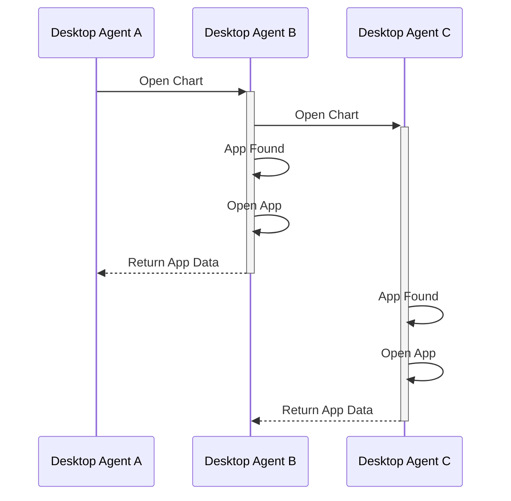
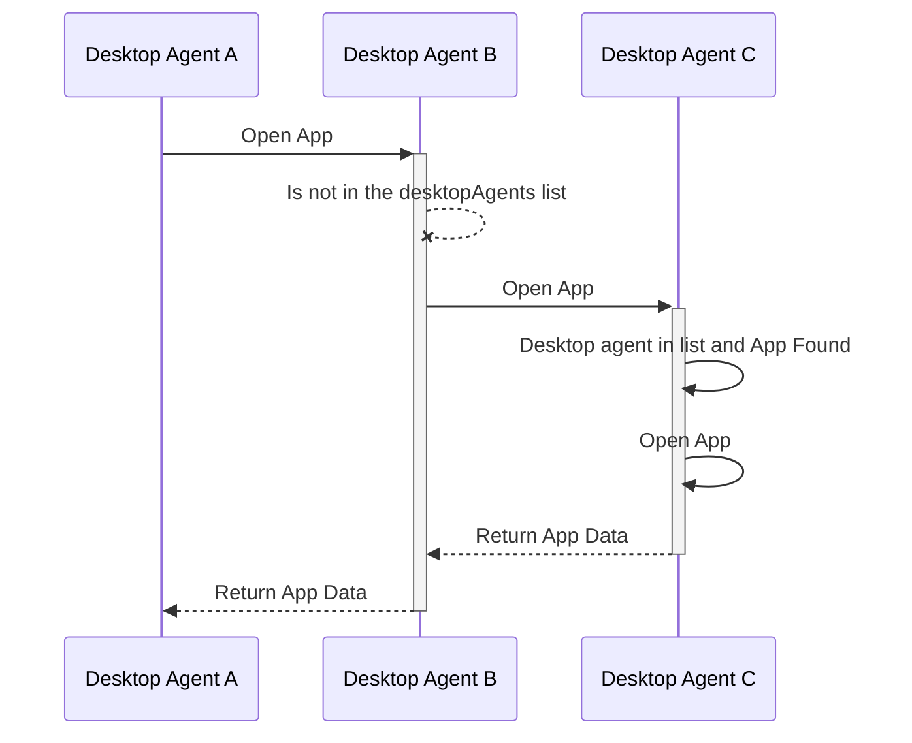
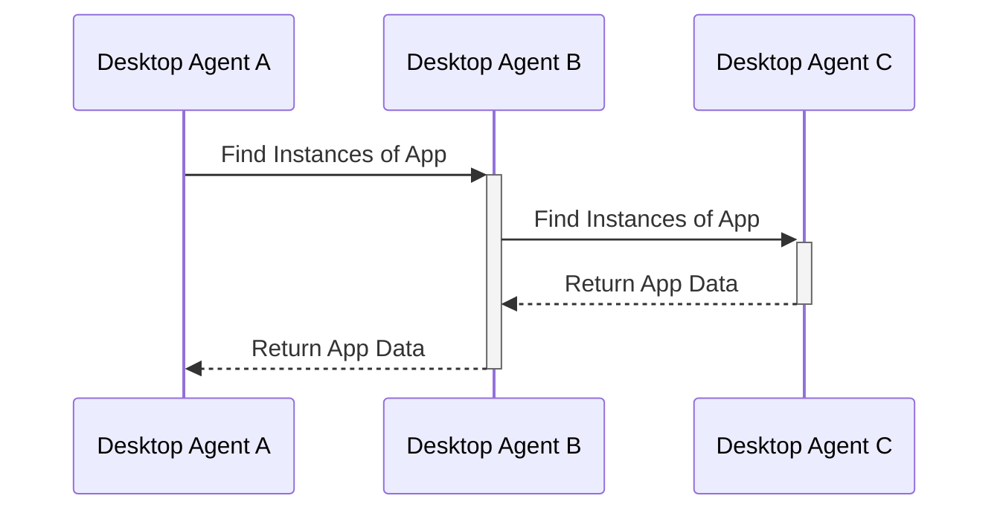

# Desktop Agent Bridging

In order to implement Desktop Agent Bridging some means for Desktop Agents to communicate with each other is needed. One obvious solution is to support the use a websocket to communicate. However, to do so some idea of the protocol for that communication is needed. 

## Websocket protocol proposal 
In a typical bridging scenario, one of more Desktop Agents will need to provide a websocket server for other agents to connect to - in the rest of this proposal the agent providing the websocket server will be referred to as 'the server' or 'a server', while Desktop Agents connecting to it are referred to as 'the client' or 'a client'.

If a Desktop Agent acts as a server, this should not preclude it also being a client of another server (allowing for a variety of bridging topologies). However, there should exist only one connection between any two desktop agents.

### Identifying Desktop Agents and Message Sources
In order to target intents and perform other actions that require specific routing between Desktop Agents, Desktop Agents need to have an identity. Identities should be assigned to clients when they connect to a server, although they might request a particular identity. This allows for multiple copies of the same underlying desktop agent implementation to be bridged and ensures that id clashes can be avoided.

To prevent spoofing and to simplify the implementation of clients, sender identities for birdging messages should be added, by the server to top level messages AND to AppMetadata objects embedded in them.

* Sender details to be added by websocket server to top level messages AND any embedded AppMetadata objects.
    * AppMetadata needs a new `desktopAgent `field
    * When a client connects to a server it should be assigned an identity of some sort, which can be used to augment messages with details of the agent
        * The server should do the assignments and could generate ids or accept them via config.
        * Clients don't need to know their own ids or even the ids of others, they just need to be able to pass around AppMetadata objects that contain them.

### Identifying Individual Messages
There are a variety of message types we'll need to send between bridged Desktop Agents, several of which will need to be replied to specifically (e.g. a `fdc3.raiseIntent` call should receive and `IntentResponse` when an app has been chosen and the intent and context delivered to it). Hence, messages also need a unique identity.

* GUIDs required to uniquely identify messages
    * To be referenced in replies

### Handling FDC3 calls When Bridged
* Desktop agents that are bridged will need to wait for responses from other desktop agents before responding to API calls.
    * for resilience, this may mean defining timeouts...

### Forwarding of Messages from Other Agents
To enable support for a vairety of topologies, it is necessary for a Desktop Agent to be able to forward messages received from one Desktop Agent on to others. There are a few simple rules which determine whether a message needs to be forwarded:
- the message does not have a target Desktop Agent (e.g. findIntent)
  - If you are a client of a server, send it on to the server
  - If you are a server, send it on to your clients (except the source of the message)
  - If you are both do both
- If the message has a target Destkop Agent (e.g. response to findIntent)
  - If you are a server and the target is one of your clients forward the message to it.
  - If you are a client (and teh target isn't you) forward the message to your server.


### Open Questions
* Is it necessary to preserve message path as it passes through different servers?


### Generic request and response formats

#### Request:
```typescript
{
    /** Unique guid for this request */
    requestGuid: string,
    /** Timestamp at which request was generated */
    timestamp:  date,
    /** FDC3 function name message relates to, e.g. "findIntent" */
    type:  string,
    /** Request body, containing the arguments to the function called.*/
    payload: {
        //example fields for specific messages... wouldn't be specified in base type
        channel?: string,
        intent?: string,
        context?: Context,
        //fields for other possible arguments
    },
    /** AppMetadata source request received from */
    source?: {
            AppMetadata & {
            desktopAgent?: string // filled in by server on receipt of message
            }
    }
}
```

#### Response:
Responses will be differentiated by the presence of a `responseGuid` field.
```typescript
{
    /** Value from request*/
    requestGuid: string,
    /** Unique guid for this response */
    responseGuid:  string,
    /** Timestamp at which request was generated */
    timestamp:  Date,
    /** FDC3 function name the original request related to, e.g. "findIntent" */
    type:  string, //same as request value
    /** Response body */
    payload: {
        //example fields for specific messages... wouldn't be specified in base type
        intent?:  string,
        appIntent?:  AppIntent,
        //fields for other possible response values
    },
    /** AppMetadata source request received from */
    source?: {
        AppMetadata & {
            desktopAgent?: string // filled in by server on receipt of message
        }
    }
    /** AppMetadata destination response sent from */
    destination?: {
        AppMetadata & {
            desktopAgent?: string // filled in by server on receipt of message
        }
    }
}
```
Clients should send these messages on to the 'server', which will add the `source.desktopAgent` metadata. Further, when processing responses, the agent acting as the 'server' should augment any `AppMetadata` objects in responses with the the same id applied to `source.desktopAgent`.


### Individual message exchanges
The sections below cover most scenerios for each of the Desktop Agent methods in order to explore how this protocol might work.

Each section assumes that we have 3 agents connected by bridge: agent-A, agent-B and agent-C. Agent-C provides a websocket server that agent-A and agent-B have connected to.


## Context
### For broadcasts on channels
Only needs a single message (no response)
An app on agent-A does:
```javascript
fdc3.broadcast(contextObj);
```
or
```javascript
(await fdc3.getOrCreateChannel("myChannel")).broadcast(contextObj)
```

It encodes this as a message which it sends to the websocket server (agent-C)

Message flow: agent-A -> agent-C

```JSON
{
    "requestGuid": "some-guid-string-here",
    "timestamp": "2020-03-...",
    "type": "broadcast",
    "payload": {
        "channel": "myChannel",
        "context": { /*contxtObj*/ }
    },
    "source": {
        "name": "...",
        "appId": "...",
        "version": "...",
        // ... other metadata fields
    }
}
```

which it repeats on to Agent-B with the `source.desktopAgent` metadata added.

Message flow: agent-C -> agent-B

```JSON
{
    "requestGuid": "some-guid-string-here",
    "timestamp": "2020-03-...",
    "type": "broadcast",
    "payload": {
        "channel": "myChannel",
        "context": { /*contxtObj*/}
    },
    "source": {
        "desktopAgent": "agent-A",
        "name": "...",
        "appId": "...",
        "version": "...",
        // ... other metadata fields
    }
}
```

When adding context listeners (either for User channels or specific App Channels) no messages need to be exchanged. Instead, upon receving a broadcast message the Desktop Agent just needs  to pass it on to all listeners on that named channel.

## Intents
### findIntent
```typescript
findIntent(intent: string, context?: Context): Promise<AppIntent>;
```

#### Request format:

A findIntent call is made on agent-A.
```javascript
let appIntent = await fdc3.findIntent();
```

Sends an outward message to the desktop agent(s) acting as server(s).

```JSON
// agent-A -> agent-C
{
   "requestGuid": "requestGuid",
   "timestamp": "2020-03-...",
   "type": "findIntent",
   "payload": {
       "intent": "StartChat",
       "context": {/*contxtObj*/}
   },
   "source": {
        "name": "",
        "appId": "",
        "version": "",
        // ... other metadata fields
    }
}
```

The server (agent-C) fills in the `source.desktopAgent` field and forwards the request to the other desktop agents.

```JSON
// agent-C -> agent-B
{
    "requestGuid": "requestGuid",
    "timestamp": "2020-03-...",
    "type": "findIntent",
    "payload": {
        "intent": "StartChat",
        "context": {/*contxtObj*/},
    },
    "source": {
        "desktoAgent": "agent-A",
        "name": "",
        "appId": "",
        "version": "",
        // ... other metadata fields
    }
}
```
Note that the `source.desktopAgent` field has been populated with the id of the agent that raised the requests, enabling the routing of responses.

#### Response format

Normal response from agent-A, where the request was raised (a websocket client)
```JSON
{
    "intent": { "name": "StartChat", "displayName": "Chat" },
    "apps": [
        { "name": "myChat" }
    ]
}
```

Desktop agent B (a websocket client) woud produce response:
```JSON
{
    "intent": { "name": "StartChat", "displayName": "Chat" },
    "apps": [
        { "name": "Skype" },
        { "name": "Symphony" },
        { "name": "Symphony", "instanceId": "93d2fe3e-a66c-41e1-b80b-246b87120859" },
        { "name": "Slack" }
    ]
}
```

which is sent back over the bridge as a response to the request message as:

```JSON
// agent-B -> agent-C
{
    "requestGuid": "requestGuid",
    "responseGuid":  "requestAgentBGuid",
    "timestamp":  "2020-03-...",
    "type":  "findIntentResponse",
    "payload": {
        "intent":  "StartChat",
        "appIntent":  {
            "intent":  { "name": "StartChat", "displayName": "Chat" },
            "apps": [
                { "name": "Skype"},
                { "name": "Symphony" },
                { "name": "Symphony", "instanceId": "93d2fe3e-a66c-41e1-b80b-246b87120859" },
                { "name": "Slack" }
            ]
        }
    },
    "destination": {
        "desktopAgent": "agent-A",
        "name": "",
        "appId": "",
        "version": "",
        // ... other metadata fields
    }
}
```

Which gets repeated by the websocket server (agent-C) in augmented form as:

```JSON
{
    "requestGuid": "requestGuid",
    "responseGuid":  "requestAgentB_Guid",
    "timestamp":  "2020-03-...",
    "type":  "findIntentResponse",
    "payload": {
        "intent":  "StartChat",
        "appIntent":  {
            "intent":  { "name": "StartChat", "displayName": "Chat" },
            "apps": [
                { "name": "Skype", "desktopAgent": "agent-B"},
                { "name": "Symphony", "desktopAgent": "agent-B" },
                { "name": "Symphony", "instanceId": "93d2fe3e-a66c-41e1-b80b-246b87120859", "desktopAgent": "agent-B" },
                { "name": "Slack", "desktopAgent": "agent-B" }
            ]
        }
    },
    "destination": {
        "desktopAgent": "agent-A",
        "name": "",
        "appId": "",
        "version": "",
        // ... other metadata fields
    },
    "source": {
        "desktoAgent": "agent-B",
    }
}
```

Desktop agent C (the websocket server) also sends its own response:
```JSON
{
    "intent":  { "name": "StartChat", "displayName": "Chat" },
    "apps": [
       { "name": "WebIce"}
    ]
}
```

which it encodes as a message:
```JSON
{
    "requestGuid": "requestGuid",
    "responseGuid":  "requestAgentC_Guid",
    "timestamp":  "2020-03-...",
    "type":  "findIntentResponse",
    "payload": {
        "intent":  "StartChat",
        "appIntent":  {
            "intent":  { "name": "StartChat", "displayName": "Chat" },
            "apps": [
            { "name": "WebIce", "desktopAgent": "agent-C"}
            ]
        }
    },
     "destination": {
        "desktopAgent": "agent-A",
        "name": "",
        "appId": "",
        "version": "",
        // ... other metadata fields
    },
    "source": {
        "desktoAgent": "agent-C",
    }
}
```
Then on agent-A the originating app finally gets back the following response from agent-C:

```JSON
// agent-C -> agent-A
{
    "intent":  { "name": "StartChat", "displayName": "Chat" },
    "apps": [
        { "name": "myChat" }, // local to this agent
        { "name": "Skype", "desktopAgent": "agent-B" }, //agent-B responses
        { "name": "Symphony", "desktopAgent": "agent-B" },
        { "name": "Symphony", "instanceId": "93d2fe3e-a66c-41e1-b80b-246b87120859", "desktopAgent": "agent-B" },
        { "name": "Slack", "desktopAgent": "agent-B" },
        { "name": "WebIce", "desktopAgent": "agent-C"} //agent C response
    ]
}
```

### raiseIntent

```typescript
raiseIntent(intent: string, context: Context, app?: TargetApp): Promise<IntentResolution>;
```
For Desktop Agent bridging, a `raiseIntent` call MUST always pass a `app:TargetApp` argument. If one is not passed a `findIntent` will be sent instead to collect options to display in a local resolver UI, allowing for a targetted intent to be raised afterwards. See details below.

#### Request format
A raiseIntent call, __without__ `app:TargetApp` argument is made on agent-A.

```typescript
raiseIntent(intent: string, context: Context): Promise<IntentResolution>;
```

agent-A sends an outward `findIntent` message to the desktop agent(s) acting as server(s):

```JSON
// agent-A -> agent-C
{
   "requestGuid": "requestGuid",
   "timestamp": "2020-03-...",
   "type": "findIntent",
   "payload": {
       "intent": "StartChat",
       "context": {/*contxtObj*/}
   },
   "source": {
        "name": "someOtherApp", //should this be the desktop agent or the app?
        "appId": "...",
        "version": "...",
        // ... other metadata fields
    }
}
```

This will trigger the same flow as `findIntent`. Upon receiveing a `findIntentResponse`, the resolver is shown.

User selects an option which will trigger a `raiseIntent` call with a `app:TargetApp` argument.

---

A `raiseIntent` call is made on agent-A which targets an `AChatApp` in agent-B.

```typescript
raiseIntent(intent: string, context: Context, app: TargetApp): Promise<IntentResolution>;
```

```JSON
// agent-A -> agent-C
{
   "requestGuid": "requestGuid",
   "timestamp": "2020-03-...",
   "type": "raiseIntent",
   "payload": {
       "intent": "StartChat",
       "context": {/*contxtObj*/},
       "app": {
           "name": "AChatApp",
           "desktopAgent": "agent-B"
       }
   },
   "source": {
        "name": "someOtherApp",
        "appId": "...",
        "version": "...",
        // ... other metadata fields
   },
   "destination": { // duplicates the app argument so that the message is routed like any other
        "app": {
           "name": "AChatApp",
           "desktopAgent": "agent-B"
       }
   }
}
```

The agent-C (server) fills in the `source.desktopAgent` field and forwards the request to the target desktop agent.

```JSON
// agent-C -> agent-B
{
    "requestGuid": "requestGuid",
    "timestamp": "2020-03-...",
    "type": "raiseIntent",
    "payload": {
        "intent": "StartChat",
        "context": {/*contxtObj*/},
    },
    "source": {
        "name": "someOtherApp",
        "appId": "...",
        "version": "...",
        "desktopAgent": "agent-A" // <---- filled by server (C)
        // ... other metadata fields
    },
    "destination": {
        "app": {
            "name": "AChatApp",
            "desktopAgent": "agent-B"
        }
    }
}
```


#### Response format
Normal response from agent-B (to-C), where the request was targeted to by agent-A. It sends this `intentResolution` as soon as it delivers the `raiseIntent` to the target app.

```JSON
// agent-B -> agent-C
{
    "requestGuid": "requestGuid",
    "responseGuid": "responseGuid",
    "timestamp": "2020-03-...",
    "type": "intentResolution",
    "payload": {
        "intent": "StartChat",
        "source": {
            "name": "AChatApp",
            "appId": "",
            "version": "",
            // ... other metadata fields
        },
        "version": "...",
    },
    "error?:": "ResolveError Enum",
    "source": { //Note this was the destination of the raised intent
        "name": "AChatApp",
        "appId": "",
        "version": "",
        // ... other metadata fields
    },
    "destination": { 
        "app": { //note this was the source of the raised intent
           "name": "someOtherApp",
           "appId": "",
            "version": "",
            "desktopAgent": "agent-A"
            // ... other metadata fields
       }
   }
}
```

agent-C (server) will fill in the `source.DesktopAgent` and relay the message on to agent-A.

```JSON
// agent-C -> agent-A
{
    "requestGuid": "requestGuid",
    "responseGuid": "intentResolutionResponseGuid",
    "timestamp": "2020-03-...",
    "type": "intentResolution",
    "payload": {
        "intent": "StartChat",
        "source": {
            "name": "AChatApp",
            "appId": "",
            "version": "",
            "desktopAgent": "agent-B" // filled by server
            // ... other metadata fields
        },
        "version": "...",
    },
    "source": {
        "name": "AChatApp",
        "appId": "",
        "version": "",
        "desktopAgent": "agent-B" // filled by server
        // ... other metadata fields
    },
    "destination": { // duplicates the app argument
        "app": {
           "name": "someOtherApp",
           "appId": "",
            "version": "",
            "desktopAgent": "agent-A"
            // ... other metadata fields
       }
   }
}
```

When `AChatApp` produces a response, or the intent handler finishes running, it should send a further `intentResult` message to send that response onto the intent raiser (or throw an error if one occurred)

```JSON
// agent-B -> agent-C -> agent-A
{
    "requestGuid": "requestGuid",
    "responseGuid": "intentResultResponseGuid",
    "timestamp": "2020-03-...",
    "type": "intentResult",
    "payload?:": {
        "channel": {
            "id": "channel 1",
            "type": "system"
        },
        "context": {/*contextObj*/} // in alternative to channel
    },
    "error?:": "ResultError Enum",
    "source": {
        "name": "AChatApp",
        "appId": "",
        "version": "",
        "desktopAgent": "agent-B" // filled by server
        // ... other metadata fields
    },
    "destination": { // duplicates the app argument
        "app": {
           "name": "someOtherApp",
           "appId": "",
            "version": "",
            "desktopAgent": "agent-A"
            // ... other metadata fields
       }
   }
}
```

If intent result is private channel:

```JSON
// agent-B -> agent-C -> agent-A
{
    "requestGuid": "requestGuid",
    "responseGuid": "intentResultResponseGuid",
    "timestamp": "2020-03-...",
    "type": "intentResult",
    "payload?:": {
        "channel": {
            "id": "channel a",
            "type": "private"
        },
        "context": {/*contextObj*/} // in alternative to channel
    },
    "error?:": "ResultError Enum",
    "source": {
        "name": "AChatApp",
        "appId": "",
        "version": "",
        "desktopAgent": "agent-B" // filled by server
        // ... other metadata fields
    },
    "destination": { // duplicates the app argument
        "app": {
           "name": "someOtherApp",
           "appId": "",
            "version": "",
            "desktopAgent": "agent-A"
            // ... other metadata fields
       }
   }
}
```
---
`onSubscribe` to the private channel sent to server:

```JSON
// agent-A -> agent-C
{
    "requestGuid": "requestGuid",
    "timestamp": "2020-03-...",
    "type": "privateChannelSubscribe",
    "payload": {},
    "source": {
        "name": "AChatApp",
        "appId": "",
        "version": "",
        // ... other metadata fields
    },
    "destination": { // duplicates the app argument
        "app": {
           "name": "someOtherApp",
           "appId": "",
            "version": "",
            "desktopAgent": "agent-B"
            // ... other metadata fields
       }
   }
}
```

Server (agent-C) will add in the source agent (agent-A) and forward the message to destination (agent-B)

```JSON
// agent-A -> agent-C
{
    "requestGuid": "requestGuid",
    "timestamp": "2020-03-...",
    "type": "privateChannelSubscribe",
    "payload": {},
    "source": {
        "name": "AChatApp",
        "appId": "",
        "version": "",
        "desktopAgent": "agent-A"
        // ... other metadata fields
    },
    "destination": { // duplicates the app argument
        "app": {
           "name": "someOtherApp",
           "appId": "",
            "version": "",
            "desktopAgent": "agent-B"
            // ... other metadata fields
       }
   }
}
```
---
`onUnsubscribe` to the private channel sent to server

```JSON
// agent-A -> agent-C
{
    "requestGuid": "requestGuid",
    "timestamp": "2020-03-...",
    "type": "privateChannelUnsubscribe",
    "payload": {},
    "source": {
        "name": "AChatApp",
        "appId": "",
        "version": "",
        // ... other metadata fields
    },
    "destination": { // duplicates the app argument
        "app": {
           "name": "someOtherApp",
           "appId": "",
            "version": "",
            "desktopAgent": "agent-B"
            // ... other metadata fields
       }
   }
}
```

Server (agent-C) will add in the source agent (agent-A) and forward the message to destination (agent-B)

```JSON
// agent-C -> agent-B
{
    "requestGuid": "requestGuid",
    "timestamp": "2020-03-...",
    "type": "privateChannelUnsubscribe",
    "payload": {},
    "source": {
        "name": "AChatApp",
        "appId": "",
        "version": "",
        "desktopAgent": "agent-A",
        // ... other metadata fields
    },
    "destination": { // duplicates the app argument
        "app": {
           "name": "someOtherApp",
           "appId": "",
            "version": "",
            "desktopAgent": "agent-B"
            // ... other metadata fields
       }
   }
}
```
---
`onDisconnect` to the private channel sent to server

```JSON
// agent-A -> agent-C
{
    "requestGuid": "requestGuid",
    "timestamp": "2020-03-...",
    "type": "privateChannelDisconnect",
    "payload": {},
    "source": {
        "name": "AChatApp",
        "appId": "",
        "version": "",
        // ... other metadata fields
    },
    "destination": { // duplicates the app argument
        "app": {
           "name": "someOtherApp",
           "appId": "",
            "version": "",
            "desktopAgent": "agent-B"
            // ... other metadata fields
       }
   }
}
```

Server (agent-C) will add in the source agent (agent-A) and forward the message to destination (agent-B)

```JSON
// agent-C -> agent-B
{
    "type": "privateChannelDisconnect",
    "payload": {},
    "source": {
        "name": "AChatApp",
        "appId": "",
        "version": "",
        "desktopAgent": "agent-A"
        // ... other metadata fields
    },
    "destination": { // duplicates the app argument
        "app": {
           "name": "someOtherApp",
           "appId": "",
            "version": "",
            "desktopAgent": "agent-B"
            // ... other metadata fields
       }
   }
}
```
---

### `fdc3.open`
```typescript
  open(app: TargetApp, context?: Context): Promise<AppMetadata>;
```
#### Request format:
A `fdc3.open`` call is made on agent-A.

```javascript
// Open an app without context, using the app name
let instanceMetadata = await fdc3.open('myApp');

// Open an app without context, using an AppMetadata object to specify the target
let appMetadata = {name: 'myApp', appId: 'myApp-v1.0.1', version: '1.0.1'};
let instanceMetadata = await fdc3.open(appMetadata);

// Open an app without context, using an AppMetadata object to specify the target and Desktop Agent
let appMetadata = {name: 'myApp', appId: 'myApp-v1.0.1', version: '1.0.1', desktopAgent:"DesktopAgentB"};
let instanceMetadata = await fdc3.open(appMetadata);
```


The `fdc3.open` command should result in a single copy of the specified app being opened and its instance data returned, or an error if it could not be opened. There are two possible scenarios:

1) The Desktop Agent that the app should open on is specified 
2) The Desktop Agent that the app should open on is NOT specified app

The first case (target Desktop Agent is specified) is simple: 
- If the local Desktop Agent is the target, handle the call normally
- If you are a server
  - check if any of your clients is the target and transmit the call to them and await a response
  - If you are also a client of another server follow the client steps
  - otherwise return `OpenError.AppNotFound`
- If you are a client
  - transmit the call to the server and await a response

The second case is a little trickier as we don't know which agent may have the app available:
- If the local Desktop Agent has the app, open it and exit.
- If you are a server
  - call each client one at a time and await a response
    - If the response is `OpenError.AppNotFound` move to the next client
    - If the response is AppMetadata then return it and exit
  - If you are also a client of another server follow the client steps
  - otherwise return `OpenError.AppNotFound`
- If you are a client
  - transmit the call to the server and await a response


<!-- TODO correct mermaid diagrams -->


**When the target Desktop Agent is set**


It sends an outward message to the other desktop agents (sent from A -> C):
```JSON
{
   "requestGuid": "4dd60b3b-9835-4cab-870c-6b9b099ed7ae",
   "timestamp": "2020-03-...",
   "type": "open",
   "payload": {
       "appMetaData": {
           "name": "myApp",
           "appId": "myApp-v1.0.1",
           "version": "1.0.1",
           "desktopAgent":"agent-B"
           },
       "context": {/*contxtObj*/}
   }
}
```

which is repeated from C -> B as:
```JSON
{
    "requestGuid": "4dd60b3b-9835-4cab-870c-6b9b099ed7ae",
    "timestamp": 2020-03-...,
    "type": "open",
    "payload": {
       "appMetaData": {
           "name": "myApp",
           "appId": "myApp-v1.0.1",
           "version": "1.0.1",
           "desktopAgent":"DesktopAgentB"
           },
       "context": {/*contxtObj*/}
    },
    "sourceAgent": "agent-A"
}
```

### `fdc3.findInstances`
```typescript
  findInstances(app: TargetApp): Promise<Array<AppMetadata>>;
```

<!-- TODO: write this one up -->


## Channels
App Channels don't need specific messages sending for `fdc3.getOrCreateChannel` as other agents will be come aware of it when messages are broadcast. 

However, `PrivateChannel` instances do require additional handling due to the listeners for subscription and disconnect. Please see the raiseIntent section for the mesages sent in support of this functionality.

