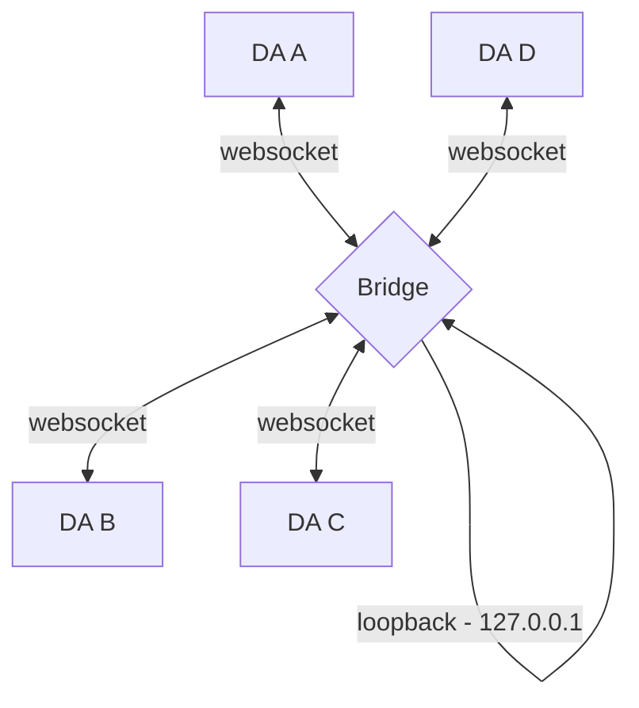
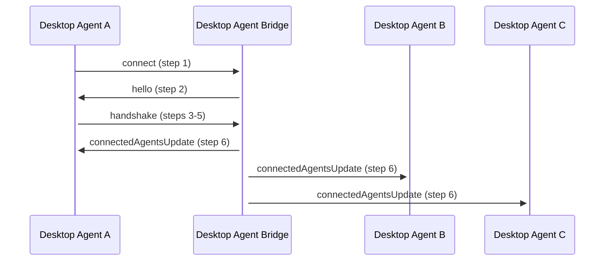
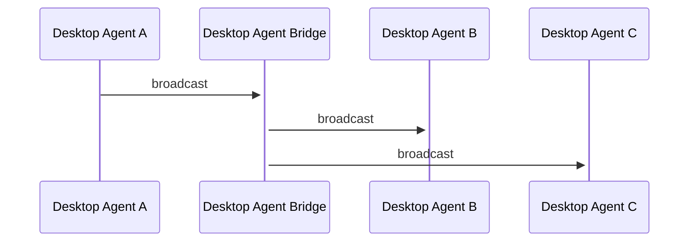
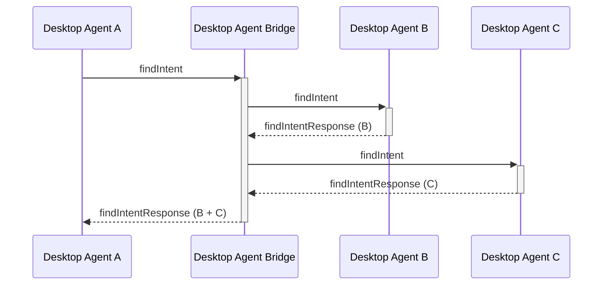
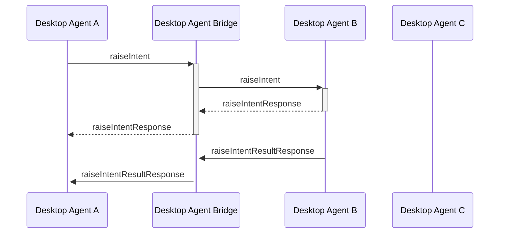
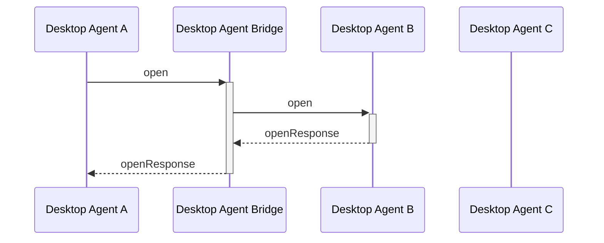
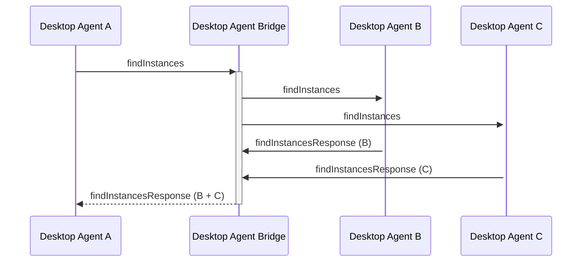

The FDC3 Desktop Agent API addresses interoperability between apps running within the context of a single Desktop Agent (DA), facilitating cross-application workflows. Desktop Agent API Bridging addresses the interconnection of Desktop Agents (DAs) such that apps running under different Desktop Agents can also interoperate, allowing workflows to span multiple Desktop Agents.

In any Desktop Agent bridging scenario, it is expected that each DA is being operated by the same user (as the scope of FDC3 contemplates cross-application workflows for a single user, rather than cross-user workflows), although DAs may be run on different machines operated by the same user.

## Recent Changes

* Added/consolidated advice on handling error responses from Desktop Agents in Messaging protocol section

## Open questions

## TODO list

* Complete message exchange documentation for PrivateChannels
* Add notes about flows for raiseIntentForContext and findIntentByContext
* Add getAppMetadata to messages exchange
* Add error details to the error handling
* Expand on how the DAB should create the JWT token (and its claims, which must change to avoid replay attacks) which it sends out in the `hello` message for DAs to validate.
* To create final PR:
  * Add new terms and acronyms to FDC3 glossary and ensure they are defined in this spec's introduction
  * Add new errors to Error enumerations specified in this proposal
  * Add RFC 4122 - https://datatracker.ietf.org/doc/html/rfc4122 to FDC3 references page

## Implementing a Desktop Agent Bridge

### Topology

In order to implement Desktop Agent Bridging some means for Desktop Agents to connect to and communicate with each other is needed. This Standard assumes that Desktop Agent Bridging is implemented via a standalone 'bridge' which each agent connects to and will use to route messages to or from other agents. This topology is similar to a star topology in networking, where the Desktop Agent Bridge (a 'bridge') will be the central node acting as a router.



Other possible topologies include peer-to-peer or client/server networks, however, these introduce significant additional complexity into multiple aspects of the bridging protocol that must be implemented by Desktop Agents, (including discovery, authentication and message routing), where a star topology/standalone bridge enables a relatively simple set of protocols, with the most difficult parts being implemented in the bridge itself.

Whilst the standalone bridge represents a single point of failure for the interconnection of Desktop Agents, it will also be significantly simpler than a full Desktop Agent implementation. Further, failures may be mitigated by setting the bridge up as a system service, such that it is started when the user's computer is started and may be restarted automatically if it fails. In the event of a bridge failure or manual shutdown, then Desktop Agents will no longer be bridged and should act as single agents.

In Financial services it is not unusual for a single user to be working with applications on more than one desktop. As Desktop Agents do not span desktops bridging Desktop Agents across multiple machines is an additional use case for Desktop Agent bridging. However, as FDC3 only contemplates interoperability between apps for a single user, it is expected that in multi-machine use cases each machine is being operated by the same user.

### Technology & Service Discovery

Connections between Desktop Agents and the Desktop Agent Bridge will be made via websocket connections, with the bridge acting as the websocket server and each connected Desktop Agent as a client.

The bridge MUST run on the same machine as the Desktop Agents, and the websocket MUST be bound to the loopback adapter IP address (127.0.0.1), ensuring that the websocket is not exposed to wider networks.

Bridge implementations SHOULD default to binding the websocket server to a port in the recommended port range 4475 - 4575, enabling simple discovery of a running bridge via attempting socket connections to ports in that range and attempting a handshake (as defined later in this proposal) that will identify the websocket as belong to a Desktop Agent Bridge. A port range is used, in preference to a single nominated port, in order to enable the automatic resolution of port clashes with other services.

Both DAs and bridge implementations MUST support at least connection to the recommended port range and MAY also support configuration for connection to an alternative bridging port range.

As part of the Desktop Agent Bridging protocol, a bridge will implement "server" behavior by:

* Accepting connections from client Desktop Agents, receiving and authenticating credentials and assigning a name (for routing purposes)
* Receiving requests from client Desktop Agents.
* Routing requests to client Desktop Agents.
* Receiving responses from client Desktop Agents and collating them.
* Routing responses to client Desktop Agents.

A Desktop Agent will implement "client" behavior by:

* Connecting to the bridge, providing authentication credentials and receiving an assigned named (for purposes)
* Forwarding requests to the bridge.
* Awaiting response(s) from the bridge.
* Receiving requests from the bridge.
* Sending responses to the bridge.

Hence, message paths and propagation are simple. All messages to other Desktop Agents are passed to the bridge for routing and all messages (both requests and responses) are received back from it, i.e. the bridge is responsible for all message routing.

#### Collating Responses

Whilst some FDC3 requests are 'fire and forget' (e.g. broadcast) the main requests such as `findIntent` or `raiseIntent` expect a response. In a bridging scenario, the response can come from multiple Desktop Agents and therefore need to be aggregated and augmented before they are sent back to the requesting DA.

:::note
A set of classifications for message exchange types are provided in the [Individual message exchanges](#individual-message-exchanges) section.
:::

The DAB is the responsible entity for collating responses together from all DAs. Whilst this approach may add some complexity to bridge implementations, it will simplify DA implementations since they only need to handle one response.

The DAB MUST allow for timeout configuration.

The Bridge SHOULD also implement timeout for waiting on DA responses. Assuming the message exchange will be all intra-machine, a recommended timeout of 1500ms SHOULD be used. Similarly, Desktop Agents SHOULD apply a timeout to requests made to the bridge that require a response (collated or otherwise), to handle situations where the bridge is not responding as expected. A recommended timeout of 3000ms SHOULD be used in this case.

#### Channels

It is assumed that Desktop Agents SHOULD adopt the recommended 8 channel set (and the respective display metadata). Desktop Agents MAY support channel customization through configuration.

The Desktop Agent Bridge MAY support channel mapping ability, to deal with issues caused by differing channel sets.

A key responsibility of the DAB is ensuring that the channel state of the connected agents is kept in-sync, which requires an initial synchronization step as part of the connection protocol.

#### Bridging Desktop Agent on Multiple Machines

As the bridge binds its websocket on the loopback address (127.0.0.1) it cannot be connected to from another device. Hence, an instance of the standalone bridge may be run on each device and those instances exchange messages in order to implement the bridge cross-device.

However, cross-machine routing is an internal concern of the Desktop Agent Bridge, with each Desktop Agent simply communicating with a bridge instance located on the same machine. The connection protocol between bridges themselves is implementation specific and beyond the scope of this standard. Further, as FDC3 only contemplates interoperability between apps for a single user, it is expected that in multi-machine use cases each machine is being operated by the same user. However, methods of verifying the identity of user are currently beyond the scope of this Standard.

## Connection Protocol

On connection to the bridge's websocket, a handshake must be completed that may include an authentication step before a name is assigned  to the Desktop Agent for use in routing messages. The purpose of the handshake is to allow:

* The Desktop Agent to confirm that it is connecting to Desktop Agent Bridge, rather than another service exposed via a websocket.
* The DAB to require that the Desktop Agent authenticate itself, allowing it to control access to the network of bridged Desktop Agents.
* The Desktop Agent to request a particular name by which it will be addressed by other agents and for the bridge to assign the requested name, after confirming that no other agent is connected with that name, or a derivative of that name if it is already in use.

The bridge is ultimately responsible for assigning each Desktop Agent a name and for routing messages using those names. Desktop Agents MUST accept the name they are assigned by the bridge.

Exchange standardized handshake messages that identify:

* That the server is a bridge, including:
  * implementation details for logging by DA.
  * supported FDC3 version(s).
* That the client is an FDC3 DA, including:
  * implementation details (ImplementationMeta returned by fdc3.getInfo() call) for logging by DA and sharing with other DAs.
    * already includes supported FDC3 version.
  * request for a specific agent name.



### Step 1. Connect to Websocket

The Desktop Agent attempts to connect to the websocket at the first port in the defined port range. If a connection cannot be made on the current port, move to the next port in the range and reattempt connection.

In the event that there are no ports remaining in the range, the Desktop Agent SHOULD reset to the beginning of the range, SHOULD pause its attempts to connect and resume later (a minimum wait period of 5 seconds SHOULD be used)

Note, if the Desktop Agent is configured to run at startup (of the user's machine) it is possible that the Desktop Agent Bridge may start later (or be restarted at some point). Hence, Desktop Agents SHOULD be capable of connecting to the bridge once they are already running (rather than purely at startup).

### Step 2. Hello

When a new connection is made to the DAB websocket, it sends a `hello` message, including its metadata.

```typescript
{
    type: "hello",
    payload: {
        desktopAgentBridgeVersion: number,
        supportedFDC3Versions: string[],
        authRequired: boolean,
        /** The DAB JWT authentication token */
        authToken?: string
    },
    meta: {
        timestamp: date
    }
}
```

A Desktop Agent can use the structure of this message to determine that it has connected to a Desktop Agent Bridge (i.e by checking `msg.type === "hello" && msg.payload.desktopAgentBridgeVersion`), whether it supports a compatible FDC3 version and whether it is expected to provide authentication credentials in the next step (`if(msg.payload.authRequired) { ... }`).

An optional JWT token can be included in the `hello` message to allow the connecting agent to authenticate the bridge. Verification of the supplied JWT by the DA is optional but recommended, meaning that the DA SHOULD verify the received JWT when one is included in the `hello` message.

If no hello message is received, the message doesn't match the defined format or validation of the optional JWT fails, the Desktop Agent should return to step 1 and attempt connection to the next port in the range.  

### Step 3. Handshake & Authentication

The DA must then respond to the `hello` message with a `handshake` request to the bridge, including an auth token (JWT) if required.

```typescript
{
    type:  "handshake",
    /** Request body, containing the arguments to the function called.*/
    payload: {
        /** The JWT authentication token */
        authToken?: string,
        /** DesktopAgent implementationMetadata trying to connect to the bridge */
        implementationMetadata: ImplementationMetadata,
        /** The requested DA name */
        requestedName: string,
        /** The current state of the Desktop Agent's channels, excluding any private channels,
         *  as a mapping of channel id to an array of Context objects, most recent first.*/
        channelsState: Record<string, Context[]>
    },
    meta: {
        /** Unique GUID for this request */
        requestGuid: string,
        /** Timestamp at which request was generated */
        timestamp:  date
    }
}
```

Note that the `meta` element of of the handshake message contains both a `timestamp` field (for logging purposes) and a `requestGuid` field that should be populated with a Globally Unique Identifier (GUID), generated by the Desktop Agent. This `responseGuid` will be used to link the handshake message to a response from the DAB that assigns it a name. For more details on GUID generation see [Globally Unique Identifier](#globally-unique-identifier) section.

If requested by the server, the JWT auth token payload should take the form:

```typescript
{
    "sub": string, // GUID for the keypair used to sign the token
    "iat": date    // timestamp at which the the token was generated as specified in ISO 8601
}
```

e.g.

```JSON
{
    "sub": "65141135-7200-47d3-9777-eb8786dd31c7",
    "iat": "2022-07-06T10:11:43.492Z"
}
```

Note that the `sub` SHOULD be a GUID that does NOT need to match the name requested by the Desktop Agent. It will be used to identify the keypair that should be used to validate the JWT token. Further, multiple Desktop Agent's MAY share the same keys for authentication and hence the same `sub`, but they will be assigned different names for routing purposes by the DAB. If an agent disconnects from the bridge and later re-connects it MAY request and be assigned the same name it connected with before.

### Step 4. Auth Confirmation and Name Assignment

The DAB will extract the authentication token `sub` from the JWT token's claims and then verify the token's signature against any public key it has been configured with. If the signature can't be verified, the bridge should respond with the below authentication failed message and the socket should be disconnected by the bridge.

```typescript
{
    type:  "authenticationFailed",
    meta: {
        /** Timestamp at which response was generated */
        timestamp:  date,
        /** GUID for the handshake request */
        requestGuid: string,
        /** Unique GUID for this message */
        responseGuid: string,
    }
}
```

If authentication succeeds (or is not required), then the DAB should assign the Desktop Agent the name requested in the `handshake` message, unless another agent is already connected with that name in which case it should generate a new name which MAY be derived from the requested name. Note that the assigned name is not communicated to the connecting agent until step 5.

### Step 5. Synchronize the Bridge's Channel State

Channels are the main stateful mechanism in the FDC3 that we have to consider. A key responsibility of the DAB is ensuring that the channel state of the connected agents is kept in-sync. To do so, the states must be synchronized whenever a new agent connects. Hence, the Bridge MUST process the `channelState` provided by the new agent in the `handshake` request, which MUST contain details of each known User Channel or App Channel and its state. The bridge MUST compare the received channel names and states to its own representation of the current state of channels in connected agents, merge that state with that of the new agent and communicate the updated state to all connected agents to ensure that they are synchronized with it.

Hence, if we assume that the state of each channel can be represented by an ordered array of context objects (most recent first - noting that only the first position, that of the most recent context broadcast, matters), the Desktop Agent Bridge MUST merge the incoming `channelsState` with the `existingChannelsState` as follows:

```typescript
Object.keys(channelsState).forEach((channelId) => {
    if (!existingChannelsState[channelId]) {
        //unknown channels: just adopt its state
        existingChannelsState[channelId] = channelsState[channelId];
    } else {
        //known channels: merge state, with existing state taking precedence
        const currentState = existingChannelsState[channelId];
        const incoming = channelsState[channelId];
        incoming.forEach((context) => {
            //only add previously unknown context types to the state
            if (!currentState.find(element => element.type === context.type)){
                //add to end of array to avoid setting most recent context type at the beginning
                currentState.push(context);
            } 
            // else ignore any types that are already known          
        });
    }
});
```

When multiple agents attempt to connect to the Desktop Agent Bridge at the same time, steps 3-6 of the connection protocol MUST be handled by the DAB serially to ensure correct channel state synchronization.

### Step 6. Connected Agents Update

The updated `existingChannelsState` will then be shared with all connected agents along with updated details of all connected agents via a `connectedAgentsUpdate` message sent to all connected sockets. The newly connected agent will receive both its assigned name and channel state via this message. The `connectedAgentsUpdate` message will be linked to the handshake request by quoting the `meta.requestGuid` of the `handshake` message.

The `connectedAgentsUpdate` message will take the form:

```typescript
{
    type:  "connectedAgentsUpdate",
    /** Request body, containing the arguments to the function called.*/
    payload: {
        /** Should be set when an agent first connects to the bridge and provide its assigned name. */
        addAgent?: string,
        /** Should be set when an agent disconnects from the bridge and provide the name that no longer is assigned. */
        removeAgent?: string,
        /** Desktop Agent Bridge implementation metadata of all connected agents. 
         *  Note that this object is extended to include a `desktopAgent` field with the name assigned by the DAB. */
        allAgents: ImplementationMetadata[],
        /** The updated state of channels that should be adopted by the agents. SHOULD only be set when an agent is connecting to the bridge. */
        channelsState?: ChannelState[] // see step4
    },
    meta: {
        /** For a new connection, should be the same as the handshake requestGuid. 
         *  Should be the same as the responseGuid for a disconnection.
        */
        requestGuid: string,
        /** Unique GUID for this message */
        responseGuid: string,
        /** Timestamp at which response was generated */
        timestamp:  date,
    }
}
```

When an agent connects to the bridge, it and other agents connected to the bridge, should adopt the state of any channels that do not currently exist or do not currently contain state of a particular type. This synchronization is NOT performed via broadcast as the context being merged would become the most recent context on the channel, when other contexts may have been broadcast subsequently. Rather, it should be adopted internally by each Desktop Agent, merging it such that it would be received by applications that have added a context listener to the channel or call `channel.getCurrentContext()` on it.

It should be noted that Desktop Agents will not have context listeners for previously unknown channels, and SHOULD simply record that channel's state for use when that channel is first used.

For known channel names, the Desktop Agents MUST also compare their current state to that which they have just received and may need to internally adopt context of types not previously seen on a channel. As context listeners can be registered for either a specific type or all types some care is necessary when doing so (as only the most recently transmitted Context should be received by un-typed listeners). Hence, the new context MUST only be passed to a context listener if it was registered specifically for that type and a context of that type did not previously exist on the channel.

In summary, updating listeners for a known channel should be performed as follows:

1. The incoming channel state `channelState` for a particular channel should be processed from last to first (most recent context broadcast).
2. If there is no current context of that type, broadcast it to any listeners of that specific type only.
3. If there is a current context of that type, and it does not match the incoming object exactly, broadcast it to listeners of that specific type only.
4. If the most recent (first in the incoming array) type OR value of that type doesn't match the most recent context broadcast on the channel, broadcast it to un-typed listeners only.

This procedure is the same for both previously connected and connecting agents, however, the merging procedure used by the DAB in step 5 will result in apps managed by previously connected agents only rarely receiving context broadcasts (and only for types they have not yet seen on a channel).

After applying the `connectedAgentsUpdate` message, the newly connected Desktop Agent and other already connected agents are able to begin communicating through the bridge.

#### Atomicity and handling concurrent operations

Handling by the Desktop Agent of the synchronization message from the DAB in step 6 of the connection protocol should be atomic to prevent message overlap with `fdc3.broadcast`, `channel.broadcast`, `fdc3.addContextListener` or `channel.getCurrentContext`. I.e. the `connectedAgentsUpdate` message must be processed immediately on receipt by Desktop Agents and updates applied before any other messages are sent or responses processed.

Similarly, the Desktop Agent Bridge must process steps 3-6 of the connection protocol (receiving a `handshake` messages up to issuing the `connectedAgentsUpdate` messages to all participants) as a single atomic unit, allowing no overlap with the processing of other messages from connected agents (as they might modify the state information it is processing during those steps).

#### Notification to users of connection events

Desktop Agents SHOULD provide visual feedback to end users when they or other agents connect or disconnect from the Desktop Agent Bridge (i.e. whenever a `connectedAgentsUpdate` message is received, or a disconnection happens). Doing so will ensure that the end user understands whether their apps and Desktop Agent can communicate with other apps running under other Desktop Agents, and can better attribute any issues with interoperability between them to the probable source.

### Step 7. Disconnects

Although not part of the connection protocol, it should be noted that the `connectedAgentsUpdate` message sent in step 6 should also be sent whenever an agent disconnects from the bridge to update other agents. If any agents remain connected, then the `channelState` does not change and can be omitted. However, if the last agent disconnects the bridge SHOULD discard its internal `channelState`, instead of issuing the update.

## Messaging Protocol

In order for Desktop Agents to communicate with the Desktop Agent Bridge and thereby other Desktop Agents, a messaging protocol is required. FDC3 supports both 'fire and forget' interactions (such as the broadcast of context messages) and interactions with specific responses (such as raising intents and returning a resolution and optional result), both of which must be handled by that messaging protocol and message formats it defines, as described in this section.

### Message Format

All messages sent or received by the Desktop Agent Bridge will be encoded in JSON and will have the same basic structure (including those already defined in the connection protocol):

```typescript
{
    /** Identifier used to declare what aspect of FDC3 that the message relates to. */
    type:  string,
    /** Request body, containing any the arguments to the FDC3 interactions. */
    payload: { ... },
    /** Metadata relating to the message, its sender and destination. */
    meta: { ... }
}
```

Messages can be divided into two categories:

* Requests: Messages that initiate a particular interaction
* Responses: Messages that later to a prior request

Details specific to each are provided below:

#### Request Messages

Request messages use the following format:

```typescript
{
    /** Typically set to the FDC3 function name that the message relates to, e.g. "findIntent" */
    type:  string,
    /** Request body, typically containing the arguments to the function called.*/
    payload: {
        /** Used to indicate which channel `broadcast` functions were called on. */
        channel?: string,
        /** Used as an argument to `findIntent` and `raiseIntent` functions.`*/
        intent?: string,
        /** Used as an argument to `broadcast`, `findIntent` and `raiseIntent` functions. */
        context?: Context,
        /** Used as an argument to `open`, `raiseIntent`, `getAppMetadata`, and `findInstances` functions */
        app?: AppIdentifier,
        /** Used as an argument to `findIntent` functions. */
        resultType?: string
    },
    /** Metadata used to uniquely identify the message and its sender. */
    meta: {
        /** Unique GUID for this request */
        requestGuid: string,
        /** Timestamp at which request was generated */
        timestamp:  date,
         /** AppIdentifier OR DesktopAgentIdentifier for the source application that the request was 
          *  received from and will be augmented with the assigned name of the 
          *  Desktop Agent by the Desktop Agent Bridge, rather than the sender. */
        source: AppIdentifier | DesktopAgentIdentifier,
        /** Optional AppIdentifier or DesktopAgentIdentifier for the destination that the request should be 
         *  routed to, which MUST be set by the Desktop Agent for API calls that 
         *  include a target (`app`) parameter. MUST include the name of the 
         *  Desktop Agent hosting the target application. */
        destination?: AppIdentifier | DesktopAgentIdentifier
    }
}
```

If the FDC3 API call underlying the request message includes a target (typically defined by an `app` argument, in the form of an AppIdentifier object) it is the responsibility of the Desktop Agent to copy that argument into the `meta.destination` field of the message and to ensure that it includes a `meta.destination.desktopAgent` value. If the target is provided in the FDC3 API call, but without a `meta.destination.desktopAgent` value, the Desktop Agent should assume that the call relates to a local application and does not need to send it to the bridge.

Requests without a `meta.destination` field will be forwarded to all other agents by the bridge, which will also handle the collation of responses which quote the `meta.requestGuid`.

#### Response Messages

Response messages will be differentiated from requests by the presence of a `meta.responseGuid` field and MUST quote the `meta.requestGuid` that they are responding to.

```typescript
{
    /** FDC3 function name the original request related to, e.g. "findIntent" */
    type:  string,
    /** Response body, containing the actual response data. */
    payload: {
        /** Standardized error strings from an appropriate FDC3 API Error enumeration. */
        error?: string,
        /** Response to `open` */
        appIdentifier?: AppIdentifier,
        /** Response to `findInstances` */
        appIdentifiers?: Array<AppIdentifier>,
        /** Response to `getAppMetadata` */
        appMetadata?: AppMetadata,
        /** Response to `findIntent`*/
        appIntent?:  AppIntent,
        /** Response to `findIntentsByContext`*/
        appIntents?:  AppIntent[],
        /** Response to `raiseIntent` functions, returned on delivery of the intent and context to the target app.
         *  Note `getResult()` function should not / can not be included in JSON. */
        intentResolution?: IntentResolution,
        /** Secondary response to `raiseIntent`, sent when the `IntentHandler` has returned.
         *  Note return an empty object if the `IntentHandler` returned void. 
         *  Note `Channel` functions (`broadcast`, `getCurrentContext`, `addContextListener` should not / can not be included in JSON)*/
        intentResult?: {context?: Context, channel?: Channel},
    },
    meta: {
        /** requestGuid from the original request being responded to*/
        requestGuid: string,
        /** Unique GUID for this response */
        responseGuid:  string,
        /** Timestamp at which request was generated */
        timestamp:  Date,
        /** Array of AppIdentifiers or DesktopAgentIdentifiers for the sources that generated
         *  responses to the request. Will contain a single value for individual responses and
         *  multiple values for responses that were collated by the bridge.*/
        sources: [AppIdentifier | DesktopAgentIdentifier],
        /** Array of AppIdentifiers or DesktopAgentIdentifiers for responses that were not returned
         * to the bridge before the timeout or because an error occurred. 
         * May be omitted if all sources responded. */
        errorSources: [AppIdentifier | DesktopAgentIdentifier]
    }
}
```

Response messages do not include a `meta.destination` as the routing of responses is handled by the bridge via the `meta.requestGuid` field.

### Identifying Individual Messages

There are a variety of message types need to be sent between bridged Desktop Agents, several of which will need to be replied to specifically (e.g. a `fdc3.raiseIntent` call should receive an `IntentResolution` when an app has been chosen, and may subsequently receive an `IntentResult` after the intent handler has run). Hence, messages also need a unique identity, which should be generated at the Desktop Agent that is the source of that message, in the form of a Globally Unique Identifier (GUID). Response messages will include the identity of the request message they are related to, allowing multiple message exchanges to be 'in-flight' at the same time.

Hence, whenever a request message is generated by a Desktop Agent it should contain a unique `meta.requestGuid` value. Response messages should quote that same value in the `meta.requestGuid` field and generate a further unique identity for their response, which is included in the `meta.responseGuid` field.

Desktop Agent Bridge implementations should consider request messages that omit `meta.requestGuid` and response messages that omit either `meta.requestGuid` or `meta.responseGuid` to be invalid and should discard them.

#### Globally Unique Identifier

A GUID (globally unique identifier), also known as a Universally Unique IDentifier (UUID), is a generated 128-bit text string that is intended to be 'unique across space and time', as defined in [IETF RFC 4122](https://www.ietf.org/rfc/rfc4122.txt).  

There are several types of GUIDs, which vary how they are generated. As Desktop Agents will typically be running on the same machine, system clock and hardware details may not provide sufficient uniqueness in GUIDs generated (including during the connect step, where Desktop Agent name collisions may exist). Hence, it is recommended that both Desktop Agents and Desktop Agent Bridges SHOULD use a version 4 generation type (random).

### Identifying Desktop Agents Identity and Message Sources

Desktop Agents will prepare messages in the above format and transmit them to the bridge. However, to target intents and perform other actions that require specific routing between DAs, DAs need to have an identity. Identities should be assigned to clients when they connect to the bridge. This allows for multiple copies of the same underlying Desktop Agent implementation to be bridged and ensures that id clashes can be avoided.

To facilitate routing of messages between agents, the `AppIdentifier` is expanded to contain an optional `desktopAgent` field:

```typescript
interface AppIdentifier {
  readonly appId: string;
  readonly instanceId?: string;
  /** Field that represents the Desktop Agent that the app is available on.**/
  readonly desktopAgent?: string;
}
```

Further, a new `DesktopAgentIdentifier` type is introduced to handle cases where a response message is returned by the Desktop Agent (or more specifically its resolver) rather than a specific app. This is particularly relevant for `findIntent` responses:

```typescript
interface DesktopAgentIdentifier {
  /** A string filled in by the Desktop Agent Bridge on receipt of a message, that represents 
   * the Desktop Agent Identifier that is the source of the message. 
   **/
  readonly desktopAgent: string;
}
```

Hence, either an `AppIdentifier` or `DesktopAgentIdentifier` is used as the `meta.source` value of both request or response messages and the source Desktop Agent identity for bridging messages will always be found at `meta.source.desktopAgent`. To prevent spoofing and to simplify the implementation of clients, the source Desktop Agent identity MUST be added to (or overwritten in) each message by the bridge when received.

A request message may include a `destination` field, set by the source Desktop Agent if the message is intended for a particular Desktop Agent (e.g. to support a `raiseIntent` call with a specified target app or app instance on a particular Desktop Agent).

Response messages do not include a `destination` field. Instead, a Desktop Agent Bridge implementation MUST retain a record of `requestGuid` fields for request message, until the request is fully resolved, allowing them to determine the destination for the collated responses and effectively enforcing the routing policy for interactions.

Further, the Desktop Agent Bridge should also inspect the `payload` of both request and response messages and ensure that any `AppIdentifier` objects have been augmented with the correct `desktopAgent` value for the app's host Desktop Agent (e.g. if returning responses to `findIntent`, ensure each `AppIntent.apps[]` entry includes the correct `desktopAgent` value). Further details of any such augmentation are provided in the description of each message exchange.

### Handling of Error Responses

The FDC3 Desktop Agent API specifies a number of error enumerations that define specific error strings that should be used as the `message` element of a JavaScript `Error` to be returned to the requesting application via a rejected promise. In the event that an Error must be returned by a Desktop Agent to the Desktop Agent Bridge, the message should be selected from the [Error enumeration](../api/ref/Errors) normally used by the corresponding FDC3 function (i.e. `OpenError` for `open` calls, `ResolveError` for `findIntent` and `raiseIntent` etc.). However, Desktop Agent Bridging does NOT require that an `Error` object is returned across the bridge as it cannot be fully recreated from its constituent fields in JavaScript. Rather, return only the specified message string in the `error` field of the `payload`, which should then be used to initialize a JavaScript `Error` on the receiving end. It is also advisable to output additional logging (in the Desktop Agent Bridge) indicating that the error was originally generated by a remote Desktop Agent and to provide the relevant details.

For example, a `raiseIntent` targeted at an app instance that no longer exists might generate the following response from the Desktop Agent:

```JSON
// e.g. agent-B -> DAB in response to a raiseIntent call
{
    "type": "raiseIntentResponse",
    "payload": {
        "error": "TargetInstanceUnavailable", //<error string from the relevant error enum
    },
    "meta": {
        "requestGuid": "<requestGuid>",
        "responseGuid": "<intentResolutionResponseGuid>",
        "timestamp": "2020-03-..."
    }
}
```

For messages that target a specific agent, the Desktop Agent Bridge will augment the message with a `source` field and return it to the calling agent and the app that made the original request.

However, API calls that require a collated response from all agents where at least one agent returns a successful response, will result in a successful response from the Desktop Agent Bridge (i.e. no `error` element should be included), with the agents returning errors listed in the `errorSources` array. This allows for successful exchanges on API calls such as `fdc3.findIntent` where some agents do not have options to return and would normally respond with (for example) `ResolveError.NoAppsFound`.

Finally, to facilitate easier debugging, errors specific to Desktop Agent Bridge are added to those enumerations, including:

```typescript
enum OpenError {
  ...
  /** Returned if the specified Desktop Agent is not found, via a connected 
      Desktop Agent Bridge. */
  DesktopAgentNotFound = 'DesktopAgentNotFound',
}

enum ResolveError {
  ...
  /** Returned if the specified Desktop Agent is not found, via a connected 
      Desktop Agent Bridge. */
  DesktopAgentNotFound = 'DesktopAgentNotFound',
}

enum ResultError {
  ...
  /** Returned if the specified Desktop Agent disconnected from the Desktop 
      Agent Bridge before a result was returned. */
  DesktopAgentDisconnected = 'DesktopAgentDisconnected',
}
```

### Forwarding of Messages and Collating Responses

When handling request messages, it is the responsibility of the Desktop Agent Bridge to:

* Receive request messages from connected Desktop Agents.
* Augment request messages with `meta.source.desktopAgent` information (as described above).
* Forward request messages onto either a specific Desktop Agent or all other Desktop Agents.
  * The bridge MUST NOT forward the request to the agent that sent the request, nor expect a reply from it.

For message exchanges that involve responses, it is the responsibility of the Desktop Agent Bridge to:

* Receive and collate response messages according the `meta.requestGuid` (allowing multiple message exchanges to be 'in-flight' at once).
* Apply a timeout to the receipt of response messages for each request.
* Produce a single collated response message that incorporates the output of each individual response received.
* Deliver the collated response message to the source Desktop Agent that sent the request.

Collated response messages generated by the bridge use the same format as individual response messages.

The following pseudo-code defines how messages should be forwarded or collated by the bridge:

* if the message is a request (`meta.requestGuid` is set, but `meta.responseGuid` is not),
  * and the message does not include a `meta.destination` field,
    * forward it to all other Desktop Agents (not including the source),
    * annotate the request as requiring responses from all other connected agents,
    * await responses or the specified timeout.
  * else if a `meta.destination` was included,
    * forward it to the specified destination agent,
    * annotate the request as requiring only a response from the specified agent,
    * await the response or the specified timeout.
* else if the message is a response (both `meta.requestGuid` and `meta.responseGuid` are set)
  * if the `meta.requestGuid` is known,
    * add the message to the collated responses for the request,
      * augment any `AppIdentifier` types in the response message with a `desktopAgent` field matching that of the responding Desktop Agent,
      * if `payload.error` is set in the response add the DesktopAgentIdentifier to the `meta.errorSources` element.
      * else add the DesktopAgentIdentifier to the `meta.sources` element.
      * if all expected responses have been received (i.e. all connected agents or the specified agent has responded, as appropriate),
        * produce the collated response message and return to the requesting Desktop Agent.
      * else await the configured response timeout or further responses,
        * if the timeout is reached without any responses being received
          * produce and return an appropriate [error response](../api/ref/Errors), including details of all Desktop Agents in `errorSources`.
          * log the timeout for each Desktop Agent that did not respond and check disconnection criteria.
        * if the timeout is reached with a partial set of responses
          * produce and return a collated response, but include details of Desktop Agents that timed out in `errorSources`.
          * log the timeout for each Desktop Agent that did not respond and check disconnection criteria.
  * else discard the response message (as it is a delayed to a request that has timed out or is otherwise invalid).
* else the message is invalid and should be discarded.

### Workflows Broken By Disconnects

Targeted request and request/response workflows may be broken when a Desktop Agent disconnects from the bridge, which bridge implementations will need to handle.

Three types of requests:

1. Fire and forget (i.e. `broadcast`).
2. Requests that require the bridge to collate multiple responses from the bridged Desktop Agents (e.g. `findIntent`).
3. Requests targeted at a specific Desktop Agent that are forwarded to the target Desktop Agent (e.g. `raiseIntent`).

The latter two types embody workflows that may be broken by an agent disconnecting from the bridge either before or during the processing of the request.

When processing the disconnection of an agent from the bridge, the bridge MUST examine requests currently 'in-flight' and:

* For requests that require the bridge to collate multiple responses:
  * complete those that no longer require further responses (all other agents have responded), or
  * continue to await the timeout (if other agents are yet to respond), or
  * return an 'empty' response in the expected format (if no other agents are connected and no data will be received).
* For requests that target a specific agent:
  * return an appropriate error (as the request cannot be completed).

Finally, in the event that either a Desktop Agent or the bridge itself stops responding, but doesn't fully disconnect, the timeouts (specified earlier in this document) will be used to handle the request as if a disconnection had occurred.

In the event that a Desktop Agent repeatedly times out, the bridge SHOULD disconnect that agent (and update other agents via the `connectedAgentsUpdate` message specified in the connection protocol), to avoid all requests requiring the full timeout to complete.

In the event that the bridge repeatedly times out, connected Desktop Agents MAY disconnect from the bridge and attempt to reconnect by returning to Step 1 of the connection protocol.

### FDC3 API calls that do NOT generate bridge messages

Some FDC3 API calls can be handled locally and do not need to generate request messages to the Desktop Agent Bridge, but are likely to be involved in other exchanges that do generate messages to the bridge (for example adding context or intent handlers). Those calls include:

* `addContextListener` functions (excluding those for `PrivateChannel` instances)
* `listener.unsubscribe` (excluding those for `PrivateChannel` instances)
* `addIntentListener`
* `getOrCreateChannel`
* `createPrivateChannel`
* `getUserChannels` and `getSystemChannels`
* `joinUserChannel` and `joinChannel`
* `getCurrentChannel`
* `leaveCurrentChannel`
* `getInfo`

However, `PrivateChannel` instances allow the registration of additional event handlers (for the addition or removal of context listeners) that may be used to manage streaming data sent over them by starting or stopping the stream in response to those events. Hence, the following calls DO generate request messages when used on a PrivateChannel instance:

* `addContextListener`
* `listener.unsubscribe`
* `disconnect`

## Individual message exchanges

The sections below cover most scenarios for each of the Desktop Agent methods in order to explore how this protocol might work.

Each section assumes that we have 3 agents connected by a bridge:

* agent-A
* agent-B
* agent-C
* DAB

Message exchanges come in a number of formats, which are known as:

* **Request only**: A request message that does not require a response ('fire and forget'), such as a `broadcast`.
* **Request Response (single)**: A request message that expects a single response from a single Desktop Agent, such as `open` or `getAppMetadata`.
* **Request Response (collated)**: A request message that expects responses from all other Desktop Agents that are collated by the bridge and returned as a single response to the requestor, such as `findIntent` or `findInstances`.
* **Request Multiple Response (single)**: A request message that expects multiple responses from a single Desktop Agent, such as `raiseIntent`.

### `broadcast` (on `fdc3`, a `Channel` or `PrivateChannel`)

Type: **Request only**

Generated by API calls:

* [`fdc3.broadcast(context: Context)`](../api/ref/DesktopAgent#broadcast)
* [`Channel.broadcast(context: Context)`](../api/ref/Channel#broadcast)

e.g.

```javascript
fdc3.broadcast(contextObj);
```

or

```javascript
(await fdc3.getOrCreateChannel("myChannel")).broadcast(contextObj)
```

Message exchange:



It encodes this as a message which it sends to the DAB

```JSON
// agent-A -> DAB
{
    "type": "broadcast",
    "payload": {
        "channel": "myChannel",
        "context": { /*contextObj*/ }
    },
    "meta": {
        "requestGuid": "<requestGuid>",
        "timestamp": "2022-03-...",
        "source": [{
            "appId": "agentA-app1",
            "instanceId": "c6ad5174-6f78-4582-8e96-728d93a4d7d7"
        }]
    }
}
```

which it repeats on to agent-B AND agent-C with the `source.desktopAgent` metadata added.

```JSON
// DAB -> agent-B
// DAB -> agent-C
{
    "type": "broadcast",
    "payload": {
        "channel": "myChannel",
        "context": { /*contextObj*/}
    },
    "meta": {
        "requestGuid": "<requestGuid>",
        "timestamp": "2020-03-...",
        "source": [{
            "appId": "agentA-app1",
            "instanceId": "c6ad5174-6f78-4582-8e96-728d93a4d7d7",
            "desktopAgent": "agent-A" //added by DAB
        }]
    }
}
```

### `findIntent` (on `fdc3`)

Type: **Request Response (collated)**

Generated by API call:

* [`findIntent(intent: string, context: Context)`](../api/ref/DesktopAgent#findintent)

e.g. An application with `appId: "agentA-app1"` and `instanceId: "c6ad5174-6f78-4582-8e96-728d93a4d7d7"` makes the following API call:

```javascript
let appIntent = await fdc3.findIntent("StartChat", context);
```

Message exchange:



#### Request format

Outward message to the DAB:

```JSON
// agent-A -> DAB
{
    "type": "findIntent",
    "payload": {
        "intent": "StartChat",
        "context": {/*contextObj*/}
    },
    "meta": {
        "requestGuid": "<requestGuid>",
        "timestamp": "2020-03-...",
        "source": [{
            "appId": "agentA-app1",
            "instanceId": "c6ad5174-6f78-4582-8e96-728d93a4d7d7"
        }]
    }
}
```

The DAB fills in the `source.desktopAgent` field and forwards the request to the other Desktop Agents (agent-B AND agent-C):

```JSON
// DAB -> agent-B
// DAB -> agent-C
{
    "type": "findIntent",
    "payload": {
        "intent": "StartChat",
        "context": {/*contextObj*/}
    },
    "meta": {
        "requestGuid": "<requestGuid>",
        "timestamp": "2020-03-...",
        "source": {
            "appId": "agentA-app1",
            "instanceId": "c6ad5174-6f78-4582-8e96-728d93a4d7d7",
            "desktopAgent": "agent-A" //added by DAB
        }
    }
}
```

Note that the `source.desktopAgent` field has been populated with the id of the agent that raised the requests, enabling the routing of responses.

#### Response format

Normal response from agent-A, where the request was raised.

```JSON
{
    "intent": { "name": "StartChat" },
    "apps": [
        { "appId": "myChat" }
    ]
}
```

DA agent-B would produce the following response if the request was generated locally:

```JSON
{
    "intent": { "name": "StartChat" },
    "apps": [
        { "appId": "Skype", "title": "Skype" /* other AppMetadata fields may be included */},
        { "appId": "Symphony", "title": "Symphony" },
        { "appId": "Symphony", 
          "instanceId": "93d2fe3e-a66c-41e1-b80b-246b87120859", 
          "title": "Symphony" },
        { "appId": "Slack", "title": "Slack" }
    ]
}
```

Hence, the response it sends to the bridge is encoded as follows:

```JSON
// agent-B -> DAB
{
    "type":  "findIntentResponse",
    "payload": {
        "appIntent":  {
            "intent":  { "name": "StartChat" },
            "apps": [
                { "appId": "Skype", "title": "Skype" /* other AppMetadata fields may be included */ },
                { "appId": "Symphony", "title": "Symphony" },
                { "appId": "Symphony", 
                  "instanceId": "93d2fe3e-a66c-41e1-b80b-246b87120859", 
                  "title": "Symphony" },
                { "appId": "Slack", "title": "Slack" }
            ]
        }
    },
    "meta": {
        "requestGuid": "<requestGuid>",
        "responseGuid":  "<responseGuidAgentB>",
        "timestamp":  "2020-03-...",
    }
}
```

Note the response GUID generated by the agent-B and the reference to the request GUID produced by agent-A where the request was originated. Further, note that the `AppMetadata` elements in the `AppIntent` do not have a `desktopAgent` field yet, and the `meta` element does not contain a `sources` element, both of which the bridge will add.

DA agent-C would produce the following response locally:

```JSON
{
    "intent":  { "name": "StartChat" },
    "apps": [
       { "appId": "WebIce"}
    ]
}
```

which is sent back over the bridge as a response to the request message as:

```JSON
// agent-C -> DAB
{
    "type":  "findIntentResponse",
    "payload": {
        "appIntent":  {
            "intent":  { "appId": "StartChat" },
            "apps": [
                { "appId": "WebIce"}
            ]
        }
    },
    "meta": {
        "requestGuid": "<requestGuid>",
        "responseGuid":  "<responseGuidAgentC>",
        "timestamp":  "2020-03-...",
    }
}
```

The bridge receives and collates the responses, producing the following collated response which is sends back to agent-A:

```JSON
// DAB -> agent-A
{
    "type":  "findIntentResponse",
    "payload": {
        "intent":  "StartChat",
        "appIntent":  {
            "intent":  { "name": "StartChat" },
            "apps": [
                { "appId": "Skype", "title": "Skype", "desktopAgent": "agent-B" }, //desktopAgent added by DAB
                { "appId": "Symphony", "title": "Symphony", "desktopAgent": "agent-B" },
                { "appId": "Symphony", 
                  "instanceId": "93d2fe3e-a66c-41e1-b80b-246b87120859", 
                  "title": "Symphony", 
                  "desktopAgent": "agent-B" },
                { "appId": "Slack", "title": "Slack", "desktopAgent": "agent-B" },
                { "appId": "WebIce", "desktopAgent": "agent-C"}
            ]
        }
    },
    "meta": {
        "requestGuid": "<requestGuid>",
        "responseGuid":  "<responseGuidAgentB>",
        "timestamp":  "2020-03-...",
        "sources": [ //added by DAB
            { "desktopAgent": "agent-A" },
            { "desktopAgent": "agent-B" },
        ]
    }
}
```

:::note
In the event that an agent times out or returns an error, where others respond, its `DesktopAgentIdentifier` should be added to the `meta.errorSources` element instead of `meta.sources`.
:::

Finally, agent-A combines the data received from the bridge, with its own local response to produce the response to the requesting application:

```JSON
// agent-A -> requesting App
{
    "intent":  { "name": "StartChat", "displayName": "Chat" },
    "apps": [
        // local to this agent
        { "appId": "myChat" },
        //agent-B responses
        { "appId": "Skype", "title": "Skype", "desktopAgent": "agent-B" },
        { "appId": "Symphony", "title": "Symphony", "desktopAgent": "agent-B" },
        { "appId": "Symphony", 
            "instanceId": "93d2fe3e-a66c-41e1-b80b-246b87120859", 
            "title": "Symphony", 
            "desktopAgent": "agent-B" },
        { "appId": "Slack", "title": "Slack", "desktopAgent": "agent-B" },
        //agent-C responses
        { "appId": "WebIce", "desktopAgent": "agent-C"}
    ]
}
```

### `findIntentsByContext` (on `fdc3`)

Type: **Request Response (collated)**

Generated by API call:

* [`findIntentsByContext(context: Context)`](../api/ref/DesktopAgent#findintentsbycontext)

e.g. An application with appId `agentA-app1` makes the following API call:

```javascript
let appIntentArr = await fdc3.findIntentsByContext(context);
```

:::note
The message exchanges for this API call are nearly identical to that used for `findIntent()`, differing only by the lack of an `intent` field in the request message payload and the structure of the response message (where an array of `AppIntents` is returned).
:::

#### Request format

Outward message to the DAB:

```JSON
// agent-A -> DAB
{
    "type": "findIntentsForContext",
    "payload": {
        "context": {/*contextObj*/}
    },
    "meta": {
        "requestGuid": "<requestGuid>",
        "timestamp": "2020-03-...",
        "source": {
            "appId": "agentA-app1",
            "instanceId": "c6ad5174-6f78-4582-8e96-728d93a4d7d7"
        }
    }
}
```

The DAB fills in the `source.desktopAgent` field and forwards the request to the other Desktop Agents (agent-B AND agent-C).

```JSON
// DAB -> agent-B
// DAB -> agent-C
{
    "type": "findIntentsForContext",
    "payload": {
        "context": {/*contextObj*/}
    },
    "meta": {
        "requestGuid": "<requestGuid>",
        "timestamp": "2020-03-...",
        "source": {
            "appId": "agentA-app1",
            "instanceId": "c6ad5174-6f78-4582-8e96-728d93a4d7d7",
            "desktopAgent": "agent-A" //added by DAB
        }
    }
}
```

#### Response format

An individual agent (for example agentB) would generate a local response as an array of `AppIntent` objects:

```JSON
[
    {
        "intent": { "name": "StartChat" },
        "apps": [
            { "appId": "Skype", "title": "Skype" /* other AppMetadata fields may be included */},
            { "appId": "Symphony", "title": "Symphony" },
            { "appId": "Symphony", 
                "instanceId": "93d2fe3e-a66c-41e1-b80b-246b87120859", 
                "title": "Symphony" },
            { "appId": "Slack", "title": "Slack" }
        ]
    },
    {
        "intent": { "name": "ViewProfile" },
        "apps": [
            { "appId": "myCRM", "title": "My CRM" },
            { "appId": "myCRM", 
            "instanceId": "93d2fe3e-a66c-41e1-b80b-246b87120859", 
            "title": "My CRM" }
        ]
    }
]
```

This response is encoded and sent to the bridge as:

```JSON
// agent-B -> DAB
{
    "type":  "findIntentsForContextResponse",
    "payload": {
        "appIntents": [
            {
                "intent": { "name": "StartChat" },
                "apps": [
                    { "appId": "Skype", "title": "Skype" /* other AppMetadata fields may be included */},
                    { "appId": "Symphony", "title": "Symphony" },
                    { "appId": "Symphony", 
                        "instanceId": "93d2fe3e-a66c-41e1-b80b-246b87120859", 
                        "title": "Symphony" },
                    { "appId": "Slack", "title": "Slack" }
                ]
            },
            {
                "intent": { "name": "ViewProfile" },
                "apps": [
                    { "appId": "myCRM", "title": "My CRM" },
                    { "appId": "myCRM", 
                    "instanceId": "93d2fe3e-a66c-41e1-b80b-246b87120859", 
                    "title": "My CRM" }
                ]
            }
        ]
    },
    "meta": {
        "requestGuid": "<requestGuid>",
        "responseGuid":  "<responseGuidAgentB>",
        "timestamp":  "2020-03-...",
    }
}
```

Each `AppMetadata` object is augmented by the bridge with a `desktopAgent` field, the responding `DesktopAgentIdentifier` value is added to the `meta.sources` element and the message payload is collated with responses from other agents into a response to the requesting agent:

```JSON
// DAB -> agent-A
{
    "type":  "findIntentsForContextResponse",
    "payload": {
        "appIntents": [
            {
                "intent": { "name": "StartChat" },
                "apps": [
                    //agent-B responses
                    { "appId": "Skype", "title": "Skype", "desktopAgent": "agent-B" },
                    { "appId": "Symphony", "title": "Symphony", "desktopAgent": "agent-B" },
                    { "appId": "Symphony", 
                        "instanceId": "93d2fe3e-a66c-41e1-b80b-246b87120859", 
                        "title": "Symphony", 
                        "desktopAgent": "agent-B" },
                    { "appId": "Slack", "title": "Slack", "desktopAgent": "agent-B" },
                    //agent-C response
                    { "appId": "WebIce", "desktopAgent": "agent-C"}
                ]
            },
            {
                "intent": { "name": "ViewProfile" },
                "apps": [
                    //agent-A responses
                    { "appId": "myCRM", "title": "My CRM", "desktopAgent": "agent-B" },
                    { "appId": "myCRM", 
                    "instanceId": "93d2fe3e-a66c-41e1-b80b-246b87120859", 
                    "title": "My CRM",
                    "desktopAgent": "agent-B" }
                    //agent-C responses
                    { "appId": "riskToolkit", "title": "Client Risk Toolkit", "desktopAgent": "agent-C" },
                    { "appId": "linkedIn", "title": "LinkedIn", "desktopAgent": "agent-C" }
                ]
            }
        ]
    },
    "meta": {
        "requestGuid": "<requestGuid>",
        "responseGuid":  "<responseGuidAgentB>",
        "timestamp":  "2020-03-...",
        "sources": [
            { "desktopAgent": "agent-B" }, 
            { "desktopAgent": "agent-C" }
        ]
    }
}
```

Finally agent-A combines the payload received with it own response and returns it to the requesting application.

### raiseIntent (on `fdc3`)

Type: **Request Multiple Response (single)**

Generated by API call:

* [`raiseIntent(intent: string, context: Context, app: AppIdentifier)`](../api/ref/DesktopAgent#raiseIntent)

For Desktop Agent Bridging, a `fdc3.raiseIntent` call MUST always pass a `app: AppIdentifier` argument to target the intent. If a target `app` is not passed, then the `findIntent` message exchange should be used to collect options for the local resolver to use (note that Desktop Agents MAY also support the deprecated `raiseIntent` signature that uses the app `name` field by using the `findIntent` message exchange to attempt to resolve the `name` to an `AppIdentifier`). Once an option has been selected (for example because there is only one option, or because the user selected an option in a local intent resolver UI), the `raiseIntent` message exchange may then be used (if a remote option was selected as the resolution) to raise the intent.

e.g. An application with appId `agentA-app1` makes the following API call:

```javascript
let appIntent = await fdc3.raiseIntent("StartChat", context);
```

Agent A should then conduct the `findIntent` message exchange as described above, displaying its Intent resolver UI if necessary. Once an option is selected, the `raiseIntent` message exchange is conducted as if the API call had been made with a target app:

```javascript
let appIntent = await fdc3.raiseIntent("StartChat", context, {"appId": "Slack", "desktopAgent": "agent-B"});
```

Message exchange:

:::note
Agent-C is not involved in the diagram below as the `raiseIntent` is now specified with target application and Desktop Agent.
:::



#### Request format

Outward message to the DAB:

```JSON
// agent-A -> DAB
{
    "type": "raiseIntent",
    "payload": {
        "intent": "StartChat",
        "context": {/*contextObj*/},
        "app": { // AppIdentifier for chosen resolution including desktopAgent value
            "appId": "Slack",
            "desktopAgent": "agent-B"
            //Note an instanceId may be included to target an already running instance
        }
    },
    "meta": {
        "requestGuid": "<requestGuid>",
        "timestamp": "2020-03-...",
        "source": {
            "appId": "agentA-app1",
            "instanceId": "c6ad5174-6f78-4582-8e96-728d93a4d7d7"
        },
        "destination": { // duplicates the app argument so that the message is routed like any other
            "appId": "Slack",
            "desktopAgent": "agent-B"
        }
    }
}
```

The bridge fills in the `source.desktopAgent` field and forwards the request to the target Desktop Agent:

```JSON
// DAB -> agent-B
{
    "type": "raiseIntent",
    "payload": {
       "intent": "StartChat",
        "context": {/*contextObj*/},
        "app": {
            "appId": "Slack",
            "desktopAgent": "agent-B"
            //Note an instanceId may be included to target an already running instance
        }
    },
    "meta": {
        "requestGuid": "<requestGuid>",
        "timestamp": "2020-03-...",
        "source": {
            "appId": "agentA-app1",
            "instanceId": "c6ad5174-6f78-4582-8e96-728d93a4d7d7",
            "desktopAgent": "agent-A" //added by DAB
        },
        "destination": { // duplicates the app argument so that the message is routed like any other
            "appId": "Slack",
            "desktopAgent": "agent-B"
        }
    }
}
```

#### Response format

If the `raiseIntent` request were made locally, agent-B would deliver the intent and context to the target app's `IntentHandler` and respond to the raising application with an `IntentResolution`:

```javascript
{
    "intent": "StartChat",
    "source": {
        "appId": "Slack",
        "instanceId": "e36d43e1-4fd3-447a-a227-38ec48a92706"   
    },
    getResult: ƒ
}
```

This is encoded and sent to the bridge (omitting the `getResult()` function) as:

```JSON
// agent-B -> DAB
{
    "type": "raiseIntentResponse",
    "payload": {
        "intentResolution": {
            "intent": "StartChat",
            "source": {
                "appId": "Slack",
                "instanceId": "e36d43e1-4fd3-447a-a227-38ec48a92706"      
            }
        }
    },
    "meta": {
        "requestGuid": "<requestGuid>",
        "responseGuid": "<responseGuid>",
        "timestamp": "2020-03-..."
    }
}
```

:::note
When producing a response to a `raiseIntent` request, the instance of the receiving application MUST be initialized and an `instanceId` generated for it before the `IntentResolution` is generated so that it may include the `instanceId`.
:::

The bridge will fill in the `intentResolution.source.DesktopAgent` & `source.desktopAgent` and relay the message back to agent-A:

```JSON
// DAB -> agent-A
{
    "type": "raiseIntentResponse",
    "payload": {
        "intentResolution": {
            "intent": "StartChat",
            "source": {
                "appId": "Slack",
                "instanceId": "e36d43e1-4fd3-447a-a227-38ec48a92706",
                "desktopAgent": "agent-B" // added by DAB
            }  
        }
    },
    "meta": {
        "requestGuid": "<requestGuid>",
        "responseGuid": "<responseGuid>",
        "timestamp": "2020-03-...",
        "sources": [{ "desktopAgent": "agent-B" }] // added by DAB
    }
}
```

When `Slack` produces an `IntentResult` from its `IntentHandler`, or the intent handler finishes running without returning a result, it should send a further `raiseIntentResultResponse` message to indicate that its finished running and to pass any `IntentResult` onto the raising application.

```JSON
// agent-B -> DAB
{
    "type": "raiseIntentResultResponse",
    "payload": {
        "intentResult": {
            "context": {/*contextObj*/}
            /* for a channel IntentResult use:
            "channel": {
                "id": "channel 1",
                "type": "system"
            }
            */
        }
    },
    "meta": {
        "requestGuid": "<requestGuid>",
        "responseGuid": "<responseGuid 2>", //a different GUID should be used for the result response
        "timestamp": "2020-03-...",
        "sources": [{
            "appId": "Slack",
            "instanceId": "e36d43e1-4fd3-447a-a227-38ec48a92706" //instance Id should be included now that its known
        }]
    }
}
```

:::note
If intent result is private channel see [PrivateChannels](#privatechannels) for additional message exchanges that may be needed.
:::

Finally, the bridge augments the response with `sources[0].desktopAgent` and passes it back to Agent-A.

```JSON
// DAB -> agent-A
{
    "type": "raiseIntentResultResponse",
    "payload": {
        "intentResult": {
            "context": {/*contextObj*/}
        }
    },
    "meta": {
        "requestGuid": "<requestGuid>",
        "responseGuid": "<responseGuid 2>",
        "timestamp": "2020-03-...",
        "sources": [{
            "appId": "Slack",
            "instanceId": "e36d43e1-4fd3-447a-a227-38ec48a92706",
            "desktopAgent": "agent-B" // added by DAB
        }]
    }
}
```

If the `IntentHandler` returned `void` rather than an intent result `payload.intentResult` should be empty, e.g.:

```JSON
// DAB -> agent-A
{
    "type": "raiseIntentResultResponse",
    "payload": {
        "intentResult": {}
    },
    "meta": {
        "requestGuid": "<requestGuid>",
        "responseGuid": "<responseGuid 2>",
        "timestamp": "2020-03-...",
        "sources": [{
            "appId": "Slack",
            "instanceId": "e36d43e1-4fd3-447a-a227-38ec48a92706",
            "desktopAgent": "agent-B" // added by DAB
        }]
    }
}
```

### open (on `fdc3`)

Type: **Request Response (single)**

Generated by API call:

* [`open(app: AppIdentifier, context?: Context)`](../api/ref/DesktopAgent#open)

e.g.

```javascript
// Open an app without context, using an AppIdentifier object to specify the target and Desktop Agent
let AppIdentifier = {appId: 'myApp-v1.0.1', desktopAgent:"DesktopAgentB"};
let instanceMetadata = await fdc3.open(AppIdentifier);

// Open an app with context, using an AppIdentifier object to specify the target and Desktop Agent
let AppIdentifier = {appId: 'myApp-v1.0.1', desktopAgent:"DesktopAgentB"};
let instanceMetadata = await fdc3.open(AppIdentifier, contextObj);
```

Note that it is not currently possible to identify resolve all available applications within a Desktop Agent via the FDC3 API. Hence, `fdc3.open` calls without a specified `desktopAgent` field in their `AppIdentifier`, e.g.:

```javascript
// Open a target app via AppIdentifier, without a specified Desktop Agent 
let AppIdentifier = {appId: 'myApp-v1.0.1'};
let instanceMetadata = await fdc3.open(AppIdentifier);
```

should always be processed locally without be passed to the bridge.

The `fdc3.open` command should result in a single copy of the specified app being opened and its instance data returned, or an error if it could not be opened. When receiving a response from invoking `fdc3.open` via the Desktop Agent Bridge, the new app instances MUST be  initialized before responding as the responding Desktop Agent will need to return an `AppIdentifier` with an `instanceId` field set.

Message exchange:



#### Request format

Outward message to the bridge:

```JSON
// agent-A -> DAB
{
    "type": "open",
    "payload": {
        "app": {
            "appId": "myApp",
            "desktopAgent":"agent-B"
        },
        "context": {/*contextObj*/}
    },
    "meta": {
        "requestGuid": "<requestGuid>",
        "timestamp": "2020-03-...",
        "source": {
            "appId": "AChatApp",
            "instanceId": "02e575aa-4c3a-4b66-acad-155073be21f6"
        }
    }
}
```

which is repeated on to the target agent as:

```JSON
// DAB -> agent-B
{
    "type": "open",
    "payload": {
        "app": {
            "appId": "myApp",
            "desktopAgent":"DesktopAgentB"
        },
        "context": {/*contextObj*/}
    },
    "meta": {
        "requestGuid": "<requestGuid>",
        "timestamp": 2020-03-...,
        "source": {
            "appId": "AChatApp",
            "instanceId": "02e575aa-4c3a-4b66-acad-155073be21f6",
            "desktopAgent": "agent-A" //added by DAB
        }
    }
}
```

#### Response format

Response message from target Desktop Agent:

```JSON
// agent-B -> DAB
{
    "type": "openResponse",
    "payload": {
        "appIdentifier": {
            "appId": "myApp",
            "instanceId": "e36d43e1-4fd3-447a-a227-38ec48a92706"
        }
    },
    "meta": {
        "requestGuid": "<requestGuid>",
        "responseGuid": "<responseGuid>",
        "timestamp": "2020-03-..."
    }
}
```

which is augmented and repeated on by the bridge as:

```JSON
// agent-B -> DAB
{
    "type": "openResponse",
    "payload": {
        "appIdentifier": {
            "appId": "myApp",
            "instanceId": "e36d43e1-4fd3-447a-a227-38ec48a92706"
        }
    },
    "meta": {
        "requestGuid": "<requestGuid>",
        "responseGuid": "<responseGuid>",
        "timestamp": "2020-03-...",
        "sources": [{ "desktopAgent": "agent-B" }] // added by DAB
    }
}
```


### findInstances

Type: **Request Response (collated)** or **Request Response (single)**

Generated by API call:

* [`findInstances(app: AppIdentifier)`](../api/ref/DesktopAgent#findinstances)

e.g.

```javascript
// Retrieve a list of all instances of an application
let instances = await fdc3.findInstances({appId: "MyAppId"});

// Retrieve a list of instances of an application on a specified Desktop Agent
let instances = await fdc3.findInstances({appId: "MyAppId", desktopAgent: "agent-A"});
```

Message exchange:



#### Request format

Outward message to the bridge:

```JSON
// agent-A -> DAB
{
    "type": "findInstances",
    "payload": {
        "app": {
            "appId": "myApp"
        }
    },
    "meta": {
        "requestGuid": "<requestGuid>",
        "timestamp": "2020-03-...",
        "source": {
            "appId": "AChatApp",
            "instanceId": "02e575aa-4c3a-4b66-acad-155073be21f6"
        }
    }
}
```

which is repeated on to the target agent as:

```JSON
// DAB -> agent-B
{
    "type": "findInstances",
    "payload": {
        "app": {
            "appId": "myApp"
        }
    },
    "meta": {
        "requestGuid": "<requestGuid>",
        "timestamp": 2020-03-...,
        "source": {
            "appId": "AChatApp",
            "instanceId": "02e575aa-4c3a-4b66-acad-155073be21f6",
            "desktopAgent": "agent-A" //added by DAB
        }
    }
}
```

If results should be constrained to a particular Desktop Agent, then set a `desktopAgent` field in `payload.app` and a matching `destination` field in `meta`:

```JSON
// agent-A -> DAB
{
    "type": "findInstances",
    "payload": {
        "app": {
            "appId": "myApp",
            "desktopAgent": "agent-B" // destination agent
        }
    },
    "meta": {
        "requestGuid": "<requestGuid>",
        "timestamp": "2020-03-...",
        "destination": { "desktopAgent": "agent-B"}, //destination agent
        "source": {
            "appId": "AChatApp",
            "instanceId": "02e575aa-4c3a-4b66-acad-155073be21f6"
        }
    }
}
```

The Desktop Agent Bridge should only forward the request to the requested Desktop Agent and handle the message exchange as a **Request Response (single)**.

#### Response format

Response message from a Desktop Agent:

```JSON
// agent-B -> DAB
{
    "type":  "findInstancesResponse",
    "payload": {
        "appIdentifiers":  [
            { "appId": "myApp", "instanceId": "4bf39be1-a25b-4ad5-8dbc-ce37b436a344"},
            { "appId": "myApp", "instanceId": "4f10abb7-4df4-4fc6-8813-bbf0dc1b393d"},
        ]
    },
    "meta": {
        "requestGuid": "<requestGuid>",
        "responseGuid":  "<responseGuidAgentC>",
        "timestamp":  "2020-03-...",
    }
}
```

The bridge receives and collates the responses, augmenting each appIdentifier with a `desktopAgent` field, producing the following collated response which it sends back to agent-A:

```JSON
// DAB -> agent-A
{
    "type":  "findIntentResponse",
    "payload": {
        "appIdentifiers":  [
            { "appId": "myApp", "instanceId": "4bf39be1-a25b-4ad5-8dbc-ce37b436a344", "desktopAgent": "agent-B"},
            //"desktopAgent" added by DAB
            { "appId": "myApp", "instanceId": "4f10abb7-4df4-4fc6-8813-bbf0dc1b393d", "desktopAgent": "agent-B" },
            { "appId": "myApp", "instanceId": "920b74f7-1fef-4076-adef-63b82bae0dd9", "desktopAgent": "agent-C" },
        ]
    },
    "meta": {
        "requestGuid": "<requestGuid>",
        "responseGuid":  "<responseGuidAgentB>",
        "timestamp":  "2020-03-...",
        "sources": [ //added by DAB
            { "desktopAgent": "agent-A" },
            { "desktopAgent": "agent-B" },
        ]
    }
}
```

:::note
In the event that an agent times out or returns an error, where others respond, its `DesktopAgentIdentifier` should be added to the `meta.errorSources` element instead of `meta.sources`.
:::

Finally, agent-A combines the data received from the bridge, with its own local response to produce the response to the requesting application:

```JSON
// DAB -> agent-A
[
    { "appId": "myApp", "instanceId": "4bf39be1-a25b-4ad5-8dbc-ce37b436a344", "desktopAgent": "agent-B"},
    { "appId": "myApp", "instanceId": "4f10abb7-4df4-4fc6-8813-bbf0dc1b393d", "desktopAgent": "agent-B" },
    { "appId": "myApp", "instanceId": "920b74f7-1fef-4076-adef-63b82bae0dd9", "desktopAgent": "agent-C" },
    { "appId": "myApp", "instanceId": "688dbd5e-21dc-4469-b8cf-4b6a606f9a27" } //local response
]
```

### getAppMetadata

Type: **Request Response (single)**

Generated by API call:

* [`getAppMetadata(app: AppIdentifier)`](../api/ref/DesktopAgent#getappmetadata)

e.g.

```javascript
// Retrieve a list of all instances of an application
let instances = await fdc3.findInstances({appId: "MyAppId"});

// Retrieve a list of instances of an application on a specified Desktop Agent
let instances = await fdc3.findInstances({appId: "MyAppId", desktopAgent: "agent-A"});
```

Message exchange:


#### Request format

Outward message to the bridge:

```JSON
// agent-A -> DAB
{
    "type": "findInstances",
    "payload": {
        "app": {
            "appId": "myApp"
        }
    },
    "meta": {
        "requestGuid": "<requestGuid>",
        "timestamp": "2020-03-...",
        "source": {
            "appId": "AChatApp",
            "instanceId": "02e575aa-4c3a-4b66-acad-155073be21f6"
        }
    }
}
```

which is repeated on to the target agent as:

```JSON
// DAB -> agent-B
{
    "type": "findInstances",
    "payload": {
        "app": {
            "appId": "myApp"
        }
    },
    "meta": {
        "requestGuid": "<requestGuid>",
        "timestamp": 2020-03-...,
        "source": {
            "appId": "AChatApp",
            "instanceId": "02e575aa-4c3a-4b66-acad-155073be21f6",
            "desktopAgent": "agent-A" //added by DAB
        }
    }
}
```

If results should be constrained to a particular Desktop Agent, then set a `desktopAgent` field in `payload.app` and a matching `destination` field in `meta`:

```JSON
// agent-A -> DAB
{
    "type": "findInstances",
    "payload": {
        "app": {
            "appId": "myApp",
            "desktopAgent": "agent-B" // destination agent
        }
    },
    "meta": {
        "requestGuid": "<requestGuid>",
        "timestamp": "2020-03-...",
        "destination": { "desktopAgent": "agent-B"}, //destination agent
        "source": {
            "appId": "AChatApp",
            "instanceId": "02e575aa-4c3a-4b66-acad-155073be21f6"
        }
    }
}
```

The Desktop Agent Bridge should only forward the request to the requested Desktop Agent and handle the message exchange as a **Request Response (single)**.

#### Response format

Response message from a Desktop Agent:

```JSON
// agent-B -> DAB
{
    "type":  "findInstancesResponse",
    "payload": {
        "appIdentifiers":  [
            { "appId": "myApp", "instanceId": "4bf39be1-a25b-4ad5-8dbc-ce37b436a344"},
            { "appId": "myApp", "instanceId": "4f10abb7-4df4-4fc6-8813-bbf0dc1b393d"},
        ]
    },
    "meta": {
        "requestGuid": "<requestGuid>",
        "responseGuid":  "<responseGuidAgentC>",
        "timestamp":  "2020-03-...",
    }
}
```

The bridge receives and collates the responses, augmenting each appIdentifier with a `desktopAgent` field, producing the following collated response which it sends back to agent-A:

```JSON
// DAB -> agent-A
{
    "type":  "findIntentResponse",
    "payload": {
        "appIdentifiers":  [
            { "appId": "myApp", "instanceId": "4bf39be1-a25b-4ad5-8dbc-ce37b436a344", "desktopAgent": "agent-B"},
            //"desktopAgent" added by DAB
            { "appId": "myApp", "instanceId": "4f10abb7-4df4-4fc6-8813-bbf0dc1b393d", "desktopAgent": "agent-B" },
            { "appId": "myApp", "instanceId": "920b74f7-1fef-4076-adef-63b82bae0dd9", "desktopAgent": "agent-C" },
        ]
    },
    "meta": {
        "requestGuid": "<requestGuid>",
        "responseGuid":  "<responseGuidAgentB>",
        "timestamp":  "2020-03-...",
        "sources": [ //added by DAB
            { "desktopAgent": "agent-A" },
            { "desktopAgent": "agent-B" },
        ]
    }
}
```

:::note
In the event that an agent times out or returns an error, where others respond, its `DesktopAgentIdentifier` should be added to the `meta.errorSources` element instead of `meta.sources`.
:::

Finally, agent-A combines the data received from the bridge, with its own local response to produce the response to the requesting application:

```JSON
// DAB -> agent-A
[
    { "appId": "myApp", "instanceId": "4bf39be1-a25b-4ad5-8dbc-ce37b436a344", "desktopAgent": "agent-B"},
    { "appId": "myApp", "instanceId": "4f10abb7-4df4-4fc6-8813-bbf0dc1b393d", "desktopAgent": "agent-B" },
    { "appId": "myApp", "instanceId": "920b74f7-1fef-4076-adef-63b82bae0dd9", "desktopAgent": "agent-C" },
    { "appId": "myApp", "instanceId": "688dbd5e-21dc-4469-b8cf-4b6a606f9a27" } //local response
]
```

//TODO: further work required on the below message exchanges:

### PrivateChannels

`PrivateChannels` are intended to provide a private communication channel for applications. In order to do so, there are differences in how their broadcasts MUST be handled and a number of additional message exchanges MUST be supported in order to handle events that are used to manage the channel's lifecycle.

When a `ContextListener` is added to a remote `PrivateChannel`, removed from it or the `disconnect` function is called a notifications must be sent to the application that owns the channel. The bridge will add in the source agent (agent-A) and forward the message to destination (agent-B).

Such notification messages should be addressed to the Desktop Agent that owns the channel, which will route it to the owning application and any other listeners. If any of those listeners are remote, the message should be repeated back to the bridge, once for each listener with the destination set as a full `AppIdentifier`. Both these messages and broadcast messages MUST NOT be repeated back to the application that generated them. The source information on repeated messages should be unmodified to ensure that the message is attributed to the original source.

#### `broadcast`

Type: **Request only**

To maintain the privacy of PrivateChannel broadcasts, both Desktop Agents and Desktop Agent Bridge implementations SHOULD provide special handling for `PrivateChannel` broadcasts. Rather than broadcasting messages to all other Desktop Agents, broadcasts should be sent only to the Desktop Agent that owns the PrivateChannel, which will then repeat the broadcast message on to each `ContextListener` (both those that are local to the Desktop Agent and those added by remote Desktop Agents) - except for the source application. Doing so will require the Desktop Agent to track which applications have added a `ContextListener` to the `PrivateChannel`.

Hence, the broadcast message should be modified such that it includes a destination and the `type` should indicate that it is a `PrivateChannel` broadcast:

```JSON
// DAB -> agent-B
{
    "type": "PrivateChannel.broadcast", //modified type for PrivateChannel broadcasts
    "payload": {
        "channel": "private-channel-ABC123",
        "context": { /*contextObj*/}
    },
    "meta": {
        "requestGuid": "<requestGuid>",
        "timestamp": "2020-03-...",
        "source": {
            "appId": "AChatApp",
            "instanceId": "02e575aa-4c3a-4b66-acad-155073be21f6",
            "desktopAgent": "agent-A" //added by DAB
        },
        "destination": {
            "desktopAgent": "agent-B"
        }
    }
}
```

For a broadcast to a `PrivateChannel` owned by another agent the destination should just include the `DesktopAgentIdentifier`. The message should then be repeated (once for each listener) from that Desktop Agent to other remote listeners without modifying the source information (to ensure that the message is attributed to the original source), but with a destination set as a full `AppIdentifier` for each remote listener.

#### `onAddContextListener`

Type: **Request only**

When a `ContextListener` is added to a remote `PrivateChannel` or a remote listener needs to be notified of the event use the following message:

```JSON
// agent-A -> DAB
{
    "type": "PrivateChannel.onAddContextListener",
    "payload": {
        "channel": "private-channel-ABC123"
    },
    "meta": {
        "requestGuid": "<requestGuid>",
        "timestamp": "2020-03-...",
        "source": {
            "appId": "AChatApp",
            "instanceId": "02e575aa-4c3a-4b66-acad-155073be21f6",
            "desktopAgent": "agent-A" //added by DAB
        },
        "destination": {
            "desktopAgent": "agent-B" //use DesktopAgentIdentifier to notify a remote PrivateChannel
            //use a full AppIdentifier for event notifications to applications
        }
    }
}
```

#### `listener.unsubscribe`

Type: **Request only**

When a `ContextListener` is unsubscribed from a remote `PrivateChannel` or a remote listener needs to be notified of the event use the following message:

```JSON
// DAB -> agent-B
{
    "type": "PrivateChannel.onUnsubscribe",
    "payload": {},
    "meta": {
        "requestGuid": "<requestGuid>",
        "timestamp": "2020-03-...",
        "source": {
            "appId": "AChatApp",
            "instanceId": "02e575aa-4c3a-4b66-acad-155073be21f6",
            "desktopAgent": "agent-A" //added by DAB
        },
        "destination": { // duplicates the app argument
            "desktopAgent": "agent-B" //use DesktopAgentIdentifier to notify a remote PrivateChannel
            //use a full AppIdentifier for event notifications to applications
        }
    }
}
```

#### `onDisconnect`

Type: **Request only**

When the `disconnect` function is is called on a remote `PrivateChannel` or a remote listener needs to be notified of the event use the following message:

```JSON
// agent-A -> DAB
{
    "type": "PrivateChannel.onDisconnect",
    "payload": {},
    "meta": {
        "requestGuid": "<requestGuid>",
        "timestamp": "2020-03-...",
        "source": {
            "appId": "AChatApp",
            "instanceId": "02e575aa-4c3a-4b66-acad-155073be21f6",
            "desktopAgent": "agent-A" //added by DAB
        },
        "destination": { // duplicates the app argument
            "desktopAgent": "agent-B" //use DesktopAgentIdentifier to notify a remote PrivateChannel
            //use a full AppIdentifier for event notifications to applications
        }
    }
}
```
