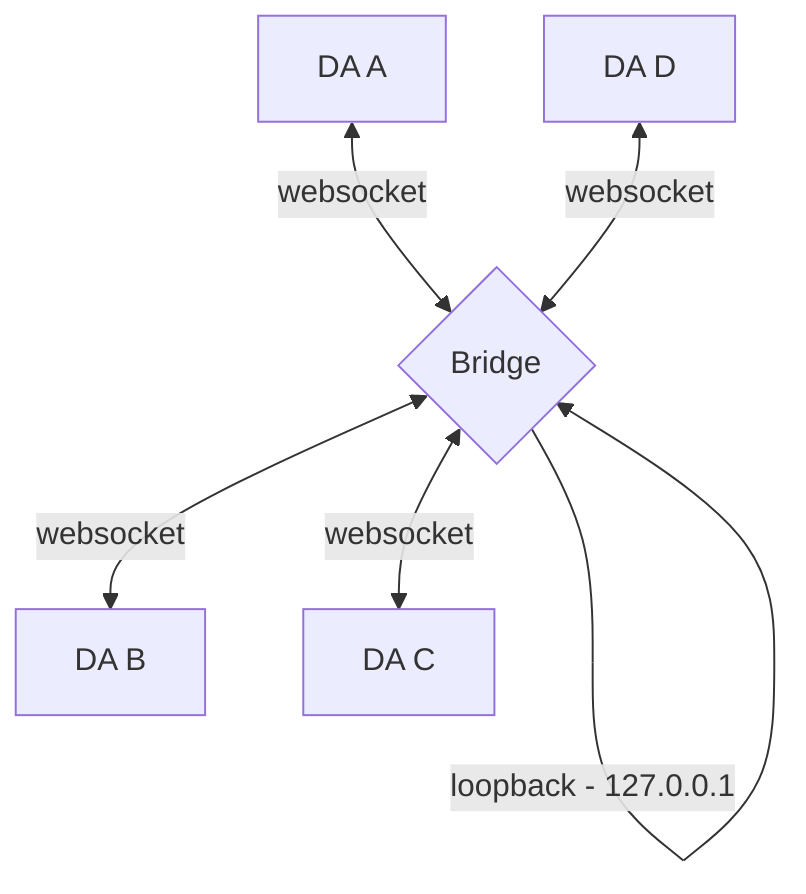
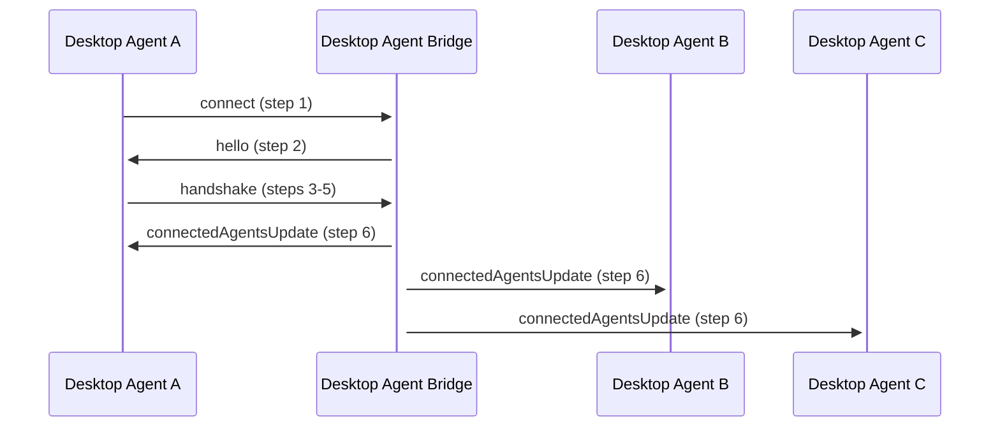
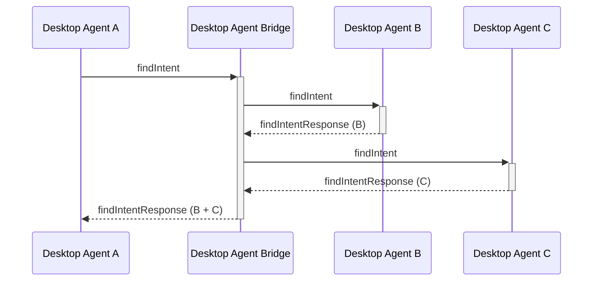
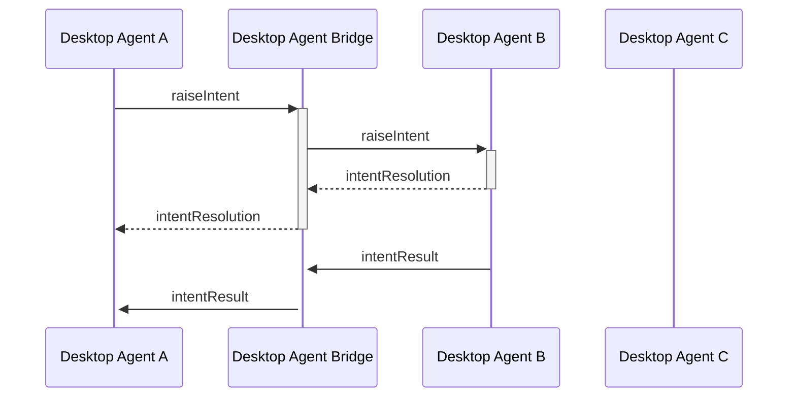
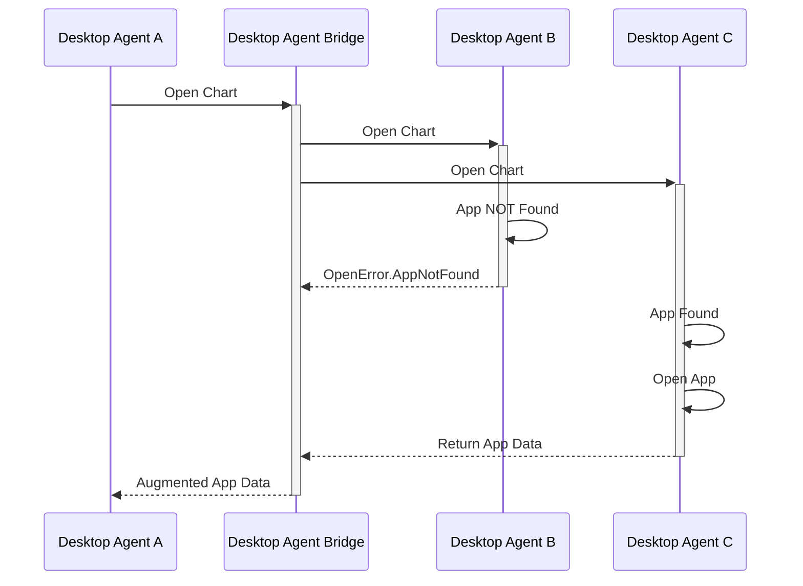
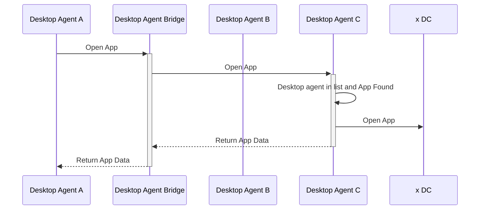
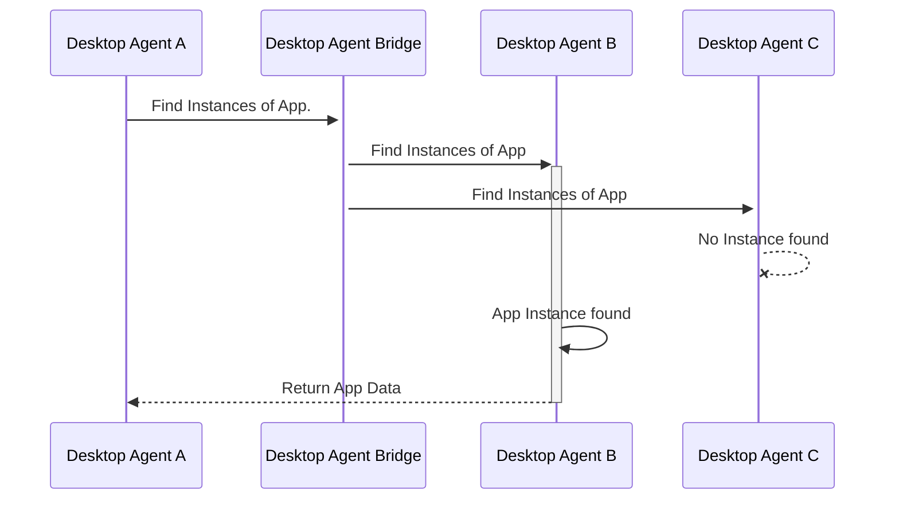

The FDC3 Desktop Agent API addresses interoperability between apps running within the context of a single Desktop Agent (DA), facilitating cross-application workflows. Desktop Agent API Bridging addresses the interconnection of Desktop Agents (DAs) such that apps running under different Desktop Agents can also interoperate, allowing workflows to span multiple Desktop Agents.

In any Desktop Agent bridging scenario, it is expected that each DA is being operated by the same user (as the scope of FDC3 contemplates cross-application workflows for a single user, rather than cross-user workflows), although DAs may be run on different machines operated by the same user.

## Recent Changes

* Fixed typos found during last meeting
* Added new `DesktopAgentIdentifier` type
* Updated `meta.source` to be of `AppIdentifier` OR `DesktopAgentIdentifier` type
* Highlighted that `source.destination` field should be used for troubleshooting and debugging purposes only

## Open questions / TODO list

* Add details of how to handle:
  * workflows broken by disconnection
  * An agent that is repeatedly timing out should be disconnected?
  * Advise on whether other agents report to users on connect/disconnect events?
* Add new terms and acronyms to FDC3 glossary and ensure they are defined in this spec's introduction
* Add RFC 4122 - https://datatracker.ietf.org/doc/html/rfc4122 to FDC3 references page
* Add a response collation example to generic messaging protocol

## Implementing a Desktop Agent Bridge

### Topology

In order to implement Desktop Agent Bridging some means for Desktop Agents to connect to and communicate with each other is needed. This Standard assumes that Desktop Agent Bridging is implemented via a standalone 'bridge' which each agent connects to and will use to route messages to or from other agents. This topology is similar to a star topology in networking, where the Desktop Agent Bridge (a 'bridge') will be the central node acting as a router.



Other possible topologies include peer-to-peer or client/server networks, however, these introduce significant additional complexity into multiple aspects of the bridging protocol that must be implemented by Desktop Agents, (including discovery, authentication and message routing), where a star topology/standalone bridge enables a relatively simple set of protocols, with the most difficult parts being implemented in the bridge itself.

Whilst the standalone bridge represents a single point of failure for the interconnection of Desktop Agents, it will also be significantly simpler than a full Desktop Agent implementation. Further, failures may be mitigated by setting the bridge up as a system service, such that it is started when the user's computer is started and may be restarted automatically if it fails. In the event of a bridge failure or manual shutdown, then Desktop Agents will no longer be bridged and should act as single agents.

In Financial services it is not unusual for a single user to be working with applications on more than one desktop. As Desktop Agents do not span desktops bridging Desktop Agents across multiple machines is an additional use case for Desktop Agent bridging. However, as FDC3 only contemplates interoperability between apps for a single user, it is expected that in multi-machine use cases each machine is being operated by the same user.

### Technology & Service Discovery

Connections between Desktop Agents and the Desktop Agent Bridge will be made via websocket connections, with the bridge acting as the websocket server and each connected Desktop Agent as a client.

The bridge MUST run on the same machine as the Desktop Agents, and the websocket MUST be bound to the loopback adapter IP address (127.0.0.1), ensuring that the websocket is not exposed to wider networks.

Bridge implementations SHOULD default to binding the websocket server to a port in the recommended port range 4475 - 4575, enabling simple discovery of a running bridge via attempting socket connections to ports in that range and attempting a handshake (as defined later in this proposal) that will identify the websocket as belong to a Desktop Agent Bridge. A port range is used, in preference to a single nominated port, in order to enable the automatic resolution of port clashes with other services.

Both DAs and bridge implementations MUST support at least connection to the recommended port range and MAY also support configuration for connection to an alternative bridging port range.

As part of the Desktop Agent Bridging protocol, a bridge will implement "server" behavior by:

* Accepting connections from client Desktop Agents, receiving and authenticating credentials and assigning a name (for routing purposes)
* Receiving requests from client Desktop Agents.
* Routing requests to client Desktop Agents.
* Receiving responses (and collating?) from client Desktop Agents.
* Routing responses to client Desktop Agents.

A Desktop Agent will implement "client" behavior by:

* Connecting to the bridge, providing authentication credentials and receiving an assigned named (for purposes)
* Forwarding requests to the bridge.
* Awaiting response(s) (and collating them?) from the bridge.
* Receiving requests from the bridge.
* Sending responses to the bridge.

Hence, message paths and propagation are simple. All messages to other Desktop Agents are passed to the bridge for routing and all messages (both requests and responses) are received back from it, i.e. the bridge is responsible for all message routing.

#### Collating Responses

Whilst some FDC3 requests are fire and forget (e.g. broadcast) the main requests such as `findIntent` or `raiseIntent` expect a response. In a bridging scenario, the response can come from multiple Desktop Agents and therefore need to be aggregated and augmented before they are sent back to the requesting DA.

The DAB is the responsible entity for collating responses together from all DAs. Whilst this approach may add some complexity to bridge implementations, it will simplify DA implementations since they only need to handle one response.

The DAB MUST allow for timeout configuration.

The Bridge SHOULD also implement timeout for waiting on DA responses. Assuming the message exchange will be all intra-machine, a recommended timeout of 1500ms - 3000ms should be used.

#### Channels

It is assumed that Desktop Agents SHOULD adopt the recommended 8 channel set (and the respective display metadata). Desktop Agents MAY support channel customization through configuration.

The Desktop Agent Bridge MAY support channel mapping ability, to deal with issues caused by differing channel sets.

A key responsibility of the DAB is ensuring that the channel state of the connected agents is kept in-sync, which requires an initial synchronization step as part of the connection protocol.

#### Bridging Desktop Agent on Multiple Machines

As the bridge binds its websocket on the loopback address (127.0.0.1) it cannot be connected to from another device. Hence, an instance of the standalone bridge may be run on each device and those instances exchange messages in order to implement the bridge cross-device.

However, cross-machine routing is an internal concern of the Desktop Agent Bridge, with each Desktop Agent simply communicating with a bridge instance located on the same machine. The connection protocol between bridges themselves is implementation specific and beyond the scope of this standard. Further, as FDC3 only contemplates interoperability between apps for a single user, it is expected that in multi-machine use cases each machine is being operated by the same user. However, methods of verifying the identity of user are currently beyond the scope of this Standard.

## Connection Protocol

On connection to the bridge's websocket, a handshake must be completed that may include an authentication step before a name is assigned  to the Desktop Agent for use in routing messages. The purpose of the handshake is to allow:

* The Desktop Agent to confirm that it is connecting to Desktop Agent Bridge, rather than another service exposed via a websocket.
* The DAB to require that the Desktop Agent authenticate itself, allowing it to control access to the network of bridged Desktop Agents.
* The Desktop Agent to request a particular name by which it will be addressed by other agents and for the bridge to assign the requested name, after confirming that no other agent is connected with that name, or a derivative of that name if it is already in use.

The bridge is ultimately responsible for assigning each Desktop Agent a name and for routing messages using those names. Desktop Agents MUST accept the name they are assigned by the bridge.

Exchange standardized handshake messages that identify:

* That the server is a bridge, including:
  * implementation details for logging by DA.
  * supported FDC3 version(s).
* That the client is an FDC3 DA, including:
  * implementation details (ImplementationMeta returned by fdc3.getInfo() call) for logging by DA and sharing with other DAs.
    * already includes supported FDC3 version.
  * request for a specific agent name.



### Step 1. Connect to Websocket

The Desktop Agent attempts to connect to the websocket at the first port in the defined port range.

### Step 2. Hello

When a new connection is made to the DAB websocket, it sends a `hello` message, including its metadata.

```typescript
{
    type: "hello",
    payload: {
        desktopAgentBridgeVersion: number,
        supportedFDC3Versions: string[],
        authRequired: boolean,
        /** The DAB JWT authentication token */
        authToken?: string
    },
    meta: {
        timestamp: date
    }
}
```

A Desktop Agent can use the structure of this message to determine that it has connected to a Desktop Agent Bridge (i.e by checking `msg.type === "hello" && msg.payload.desktopAgentBridgeVersion`), whether it supports a compatible FDC3 version and whether it is expected to provide authentication credentials in the next step (`if(msg.payload.authRequired) { ... }`).

An optional JWT token can be included in the `hello` message to allow the connecting agent to authenticate the bridge. Verification of the supplied JWT by the DA is optional but recommended, meaning that the DA SHOULD verify the received JWT when one is included in the `hello` message.

If no hello message is received, the message doesn't match the defined format or validation of the optional JWT fails, the Desktop Agent should return to step 1 and attempt connection to the next port in the range.  In the event that there are no ports remaining in the range, the Desktop Agent SHOULD reset to the beginning of the range, MAY pause its attempts to connect and resume later. Note, if the Desktop Agent is configured to run at startup (of the user's machine) it is possible that the Desktop Agent Bridge may start later (or be restarted at some point). Hence, Desktop Agents SHOULD be capable of connecting to the bridge once they are already running (rather than purely at startup).

### Step 3. Handshake & Authentication

The DA must then respond to the `hello` message with a `handshake` request to the bridge, including an auth token (JWT) if required.

```typescript
{
    type:  "handshake",
    /** Request body, containing the arguments to the function called.*/
    payload: {
        /** The JWT authentication token */
        authToken?: string,
        /** DesktopAgent implementationMetadata trying to connect to the bridge */
        implementationMetadata: ImplementationMetadata,
        /** The requested DA name */
        requestedName: string,
        /** The current state of the Desktop Agent's channels, excluding any private channels,
         *  as a mapping of channel id to an array of Context objects, most recent first.*/
        channelsState: Record<string, Context[]>
    },
    meta: {
        /** Unique GUID for this request */
        requestGuid: string,
        /** Timestamp at which request was generated */
        timestamp:  date
    }
}
```

Note that the `meta` element of of the handshake message contains both a `timestamp` field (for logging purposes) and a `requestGuid` field that should be populated with a Globally Unique Identifier (GUID), generated by the Desktop Agent. This `responseGuid` will be used to link the handshake message to a response from the DAB that assigns it a name. For more details on GUID generation see [Globally Unique Identifier](####globally-unique-identifier) section.

If requested by the server, the JWT auth token payload should take the form:

```typescript
{
    "sub": string, // UUID for the keypair used to sign the token
    "iat": date    // timestamp at which the the token was generated as specified in ISO 8601
}
```

e.g.

```JSON
{
    "sub": "65141135-7200-47d3-9777-eb8786dd31c7",
    "iat": "2022-07-06T10:11:43.492Z"
}
```

Note that the `sub` SHOULD be a UUID that does NOT need to match the name requested by the Desktop Agent. It will be used to identify the keypair that should be used to validate the JWT token. Further, multiple Desktop Agent's MAY share the same keys for authentication and hence the same `sub`, but they will be assigned different names for routing purposes by the DAB. If an agent disconnects from the bridge and later re-connects it MAY request and be assigned the same name it connected with before.

### Step 4. Auth Confirmation and Name Assignment

The DAB will extract the authentication token `sub` from the JWT token's claims and then verify the token's signature against any public key it has been configured with. If the signature can't be verified, the bridge should respond with the below authentication failed message and the socket should be disconnected by the bridge.

```typescript
{
    type:  "authenticationFailed",
    meta: {
        /** Timestamp at which response was generated */
        timestamp:  date,
        /** GUID for the handshake request */
        requestGuid: string,
        /** Unique guid for this message */
        responseGuid: string,
    }
}
```

If authentication succeeds (or is not required), then the DAB should assign the Desktop Agent the name requested in the `handshake` message, unless another agent is already connected with that name in which case it should generate a new name which MAY be derived from the requested name. Note that the assigned name is not communicated to the connecting agent until step 5.

### Step 5. Synchronize the Bridge's Channel State

Channels are the main stateful mechanism in the FDC3 that we have to consider. A key responsibility of the DAB is ensuring that the channel state of the connected agents is kept in-sync. To do so, the states must be synchronized whenever a new agent connects. Hence, the Bridge MUST process the `channelState` provided by the new agent in the `handshake` request, which MUST contain details of each known User Channel or App Channel and its state. The bridge MUST compare the received channel names and states to its own representation of the current state of channels in connected agents, merge that state with that of the new agent and communicate the updated state to all connected agents to ensure that they are synchronized with it.

Hence, if we assume that the state of each channel can be represented by an ordered array of context objects (most recent first - noting that only the first position, that of the most recent context broadcast, matters), the Desktop Agent Bridge MUST merge the incoming `channelsState` with the `existingChannelsState` as follows:

```typescript
Object.keys(channelsState).forEach((channelId) => {
    if (!existingChannelsState[channelId]) {
        //unknown channels: just adopt its state
        existingChannelsState[channelId] = channelsState[channelId];
    } else {
        //known channels: merge state, with existing state taking precedence
        const currentState = existingChannelsState[channelId];
        const incoming = channelsState[channelId];
        incoming.forEach((context) => {
            //only add previously unknown context types to the state
            if (!currentState.find(element => element.type === context.type)){
                //add to end of array to avoid setting most recent context type at the beginning
                currentState.push(context);
            } 
            // else ignore any types that are already known          
        });
    }
});
```

When multiple agents attempt to connect to the Desktop Agent Bridge at the same time, steps 3-6 of the connection protocol MUST be handled by the DAB serially to ensure correct channel state synchronization.

### Step 6. Connected Agents Update

The updated `existingChannelsState` will then be shared with all connected agents along with updated details of all connected agents via a `connectedAgentsUpdate` message sent to all connected sockets. The newly connected agent will receive both its assigned name and channel state via this message. The `connectedAgentsUpdate` message will be linked to the handshake request by quoting the `meta.requestGuid` of the `handshake` message.

The `connectedAgentsUpdate` message will take the form:

```typescript
{
    type:  "connectedAgentsUpdate",
    /** Request body, containing the arguments to the function called.*/
    payload: {
        /** Should be set when an agent first connects to the bridge and provide its assigned name. */
        addAgent?: string,
        /** Should be set when an agent disconnects from the bridge and provide the name that no longer is assigned. */
        removeAgent?: string,
        /** Desktop Agent Bridge implementation metadata of all connected agents. 
         *  Note that this object is extended to include a `desktopAgent` field with the name assigned by the DAB. */
        allAgents: ImplementationMetadata[],
        /** The updated state of channels that should be adopted by the agents. SHOULD only be set when an agent is connecting to the bridge. */
        channelsState?: ChannelState[] // see step4
    },
    meta: {
        /** For a new connection, should be the same as the handshake requestGuid. 
         *  Should be the same as the responseGuid for a disconnection.
        */
        requestGuid: string,
        /** Unique guid for this message */
        responseGuid: string,
        /** Timestamp at which response was generated */
        timestamp:  date,
    }
}
```

When an agent connects to the bridge, it should adopt the state of any channels that do not currently exist or do not currently contain state of a particular type. This synchronization is NOT performed via broadcast as the context being merged would become the most recent context on the channel, when other contexts may have been broadcast subsequently. Rather, it should be adopted internally by the Desktop Agent merging it such that it would be received by applications that are adding a user channel context listener or calling `channel.getCurrentContext()`.

It should be noted that Desktop Agents will not have context listeners for previously unknown channels, and SHOULD simply record that channel's state for use when that channel is first used.

For known channel names, the Desktop Agent MUST also compare its current state to that which it has just received and may need to internally adopt context of types not previously seen on a channel. As context listeners can be registered for either a specific type or all types some care is necessary when doing so (as only the most recently transmitted Context should be received by un-typed listeners). Hence, the new context MUST only be passed to a context listener if it was registered specifically for that type and a context of that type did not previously exist on the channel.

In summary, updating listeners for a known channel should be performed as follows:

1. The incoming channel state `channelState` for a particular channel should be processed from last to first (most recent context broadcast).
2. If there is no current context of that type, broadcast it to any listeners of that specific type only.
3. If there is a current context of that type, and it does not match the incoming object exactly, broadcast it to listeners of that specific type only.
4. If the most recent (first in the incoming array) type OR value of that type doesn't match the most recent context broadcast on the channel, broadcast it to un-typed listeners only.

This procedure is the same for both previously connected and connecting agents, however, the merging procedure used by the DAB in step 5 will result in apps managed by previously connected agents only rarely receiving context broadcasts (and only for types they have not yet seen on a channel).

After applying the `connectedAgentsUpdate` message, the newly connected Desktop Agent and other already connected agents are able to begin communicating through the bridge.

The handling of these synchronization messages from the DAB to Desktop Agents should be handled atomically by Desktop Agents to prevent message overlap with `fdc3.broadcast`, `channel.broadcast`, `fdc3.addContextListener` or `channel.getCurrentContext`. I.e. the `connectedAgentsUpdate` message must be processed immediately on receipt and updates applied before any other messages are sent or responses processed.

Similarly, the DAB must process `handshake` messages and issue `connectedAgentsUpdate` messages to all participants (steps 3-6) atomically, allowing no overlap with the processing of other messages from connected agents.

### Step 7. Disconnects

Although not part of the connection protocol, it should be noted that the `connectedAgentsUpdate` message sent in step 6 should also be sent whenever an agent disconnects from the bridge to update other agents. If any agents remain connected, then the `channelState` does not change and can be omitted. However, if the last agent disconnects the bridge SHOULD discard its internal `channelState`, instead of issuing the update.

## Messaging Protocol

In order for Desktop Agents to communicate with the Desktop Agent Bridge and thereby other Desktop Agents, a messaging protocol is required. FDC3 supports both 'fire and forget' interactions (such as the broadcast of context messages) and interactions with specific responses (such as raising intents and returning a resolution and optional result), both of which must be handled by that messaging protocol and message formats it defines, as described in this section.

### Message Format

All messages sent or received by the Desktop Agent Bridge will be encoded in JSON and will have the same basic structure (including those already defined in the connection protocol):

```typescript
{
    /** Identifier used to declare what aspect of FDC3 that the message relates to. */
    type:  string,
    /** Request body, containing any the arguments to the FDC3 interactions. */
    payload: { ... },
    /** Metadata relating to the message, its sender and destination. */
    meta: { ... }
}
```

Messages can be divided into two categories:

* Requests: Messages that initiate a particular interaction
* Responses: Messages that later to a prior request

Details specific to each are provided below:

#### Request Messages

Request messages use the following format:

```typescript
{
    /** Typically set to the FDC3 function name that the message relates to, e.g. "findIntent" */
    type:  string,
    /** Request body, typically containing the arguments to the function called.*/
    payload: {
        //example fields for specific messages
        channel?: string,
        intent?: string,
        context?: Context,
        app?: AppIdentifier
    },
    /** Metadata used to uniquely identify the message and its sender. */
    meta: {
        /** Unique GUID for this request */
        requestGuid: string,
        /** Timestamp at which request was generated */
        timestamp:  date,
         /** AppIdentifier OR DesktopAgentIdentifier for the source application that the request was 
          *  received from and will be augmented with the assigned name of the 
          *  Desktop Agent by the Desktop Agent Bridge, rather than the sender. */
        source: AppIdentifier | DesktopAgentIdentifier,
        /** Optional AppIdentifier or DesktopAgentIdentifier for the destination that the request should be 
         *  routed to, which MUST be set by the Desktop Agent for API calls that 
         *  include a target (`app`) parameter. MUST include the name of the 
         *  Desktop Agent hosting the target application. */
        destination?: AppIdentifier | DesktopAgentIdentifier
    }
}
```

If the FDC3 API call underlying the request message includes a target (typically defined by an `app` argument, in the form of an AppIdentifier object) it is the responsibility of the Desktop Agent to copy that argument into the `meta.destination` field of the message and to ensure that it includes a `meta.destination.desktopAgent` value. If the target is provided in the FDC3 API call, but without a `meta.destination.desktopAgent` value, the Desktop Agent should assume that the call relates to a local application and does not need to send it to the bridge.

Requests without a `meta.destination` field will be forwarded to all other agents for processing and the collation of responses by the bridge.

#### Response Messages

Response messages will be differentiated from requests by the presence of a `responseGuid` field and MUST reference the `requestGuid` that they are responding to.

```typescript
{
    /** FDC3 function name the original request related to, e.g. "findIntent" */
    type:  string,
    /** Response body, containing the actual response data. */
    payload: {
        //example fields for specific messages... 
        intent?:  string,
        appIntent?:  AppIntent,
        
        //TODO


    },
    meta: {
        /** requestGuid from the original request being responded to*/
        requestGuid: string,
        /** Unique GUID for this response */
        responseGuid:  string,
        /** Timestamp at which request was generated */
        timestamp:  Date,
        /** AppIdentifier for the source that generated this response */
        source: AppIdentifier | DesktopAgentIdentifier,
        /** AppIdentifier OR DesktopAgentIdentifier for the destination that the response should be routed to */
        destination: AppIdentifier | DesktopAgentIdentifier
    }
}
```

Response messages MUST always include a `meta.destination` field which matches the `meta.source` information provided in the request. Response messages that do not include a `meta.destination` should be discarded.

### Identifying Desktop Agents Identity and Message Sources

Desktop Agents will prepare messages in the above format and transmit them to the bridge. However, to target intents and perform other actions that require specific routing between DAs, DAs need to have an identity. Identities should be assigned to clients when they connect to the bridge. This allows for multiple copies of the same underlying Desktop Agent implementation to be bridged and ensures that id clashes can be avoided.

To prevent spoofing and to simplify the implementation of clients, sender identities for bridging messages MUST be added, by the bridge to `AppIdentifier` or `DesktopAgentIdentifier` objects embedded in them as the `source` field. Request and response `destination` fields are set by the Desktop Agent sending the message. However, in the case of response messages, Desktop Agent Bridge implementation MUST retain a record of `requestGuid` fields, until the request is fully resolved, allowing them to validate or overwrite the `destination` for a response to match the source of the original request, effectively enforcing the routing policy for interactions.

Further, the Desktop Agent Bridge should also inspect the `payload` of both request and response messages and ensure that any `AppIdentifier` objects have been augmented with the correct `desktopAgent` value for the app's host Desktop Agent (e.g. if returning responses to `findIntent`, ensure each `AppIntent.apps[]` entry includes the correct `desktopAgent` value). Further details of such augmentation is provided in the description of each message exchange.

#### DesktopAgentIdentifier

This proposal  introduces a new `DesktopAgentIdentifier` type. This type is to facilitate addressing of messages to particular Desktop Agent and apps that they host.

```typescript
interface DesktopAgentIdentifier {
  /** A string filled in by the Desktop Agent Bridge on receipt of a message, that represents 
   * the Desktop Agent Identifier that is the source of the message. 
   **/
  readonly desktopAgent: string;
}
```

#### AppIdentifier

The `AppIdentifier` is to be expanded to contain an optional `desktopAgent` field.

```typescript
interface AppIdentifier {
  readonly appId: string;
  readonly instanceId?: string;
  /** Field that represents the Desktop Agent that the app is available on.**/
  readonly desktopAgent?: DesktopAgentIdentifier;
}
```

### Identifying Individual Messages

There are a variety of message types need to be sent between bridged Desktop Agents, several of which will need to be replied to specifically (e.g. a `fdc3.raiseIntent` call should receive an `IntentResolution` when an app has been chosen, and may subsequently receive an `IntentResult` after the intent handler has run). Hence, messages also need a unique identity, which should be generated at the Desktop Agent that is the source of that message, in the form of a Globally Unique Identifier (GUID). Response messages will include the identity of the request message they are related to, allowing multiple message exchanges to be 'in-flight' at the same time.

The `meta.destination` field MUST not be relied upon to ensure the correct routing of messages. The spec recognizes the superior readability that this value provides over the `meta.requestGuid` but it should only be used for debugging and troubleshooting purposes.

Hence, whenever a request message is generated by a Desktop Agent it should contain a unique `meta.requestGuid` value. Response messages should quote that same value in the `meta.requestGuid` field and generate a further unique identity for their response, which is included in the `meta.responseGuid` field.

Desktop Agent Bridge implementations should consider request messages that omit `meta.requestGuid` and response messages that omit either `meta.requestGuid` or `meta.responseGuid` to be invalid and should discard them.

#### Globally Unique Identifier

A GUID (globally unique identifier), also known as a Universally Unique IDentifier (UUID), is a generated 128-bit text string that is intended to be 'unique across space and time', as defined in [IETF RFC 4122](https://www.ietf.org/rfc/rfc4122.txt).  

There are several types of GUIDs, which vary how they are generated. As Desktop Agents will typically be running on the same machine, system clock and hardware details may not provide sufficient uniqueness in GUIDs generated (including during the connect step, where Desktop Agent name collisions may exist). Hence, it is recommended that both Desktop Agents and Desktop Agent Bridges SHOULD use a version 4 generation type (random).

### Forwarding of Messages and Collating Responses

When handling request messages, it is the responsibility of the Desktop Agent Bridge to:

* Receive request messages from connected Desktop Agents,
* Augment request messages with source information (as described above),
* Forward request messages onto either a specific Desktop Agent or all Desktop Agents as appropriate.

For message exchanges that involve responses, it is the responsibility of the Desktop Agent Bridge to:

* Receive and collate response messages according the requestGuid (allowing multiple message exchanges to be 'in-flight' at once),
* Apply a timeout to the receipt of response messages for each request,
* Produce a single collated response message that incorporates the output of each individual response received,
* Deliver the collated response message to the source of the request

There are a few simple rules which determine how a request message should be forwarded:

* If the message is a request (`meta.requestGuid` is set, but `meta.responseGuid` is not)
  * and the message does not include a `meta.destination` field
    * forward it to all other Desktop Agents (not including the source) and await responses
  * else if a `meta.destination` was included
    * forward it to the specified destination agent and await the response
* else if the message is a response
  * and the message response includes

//TODO complete this

## Handling FDC3 Interactions When Bridged

//TODO add details of AppIdentifier augmentation to each exchange 

The use of Desktop Agent Bridging affects how a Desktop Agent must handle FDC3 API calls. Details on how this affects the FD3 API, how a Desktop Agent should interact the bridge and specifics of the messaging protocol are provided in this section.  

## Individual message exchanges

The sections below cover most scenarios for each of the Desktop Agent methods in order to explore how this protocol might work.

Each section assumes that we have 3 agents connected by a bridge:

* agent-A
* agent-B
* agent-C
* DAB

## Context

### broadcast (on channels)

Only needs a single message (no response).

An app on agent-A does:

```javascript
fdc3.broadcast(contextObj);
```

or

```javascript
(await fdc3.getOrCreateChannel("myChannel")).broadcast(contextObj)
```


It encodes this as a message which it sends to the DAB

```JSON
// agent-A -> DAB
{
    "type": "broadcast",
    "payload": {
        "channel": "myChannel",
        "context": { /*contextObj*/ }
    },
    "meta": {
        "requestGuid": "requestGuid",
        "timestamp": "2020-03-...",
        "source": {
            "name": "...",
            "appId": "...",
            "version": "...",
            // ... other metadata fields
        }
    }
}
```

which it repeats on to agent-B AND agent-C with the `source.desktopAgent` metadata added.

```JSON
// DAB -> agent-B
// DAB -> agent-C
{
    "type": "broadcast",
    "payload": {
        "channel": "myChannel",
        "context": { /*contextObj*/}
    },
    "meta": {
        "requestGuid": "requestGuid",
        "timestamp": "2020-03-...",
        "source": {
            "desktopAgent": "agent-A",
            "name": "...",
            "appId": "...",
            "version": "...",
            // ... other metadata fields
        },
    }
}
```

When adding context listeners (either for User Channels or specific App Channels) no messages need to be exchanged. Instead, upon receiving a broadcast message the Desktop Agent just needs to pass it on to all listeners on that named channel.

## Intents

### findIntent

```typescript
findIntent(intent: string, context?: Context): Promise<AppIntent>;
```



#### Request format

A findIntent call is made on agent-A.

```javascript
let appIntent = await fdc3.findIntent();
```

Sends an outward message to the DAB.

```JSON
// agent-A -> DAB
{
   "type": "findIntent",
   "payload": {
        "intent": "StartChat",
        "context": {/*contextObj*/}
   },
   "meta": {
        "requestGuid": "requestGuid",
        "timestamp": "2020-03-...",
        "source": {
            "name": "",
            "appId": "",
            "version": "",
            // ... other metadata fields
        }
   }
}
```

The DAB fills in the `source.desktopAgent` field and forwards the request to the other Desktop Agents (agent-B AND agent-C).

```JSON
// DAB -> agent-B
// DAB -> agent-C
{
    "type": "findIntent",
    "payload": {
        "intent": "StartChat",
        "context": {/*contextObj*/},
    },
    "meta": {
        "requestGuid": "requestGuid",
        "timestamp": "2020-03-...",
        "source": {
            "desktopAgent": "agent-A", // filled by DAB
            "name": "",
            "appId": "",
            "version": "",
            // ... other metadata fields
        }
    }
}
```

Note that the `source.desktopAgent` field has been populated with the id of the agent that raised the requests, enabling the routing of responses.

#### Response format

Normal response from agent-A, where the request was raised.

```JSON
{
    "intent": { "name": "StartChat", "displayName": "Chat" },
    "apps": [
        { "name": "myChat" }
    ]
}
```

DA agent-B would produce response:

```JSON
{
    "intent": { "name": "StartChat", "displayName": "Chat" },
    "apps": [
        { "name": "Skype" },
        { "name": "Symphony" },
        { "name": "Symphony", "instanceId": "93d2fe3e-a66c-41e1-b80b-246b87120859" },
        { "name": "Slack" }
    ]
}
```

which is sent back over the bridge as a response to the request message as:

```JSON
// agent-B -> DAB
{
    "type":  "findIntentResponse",
    "payload": {
        "intent":  "StartChat",
        "appIntent":  {
            "intent":  { "name": "StartChat", "displayName": "Chat" },
            "apps": [
                { "name": "Skype"},
                { "name": "Symphony" },
                { "name": "Symphony", "instanceId": "93d2fe3e-a66c-41e1-b80b-246b87120859" },
                { "name": "Slack" }
            ]
        }
    },
    "meta": {
        "requestGuid": "requestGuid",
        "responseGuid":  "responseGuidAgentB",
        "timestamp":  "2020-03-...",
        "destination": {
            "desktopAgent": "agent-A",
            "name": "",
            "appId": "",
            "version": "",
            // ... other metadata fields
        }
    }
}
```

Note the response guid generated by the agent-B and the reference to the request guid produced by agent-A where the request was originated.

This response gets repeated by the bridge in augmented form as:

```JSON
{
    "type":  "findIntentResponse",
    "payload": {
        "intent":  "StartChat",
        "appIntent":  {
            "intent":  { "name": "StartChat", "displayName": "Chat" },
            "apps": [
                { "name": "Skype", "desktopAgent": "agent-B"},
                { "name": "Symphony", "desktopAgent": "agent-B" },
                { "name": "Symphony", "instanceId": "93d2fe3e-a66c-41e1-b80b-246b87120859", "desktopAgent": "agent-B" },
                { "name": "Slack", "desktopAgent": "agent-B" }
            ]
        }
    },
    "meta": {
        "requestGuid": "requestGuid",
        "responseGuid":  "responseGuidAgentB",
        "timestamp":  "2020-03-...",
        "destination": {
            "desktopAgent": "agent-A",
            "name": "",
            "appId": "",
            "version": "",
            // ... other metadata fields
        },
        "source": {
            "desktopAgent": "agent-B",
        }
    }
}
```

DA agent-C would produce response:

```JSON
{
    "intent":  { "name": "StartChat", "displayName": "Chat" },
    "apps": [
       { "name": "WebIce"}
    ]
}
```

which is sent back over the bridge as a response to the request message as:

```JSON
// agent-C -> DAB
{
    "type":  "findIntentResponse",
    "payload": {
        "intent":  "StartChat",
        "appIntent":  {
            "intent":  { "name": "StartChat", "displayName": "Chat" },
            "apps": [
                { "name": "WebIce", "desktopAgent": "agent-C"}
            ]
        }
    },
    "meta": {
        "requestGuid": "requestGuid",
        "responseGuid":  "responseGuidAgentC",
        "timestamp":  "2020-03-...",
        "destination": {
           "desktopAgent": "agent-A",
           "name": "",
           "appId": "",
           "version": "",
           // ... other metadata fields
       }
    }
}
```

This response gets repeated by the bridge in augmented form as:

```JSON
{
    "type":  "findIntentResponse",
    "payload": {
        "intent":  "StartChat",
        "appIntent":  {
            "intent":  { "name": "StartChat", "displayName": "Chat" },
            "apps": [
                { "name": "WebIce", "desktopAgent": "agent-C"}
            ]
        }
    },
    "meta": {
        "requestGuid": "requestGuid",
        "responseGuid":  "responseGuidAgentC",
        "timestamp":  "2020-03-...",
        "destination": {
           "desktopAgent": "agent-A",
           "name": "",
           "appId": "",
           "version": "",
           // ... other metadata fields
       },
       "source": {
            "desktopAgent": "agent-C",
        }
    }
}
```

Then on agent-A the originating app finally gets back the following response from the bridge:

```JSON
// DAB -> agent-A
{
    "intent":  { "name": "StartChat", "displayName": "Chat" },
    "apps": [
        { "name": "myChat" }, // local to this agent
        { "name": "Skype", "desktopAgent": "agent-B" }, //agent-B responses
        { "name": "Symphony", "desktopAgent": "agent-B" },
        { "name": "Symphony", "instanceId": "93d2fe3e-a66c-41e1-b80b-246b87120859", "desktopAgent": "agent-B" },
        { "name": "Slack", "desktopAgent": "agent-B" },
        { "name": "WebIce", "desktopAgent": "agent-C"} //agent C response
    ]
}
```

### raiseIntent

```typescript
raiseIntent(intent: string, context: Context, app?: TargetApp): Promise<IntentResolution>;
```

For Desktop Agent bridging, a `raiseIntent` call MUST always pass a `app:TargetApp` argument. If one is not passed a `findIntent` will be sent instead to collect options to display in a local resolver UI, allowing for a targeted intent to be raised afterwards. See details below.

When receiving a response from invoking `raiseIntent` the new app instances MUST be fully initialized ie. the responding Desktop Agent will need to return an `AppIdentifier` with an `instanceId`.

Note that the below diagram assumes a `raiseIntent` WITH a `app:TargetApp` was specified and therefore agent-C is not involved.



#### Request format

A raiseIntent call, __without__ `app:TargetApp` argument is made on agent-A.

```typescript
raiseIntent(intent: string, context: Context): Promise<IntentResolution>;
```

agent-A sends an outward `findIntent` message to the DAB:

```JSON
// agent-A -> DAB
{
    "type": "findIntent",
    "payload": {
        "intent": "StartChat",
        "context": {/*contextObj*/}
    },
    "meta": {
        "requestGuid": "requestGuid",
        "timestamp": "2020-03-...",
        "source": {
            "name": "someOtherApp", //should this be the Desktop Agent or the app?
            "appId": "...",
            "version": "...",
            // ... other metadata fields
        }
    }
}
```

This will trigger the same flow as `findIntent`. Upon receiving a `findIntentResponse`, the resolver is shown.

User selects an option which will trigger a `raiseIntent` call with a `app:TargetApp` argument.

---

A `raiseIntent` call is made on agent-A which targets an `AChatApp` in agent-B.

```typescript
raiseIntent(intent: string, context: Context, app: TargetApp): Promise<IntentResolution>;
```

```JSON
// agent-A -> DAB
{
    "type": "raiseIntent",
    "payload": {
        "intent": "StartChat",
        "context": {/*contextObj*/},
        "app": {
            "name": "AChatApp",
            "desktopAgent": "agent-B"
        }
    },
    "meta": {
        "requestGuid": "requestGuid",
        "timestamp": "2020-03-...",
        "source": {
                "name": "someOtherApp",
                "appId": "...",
                "version": "...",
                // ... other metadata fields
        },
        "destination": { // duplicates the app argument so that the message is routed like any other
                "app": {
                "name": "AChatApp",
                "desktopAgent": "agent-B"
            }
        }
    }
}
```

The bridge fills in the `source.desktopAgent` field and forwards the request to the target Desktop Agent

```JSON
// DAB -> agent-B
{
    "type": "raiseIntent",
    "payload": {
        "intent": "StartChat",
        "context": {/*contextObj*/},
    },
    "meta": {
        "requestGuid": "requestGuid",
        "timestamp": "2020-03-...",
        "source": {
            "name": "someOtherApp",
            "appId": "...",
            "version": "...",
            "desktopAgent": "agent-A" // <---- filled by DAB
            // ... other metadata fields
        },
        "destination": {
            "app": {
                "name": "AChatApp",
                "desktopAgent": "agent-B"
            }
        },
    }
}
```

#### Response format

Normal response from agent-B, where the request was targeted to by agent-A. It sends this `intentResolution` as soon as it delivers the `raiseIntent` to the target app

```JSON
// agent-B -> DAB
{
    "type": "intentResolution",
    "payload": {
        "intent": "StartChat",
        "source": {
            "name": "AChatApp",
            "appId": "",
            "version": "",
            // ... other metadata fields
        },
        "version": "...",
    },
    "meta": {
        "requestGuid": "requestGuid",
        "responseGuid": "intentResolutionResponseGuid",
        "timestamp": "2020-03-...",
        "error?:": "ResolveError Enum",
        "source": { //Note this was the destination of the raised intent
            "name": "AChatApp",
            "appId": "",
            "version": "",
            // ... other metadata fields
        },
        "destination": { 
            "app": { //note this was the source of the raised intent
            "name": "someOtherApp",
            "appId": "",
                "version": "",
                "desktopAgent": "agent-A"
                // ... other metadata fields
            }
        }
    }
}
```

The bridge will fill in the `source.DesktopAgent` and relay the message on to agent-A

```JSON
// DAB -> agent-A
{
    "type": "intentResolution",
    "payload": {
        "intent": "StartChat",
        "source": {
            "name": "AChatApp",
            "appId": "",
            "version": "",
            "desktopAgent": "agent-B" // filled by DAB
            // ... other metadata fields
        },
        "version": "...",
    },
    "meta": {
        "requestGuid": "requestGuid",
        "responseGuid": "intentResolutionResponseGuid",
        "timestamp": "2020-03-...",
        "source": {
            "name": "AChatApp",
            "appId": "",
            "version": "",
            "desktopAgent": "agent-B" // filled by DAB
            // ... other metadata fields
        },
        "destination": { // duplicates the app argument
            "app": {
               "name": "someOtherApp",
               "appId": "",
                "version": "",
                "desktopAgent": "agent-A"
                // ... other metadata fields
           }
       }
    }
}
```

When `AChatApp` produces a response, or the intent handler finishes running, it should send a further `intentResult` message to send that response onto the intent raiser (or throw an error if one occurred)

```JSON
// agent-B -> DAB -> agent-A
{
    "type": "intentResult",
    "payload?:": {
        "channel": {
            "id": "channel 1",
            "type": "system"
        },
        "context": {/*contextObj*/} // in alternative to channel
    },
    "meta": {
        "requestGuid": "requestGuid",
        "responseGuid": "intentResultResponseGuid",
        "timestamp": "2020-03-...",
        "error?:": "ResultError Enum",
        "source": {
            "name": "AChatApp",
            "appId": "",
            "version": "",
            "desktopAgent": "agent-B" // filled by DAB
            // ... other metadata fields
        },
        "destination": { // duplicates the app argument
            "app": {
               "name": "someOtherApp",
               "appId": "",
                "version": "",
                "desktopAgent": "agent-A"
                // ... other metadata fields
           }
       }
    }
}
```

If intent result is private channel:

```JSON
// agent-B -> DAB -> agent-A
{
    "type": "intentResult",
    "payload?:": {
        "channel": {
            "id": "channel a",
            "type": "private"
        },
        "context": {/*contextObj*/} // in alternative to channel
    },
    "meta": {
        "requestGuid": "requestGuid",
        "responseGuid": "intentResultResponseGuid",
        "timestamp": "2020-03-...",
        "error?:": "ResultError Enum",
        "source": {
            "name": "AChatApp",
            "appId": "",
            "version": "",
            "desktopAgent": "agent-B" // filled by DAB
            // ... other metadata fields
        },
        "destination": { // duplicates the app argument
            "app": {
            "name": "someOtherApp",
            "appId": "",
                "version": "",
                "desktopAgent": "agent-A"
                // ... other metadata fields
            }
        }
    }
}
```

---
`onSubscribe` to the private channel sent to server:

```JSON
// agent-A -> DAB
{
    "type": "privateChannelSubscribe",
    "payload": {},
    "meta": {
        "requestGuid": "requestGuid",
        "timestamp": "2020-03-...",
        "source": {
            "name": "AChatApp",
            "appId": "",
            "version": "",
            // ... other metadata fields
        },
        "destination": { // duplicates the app argument
            "app": {
            "name": "someOtherApp",
            "appId": "",
                "version": "",
                "desktopAgent": "agent-B"
                // ... other metadata fields
            }
        }
    }
}
```

The bridge will add in the source agent (agent-A) and forward the message to destination (agent-B)

```JSON
// DAB -> agent-B
{
    "type": "privateChannelSubscribe",
    "payload": {},
    "meta": {
        "requestGuid": "requestGuid",
        "timestamp": "2020-03-...",
        "source": {
            "name": "AChatApp",
            "appId": "",
            "version": "",
            "desktopAgent": "agent-A"
            // ... other metadata fields
        },
            "destination": { // duplicates the app argument
                "app": {
                "name": "someOtherApp",
                "appId": "",
                    "version": "",
                    "desktopAgent": "agent-B"
                    // ... other metadata fields
            }
        }
    }
}
```

---
`onUnsubscribe` to the private channel sent to the bridge

```JSON
// agent-A -> DAB
{
    "type": "privateChannelUnsubscribe",
    "payload": {},
    "meta": {
        "requestGuid": "requestGuid",
        "timestamp": "2020-03-...",
        "source": {
            "name": "AChatApp",
            "appId": "",
            "version": "",
            // ... other metadata fields
        },
        "destination": { // duplicates the app argument
            "app": {
               "name": "someOtherApp",
               "appId": "",
                "version": "",
                "desktopAgent": "agent-B"
                // ... other metadata fields
           }
       }
    }
}
```

The bridge will add in the source agent (agent-A) and forward the message to destination (agent-B)

```JSON
// DAB -> agent-B
{
    "requestGuid": "requestGuid",
    "timestamp": "2020-03-...",
    "type": "privateChannelUnsubscribe",
    "payload": {},
    "meta": {
        "source": {
            "name": "AChatApp",
            "appId": "",
            "version": "",
            "desktopAgent": "agent-A",
            // ... other metadata fields
        },
        "destination": { // duplicates the app argument
            "app": {
               "name": "someOtherApp",
               "appId": "",
                "version": "",
                "desktopAgent": "agent-B"
                // ... other metadata fields
           }
       }
    }
}
```

---
`onDisconnect` to the private channel sent to the bridge

```JSON
// agent-A -> DAB
{
    "type": "privateChannelDisconnect",
    "payload": {},
    "meta": {
        "requestGuid": "requestGuid",
        "timestamp": "2020-03-...",
        "source": {
            "name": "AChatApp",
            "appId": "",
            "version": "",
            // ... other metadata fields
        },
        "destination": { // duplicates the app argument
            "app": {
               "name": "someOtherApp",
               "appId": "",
                "version": "",
                "desktopAgent": "agent-B"
                // ... other metadata fields
           }
       }
    }
}
```

The bridge will add in the source agent (agent-A) and forward the message to destination (agent-B)

```JSON
// DAB -> agent-B
{
    "type": "privateChannelDisconnect",
    "payload": {},
    "meta": {
        "requestGuid": "requestGuid",
        "timestamp": "2020-03-...",
        "source": {
            "name": "AChatApp",
            "appId": "",
            "version": "",
            "desktopAgent": "agent-A"
            // ... other metadata fields
        },
        "destination": { // duplicates the app argument
            "app": {
               "name": "someOtherApp",
               "appId": "",
                "version": "",
                "desktopAgent": "agent-B"
                // ... other metadata fields
           }
       }
    }
}
```

### open

```typescript
open(app: TargetApp, context?: Context): Promise<AppIdentifier>;
```

When receiving a response from invoking `fdc3.open` the new app instances MUST be fully initialized ie. the responding Desktop Agent will need to return an `AppIdentifier` with an `instanceId`.

#### Request format

A `fdc3.open` call is made on agent-A.

```javascript
// Open an app without context, using the app name
let instanceMetadata = await fdc3.open('myApp');

// Open an app without context, using an AppIdentifier object to specify the target
let AppIdentifier = {name: 'myApp', appId: 'myApp-v1.0.1', version: '1.0.1'};
let instanceMetadata = await fdc3.open(AppIdentifier);

// Open an app without context, using an AppIdentifier object to specify the target and Desktop Agent
let AppIdentifier = {name: 'myApp', appId: 'myApp-v1.0.1', version: '1.0.1', desktopAgent:"DesktopAgentB"};
let instanceMetadata = await fdc3.open(AppIdentifier);
```

The `fdc3.open` command should result in a single copy of the specified app being opened and its instance data returned, or an error if it could not be opened. There are two possible scenarios:

1) The Desktop Agent that the app should open on is specified
2) The Desktop Agent that the app should open on is NOT specified app

The first case (target Desktop Agent is specified) is simple:

* If the local Desktop Agent is the target, handle the call normally
* Otherwise:
  * Request is sent to the bridge
  * DAB checks to see if any of the connected DAs is the target and transmit the call to it and awaits a response
  * otherwise return `OpenError.AppNotFound`

The second case is a little trickier as we don't know which agent may have the app available:

* If the local Desktop Agent has the app, open it and exit.
* Otherwise:
  * Request is sent to the bridge
  * Bridge will query each connected DA asynchronously and await a response
    * If the response is `AppIdentifier` then return it and exit (ignore every subsequent response)
    * If the response is `OpenError.AppNotFound` and there are pending responses, wait for the next response
    * If the response is `OpenError.AppNotFound` and there are NO pending responses, return `OpenError.AppNotFound`



__When the target Desktop Agent is set__



It sends an outward message to the bridge:

```JSON
// agent-A -> DAB
{
    "type": "open",
    "payload": {
        "AppIdentifier": {
            "name": "myApp",
            "appId": "myApp-v1.0.1",
            "version": "1.0.1",
            "desktopAgent":"agent-B"
            },
        "context": {/*contextObj*/}
    },
    "meta": {
        "requestGuid": "requestGuid",
        "timestamp": "2020-03-...",
    }
}
```

which is repeated as:

```JSON
// DAB -> agent-B
{
    "type": "open",
    "payload": {
        "AppIdentifier": {
            "name": "myApp",
           "appId": "myApp-v1.0.1",
           "version": "1.0.1",
           "desktopAgent":"DesktopAgentB"
           },
       "context": {/*contextObj*/}
    },
    "meta": {
        "requestGuid": "requestGuid",
        "timestamp": 2020-03-...,
        "source": {
            "desktopAgent": "agent-A", // filled by DAB
            // ... other metadata fields
        }
    }
}
```

### findInstances

```typescript
findInstances(app: TargetApp): Promise<Array<AppIdentifier>>;
```



## Channels

App Channels don't need specific messages sending for `fdc3.getOrCreateChannel` as other agents will be come aware of it when messages are broadcast.

However, `PrivateChannel` instances do require additional handling due to the listeners for subscription and disconnect. Please see the raiseIntent section for the messages sent in support of this functionality.
