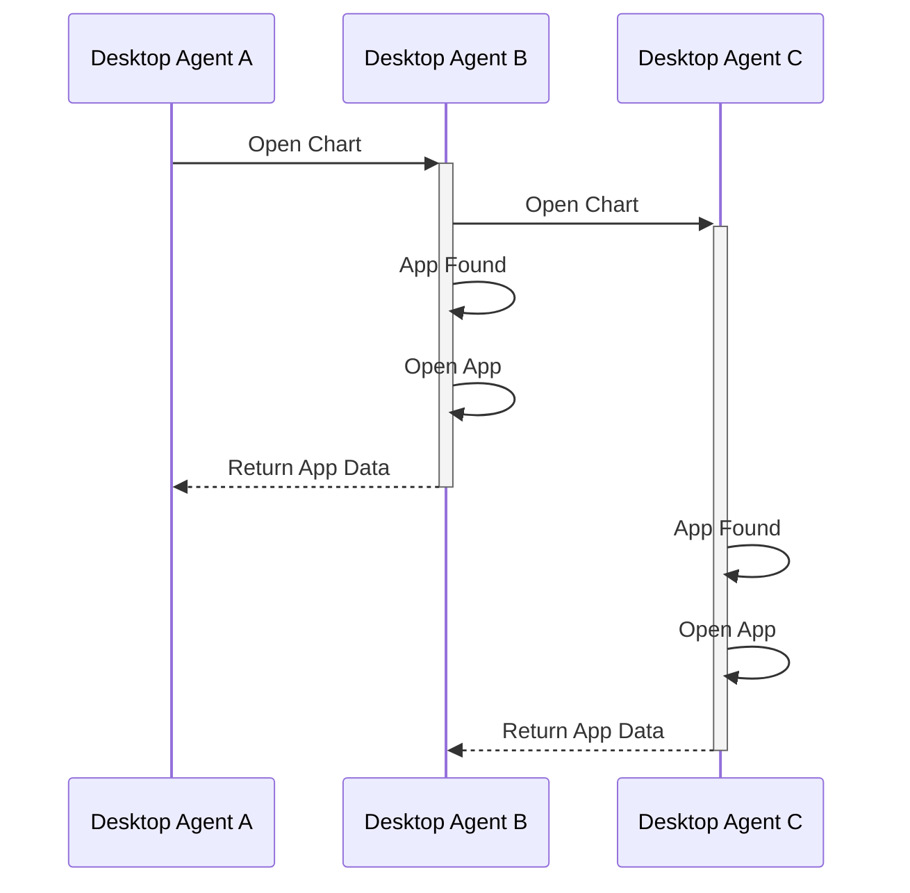
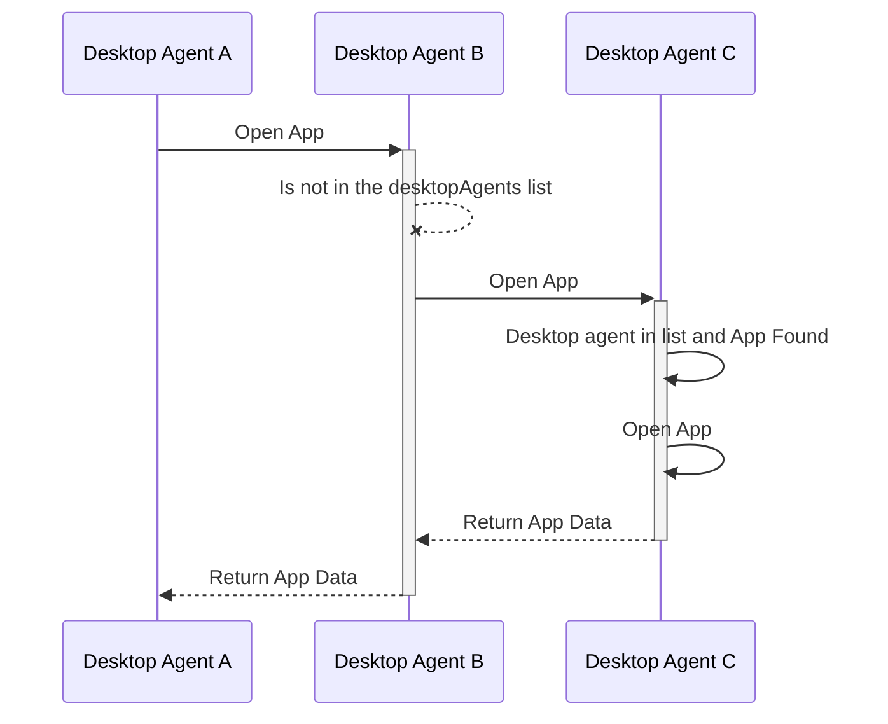
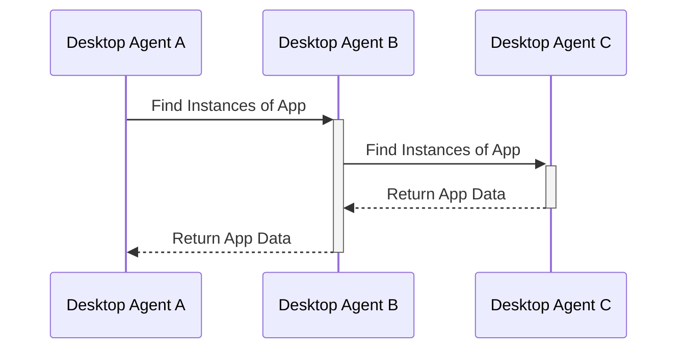

# Notes
Need to product some description of a protocol, to be used over a websocket, for exchanging messages about FDC3 calls between Desktop Agents.
## Overall protocol details
* Sender details to be added by websocket server to top level messages AND any embedded AppMetadata objects.
    * AppMetadata needs a new `agent `field
    * When a client connects to a server it should be assigned an identity of some sort, which can be used to augment messages with details of the agent
        * The server should do the assignments and could generate ids or accept them via config.
        * Clients don't need to know their own ids or even the ids of others, they just need to be able to pass around AppMetadata objects that contain them.
* Preserve message path as it passes through different servers?
* GUIDs required to uniquely identify messages
    * To be referenced in replies
* Desktop agents that are bridged will need to wait for responses from other desktop agents before responding to API calls…
    * for resilience, this may mean defining timeouts
    * Desktop Agents may need GUIDs and / OR metadata - names?


## Generic request and response formats

### Request:
```typescript
{
   /** Unique guid for this request */
   requestGuid: string,
   /** Timestamp at which request was generated */
   timestamp:  date,
   /** FDC3 function name message relates to, e.g. "findIntent" */
   type:  string,
   /** Request body, containing the arguments to the function called.*/
   body: {
       //example fields for specific messages... wouldn't be specified in base type
       channel?: string,
       intent?: string,
       context?: Context,
       //fields for other possible arguments
   },
   /** Agent request received from, filled in by server on receipt of message */
   sourceAgent?: string
}
```

### Response:
Responses will be differentiated by the presence of a `responseGuid` field.
```typescript
{
    /** Value from request*/
    requestGuid: string,
    /** Unique guid for this response */
    responseGuid:  string,
    /** Timestamp at which request was generated */
    timestamp:  Date,
    /** FDC3 function name the original request related to, e.g. "findIntent" */
    type:  string, //same as request value
    /** Response body */
    body: {
        //example fields for specific messages... wouldn't be specified in base type
        intent?:  string,
        appIntent?:  AppIntent,
        //fields for other possible response values
    },
    /** Agent response received from, filled in by server on receipt of message */
    sourceAgent?: string,
    /** sourceAgent from request,  used to route response */
    targetAgent: string
}
```
Clients should send these messages on to the 'server', which will add the `sourceAgent` metadata. Further, when processing responses, the agent acting as the 'server' should augment any `AppMetadata` objects in responses with the the same id applied to sourceAgent.


## Individual message exchanges
The sections below cover all scenerios for each of the Desktop Agent methods.
Each section assumes that we have 3 agents connected by bridge: agent-A, agent-B and agent-C. Agent-C provides a websocket server that agent-A and agent-B have connected to.

## Apps
### Open
```typescript
  open(app: TargetApp, context?: Context): Promise<AppMetadata>;
```
#### Request format:
A findIntent call is made on agent-A.
```javascript
// Open an app without context, using the app name
let instanceMetadata = await fdc3.open('myApp');

// Open an app without context, using an AppMetadata object to specify the target
let appMetadata = {name: 'myApp', appId: 'myApp-v1.0.1', version: '1.0.1'};
let instanceMetadata = await fdc3.open(appMetadata);

// Open an app without context, using an AppMetadata object to specify the target and Desktop Agent
let appMetadata = {name: 'myApp', appId: 'myApp-v1.0.1', version: '1.0.1', desktopAgents:["DesktopAgentB"]};
let instanceMetadata = await fdc3.open(appMetadata);

```
There are three scenerios where Desktop Agent A sends an Open command
1) The app is opened on all Desktop Agents instances
2) The app is not found on any Desktop Agent
3) The Desktop Agent(s) that the app should open on is specified by the end user ahead of time

**When the desktop agent is in a list**


It sends an outward message to the other desktop agents (sent from A -> C):
```JSON
{
   "requestGuid": "4dd60b3b-9835-4cab-870c-6b9b099ed7ae",
   "timestamp": "2020-03-...",
   "type": "open",
   "body": {
       "appMetaData": {
           "name": "myApp",
           "appId": "myApp-v1.0.1",
           "version": "1.0.1",
           "desktopAgent":"DesktopAgentB"
           },
       "context": {/*contxtObj*/}
   }
}
```

which is repeated from C -> B as:
```JSON
{
    "requestGuid": "4dd60b3b-9835-4cab-870c-6b9b099ed7ae",
    "timestamp": 2020-03-...,
    "type": "open",
    "body": {
       "appMetaData": {
           "name": "myApp",
           "appId": "myApp-v1.0.1",
           "version": "1.0.1",
           "desktopAgent":"DesktopAgentB"
           },
       "context": {/*contxtObj*/}
    },
    "sourceAgent": "agent-A"
}
```

### findInstances
```typescript
  findInstances(app: TargetApp): Promise<Array<AppMetadata>>;
```



## Context
### For broadcasts on channels
Only needs a single message (no response)
An app on agent-A does:
```javascript
fdc3.broadcast(contextObj);
```
or
```javascript
(await fdc3.getOrCreateChannel("myChannel")).broadcast(contextObj)
```

It encodes this as a message which it sends to the websocket server(hosted by agent-C):

```JSON
{
    "requestGuid": "some-guid-string-here",
    "timestamp": "2020-03-...",
    "type": "broadcast",
    "body": {
        "channel": "myChannel",
        "context": { /*contxtObj*/ }
    }
}
```

which it repeats on to Agent-B with the `sourceAgent` metadata added:
```JSON
{
    "requestGuid": "some-guid-string-here",
    "timestamp": "2020-03-...",
    "type": "broadcast",
    "body": {
        "channel": "myChannel",
        "context": { /*contxtObj*/}
    },
    "sourceAgent": "agent-A"
}
```

## Intents
### findIntent
```typescript
findIntent(intent: string, context?: Context): Promise<AppIntent>;
```

#### Request format:

A findIntent call is made on agent-A.
```javascript
let appIntent = await fdc3.findIntent();
```

It sends an outward message to the other desktop agents (sent from A -> C):
```JSON
{
   "requestGuid": "4dd60b3b-9835-4cab-870c-6b9b099ed7ae",
   "timestamp": "2020-03-...",
   "type": "findIntent",
   "body": {
       "intent": "StartChat",
       "context": {/*contxtObj*/}
   }
}
```

which is repeated from C -> B as:
```JSON
{
    "requestGuid": "4dd60b3b-9835-4cab-870c-6b9b099ed7ae",
    "timestamp": 2020-03-...,
    "type": "findIntent",
    "body": {
        "intent": "StartChat",
        "context": {/*contxtObj*/},
    },
    "sourceAgent": "agent-A"
}
```

Note that the `sourceAgent` field has been populated with the id of the agent that raised the requests, enabling the routing of responses.

#### Response format

Normal response from:agent A, where the request was raised (a websocket client)
```JSON
{
    "intent": { "name": "StartChat", "displayName": "Chat" },
    "apps": [
        { "name": "myChat" }
    ]
}
```

Desktop agent B (a websocket client) woud produce response:
```JSON
{
    "intent": { "name": "StartChat", "displayName": "Chat" },
    "apps": [
        { "name": "Skype" },
        { "name": "Symphony" },
        { "name": "Symphony", "instanceId": "93d2fe3e-a66c-41e1-b80b-246b87120859" },
        { "name": "Slack" }
    ]
}
```

which is sent back over the bridge by Agent B -> C as a response to the request message as:
```JSON
{
    "requestGuid": "4dd60b3b-9835-4cab-870c-6b9b099ed7ae",
    "responseGuid":  "b4cf1b91-0b64-45b6-9f55-65503d507024",
    "timestamp":  2020-03-...,
    "type":  "findIntent",
    "body": {
        "intent":  "StartChat",
        "appIntent":  {
            "intent":  { "name": "StartChat", "displayName": "Chat" },
            "apps": [
                { "name": "Skype"},
                { "name": "Symphony" },
                { "name": "Symphony", "instanceId": "93d2fe3e-a66c-41e1-b80b-246b87120859" },
                { "name": "Slack" }
            ]
        }
    },
    "targetAgent": "agent-A"
}
```

Which gets repeated by the websocket server (agent-C) in augmented form as:
```JSON
{
    "requestGuid": "4dd60b3b-9835-4cab-870c-6b9b099ed7ae",
    "responseGuid":  "b4cf1b91-0b64-45b6-9f55-65503d507024",
    "timestamp":  2020-03-...,
    "type":  "findIntent",
    "body": {
        "intent":  "StartChat",
        "appIntent":  {
            "intent":  { "name": "StartChat", "displayName": "Chat" },
            "apps": [
                { "name": "Skype", "agent": "agent-B"},
                { "name": "Symphony", "agent": "agent-B" },
                { "name": "Symphony", "instanceId": "93d2fe3e-a66c-41e1-b80b-246b87120859", "agent": "agent-B" },
                { "name": "Slack", "agent": "agent-B" }
            ]
        }
    },
    "targetAgent": "agent-A",
    "sourceAgent": "agent-B"
}
```

Desktop agent C (the websocket server) also sends its own response:
```JSON
{
    "intent":  { "name": "StartChat", "displayName": "Chat" },
    "apps": [
       { "name": "WebIce"}
    ]
}
```

which it encodes as a message:
```JSON
{
    "requestGuid": "4dd60b3b-9835-4cab-870c-6b9b099ed7ae",
    "responseGuid":  "988a49c8-49c2-4fb4-aad4-be39d1471834",
    "timestamp":  2020-03-...,
    "type":  "findIntent",
    "body": {
        "intent":  "StartChat",
        "appIntent":  {
            "intent":  { "name": "StartChat", "displayName": "Chat" },
            "apps": [
            { "name": "WebIce", "agent": "agent-C"}
            ]
        }
    },
    "targetAgent": "agent-A",
    "sourceAgent": "agent-C"
}
```
Then on agent-A the originating app finally gets back the following response from the FDC3 desktop "agent-C":
```JSON
{
    "intent":  { "name": "StartChat", "displayName": "Chat" },
    "apps": [
        { "name": "myChat" }, // local to this agent
        { "name": "Skype", "agent": "agent-B" }, //agent-B responses
        { "name": "Symphony", "agent": "agent-B" },
        { "name": "Symphony", "instanceId": "93d2fe3e-a66c-41e1-b80b-246b87120859", "agent": "agent-B" },
        { "name": "Slack", "agent": "agent-B" },
        { "name": "WebIce", "agent": "agent-C"} //agent C response
    ]
}
```

### raiseIntent

```typescript
raiseIntent(intent: string, context: Context, app?: TargetApp): Promise<IntentResolution>;
```
Note as IntentResolutions can now return a promise of result data there are multiple response formats required

#### Request format
A raiseIntent call is made on agent-A.

```typescript
raiseIntent(intent: string, context: Context, app?: TargetApp): Promise<IntentResolution>;
```

__WIP__

Just brain dumping stuff at the moment...

```
DA-A                        DA-B                       DA-C
| ---- raiseIntent ---->    |                           |
|                           |----   raiseIntent     --->|
|                           |<--- intentResolution  ----|
|<-- resolutionOptions -----|                           |
|--- raiseIntent(... app)-->|                           |
|                           |------ raiseIntent ------->|
|                           |<--- intentResolution  ----|
|<--- intentResolution -----|                           |
```
---
**Assumptions & Questions**
- No client - client communication - All request go to server first which are then routed to the correct DA.
- The intentResolution result should be as is? The outcome of the raiseIntent should be the same as current?

**NOTE:** - (TP 14/03/2022) - The raiseIntent response should not really change (?) - Meaning, you raise and intent and the result of that would either be an intentResolution, that might need to contain information about which DA the intent was resolved, OR an error if the intent fails to resolve.

The raiseIntent request however, will need to be able to specify a target which must (should) include an DA as well.

Maybe we can strongly advise that `raiseIntent` should be preceeded by `findIntents`.

No target specified
1. DA-A (client) sends `raiseIntent` request without target to DA-C (server)
2. DA-C MUST fire a `findIntent` to DA-A, DA-B and DA-C
   * `findIntent` response only has one possible resolution
      *  No resolver UI is shown and a `findIntent` response is sent to DA-A which sends a `raiseIntent` with target. This should happen silently/transparently?
   * `findIntent` response has multiple resolution possibilities
     * Resolver UI is shown on DA-A which upon the user selecting the app will send a `raiseIntent` with target
   * `findIntent` returns error because there is no possible resolution


Target specified

1. DA-A (client) sends `raiseIntent` request with target (DA-B) to DA-C (server)
2. DA-C populates the sourceAgent in the raiseIntent request and forward the request to DA-B directly
3. DA-B sends `intentResolution` response to DA-C that fills in the targetAgent field
4. DA-C sends the augmented `intentResolution` response to DA-A

---

It sends an outward message to the other desktop agents (sent from A -> C):
```JSON
// no target
{
   "requestGuid": "62fe69bd-3f40-45a4-86fc-0150dbade8ab",
   "timestamp": "2020-03-...",
   "type": "raiseIntent",
   "body": {
       "intent": "ViewChart",
       "context": {/*contxtObj*/}
   }
}
// with AppMetadata
{
   "requestGuid": "c916ee2e-feb7-437e-9ab3-be52ac46a6bc",
   "timestamp": "2020-03-...",
   "type": "raiseIntent",
   "body": {
       "intent": "ViewChart",
       "context": {/*contxtObj*/},
       "app": {
           "name": "AChartApp",
           "agent": "agent-c"
       }
   }
}
// with AppName only
{
   "requestGuid": "2adbd9e5-5a22-4869-9a8c-95ca7ec8b6ae",
   "timestamp": "2020-03-...",
   "type": "raiseIntent",
   "body": {
       "intent": "ViewChart",
       "context": {/*contxtObj*/},
       "app": "AChartApp"
   }
}
```

Which is repeated from C -> B as:

```JSON
{
    "requestGuid": "62fe69bd-3f40-45a4-86fc-0150dbade8ab",
    "timestamp": 2020-03-...,
    "type": "raiseIntent",
    "body": {
        "intent": "ViewChart",
        "context": {/*contxtObj*/},
    },
    "sourceAgent": "agent-A"
}
```
Note that the sourceAgent field has been populated with the id of the agent that raised the requests, enabling the routing of responses.

#### Response format
Normal response from:agent A, where the request was raised (a websocket client)
```JSON
{
    "intent": "ViewChart",
    "source": {
        "name": "myChartA",
    },
    "resolution": {
        // with a context
        "context": {/*contxtObj*/}
    }
}
```
or
```JSON
{
    "intent": "ViewChart",
    "source": {
        "name": "myChartA",
    },
    "resolution": {
        // with a channel
        "id": "channel 1",
        "type": "system"
    }
}
```

Desktop agent B (a websocket client) woud produce response:
```JSON
{
    "intent": "ViewChart",
    "source": {
        "name": "myChartB",
    },
    "resolution": {
       "context": {/*contxtObj*/}
    }
}
```

which is sent back over the bridge by Agent B -> C as a response to the request message as:
```JSON
{
    "requestGuid": "62fe69bd-3f40-45a4-86fc-0150dbade8ab",
    "responseGuid":  "b8a86c63-049e-469d-bc76-bd1d10b17344",
    "timestamp":  2020-03-...,
    "type":  "raiseIntent",
    "body": {
        "intentResolution": {
            "intent": "ViewChart",
            "source": {
                "name": "myChartB",
            },
            "resolution": {
                "context": {/*contxtObj*/}
            }
        }
    },
    "targetAgent": "agent-A"
}
```

Which gets repeated by the websocket server (agent-C) in augmented form as:
```JSON
{
    "requestGuid": "62fe69bd-3f40-45a4-86fc-0150dbade8ab",
    "responseGuid":  "b8a86c63-049e-469d-bc76-bd1d10b17344",
    "timestamp":  2020-03-...,
    "type":  "raiseIntent",
    "body": {
        "intentResolution": {
            "intent": "ViewChart",
            "source": {
                "name": "myChartB",
            },
            "resolution": {
                "context": {/*contxtObj*/} // or channel
            }
        }
    },
    "targetAgent": "agent-A",
    "sourceAgent": "agent-B"
}
```

Desktop agent C (the websocket server) also sends its own response:
```JSON
{
    "intent": "ViewChart",
    "source": {
        "name": "myChartC",
    },
    "resolution": {
       "context": {/*contxtObj*/}
    }
}
```

which it encodes as a message:
```JSON
{
    "requestGuid": "4dd60b3b-9835-4cab-870c-6b9b099ed7ae",
    "responseGuid":  "1fe1a74f-2943-4ca4-b90a-afc317fd149c",
    "timestamp":  2020-03-...,
    "type":  "raiseIntent",
    "body": {
        "intentResolution": {
            "intent": "ViewChart",
            "source": {
                "name": "myChartC",
            },
            "resolution": {
                "context": {/*contxtObj*/} // or channel
            }
        }
    },
    "targetAgent": "agent-A",
    "sourceAgent": "agent-C"
}
```

Then agent C (ie. the server) should augment the responses so that a unequivocal resolution can be achieved (imagine 2 DA have app with the same name that are able to resolve the same intent) by agent-a.

```JSON
// intent resolution response???
{
    "intent": "ViewChart",
    "sources": [
        "agent-A": { // agent-A intentResolution
            "source": {
                "name": "myChartA",
            },
        },
        "agent-B": { // agent-B intentResolution
            "source": {
                "name": "myChartB",
            },
        },
        "agent-c": { // agent-C intentResolution
            "source": {
                "name": "myChartC",
            },
        },
    ],
}

// another option
{
    "intent": "ViewChart",
    "sources": [
        "source": { // agent-A intent resolver UI response
            "name": "myChartA",
            "agent": "agent-A"
        },
        "source": { // agent-B intent resolver UI response
            "name": "myChartB",
            "agent": "agent-B"
        },
        "source": { // agent-C intent resolver UI response
            "name": "myChartC",
            "agent": "agent-C"
        },
    ],
}
```

## Channels

