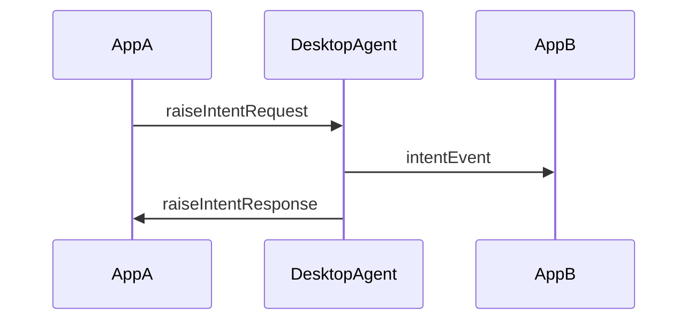
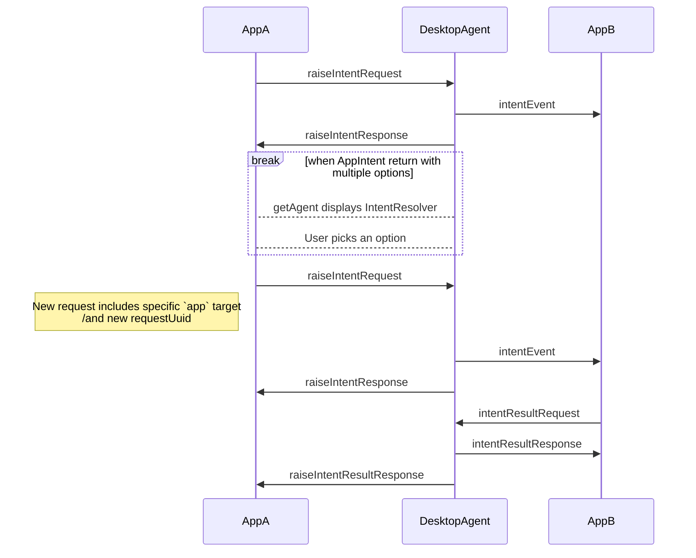
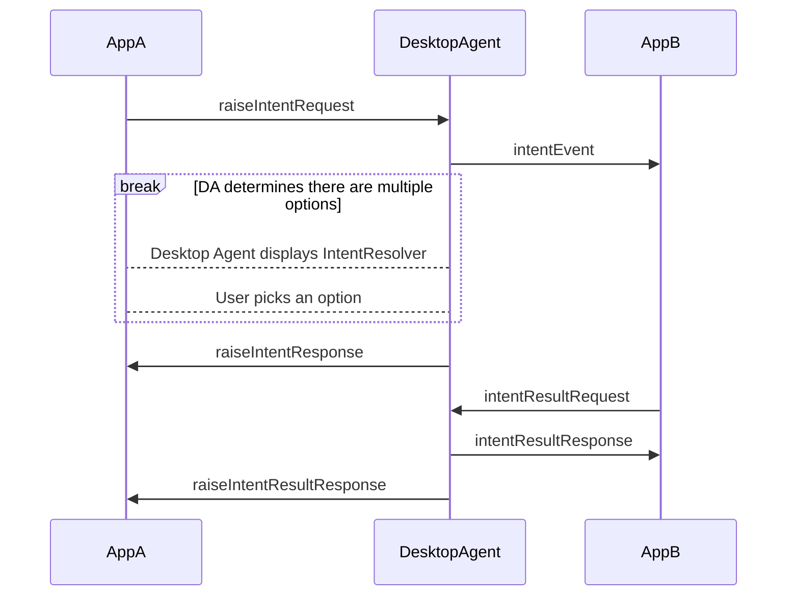
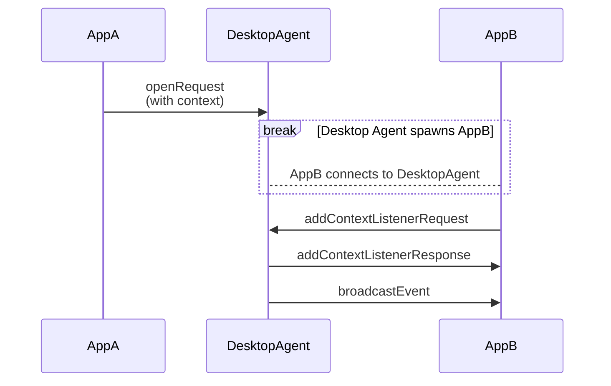

# Desktop Agent Communication Protocol (DACP)

:::info _[@experimental](../fdc3-compliance#experimental-features)_

The Desktop Agent Communication Protocol (DACP) is an experimental feature added to FDC3 in 2.2. Limited aspects of its design may change in future versions and it is exempted from the FDC3 Standard's normal versioning and deprecation polices in order to facilitate any necessary change.

:::

The Desktop Agent Communication Protocol (DACP) constitutes a set of standardized JSON messages or 'wire protocol' that can be used to implement an interface to a Desktop Agent, encompassing all API calls events defined in the [Desktop Agent API](../ref/DesktopAgent.md). For example, the DACP is used by the [`@finos/fdc3` npm module](https://www.npmjs.com/package/@finos/fdc3) to communicate with Browser-Resident Desktop Agents or a connection setup via the [FDC3 Web Connection Protocol](./webConnectionProtocol).

## Protocol conventions

DACP messages are defined in [JSON Schema](https://json-schema.org/) in the [FDC3 github repository](https://github.com/finos/FDC3/tree/fdc3-for-web/schemas/api).

:::tip

TypeScript types representing all DACP and WCP messages are generated from the JSON Schema source and can be imported from the [`@finos/fdc3` npm module](https://www.npmjs.com/package/@finos/fdc3):

```ts
import {BrowserTypes} from '@finos.fdc3';
```

:::

The protocol is composed of several different classes of message, each governed by a message schema:

1. **App Request Messages** ([schema](https://fdc3.finos.org/schemas/next/api/appRequest.schema.json)):
    - Messages sent by an application representing an API call, such as [`DesktopAgent.broadcast`](../ref/DesktopAgent#broadcast), [`Channel.addContextListener`](../ref/Channel#addcontextlistener), or [`Listener.unsubscribe`](../ref/Types#listener).
    - Message names all end in 'Request'.
    - Each instance of a request message sent is uniquely identified by a `meta.requestUuid` field.

2. **Agent Response Messages** ([schema](https://fdc3.finos.org/schemas/next/api/agentResponse.schema.json)):
    - Response messages sent from the DA to the application, each relating to a corresponding _App Request Message_.
    - Message names all end in 'Response'.
    - Each instance of an Agent Response Message is uniquely identified by a `meta.responseUuid` field.
    - Each instance of an Agent Response Message quotes the `meta.requestUuid` value of the message it is responding to.

3. **Agent Event Messages** ([schema](https://fdc3.finos.org/schemas/next/api/agentEvent.schema.json)):
    - Messages sent from the DA to the application that are due to actions in other applications, such as an inbound context resulting from another app's broadcast.
    - Message names all end in 'Event'.
    - Each instance of an Agent Response Message is uniquely identified by a `meta.eventUuid` field.

Each individual message is also governed by a message schema, which is composed with the schema for the message type.

:::info

In rare cases, the payload of a request or event message may quote the `requestUuid` or `eventUuid` of another message that it represents a response to, e.g. `intentResultRequest` quotes the `eventUuid` of the `intentEvent` that delivered the intent and context to the app, as well as the `requestUuid` of the `raiseIntentRequest` message that originally raised the intent.

:::

All messages defined in the DACP follow a common structure:

```json
{
    "type": "string", // string identifying the message type
    "payload": {
        //message payload fields defined for each message type 
    },
    "meta": {
        "timestamp": "2024-09-17T10:15:39+00:00"
        //other meta fields determined by each 'class' of message
        //  these include requestUuid, responseUuid and eventUuid
        //  and a source field identifying an app where appropriate
    }
}
```

`meta.timestamp` fields are formatted as strings, according to the format defined by [ISO 8601-1:2019](https://www.iso.org/standard/70907.html), which is produced in JavaScript via the `Date` class's `toISOString()` function, e.g. `(new Date()).toISOString()`.

### Routing, Registering Listeners & Multiplexing

//messages SHOULD be routed rather than implement over a bus

//messages are sent to register and unregister listeners so that DAs can send only relevant messages to app for security

//DAs only need to send one event message, even when there are multiple listeners, getAgent() should fire all relevant listeners.

## Message Definitions Supporting FDC3 API calls

This section provides details of the messages defined in the DACP, grouped according to the FDC3 API functions that they support, and defined by JSON Schema files. Many of these message definitions make use of JSON versions of [metadata](../ref/Metadata) and other [types](../ref/Types) defined by the Desktop Agent API, the JSON versions of which can be found in [api.schema.json](https://fdc3.finos.org/schemas/next/api/api.schema.json), while a number of DACP specific object definitions that are reused through the messages can be found in [common.schema.json](https://fdc3.finos.org/schemas/next/api/common.schema.json)

### `DesktopAgent`

#### `addContextListener()`

Request and response used to implement the API call:
- [addContextListenerRequest](https://fdc3.finos.org/schemas/next/api/addContextListenerRequest.schema.json)
- [addContextListenerResponse](https://fdc3.finos.org/schemas/next/api/addContextListenerResponse.schema.json)

Event message used to context objects that have been broadcast:
- [broadcastEvent](https://fdc3.finos.org/schemas/next/api/broadcastEvent.schema.json)

Message exchange for removing the context listener:
- [contextListenerUnsubscribeRequest](https://fdc3.finos.org/schemas/next/api/contextListenerUnsubscribeRequest.schema.json)
- [contextListenerUnsubscribeResponse](https://fdc3.finos.org/schemas/next/api/contextListenerUnsubscribeResponse.schema.json)

#### `addEventListener()`

Request and response used to implement the API call:
- [addEventListenerRequest](https://fdc3.finos.org/schemas/next/api/addEventListenerRequest.schema.json)
- [addEventListenerResponse](https://fdc3.finos.org/schemas/next/api/addEventListenerResponse.schema.json)

Event messages used to deliver events that have occurred:

- [channelChangedEvent](https://fdc3.finos.org/schemas/next/api/channelChangedEvent.schema.json)

Message exchange for removing the event listener:

- [eventListenerUnsubscribeRequest](https://fdc3.finos.org/schemas/next/api/eventListenerUnsubscribeRequest.schema.json)
- [eventListenerUnsubscribeResponse](https://fdc3.finos.org/schemas/next/api/eventListenerUnsubscribeResponse.schema.json)

#### `addIntentListener()`

Request and response used to implement the API call:

- [addIntentListenerRequest](https://fdc3.finos.org/schemas/next/api/addIntentListenerRequest.schema.json)
- [addIntentListenerResponse](https://fdc3.finos.org/schemas/next/api/addIntentListenerResponse.schema.json)

Event message used to a raised intent and context object from another app to the listener:

- [intentEvent](https://fdc3.finos.org/schemas/next/api/intentEvent.schema.json)

An additional request and response used to deliver a result from the intent handler to the Desktop Agent, so that it can convey it back to the raising application:

- [intentResultRequest](https://fdc3.finos.org/schemas/next/api/intentResultRequest.schema.json)
- [intentResultResponse](https://fdc3.finos.org/schemas/next/api/intentResultResponse.schema.json)

Message exchange for removing the intent listener:

- [intentListenerUnsubscribeRequest](https://fdc3.finos.org/schemas/next/api/intentListenerUnsubscribeRequest.schema.json)
- [intentListenerUnsubscribeResponse](https://fdc3.finos.org/schemas/next/api/intentListenerUnsubscribeResponse.schema.json)








#### `broadcast()`

Request and response used to implement the API call:

- [broadcastRequest](https://fdc3.finos.org/schemas/next/api/broadcastRequest.schema.json)
- [broadcastResponse](https://fdc3.finos.org/schemas/next/api/broadcastResponse.schema.json)

See [`addContextListener()`](#addcontextlistener) above for the `broadcastEvent` used to deliver the broadcast to other apps.

#### `createPrivateChannel()`

Request and response used to implement the API call:

- [createPrivateChannelRequest](https://fdc3.finos.org/schemas/next/api/createPrivateChannelRequest.schema.json)
- [createPrivateChannelResponse](https://fdc3.finos.org/schemas/next/api/createPrivateChannelResponse.schema.json)

#### `findInstances()`

Request and response used to implement the API call:

- [findInstancesRequest](https://fdc3.finos.org/schemas/next/api/findInstancesRequest.schema.json)
- [findInstancesResponse](https://fdc3.finos.org/schemas/next/api/findInstancesResponse.schema.json)

#### `findIntent()`

Request and response used to implement the API call:

- [findIntentRequest](https://fdc3.finos.org/schemas/next/api/findIntentRequest.schema.json)
- [findIntentResponse](https://fdc3.finos.org/schemas/next/api/findIntentResponse.schema.json)

#### `findIntentsByContext()`

Request and response used to implement the API call:

- [findIntentsByContextRequest](https://fdc3.finos.org/schemas/next/api/findIntentsByContextRequest.schema.json)
- [findIntentsByContextResponse](https://fdc3.finos.org/schemas/next/api/findIntentsByContextResponse.schema.json)

#### `getAppMetadata()`

Request and response used to implement the API call:

- [getAppMetadataRequest](https://fdc3.finos.org/schemas/next/api/getAppMetadataRequest.schema.json)
- [getAppMetadataResponse](https://fdc3.finos.org/schemas/next/api/getAppMetadataResponse.schema.json)

#### `getCurrentChannel()`

Request and response used to implement the API call:

- [getCurrentChannelRequest](https://fdc3.finos.org/schemas/next/api/getCurrentChannelRequest.schema.json)
- [getCurrentChannelResponse](https://fdc3.finos.org/schemas/next/api/getCurrentChannelResponse.schema.json)

#### `getInfo()`

Request and response used to implement the API call:

- [getInfoRequest](https://fdc3.finos.org/schemas/next/api/getInfoRequest.schema.json)
- [getInfoResponse](https://fdc3.finos.org/schemas/next/api/getInfoResponse.schema.json)

#### `getOrCreateChannel()`

Request and response used to implement the API call:

- [getOrCreateChannelRequest](https://fdc3.finos.org/schemas/next/api/getOrCreateChannelRequest.schema.json)
- [getOrCreateChannelResponse](https://fdc3.finos.org/schemas/next/api/getOrCreateChannelResponse.schema.json)

#### `getUserChannels()`

Request and response used to implement the API call:

- [getUserChannelsRequest](https://fdc3.finos.org/schemas/next/api/getUserChannelsRequest.schema.json)
- [getUserChannelsResponse](https://fdc3.finos.org/schemas/next/api/getUserChannelsResponse.schema.json)

#### `joinUserChannel()`

Request and response used to implement the API call:

- [joinUserChannelRequest](https://fdc3.finos.org/schemas/next/api/joinUserChannelRequest.schema.json)
- [joinUserChannelResponse](https://fdc3.finos.org/schemas/next/api/joinUserChannelResponse.schema.json)

#### `leaveCurrentChannel()`

Request and response used to implement the API call:

- [leaveCurrentChannelRequest](https://fdc3.finos.org/schemas/next/api/leaveCurrentChannelRequest.schema.json)
- [leaveCurrentChannelResponse](https://fdc3.finos.org/schemas/next/api/leaveCurrentChannelResponse.schema.json)

#### `open()`

Request and response used to implement the API call:

- [openRequest](https://fdc3.finos.org/schemas/next/api/openRequest.schema.json)
- [openResponse](https://fdc3.finos.org/schemas/next/api/openResponse.schema.json)

Where a context object is passed (e.g. `fdc3.open(app, context)`) the `broadcastEvent` message described above in [`addContextListener`](#addcontextlistener) should be used to deliver it after the context listener has been added:



#### `raiseIntent()`

Request and response used to implement the API call:

- [raiseIntentRequest](https://fdc3.finos.org/schemas/next/api/raiseIntentRequest.schema.json)
- [raiseIntentResponse](https://fdc3.finos.org/schemas/next/api/raiseIntentResponse.schema.json)
- [raiseIntentResultResponse](https://fdc3.finos.org/schemas/next/api/raiseIntentResultResponse.schema.json)

#### `raiseIntentForContext()`

Request and response used to implement the API call:

- [raiseIntentForContextRequest](https://fdc3.finos.org/schemas/next/api/raiseIntentForContextRequest.schema.json)
- [raiseIntentForContextResponse](https://fdc3.finos.org/schemas/next/api/raiseIntentForContextResponse.schema.json)

### `Channel`

Owing to the significant overlap between the FDC3 `DesktopAgent` and `Channel` API, which includes the ability to retrieve and work with User channels as App Channels, most of the messaging for the `Channel` API is shared with `DesktopAgent`. Specifically, all messages defined in the the [`broadcast`](#broadcast) and [`addContextListener`](#addcontextlistener) sections above are reused, with a few minor differences to note:

- When working with a specific channel, the `channelId` property in `addContextListenerRequest` should be set to the ID of the channel, where it is set to `null` to work with the current user channel.
- When receiving a `broadcastEvent` a `channelId` that is `null` indicates that the context was sent via a call to `fdc3.open` and does not relate to a channel.

The following additional function is unique to the `Channel` interface:

#### `getCurrentContext()`

Request and response used to implement the API call:

- [getCurrentContextRequest](https://fdc3.finos.org/schemas/next/api/getCurrentContextRequest.schema.json)
- [getCurrentContextResponse](https://fdc3.finos.org/schemas/next/api/getCurrentContextResponse.schema.json)

### `PrivateChannel`

The `PrivateChannel` interface extends `Channel` with a number of additional functions that are supported by the following messages:

#### `addEventListener()`

Request and response used to implement the API call:

- [privateChanneladdEventListenerRequest](https://fdc3.finos.org/schemas/next/api/privateChanneladdEventListenerRequest.schema.json)
- [privateChanneladdEventListenerResponse](https://fdc3.finos.org/schemas/next/api/privateChanneladdEventListenerResponse.schema.json)

Event messages used to deliver events that have occurred:

- [privateChannelOnAddContextListenerEvent](https://fdc3.finos.org/schemas/next/api/privateChannelOnAddContextListenerEvent.schema.json) 
- [privateChannelOnDisconnectEvent](https://fdc3.finos.org/schemas/next/api/privateChannelOnDisconnectEvent.schema.json)
- [privateChannelOnUnsubscribeEvent](https://fdc3.finos.org/schemas/next/api/privateChannelOnUnsubscribeEvent.schema.json)

Message exchange for removing the event listener:

- [privateChannelUnsubscribeEventListenerRequest](https://fdc3.finos.org/schemas/next/api/privateChannelUnsubscribeEventListenerRequest.schema.json)
- [privateChannelUnsubscribeEventListenerResponse](https://fdc3.finos.org/schemas/next/api/privateChannelUnsubscribeEventListenerResponse.schema.json)

#### `disconnect()`

Request and response used to implement the API call:

- [privateChannelDisconnectRequest](https://fdc3.finos.org/schemas/next/api/privateChannelDisconnectRequest.schema.json)
- [privateChannelDisconnectResponse](https://fdc3.finos.org/schemas/next/api/privateChannelDisconnectResponse.schema.json)

### Checking apps are alive

- [heartbeatEvent](https://fdc3.finos.org/schemas/next/api/heartbeatEvent.schema.json)
- [heartbeatAcknowledgment](https://fdc3.finos.org/schemas/next/api/heartbeatAcknowledgment.schema.json)

### Controlling injected User Interfaces

- [iFrameMessage](https://fdc3.finos.org/schemas/next/api/iFrameMessage.schema.json)
- [iFrameHello](https://fdc3.finos.org/schemas/next/api/iFrameHello.schema.json)
- [iFrameHandshake](https://fdc3.finos.org/schemas/next/api/iFrameHandshake.schema.json)
- [iFrameDrag](https://fdc3.finos.org/schemas/next/api/iFrameDrag.schema.json)
- [iFrameRestyle](https://fdc3.finos.org/schemas/next/api/iFrameRestyle.schema.json)

- [iFrameChannels](https://fdc3.finos.org/schemas/next/api/iFrameChannels.schema.json)
- [iFrameChannelSelected](https://fdc3.finos.org/schemas/next/api/iFrameChannelSelected.schema.json)

- [iFrameResolve](https://fdc3.finos.org/schemas/next/api/iFrameResolve.schema.json)
- [iFrameResolveAction](https://fdc3.finos.org/schemas/next/api/iFrameResolveAction.schema.json)
