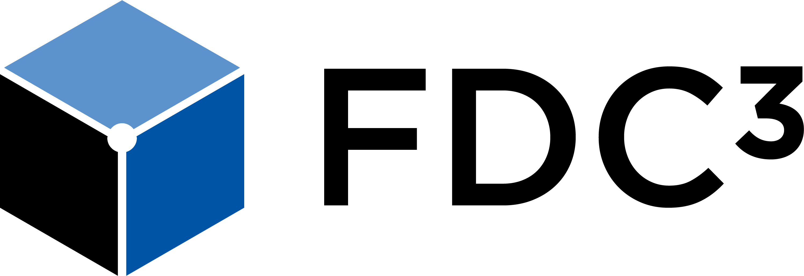

The mission of FDC3 is to develop specific protocols and taxonomies to advance the ability of desktop applications in financial workflows to interoperate in a plug-and-play fashion, without prior bi-lateral agreements. [Read the Charter](fdc3-charter.md).

FDC3 was launched in October 2017 by [OpenFin](http://www.openfin.co) in collaboration with major industry participants. It includes representatives from over 40 major banks, buy-side firms, consultancies and financial services platforms. FDC3 uses the Apache 2.0 open source license for all deliverables.

FDC3 is hosted within, and governed by the policies of, the [Fintech Open Source Foundation](http://finos.org/) (FINOS). FINOS is an independent nonprofit organization focused on promoting open innovation within financial services.