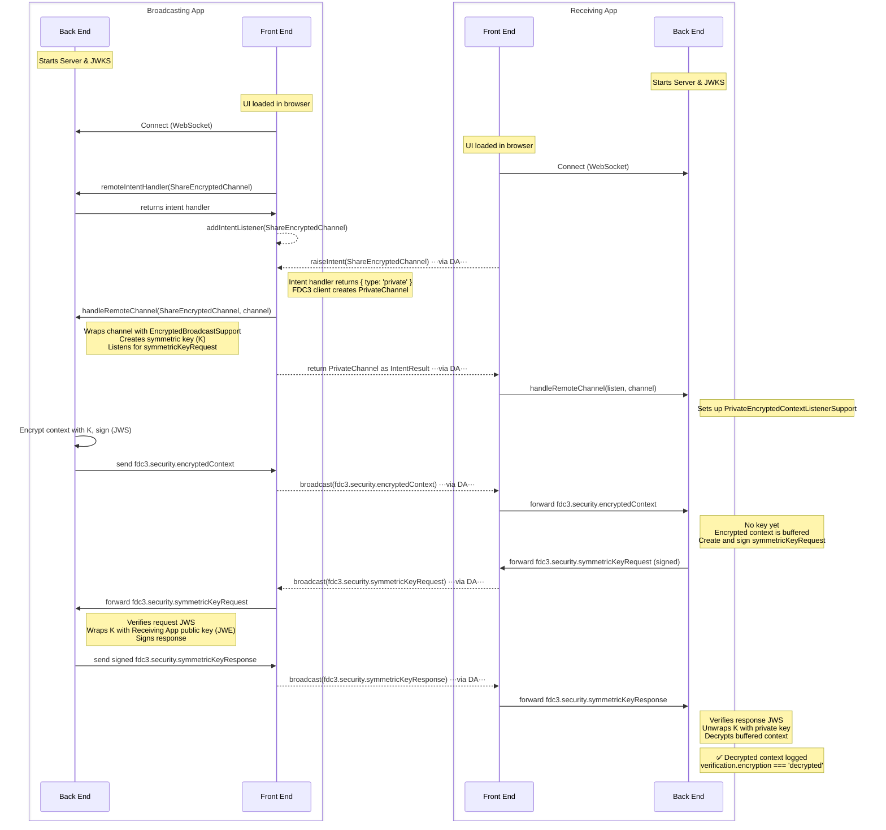
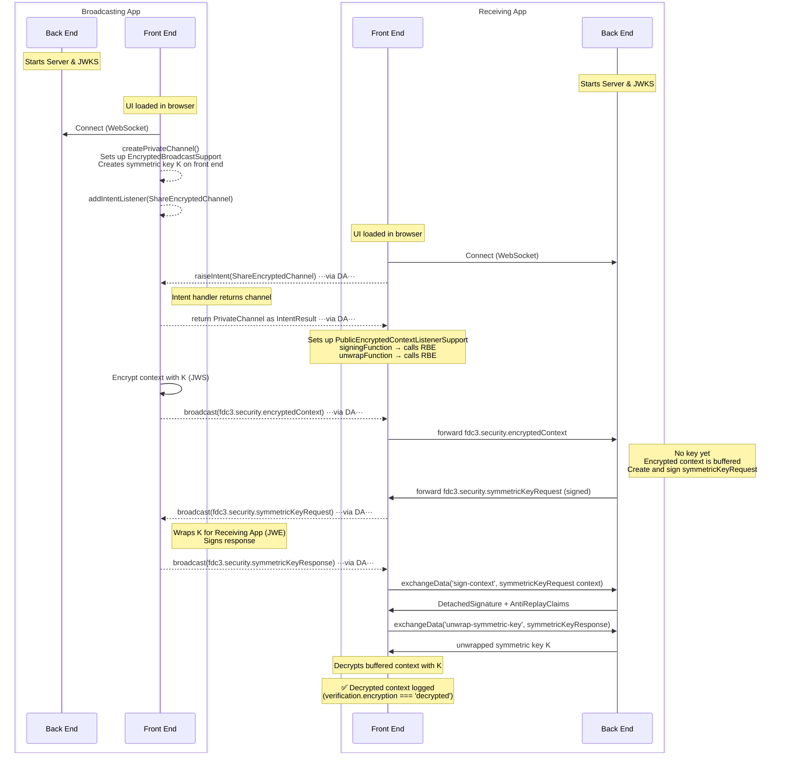
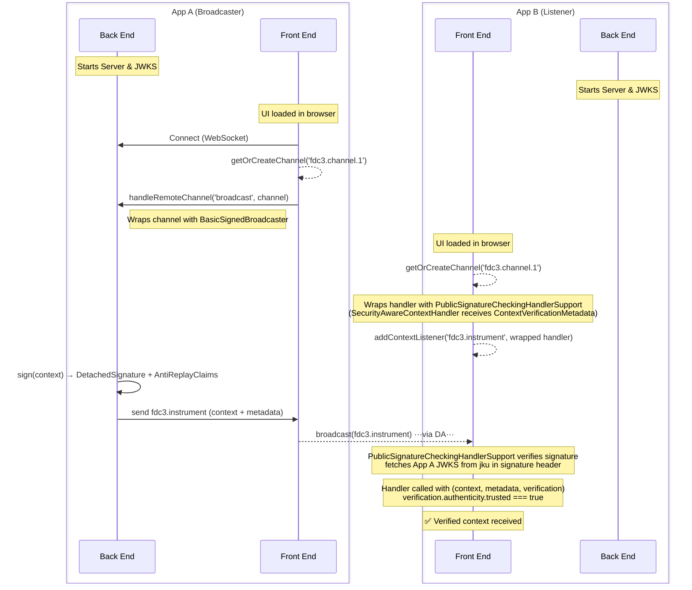
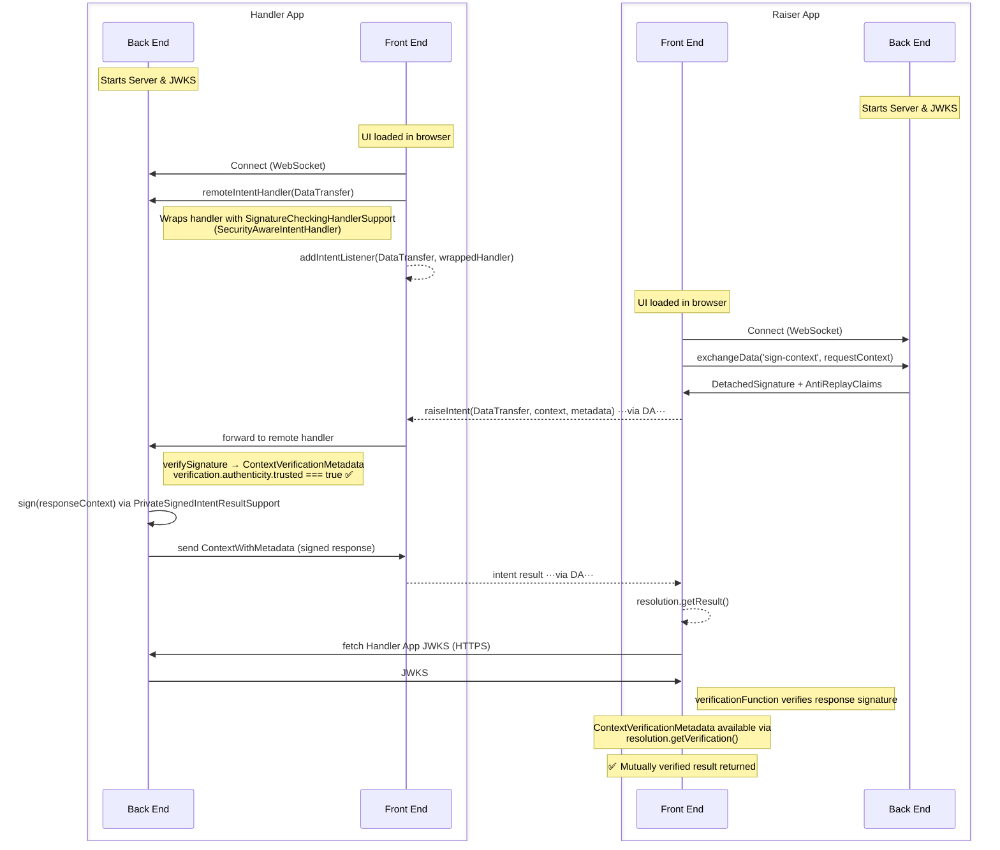
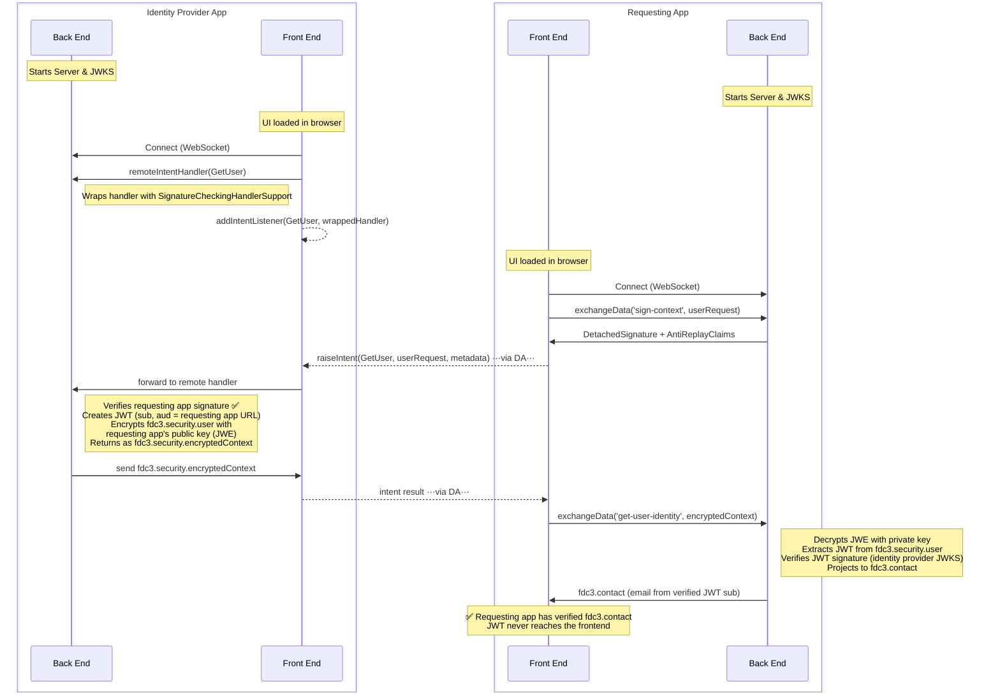

# FDC3 Security Samples

This directory contains examples demonstrating how to use the FDC3 Security features for context encryption, signing, and user identification.

Each example is a standalone TypeScript file that can be executed directly using `tsx` from the package root. The desktop agent is mocked in each sample to illustrate the information flows between applications and their secure backends.

## Running the Examples

From the `packages/fdc3-security` directory:

```bash
# Run the Mutually Authenticated Intent example
npx tsx samples/signing-intent-example.ts

# Run the Signing Broadcast example
npx tsx samples/signing-broadcast-example.ts

# Run the Backend Encrypted Channel example
npx tsx samples/backend-encrypted-channel-example.ts

# Run the Frontend Encrypted Channel example
npx tsx samples/frontend-encrypted-channel-example.ts

# Run the Get User example
npx tsx samples/get-user-example.ts
```

---

## [Backend Encrypted Channel Example](backend-encrypted-channel-example.ts)

Demonstrates the **backend key** pattern: the symmetric key is created and held entirely on the broadcasting app's backend, and all message decryption happens on the receiving app's backend. Neither the key nor the decrypted plaintext ever enters the browser. Every received message incurs a backend round-trip for decryption, which largely offsets the latency advantage of symmetric encryption, but this is the correct choice when the threat model requires that decrypted plaintext never exists in browser memory — for example, when handling highly regulated data or when the browser environment itself is not considered trusted.



---

## [Frontend Encrypted Channel Example](frontend-encrypted-channel-example.ts)

Demonstrates the **frontend key** pattern: the symmetric key is unwrapped once on the receiving app's backend (the only operation requiring the private key), then returned to the frontend for low-latency per-message decryption in the browser. This mirrors the TLS model most closely — pay the asymmetric cost once, then use the cheap symmetric cipher for the stream. Use this pattern when the browser is a sufficiently trusted environment for a short-lived session key and message throughput or latency matters.



---

## [Signing Broadcast Example](signing-broadcast-example.ts)

Illustrates how to sign FDC3 broadcasts using `BasicSignedBroadcaster` (running on the sender's backend) and verify them using `PublicSignatureCheckingHandlerSupport` (running on the receiver's frontend). The handler is wrapped using a `SecurityAwareContextHandler`, which receives a `ContextVerificationMetadata` object as its third argument rather than reading verification results from `ContextMetadata` directly.



---

## [Signing Intent Example (Mutual Authentication)](signing-intent-example.ts)

A full end-to-end demonstration of mutual authentication in FDC3 intent flows. The raiser signs its request context (via its backend), the handler verifies the request and signs its response (via its backend), and the raiser verifies the response. Both sides use `SecurityAwareIntentHandler` so that `ContextVerificationMetadata` is available in the handler without polluting `ContextMetadata`.

One-way authentication (raiser only, or handler only) can be achieved by removing either the signing or the verification half.



---

## [Get User Example](get-user-example.ts)

Demonstrates raising the **`GetUser`** intent with a signed `fdc3.security.userRequest` context to an identity provider app. The identity provider app verifies the requesting application's signature, mints a signed JWT scoped to the requesting application's audience, and returns it encrypted with the requesting application's public key. The requesting application's backend decrypts the payload and verifies the JWT before projecting the identity into a standard `fdc3.contact` context — keeping the raw JWT off the frontend entirely.


