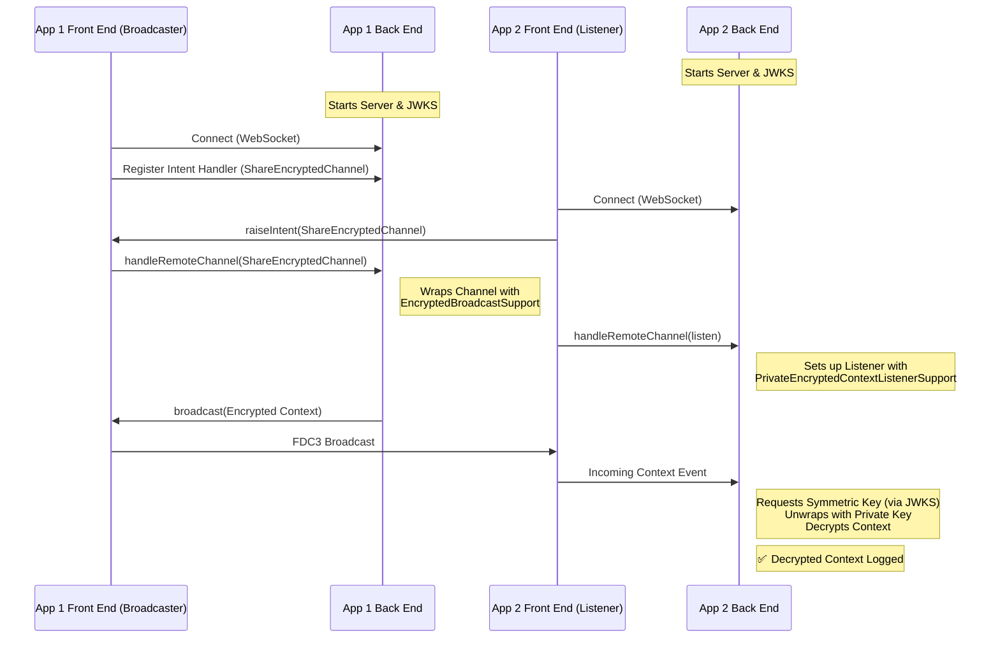
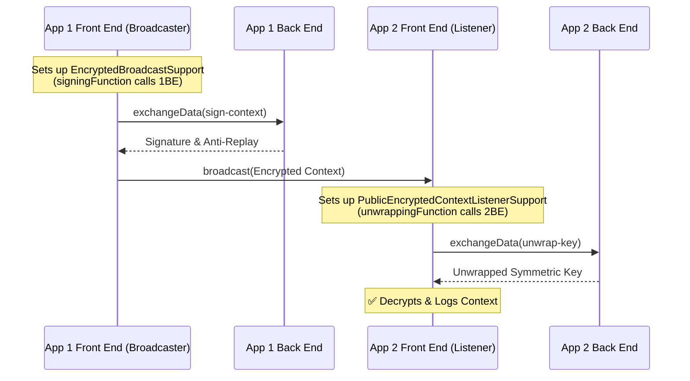
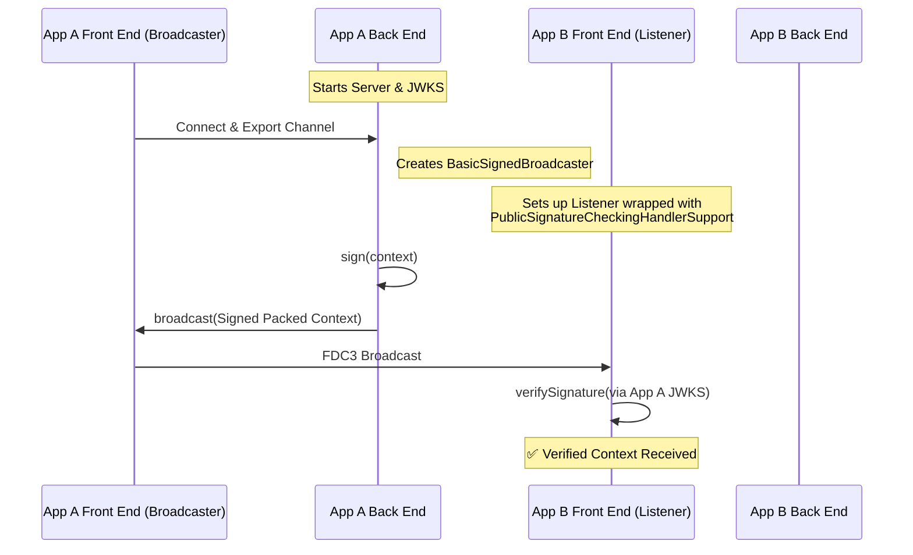
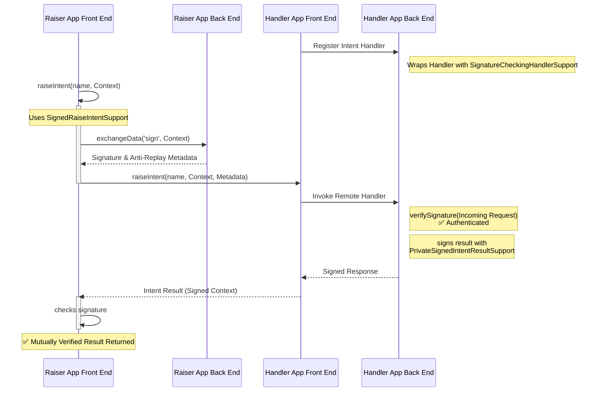
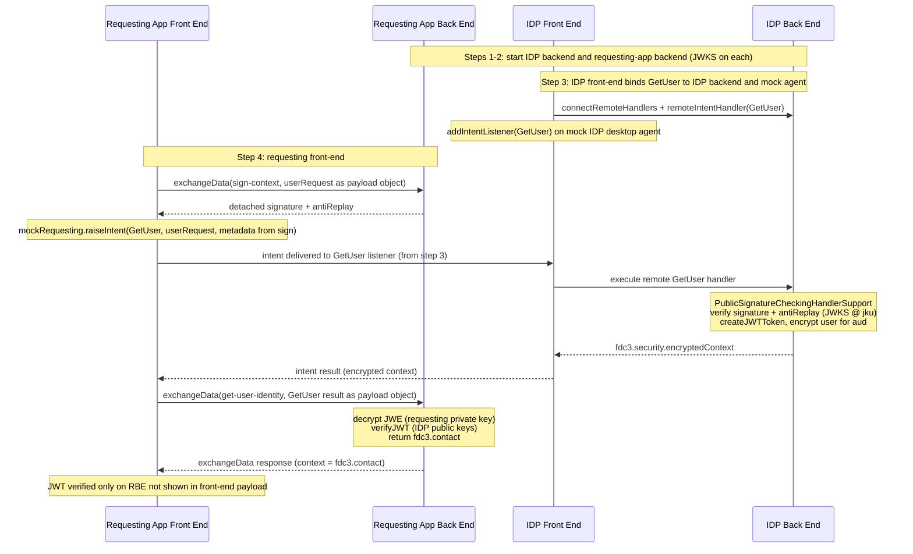

# FDC3 Security Samples

This directory contains examples demonstrating how to use the FDC3 Security features for context encryption, signing, and user identification.

Each example is a standalone TypeScript file that can be executed directly using `tsx` from the package root. The desktop agent is mocked in each sample to illustrate the information flows between applications and their secure backends.

## Running the Examples

From the `packages/fdc3-security` directory:

```bash
# Example: Run the Mutually Authenticated Intent example
npx tsx samples/signing-intent-example.ts

# Example: Run the Signing Broadcast example
npx tsx samples/signing-broadcast-example.ts
```

---

## [Backend Encrypted Channel Example](backend-encrypted-channel-example.ts)

Demonstrates how to use `EncryptedBroadcastSupport` and `PrivateEncryptedContextListenerSupport` on the backend. Encryption and decryption are handled entirely by backend processes, with the frontend acting only as a transport for FDC3 channels.



---

## [Frontend Encrypted Channel Example](frontend-encrypted-channel-example.ts)

Shows how to use `EncryptedBroadcastSupport` and `PublicEncryptedContextListenerSupport` for frontend-driven encryption. Encryption and decryption occur on the frontend, while sensitive key unwrapping and signing are delegated to a secure backend via `exchangeData`.



---

## [Signing Broadcast Example](signing-broadcast-example.ts)

Illustrates how to sign FDC3 broadcasts using `BasicSignedBroadcaster` and verify them using `PublicSignatureCheckingHandlerSupport`. This covers a full cycle of signed context dissemination.



---

## [Signing Intent Example (Mutual Authentication)](signing-intent-example.ts)

A full end-to-end demonstration of mutual authentication in FDC3 intent flows. This composite example replaces previous partial samples to show a complete secure cycle: 
 - Raiser signs the request 
 - Handler verifies and signs the result 
 - Raiser verifies the result.

Potentially, users could modify this to do one-way authentication.


---

## [Get User Example](get-user-example.ts)

A detailed demonstration of the **`GetUser`** intent (`fdc3.security.userRequest` in, **`fdc3.contact`** out on the requesting side). The sample follows the same layout as other security samples: **(1)** start the IDP backend, **(2)** start the requesting-app backend, **(3)** IDP front-end connects and registers a **GetUser** intent listener on a mock desktop agent, **(4)** requesting-app front-end signs the user request, **raises** `GetUser`, then calls **`exchangeData('get-user-identity', …)`** so the JWT is verified only on the requesting backend and never reaches the browser-side code path shown here.


