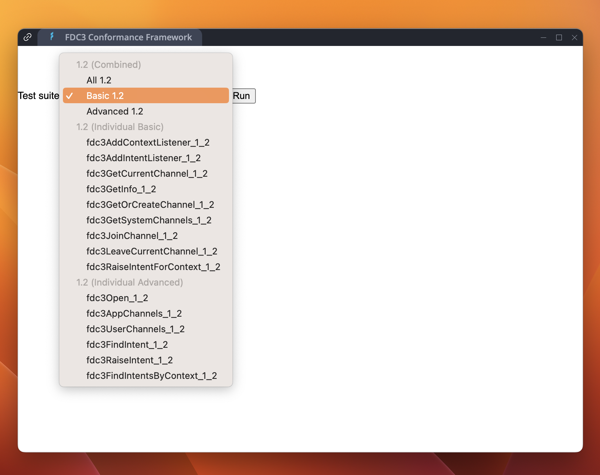
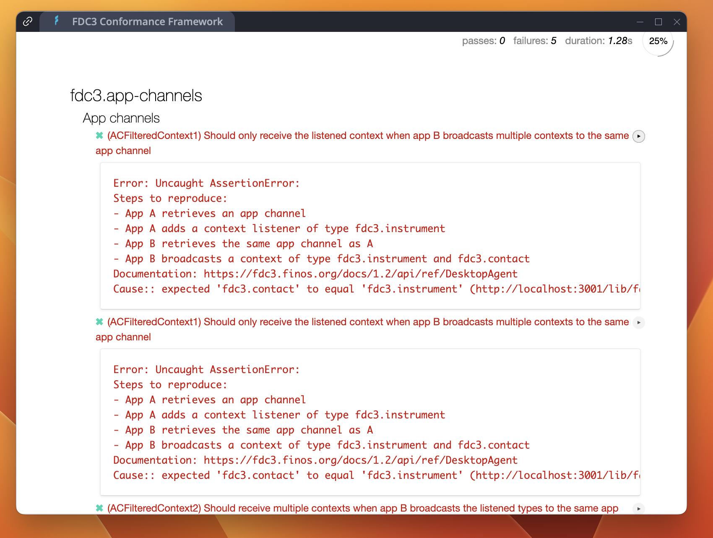
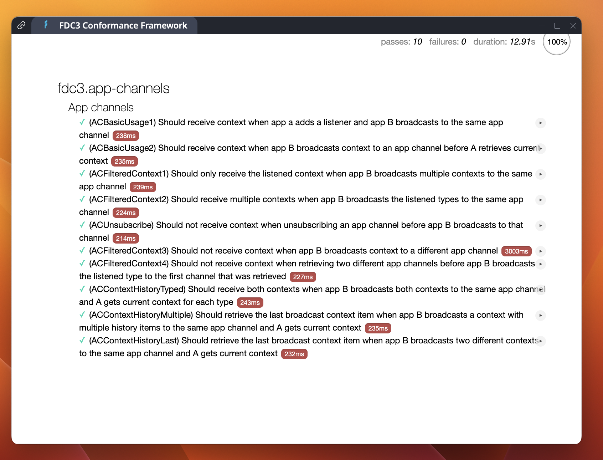
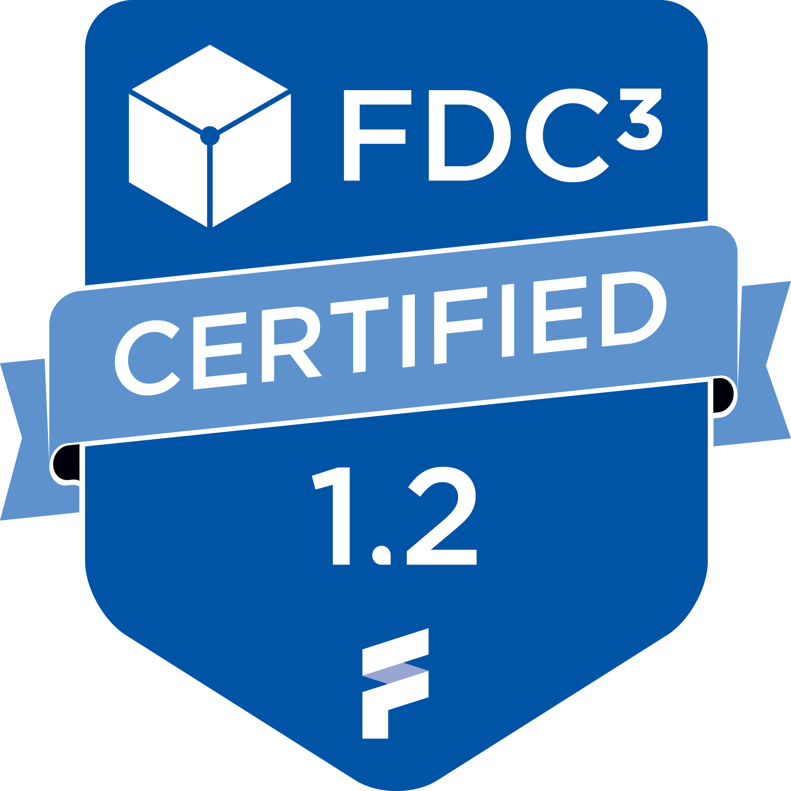
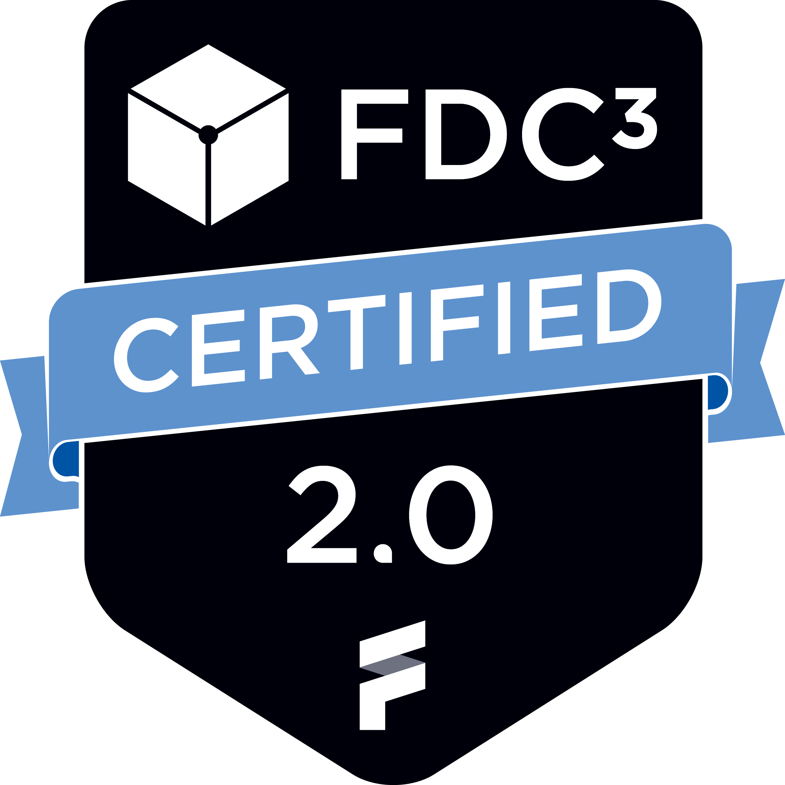

# FDC3 Conformance Framework

A framework for testing whether desktop containers implement the [FDC3 standard](https://fdc3.finos.org/).

The tests implemented for each FDC3 version are based on the FDC3 Conformance tests specifications defined by the FDC3 maintainers and hosted on the [FDC3 website](https://fdc3.finos.org/docs/api/conformance/Conformance-Overview). 

Tests in this module currently implement versions 2.0 and 2.2 of the FDC3 Standard.  For old 1.2 conformance testing, please see the [archived FDC3 Conformance project](https://github.com/finos/FDC3-Conformance-Framework) 

## What Is It?

- There are many vendors implementing Desktop Agents for the FDC3 standard.
- Developers building apps interoperating with the FDC3 standard want to be sure that their apps will work with every Desktop Agent.
- This suite of conformance tests allows for programmatic verification of an FDC3 Desktop Agent implementation.

## Why Is This Important?

✔️ **Multiple Platforms**

It can be annoying for users to find that features in their apps that they rely on don't work when changing between Desktop Agents.  Hopefully these conformance tests will add security around that.

✔️ **Marketing**

FINOS has created _badges_ to indicate conformance with the FDC3 standard.   By passing the conformance tests and joining the conformance program, firms are able to use those badges in their own marketing materials.

✔️ **Backwards Compatibility**

There are multiple versions of the FDC3 standard.  A Desktop Agent could host apps written in _any one of these versions_.  For that reason, it's important that Desktop Agents are tested to make sure that they keep on supporting apps written against older versions of FDC3.

## How Does It Work?

There are two main parts to conformance:
  
  - Running the tests _locally_
  - Joining the Conformance Program

### Running The Conformance Tests

You can either run the hosted conformance tests listed in the FINOS App Directory, or run them on your local machine (useful if you are making changes).  Instructions for doing either of those things are here:

#### Running From fdc3.finos.org

You can run the FDC3 conformance tests straight from the FDC3 website.  If you have a Desktop Agent supporting the [AppD v2 standard](https://fdc3.finos.org/docs/app-directory/spec), you can run the tests from the following URL:

 - [https://fdc3.finos.org/toolbox/fdc3-conformance/directory.v2.json](https://fdc3.finos.org/toolbox/fdc3-conformance/directory.v2.jso)

#### Local Installation

Alternatively, you can run the conformance suite from your local machine by following these steps:

1.  **Check Out This Repo**

The FDC3 project is a monorepo and the `toolbox/fdc3-conformance` folder contains the conformance tests.  

2. **Install Dependencies**

In order to get started, install all the dependencies with:

```sh
npm install
```

3.  **Run The Apps Locally**

To run the conformance suite (and all of the other FDC3 project components such as the workbench and demo desktop agent) locally on port 3001:

```sh
npm run dev
```

4.  **Set Up Your Desktop Agent**

You will need to set up your desktop agent so that it has an _App Directory containing all the conformance apps_.   
This step is vendor-dependent, but examples of `AppD` records can be found in the `directory` folder.

### Running The Tests

Once you have configured your desktop agent correctly, open the conformance app and select the tests you wish to run:



The tests run and produce an output in the window.  Failure are shown with a stack trace in red:



Successful runs look something like this:



### Joining The Conformance Program

If you've had a clean run of all the tests locally, why not join the conformance program?

[Instructions to join the Certified FDC3 Desktop Agent Conformance Program](instructions.md)

Once you have followed these steps, you will be allowed to display the FDC3 Compliance Badges within your marketing literature.



### Which Desktop Agents Are Conformant?

We publish the details of conformant desktop agents on the [FDC3 Home Page](https://fdc3.finos.org#conformance).  Please check there to find out who FINOS has certified! 

