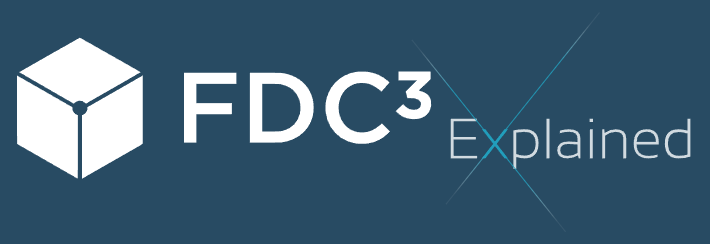

# <a href='http://fdc3.finos.org/toolbox/fdc3-explained'>

FDC3 Explained was originally created by Johan Sandersson, an original maintainer of FDC3, and contributed to the project. It shows how easy it is to create very simple HTML and JavaScript that can use the FDC3 APIs to facilitate interoperability.

It is also a useful tool for detecing whether FDC3 is enabled, by running the website inside an FDC3-supporting desktop agent, and for performing basic FDC3 operations to help test interoperability workflows.

## Website

FDC3 Explained can be accessed at the following URL: https://fdc3.finos.org/toolbox/fdc3-explained.

Note that it will only detect and allow use of FDC3 when running in the context of an FDC3 desktop agent.

## Build

The NPM script `copy-explained` in the `website` folder copies the relevant files to the FDC3 website build for deployment.

It is automatically executed during deployments to https://fdc3.finos.org.

## Note

FDC3 Explained does not aim to be an exhaustive reference implementation for each version of the FDC3 Standard, it is merely a convenient testing utility.
