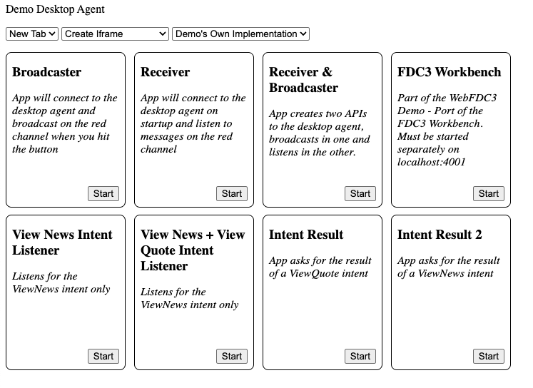
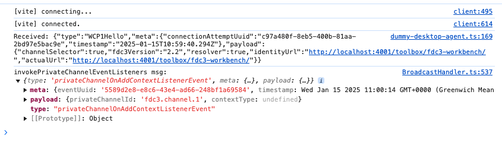
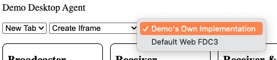
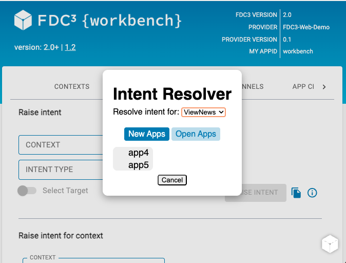
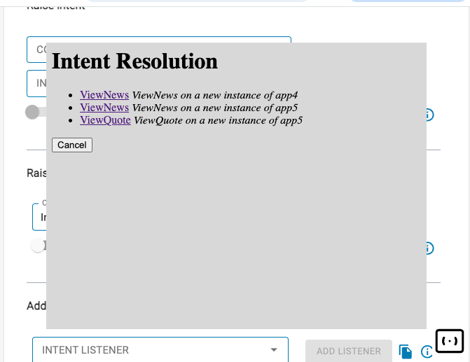
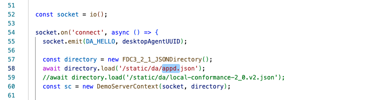

# FDC3 Demo Desktop Agent

This repository contains a [FDC3 2.0 Conformant](../../fdc3-conformance/README.md) Desktop Agent reference implementation, built on top of the [FDC3 Web Implementation](../fdc3-web-impl/README.md).

## Running The Demo

From the root of the repository, run:

```bash

npm install
npm run build
npm run dev

```

If all goes well, you should see the following message in the console:

```
Server is listening on port 4000. Head to http://localhost:4000/static/da/index.html
```

And the web page will load in Chrome looking like this:



## Features

The demo Desktop Agent provides the following features:


### 1. Browser-Based Desktop Agent 



All FDC3 state is maintained in-browser with the exception of some very simple routing (expressed in `src/server/main.ts`) that links the various connections together.  Therefore, refreshing the Desktop Agent's window will reset the state of the Desktop Agent.

This means that you can view FDC3 communications within the Demo Desktop Agent's browser window, as shown in the above screenshot.

### 2. Tabs or Frames


`demo` supports launching of FDC3 Apps as either tabs or frames.  You can choose the approach with the drop-down on the demo page.

### 3.  Both Parent Post-Message and Iframe Communication Approaches


FDC3 WCP supports both communication from the App to the Desktop Agent via direct parent window postMessage and via postMessage to an iframe.  `demo` supports both approaches and you can choose the approach with the middle drop-down on the demo page.

### 4. Intent Resolver / Channel Selector UI



FDC3 WCP supports the ability for Desktop Agents to specify UI for resolving intents or selecting channels, and FDC3 also provides a default implementation which Desktop Agent implementers can use if they want.  `demo` allows the user to choose between `demo`'s own Channel Selector and Intent Resolver or the Default Web FDC3 ones.  This is done with the right-most drop-down on the launch page.  

#### Channel Selectors

|Mode           | Default Web FDC3 UI | Demo UI |
|---------------|---------------------|---------|
|Collapsed      ||| 
|Expanded       |||

**Note:** The Demo UI Channel Selector also supports **dragging** when in expanded mode.  You can reposition it on the screen by dragging on the six circles on the right of the title bar.

#### Intent Resolvers

Here are screenshots of the two different UIs provided for intent resolution:

  

### 5. App Directory Loaded From URL



The Demo Desktop Agent doesn't provide UI for selecting the app directory, however it is trivial to change this by modifying the `dummy-desktop-agent.ts` file.  You are able to specify as many different app directories to load as you want.  Note, `appd.json` and `local-conformance-2_0.v2.json` are provided in the `static/da` directory for you.

The `appd.json` file is a simple JSON file that specifies some demo apps (see below).  The `local-conformance-2_0.v2.json` file is for running 2.0 conformance tests.

## Demo Applications

As shown in the screenshot above, there are 7 demo applications provided by Demo.   These attempt to exercise the functionality of FDC3 in a simple way.  They are:

- **Broadcaster**: When you hit "Press Me To Broadcast", it joins User Channel 1 and then begins periodically broadcasting simple messages, until it gets to 50 messages and stops.  

- **Receiver**: This also joins User Channel 1, and logs the contents of any messages it receives.  Tip: Try changing the user channel using the channel selector in either of these two apps to see what happens.

- **Receiver and Broadcaster**: A single App combining the functionality of the two above.  It will broadcast messages and log them.

- **FDC3 Workbench**:  The venerable [FDC3 Workbench](../../fdc3-workbench/README.md), which provides a simple UI for exercising all of the interoperability features of FDC3.  Tip: try running a few of these and testing sending messages via channels between the instances.

- **View News Intent Listener**: One of two apps that listens for the `ViewNews` intent, logs the context it receives on screen and responds with an `fdc3.test` context.  Tip: This is useful for testing out intent resolution. Try going into the FDC3 Workbench and raising a `ViewNews` intent with an `fdc3.instrument` context and you'll see an intent resolver pop up.  

- **View News and View Quote Intent Listener**: Similar to the above, but also responds to the `ViewQuote` intent.  tip: As this is the only app responding to `ViewQuote`, you will not see an intent resolver when you raise `ViewQuote` with an `fdc3.instrument`.

- **Intent Result**: On launch, raises a `ViewQuote` intent with an `fdc3.instrument` context.  This is useful for testing out intent resolution without having to bother with the FDC3 Workbench.

- **Intent Result 2**: On launch, raises a `ViewNews` intent with an `fdc3.instrument` context.    Tip: Try changing the intent resolver in the UI to the default one and see what happens.