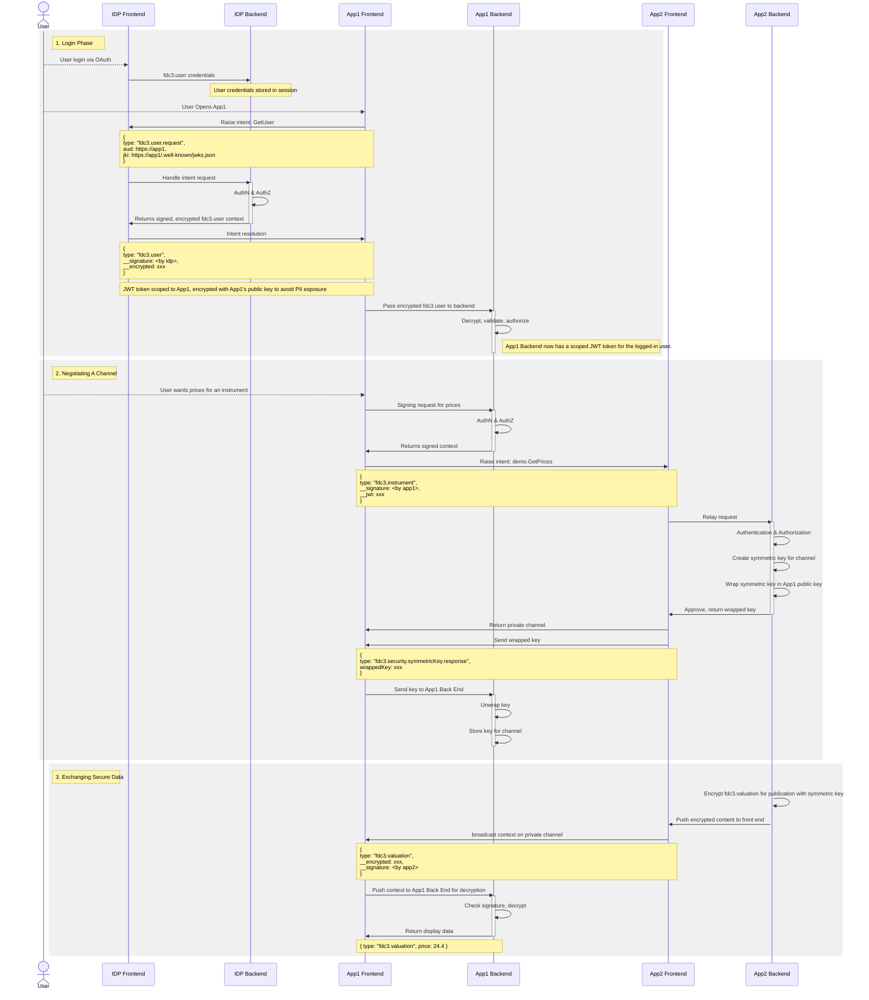

## The Demo

This demo illustrates the FDC3 Security Interop flow across three main phases: user authentication, secure channel negotiation, and encrypted data exchange.

```mermaid
%%{init: {'sequence': {'noteAlign': 'left'}}}%%

sequenceDiagram
    actor U as User
    participant IDF as IDP Frontend
    participant IDB as IDP Backend
    participant A1F as App1 Frontend
    participant A1B as App1 Backend
    participant A2F as App2 Frontend
    participant A2B as App2 Backend

    rect rgb(240, 240, 240)
    Note right of U: 1. Login Phase
    U-->>IDF: User login via OAuth
    IDF->>IDB: fdc3.user credentials
    Note over IDB: User credentials stored in session

    U-->>A1F: User Opens App1
    A1F->>IDF: Raise intent: GetUser
    Note over A1F, IDF: {<br/>type: "fdc3.user.request", <br/>  aud: https://app1, <br/> jki: https://app1/.well-known/jwks.json <br/> }
    IDF->>IDB: Handle intent request
    activate IDB
    IDB->>IDB: AuthN & AuthZ
    IDB->>IDF: Returns signed, encrypted fdc3.user context
    deactivate IDB
    IDF->>A1F: Intent resolution
    Note over IDF, A1F: { <br/>type: "fdc3.user", <br/>__signature: <by idp>, <br/>__encrypted: xxx <br/>}
    Note over IDF, A1F: JWT token scoped to App1, encrypted with App1's public key to avoid PII exposure
    
    A1F->>A1B: Pass encrypted fdc3.user to backend
    activate A1B
    A1B->>A1B: Decrypt, validate, authorize
    Note right of A1B: App1 Backend now has a scoped JWT token for the logged-in user.
    deactivate A1B
    end


    rect rgb(240, 240, 240)
    Note right of U: 2. Negotiating A Channel
    U-->>A1F: User wants prices for an instrument
    A1F->>A1B: Signing request for prices
    activate A1B
    A1B->>A1B: AuthN & AuthZ
    A1B->>A1F: Returns signed context
    deactivate A1B
    
    A1F->>A2F: Raise intent: demo.GetPrices
    Note over A1F, A2F: { <br/>type: "fdc3.instrument", <br/>__signature: <by app1>, <br/>__jwt: xxx <br/>}
    A2F->>A2B: Relay request
    activate A2B
    A2B->>A2B: Authentication & Authorization
    A2B->>A2B: Create symmetric key for channel
    A2B->>A2B: Wrap symmetric key in App1 public key
    A2B->>A2F: Approve, return wrapped key
    deactivate A2B
    A2F->>A1F: Return private channel
    A2F->>A1F: Send wrapped key
    Note over A2F, A1F: { <br/>type: "fdc3.security.symmetricKey.response", <br/>wrappedKey: xxx <br/>}
    
    A1F->>A1B: Send key to App1 Back End
    activate A1B
    A1B->>A1B: Unwrap key
    A1B->>A1B: Store key for channel
    deactivate A1B
    end

    rect rgb(240, 240, 240)
    Note right of U: 3. Exchanging Secure Data
    activate A2B
    A2B->>A2B: Encrypt fdc3.valuation for publication with symmetric key
    A2B->>A2F: Push encrypted content to front end
    A2F->>A1F: broadcast context on private channel
    Note over A2F, A1F: {<br/> type: "fdc3.valuation", <br/>__encrypted: xxx, <br/>__signature: <by app2> <br/>}
    A1F->>A1B: Push context to App1 Back End for decryption
    activate A1B
    A1B->>A1B: Check signature, decrypt
    A1B->>A1F: Return display data
    deactivate A1B
    Note over A1B, A1F: { type: "fdc3.valuation", price: 24.4 }
    end
```

