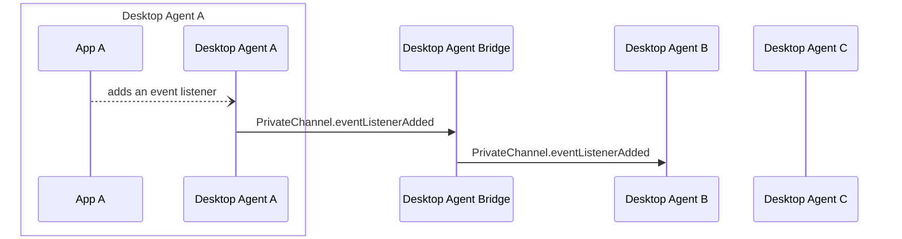

Desktop Agent bridging message exchange for the addition of an event handler to a [`PrivateChannel`](../../api/ref/PrivateChannel). Generated by API calls:

- [`PrivateChannel.onAddContextListener(handler: (contextType?: string) => void): Listener`](../../api/ref/PrivateChannel#onaddcontextlistener)
- [`PrivateChannel.onUnsubscribe(handler: (contextType?: string) => void): Listener`](../../api/ref/PrivateChannel#onunsubscribe)
- [`PrivateChannel.onDisconnect(handler: () => void): Listener`](../../api/ref/PrivateChannel#ondisconnect)

[Message Exchange Type](../spec#individual-message-exchanges): **Request only**

:::caution

Some additional tracking of PrivateChannel metadata is required on the Desktop Agent that created each PrivateChannel and on any Desktop Agent interacting with it, in order to use these message exchanges. Please see the [relevant section of the Agent Bridging overview](../spec#privatechannels) for more details.

:::

Private channels support a number of additional event listeners (`onAddContextListener`, `onUnsubscribe`, `onDisconnect`), when an application adds one of these event listeners to a private channel that was created remotely and returned as an `IntentResult` (which should be tracked by the Desktop Agent Bridge client) a message needs to be sent to the agent that created the channel to facilitate routing of event messages. A single message type is used for this with a `payload.listenerType` field.

## Message exchange



## Request format

### Request message schemas

- [https://fdc3.finos.org/schemas/next/bridging/privateChannelEventListenerAddedAgentRequest.schema.json](pathname:///schemas/next/bridging/privateChannelEventListenerAddedAgentRequest.schema.json)
- [https://fdc3.finos.org/schemas/next/bridging/privateChannelEventListenerAddedBridgeRequest.schema.json](pathname:///schemas/next/bridging/privateChannelEventListenerAddedBridgeRequest.schema.json)

### Example

```json
// agent-A -> DAB
{
    "type": "PrivateChannel.eventListenerAdded",
    "payload": {
        "channelId": "private-channel-ABC123",
        "listenerType": "onAddContextListener"
    },
    "meta": {
        "requestUuid": "<requestUuid>",
        "timestamp": "2020-03-...",
        "source": {
            "appId": "AChatApp",
            "instanceId": "02e575aa-4c3a-4b66-acad-155073be21f6",
            "desktopAgent": "agent-A" //added by DAB
        },
        "destination": {
            "appId": "AnotherApp",
            "instanceId": "02e235ba-acad-4b66-4c3a-547073be23f1",
            "desktopAgent": "agent-B"
        }
    }
}
```
