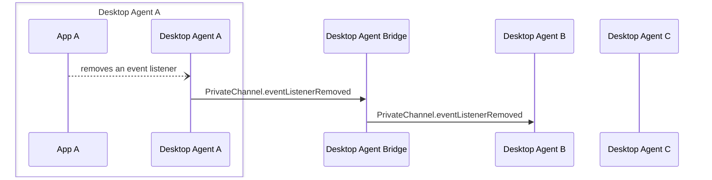

Desktop Agent bridging message exchange for the removal of an event handler from a [`PrivateChannel`](../../api/ref/PrivateChannel). Generated by API calls:

- [`listener.unsubscribe(): void`](../../api/ref/Types#listener)
  - for [`Listener`](../../api/ref/Types#listener) objects returned by [`PrivateChannel`](../../api/ref/PrivateChannel) functions:
    - [`onAddContextListener(handler: (contextType?: string) => void): Promise<Listener>`](../../api/ref/PrivateChannel#onaddcontextlistener)
    - [`onUnsubscribe(handler: (contextType?: string) => void): Promise<Listener>`](../../api/ref/PrivateChannel#onunsubscribe)
    - [`onDisconnect(handler: () => void): Promise<Listener>`](../../api/ref/PrivateChannel#ondisconnect)
- [`PrivateChannel.disconnect(): void`](../../api/ref/PrivateChannel#disconnect)

[Message Exchange Type](../spec#individual-message-exchanges): **Request only**

:::caution

Some additional tracking of PrivateChannel metadata is required on the Desktop Agent that created each PrivateChannel and on any Desktop Agent interacting with it, in order to use these message exchanges. Please see the [relevant section of the Agent Bridging overview](../spec#privatechannels) for more details.

:::

Private channels support a number of additional event listeners (`onAddContextListener`, `onUnsubscribe`, `onDisconnect`), when an application removes an event listener from a PrivateChannel that was created remotely and returned as an `IntentResult` (which should be tracked by the Desktop Agent Bridge client) a message needs to be sent to the agent that created the channel so it can discard retained routing information. A single message type is used for this with a `payload.listenerType` field.

## Message exchange



## Request format

### Request message schemas

- [https://fdc3.finos.org/schemas/next/bridging/privateChannelEventListenerRemovedAgentRequest.schema.json](pathname:///schemas/next/bridging/privateChannelEventListenerRemovedAgentRequest.schema.json)
- [https://fdc3.finos.org/schemas/next/bridging/privateChannelEventListenerRemovedBridgeRequest.schema.json](pathname:///schemas/next/bridging/privateChannelEventListenerRemovedBridgeRequest.schema.json)

### Example

```json
// agent-A -> DAB
{
    "type": "PrivateChannel.eventListenerRemoved",
    "payload": {
        "channelId": "private-channel-ABC123",
        "listenerType": "onAddContextListener"
    },
    "meta": {
        "requestUuid": "<requestUuid>",
        "timestamp": "2020-03-...",
        "source": {
            "appId": "AChatApp",
            "instanceId": "02e575aa-4c3a-4b66-acad-155073be21f6",
            "desktopAgent": "agent-A" //added by DAB
        },
        "destination": {
            "appId": "AnotherApp",
            "instanceId": "02e235ba-acad-4b66-4c3a-547073be23f1",
            "desktopAgent": "agent-B"
        }
    }
}
```
