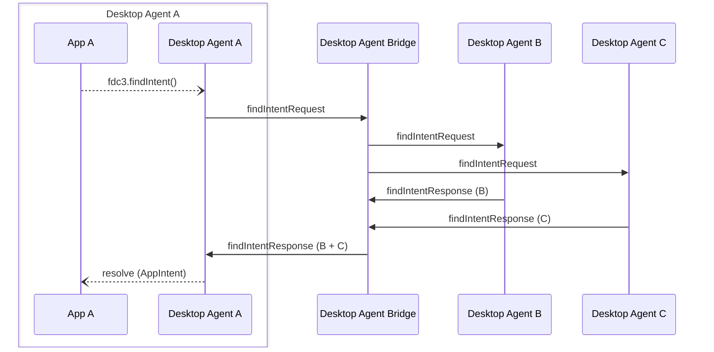

Desktop Agent bridging message exchange for a `findIntent` API call on the [`DesktopAgent`](../../api/ref/DesktopAgent). Generated by API call:

- [`findIntent(intent: string, context?: Context, resultType?: string): Promise<AppIntent>`](../../api/ref/DesktopAgent#findintent)

[Message Exchange Type](../spec#individual-message-exchanges): **Request Response (collated)**

E.g. An application with `appId: "agentA-app1"` and `instanceId: "c6ad5174-6f78-4582-8e96-728d93a4d7d7"` makes the following API call:

```javascript
let appIntent = await fdc3.findIntent("StartChat", context);
```

## Message exchange



## Request format

### Request message schemas

- [https://fdc3.finos.org/schemas/next/bridging/findIntentAgentRequest.schema.json](pathname:///schemas/next/bridging/findIntentAgentRequest.schema.json)
- [https://fdc3.finos.org/schemas/next/bridging/findIntentBridgeRequest.schema.json](pathname:///schemas/next/bridging/findIntentBridgeRequest.schema.json)

### Example

Outward message to the DAB (with `intent` and `context` specified, but not `resultType`):

```json
// agent-A -> DAB
{
    "type": "findIntentRequest",
    "payload": {
        "intent": "StartChat",
        "context": {/*contextObj*/}
    },
    "meta": {
        "requestUuid": "<requestUuid>",
        "timestamp": "2020-03-...",
        "source": {
            "appId": "agentA-app1",
            "instanceId": "c6ad5174-6f78-4582-8e96-728d93a4d7d7"
        }
    }
}
```

The DAB fills in the `source.desktopAgent` field and forwards the request to the other Desktop Agents (agent-B AND agent-C):

```json
// DAB -> agent-B
// DAB -> agent-C
{
    "type": "findIntentRequest",
    "payload": {
        "intent": "StartChat",
        "context": {/*contextObj*/}
    },
    "meta": {
        "requestUuid": "<requestUuid>",
        "timestamp": "2020-03-...",
        "source": {
            "appId": "agentA-app1",
            "instanceId": "c6ad5174-6f78-4582-8e96-728d93a4d7d7",
            "desktopAgent": "agent-A" //added by DAB
        }
    }
}
```

Note that the `source.desktopAgent` field has been populated with the id of the agent that raised the requests, enabling the routing of responses.

## Response format

### Response message schemas

- [https://fdc3.finos.org/schemas/next/bridging/findIntentAgentResponse.schema.json](pathname:///schemas/next/bridging/findIntentAgentResponse.schema.json)
- [https://fdc3.finos.org/schemas/next/bridging/findIntentAgentErrorResponse.schema.json](pathname:///schemas/next/bridging/findIntentAgentErrorResponse.schema.json)
- [https://fdc3.finos.org/schemas/next/bridging/findIntentBridgeResponse.schema.json](pathname:///schemas/next/bridging/findIntentBridgeResponse.schema.json)
- [https://fdc3.finos.org/schemas/next/bridging/findIntentBridgeErrorResponse.schema.json](pathname:///schemas/next/bridging/findIntentBridgeErrorResponse.schema.json)

### Example

Normal response from agent-A, where the request was raised.

```json
{
    "intent": { "name": "StartChat" },
    "apps": [
        { "appId": "myChat" }
    ]
}
```

DA agent-B would produce the following response if the request was generated locally:

```json
{
    "intent": { "name": "StartChat" },
    "apps": [
        { "appId": "Skype", "title": "Skype" /* other AppMetadata fields may be included */},
        { "appId": "Symphony", "title": "Symphony" },
        { "appId": "Symphony", 
          "instanceId": "93d2fe3e-a66c-41e1-b80b-246b87120859", 
          "title": "Symphony" },
        { "appId": "Slack", "title": "Slack" }
    ]
}
```

Hence, the response it sends to the bridge is encoded as follows:

```json
// agent-B -> DAB
{
    "type":  "findIntentResponse",
    "payload": {
        "appIntent":  {
            "intent":  { "name": "StartChat" },
            "apps": [
                { "appId": "Skype", "title": "Skype" /* other AppMetadata fields may be included */ },
                { "appId": "Symphony", "title": "Symphony" },
                { "appId": "Symphony", 
                  "instanceId": "93d2fe3e-a66c-41e1-b80b-246b87120859", 
                  "title": "Symphony" },
                { "appId": "Slack", "title": "Slack" }
            ]
        }
    },
    "meta": {
        "requestUuid": "<requestUuid>",
        "responseUuid":  "<responseUuidAgentB>",
        "timestamp":  "2020-03-...",
    }
}
```

Note the response UUID generated by the agent-B and the reference to the request UUID produced by agent-A where the request was originated. Further, note that the `AppMetadata` elements in the `AppIntent` do not have a `desktopAgent` field yet, and the `meta` element does not contain a `sources` element, both of which the bridge will add.

DA agent-C would produce the following response locally:

```json
{
    "intent":  { "name": "StartChat" },
    "apps": [
       { "appId": "WebIce"}
    ]
}
```

which is sent back over the bridge as a response to the request message as:

```json
// agent-C -> DAB
{
    "type":  "findIntentResponse",
    "payload": {
        "appIntent":  {
            "intent":  { "name": "StartChat" },
            "apps": [
                { "appId": "WebIce"}
            ]
        }
    },
    "meta": {
        "requestUuid": "<requestUuid>",
        "responseUuid":  "<responseUuidAgentC>",
        "timestamp":  "2020-03-...",
    }
}
```

The bridge receives and collates the responses, producing the following collated response which is sends back to agent-A:

```json
// DAB -> agent-A
{
    "type":  "findIntentResponse",
    "payload": {
        "intent":  "StartChat",
        "appIntent":  {
            "intent":  { "name": "StartChat" },
            "apps": [
                { "appId": "Skype", "title": "Skype", "desktopAgent": "agent-B" }, //desktopAgent added by DAB
                { "appId": "Symphony", "title": "Symphony", "desktopAgent": "agent-B" },
                { "appId": "Symphony", 
                  "instanceId": "93d2fe3e-a66c-41e1-b80b-246b87120859", 
                  "title": "Symphony", 
                  "desktopAgent": "agent-B" },
                { "appId": "Slack", "title": "Slack", "desktopAgent": "agent-B" },
                { "appId": "WebIce", "desktopAgent": "agent-C"}
            ]
        }
    },
    "meta": {
        "requestUuid": "<requestUuid>",
        "responseUuid":  "<responseUuidDAB>",
        "timestamp":  "2020-03-...",
        "sources": [ //added by DAB
            { "desktopAgent": "agent-A" },
            { "desktopAgent": "agent-B" },
        ]
    }
}
```

:::note

In the event that an agent referred to in the API call is not connected to the bridge, an agent that was connected times out or returns an error, its `DesktopAgentIdentifier` should be added to the `meta.errorSources` element instead of `meta.sources` and the appropriate error ([`ResolveError.DesktopAgentNotFound`](../../api/ref/Errors#resolveerror), [`BridgingError.ResponseTimedOut`](../../api/ref/Errors#bridgingerror) or [`BridgingError.AgentDisconnected`](../../api/ref/Errors#bridgingerror)) should be added to `meta.errorDetails`.

:::

Finally, agent-A combines the data received from the bridge, with its own local response to produce the response to the requesting application:

```json
// agent-A -> requesting App
{
    "intent":  { "name": "StartChat", "displayName": "Chat" },
    "apps": [
        // local to this agent
        { "appId": "myChat" },
        //agent-B responses
        { "appId": "Skype", "title": "Skype", "desktopAgent": "agent-B" },
        { "appId": "Symphony", "title": "Symphony", "desktopAgent": "agent-B" },
        { "appId": "Symphony", 
            "instanceId": "93d2fe3e-a66c-41e1-b80b-246b87120859", 
            "title": "Symphony", 
            "desktopAgent": "agent-B" },
        { "appId": "Slack", "title": "Slack", "desktopAgent": "agent-B" },
        //agent-C responses
        { "appId": "WebIce", "desktopAgent": "agent-C"}
    ]
}
```
