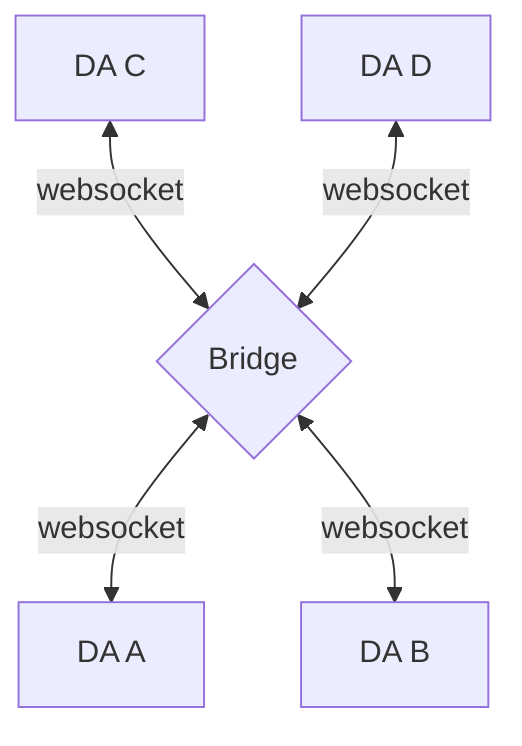
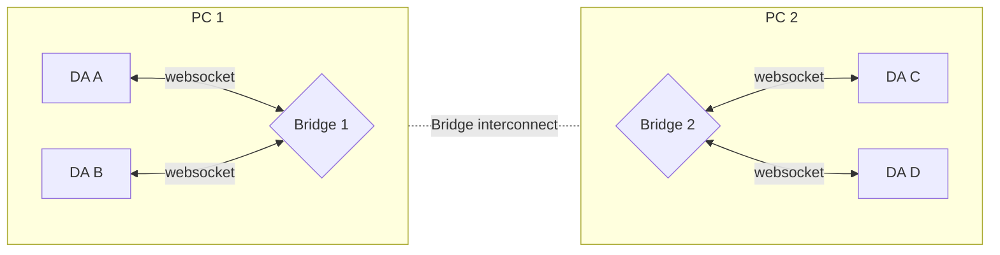
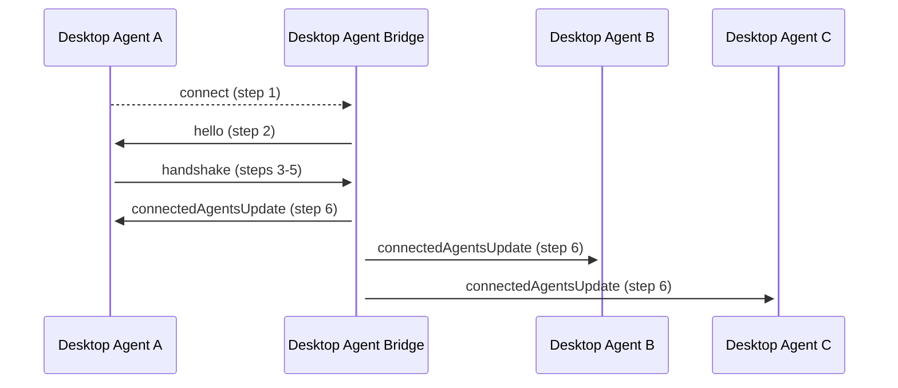

:::info _[@experimental](../fdc3-compliance#experimental-features)_

Desktop Agent Bridging is an experimental feature added to FDC3 in 2.1, hence, its design may change in the future and it is exempted from the FDC3 Standard's normal versioning and deprecation polices in order to facilitate any necessary change.

:::

<!-- ## TODO list

* Expand on how the DAB should create the JWT token (and its claims, which must change to avoid replay attacks) which it sends out in the `hello` message for DAs to validate.
* Link to BackPlane project somewhere 

-->

The FDC3 Desktop Agent API addresses interoperability between apps running within the context of a single Desktop Agent (DA), enabling cross-application workflows and context sharing.


It is clear, however, that user desktops are substantially more complicated in reality. Some Desktop Agent implementations already provide additional features allowing "external" applications (e.g. those not launched by the Desktop Agent) to connect in order to participate in interoperability.


Firms that make extensive use of FDC3 have also identified use cases where interoperability workflows span different physical desktops, and have built proprietary bridging solutions (e.g. [Backplane](https://backplane.finos.org/) was originally developed as an in-house solution to this problem).


With the success of FDC3, usage of vendor-provided Desktop Agents has increased substantially among banks and buy-side institutions. Buy-side firms who are clients of multiple banks' platforms have multiple desktop agents delivered to their desktops. Several software vendors also deliver FDC3-compatible software: some as apps that can run in any Desktop Agent, but some as self-contained applications running in their own desktop agent. They are often multi-component suites of functionality with a customized user experience, and are not simple to export to a different Desktop Agent. In these cases, being able to provide a single installable platform bundled with a Desktop Agent is a far more practical solution for the vendor and customer.


However, unless the Desktop Agents themselves can interoperate, unfortunately, this approach prevents interoperability rather than promoting it. To support user workflows spanning the whole environment there needs to be some form of network connectivity between Desktop Agents.

Desktop Agent Bridging addresses the interconnection of Desktop Agents (DAs) such that apps running under different Desktop Agents can also interoperate, allowing workflows to span multiple Desktop Agents. This is achieved, without implementation changes or special handling in the apps, by providing a protocol and service for the Desktop Agents to interoperate with each other instead, allowing application interop to extend across the bridged agents, seamlessly.

In any Desktop Agent Bridging scenario, it is expected that each DA is being operated by the same user (as the scope of FDC3 contemplates cross-application workflows for a single user, rather than cross-user workflows), although DAs may be run on different machines operated by the same user. Whether a bridge is running for Desktop Agents to connect to, whether it requires the agents to authenticate etc., is in the hands of the user (and their local IT team).

## Bridging Desktop Agents

The Desktop Agent Bridging Part of the FDC3 Standard is composed of three components:

- **[Bridge Connection](#connection)**: A means for Desktop Agents to communicate with a bridge, and through that bridge, with each other.
- **[Bridge Connection Protocol (BCP)](#bridge-connection-protocol)**: A protocol defining message exchanges necessary to connect to a Bridge and to perform initial state synchronization.
- **[Bridge Messaging Protocol (BMP)](#bridge-messaging-protocol)**: A protocol defining message exchanges that allow FDC3 API interop to extend across multiple Desktop Agents.

Detail on each of these components is defined in the following sections.

:::note

Although this specification defines a particular [connection](#connection) type (based on a websocket server), it has been divided into parts so that the protocol definitions might be reused to implement a bridge over an alternative connection in future.

::: 

:::tip

The Desktop Agent Bridging protocol has been designed such that an application using the FDC3 API does not need to make any significant changes in order to make use of the Bridging connection between its Desktop Agent and another agent. This is achieved via messaging workflows that allow the bridged agents to cooperate on behalf of the applications, for example, by retrieving options for intent resolution from other agent or forwarding on messages that were broadcast on channels.

However, Bridging should still be visible to applications, which is achieved through the addition of a `desktopAgent` field to the `AppIdentifier` type allowing it to indicate that an app or app instance exists on another agent, as well as a number of new error messages that may be returned to indicate bridging issues.

:::

### Agent Bridging Compliance

Agent Bridging is introduced in FDC3 2.1 as an [@experimental](../fdc3-compliance#experimental-features) feature of the FDC3 Standard, included to enable implementation by and feedback from the FDC3 community. As such, it is currently optional for the purposes of compliance and is exempted from the normal versioning and deprecation polices in order to facilitate any refinement needed.

### JSON Message Protocol & JSON Schema

The Bridge Connection Protocol (BCP) and Bridge Messaging Protocols (BMP) that the Desktop Agent Bridging Part defines are based on messages encoded in JSON. [JSON Schema](https://json-schema.org/) is used to define the format of each message in the protocol. These schema files should be considered the 'source of truth' for each and may be used to validate that individual messages are in the correct format. However, examples are provided in the documentation in TypeScript and JavaScript formats for convenience. TypeScript interfaces for individual messages, included in the FDC3 NPM module, are generated from the JSON Schema source files using [quicktype](https://quicktype.io/).

## Connection

### Topology

In order to implement Desktop Agent Bridging some means for Desktop Agents to connect to and communicate with each other is needed. This Standard assumes that Desktop Agent Bridging is implemented via a standalone 'bridge' which each agent connects to and will use to route messages to or from other agents. This topology is similar to a star topology in networking, where the Desktop Agent Bridge (a 'bridge') will be the central node acting as a router.



Other possible topologies include peer-to-peer or client/server networks, however, these introduce significant additional complexity into multiple aspects of the bridging protocol that must be implemented by Desktop Agents, (including discovery, authentication and message routing), where a star topology/standalone bridge enables a relatively simple set of protocols, with the most difficult parts being implemented in the bridge itself.

Whilst the standalone bridge represents a single point of failure for the interconnection of Desktop Agents, it will also be significantly simpler than a full Desktop Agent implementation. Further, failures may be mitigated by setting the bridge up as a system service, such that it is started when the user's computer is started and may be restarted automatically if it fails. In the event of a bridge failure or manual shutdown, then Desktop Agents will no longer be bridged and should act as single agents.

By using the Desktop Agent Bridging Connection and Messaging protocols, a bridge will implement "server" behavior by:

- Accepting connections from client Desktop Agents, receiving and authenticating credentials and assigning a name (for routing purposes)
- Receiving requests from client Desktop Agents.
- Routing requests to client Desktop Agents.
- Receiving responses from client Desktop Agents and collating them.
- Routing responses to client Desktop Agents.

A Desktop Agent will implement "client" behavior by:

- Connecting to the bridge, providing authentication credentials and receiving an assigned named (for routing purposes).
- Forwarding requests to the bridge.
- Awaiting response(s) from the bridge.
- Receiving requests from the bridge.
- Sending responses to the bridge.

Hence, message paths and propagation are simple. All messages to other Desktop Agents are passed to the bridge for routing and all messages (both requests and responses) are received back from it, i.e. the bridge is responsible for all message routing.

#### Multi-Machine Use Cases

In financial services it is not unusual for a single user to be working with applications on more than one desktop. As Desktop Agents do not span desktops bridging Desktop Agents across multiple machines is an additional use case for Desktop Agent bridging. However, as FDC3 only contemplates interoperability between apps for a single user, it is expected that in multi-machine use cases each machine is being operated by the same user.



However, cross-machine routing is currently considered to be an internal concern of a Desktop Agent Bridge implementation, with each Desktop Agent simply communicating with a bridge instance located on the same machine. Hence, the connection protocol between bridges themselves is currently beyond the scope of this standard and my be implemented via any suitable means.

Further, as FDC3 only contemplates interoperability between apps for a single user, it is expected that in multi-machine use cases each machine is being operated by the same user. However, methods of verifying the identity of users are currently beyond the scope of the Standard.

### Websocket Connection

Connections between Desktop Agents and the Desktop Agent Bridge will be made via websocket connections, with the bridge acting as the websocket server and each connected Desktop Agent as a client.

The bridge MUST run on the same machine as the Desktop Agents, and the websocket MUST be bound to the loopback adapter IP address (127.0.0.1), ensuring that the websocket is not exposed to wider networks.

Bridge implementations SHOULD default to binding the websocket server to a port in the recommended port range 4475 - 4575, enabling simple discovery of a running bridge via attempting socket connections to ports in that range and attempting a handshake (as defined later in this proposal) that will identify the websocket as belong to a Desktop Agent Bridge. A port range MAY be used, in preference to a single nominated port, in order to enable the automatic resolution of port clashes with other services.

Both DAs and bridge implementations SHOULD support at least connection to the recommended port range and MAY also support configuration for connection to an alternative bridging port or port range.

#### WebSockets and Multiple Machines

As the bridge binds its websocket on the loopback address (127.0.0.1) it cannot be connected to from another device. Hence, an instance of the standalone bridge may be run on each device and those instances exchange messages by other means in order to implement the bridge cross-device.

## Bridge Connection Protocol

On connection to the bridge's websocket, a handshake must be completed that may include an authentication step before a name is assigned to the Desktop Agent for use in routing messages. The purpose of the handshake is to allow:

- The Desktop Agent to confirm that it is connecting to the Desktop Agent Bridge, rather than another service exposed via a websocket.
- The Desktop Agent Bridge to require that the Desktop Agent authenticate itself, allowing it to control access to the network of bridged Desktop Agents.
- The Desktop Agent to request a particular name by which it will be addressed by other agents and for the bridge to assign the requested name, after confirming that no other agent is connected with that name, or a derivative of that name if it is already in use.

The bridge is ultimately responsible for assigning each Desktop Agent a name and for routing messages using those names. Desktop Agents MUST accept the name they are assigned by the bridge.

Exchange standardized handshake messages that identify:

- That the server is a bridge, including:
  - implementation details for logging by DA.
  - supported FDC3 version(s).
- That the client is an FDC3 DA, including:
  - implementation details (ImplementationMeta returned by fdc3.getInfo() call) for logging by DA and sharing with other DAs.
    - already includes supported FDC3 version.
  - request for a specific agent name.



### Step 1. Connect to Websocket

The Desktop Agent attempts to connect to the websocket at the first port in the defined port range. If a connection cannot be made on the current port, move to the next port in the range and reattempt connection.

In the event that there are no ports remaining in the range, the Desktop Agent SHOULD reset to the beginning of the range, SHOULD pause its attempts to connect and resume later (a minimum wait period of 5 seconds SHOULD be used)

Note, if the Desktop Agent is configured to run at startup (of the user's machine) it is possible that the Desktop Agent Bridge may start later (or be restarted at some point). Hence, Desktop Agents SHOULD be capable of connecting to the bridge once they are already running (rather than purely at startup).

### Step 2. Hello

When a new connection is made to the Desktop Agent Bridge websocket, it sends a `hello` message, including its metadata.

```typescript
{
    type: "hello",
    payload: {
        desktopAgentBridgeVersion: string,
        supportedFDC3Versions: string[],
        authRequired: boolean,
        /** The DAB JWT authentication token */
        authToken?: string
    },
    meta: {
        timestamp: date
    }
}
```

**Schema**: [https://fdc3.finos.org/schemas/next/bridging/connectionStep2Hello.schema.json](pathname:///schemas/next/bridging/connectionStep2Hello.schema.json)

A Desktop Agent can use the structure of this message to determine that it has connected to a Desktop Agent Bridge (i.e by checking `msg.type === "hello" && msg.payload.desktopAgentBridgeVersion`), whether it supports a compatible FDC3 version and whether it is expected to provide authentication credentials in the next step (`if(msg.payload.authRequired) { ... }`).

An optional JWT token can be included in the `hello` message to allow the connecting agent to authenticate the bridge. Verification of the supplied JWT by the DA is optional but recommended, meaning that the DA SHOULD verify the received JWT when one is included in the `hello` message.

If no hello message is received, the message doesn't match the defined format or validation of the optional JWT fails, the Desktop Agent should return to step 1 and attempt connection to the next port in the range.  

### Step 3. Handshake & Authentication

The DA must then respond to the `hello` message with a `handshake` request to the bridge, including an auth token (JWT) if required.

```typescript
{
    type:  "handshake",
    /** Request body, containing the arguments to the function called.*/
    payload: {
        /** The JWT authentication token */
        authToken?: string,
        /** Metadata about the Desktop Agent connecting, normally retrieved within the 
         *  context of the Desktop Agent via `fdc3.getInfo()`.*/
        implementationMetadata: {
          /** The version number of the FDC3 specification that the implementation
          *  provides. The string must be a numeric semver version, e.g. 1.2 or 1.2.1. */
          fdc3Version: string,
          /** The name of the provider of the FDC3 Desktop Agent Implementation
           *  (e.g.Finsemble, io.Connect, OpenFin etc.). */
          provider: string,
          /** The version of the provider of the FDC3 Desktop Agent Implementation (e.g. 5.3.0). */
          providerVersion: string,
          /** Metadata indicating whether the Desktop Agent implements optional features of
           *  the Desktop Agent API. */
          readonly optionalFeatures: {
            /** Used to indicate whether the exposure of 'originating app metadata' for
             *  context and intent messages is supported by the Desktop Agent.*/
            "OriginatingAppMetadata": boolean;
            /** Used to indicate whether the optional `fdc3.joinUserChannel`,
             *  `fdc3.getCurrentChannel` and `fdc3.leaveCurrentChannel` are implemented by
             *  the Desktop Agent.*/
            "UserChannelMembershipAPIs": boolean;
          }
        },
        /** The requested DA name */
        requestedName: string,
        /** The current state of the Desktop Agent's App and User channels (exclude any 
         *  Private channels), as a mapping of channel id to an array of Context objects, 
         *  one per type found in the channel, most recent first.*/
        channelsState: Record<string, Context[]>
    },
    meta: {
        /** Unique UUID for this request */
        requestUuid: string,
        /** Timestamp at which request was generated */
        timestamp:  date
    }
}
```

**Schema**: [https://fdc3.finos.org/schemas/next/bridging/connectionStep3Handshake.schema.json](pathname:///schemas/next/bridging/connectionStep3Handshake.schema.json)

Note that the `meta` element of of the handshake message contains both a `timestamp` field (for logging purposes) and a `requestUuid` field that should be populated with a Universally Unique Identifier (UUID), generated by the Desktop Agent. This `responseUuid` will be used to link the handshake message to a response from the Desktop Agent Bridge that assigns it a name. For more details on UUID generation see [Universally Unique Identifier](#universally-unique-identifier) section.

If requested by the server, the JWT auth token payload should take the form:

```typescript
{
    "sub": string, // UUID for the key pair used to sign the token
    "iat": date    // timestamp at which the the token was generated as specified in ISO 8601
}
```

e.g.

```json
{
    "sub": "65141135-7200-47d3-9777-eb8786dd31c7",
    "iat": "2022-07-06T10:11:43.492Z"
}
```

Note that the `sub` SHOULD be a UUID that does NOT need to match the name requested by the Desktop Agent. It will be used to identify the key pair that should be used to validate the JWT token. Further, multiple Desktop Agent's MAY share the same keys for authentication and hence the same `sub`, but they will be assigned different names for routing purposes by the Desktop Agent Bridge. If an agent disconnects from the bridge and later re-connects it MAY request and be assigned the same name it connected with before.

### Step 4. Auth Confirmation and Name Assignment

The Desktop Agent Bridge will extract the authentication token `sub` from the JWT token's claims and then verify the token's signature against any public key it has been configured with. If the signature can't be verified, the bridge should respond with the below authentication failed message and the socket should be disconnected by the bridge.

```typescript
{
    type:  "authenticationFailed",
    payload: {
        message: string
    },
    meta: {
        /** Timestamp at which response was generated */
        timestamp:  Date,
        /** UUID for the handshake request */
        requestUuid: string,
        /** Unique UUID for this message */
        responseUuid: string,
    }
}
```

**Schema**: [https://fdc3.finos.org/schemas/next/bridging/connectionStep4AuthenticationFailed.schema.json](pathname:///schemas/next/bridging/connectionStep4AuthenticationFailed.schema.json)

If authentication succeeds (or is not required), then the Desktop Agent Bridge should assign the Desktop Agent the name requested in the `handshake` message, unless another agent is already connected with that name in which case it should generate a new name which MAY be derived from the requested name. Note that the assigned name is not communicated to the connecting agent until step 6.

### Step 5. Synchronize the Bridge's Channel State

Channels are the main stateful mechanism in the FDC3 that we have to consider. The state of any FDC3 channel includes the most recent context broadcast on the channel, plus the most recent context of each type that has been broadcast on it (allowing applications to receive the most recent context of the type that they listen for, rather than just the most recent context of any type).

A key responsibility of the Desktop Agent Bridge is ensuring that the channel state of the connected agents is kept in-sync. To do so, the states must be synchronized whenever a new agent connects. Hence, the Bridge MUST process the `channelState` provided by the new agent in the `handshake` request, which MUST contain details of each known User Channel or App Channel and its state (the most recent context object and the most recent context object of each type that it has received). The bridge MUST compare the received channel names and states to its own representation of the current state of channels in connected agents, merge that state with that of the new agent and communicate the updated state to all connected agents to ensure that they are synchronized with it.

Hence, if we assume that the state of each channel can be represented by an array of the most recent context object of each type, with the most recent context occupying the first position in the array, the Desktop Agent Bridge MUST merge the incoming `channelsState` with the `existingChannelsState` as follows:

```typescript
Object.keys(channelsState).forEach((channelId) => {
    if (!existingChannelsState[channelId]) {
        //unknown channels: just adopt its state
        existingChannelsState[channelId] = channelsState[channelId];
    } else {
        //known channels: merge state, with existing state taking precedence
        const currentState = existingChannelsState[channelId];
        const incoming = channelsState[channelId];
        incoming.forEach((context) => {
            //only add previously unknown context types to the state
            if (!currentState.find(element => element.type === context.type)){
                //add to end of array to avoid setting most recent context type at the beginning
                currentState.push(context);
            } 
            // else ignore any types that are already known          
        });
    }
});
```

When multiple agents attempt to connect to the Desktop Agent Bridge at the same time, steps 3-6 of the connection protocol MUST be handled by the Desktop Agent Bridge serially to ensure correct channel state synchronization.

### Step 6. Connected Agents Update

The updated `existingChannelsState` will then be shared with all connected agents along with updated details of all connected agents via a `connectedAgentsUpdate` message sent to all connected sockets. The newly connected agent will receive both its assigned name and channel state via this message. The `connectedAgentsUpdate` message will be linked to the handshake request by quoting the `meta.requestUuid` of the `handshake` message.

The `connectedAgentsUpdate` message will take the form:

```typescript
{
    type:  "connectedAgentsUpdate",
    /** Request body, containing the arguments to the function called.*/
    payload: {
        /** Should be set when an agent first connects to the bridge and provide 
         * its assigned name. */
        addAgent?: string,
        /** Should be set when an agent disconnects from the bridge and provide 
         * the name that no longer is assigned. */
        removeAgent?: string,
        /** Desktop Agent Bridge implementation metadata of all connected agents. 
         *  Note that this object is extended to include a `desktopAgent` field 
         *  with the name assigned by the DAB. */
        allAgents: ImplementationMetadata[],
        /** The updated state of channels that should be adopted by the agents. 
         *  SHOULD only be set when an agent is connecting to the bridge. */
        channelsState?: Record<string, Context[]> // see step4
    },
    meta: {
        /** For a new connection, should be the same as the handshake requestUuid. 
         *  Should be the same as the responseUuid for a disconnection.
        */
        requestUuid: string,
        /** Unique UUID for this message */
        responseUuid: string,
        /** Timestamp at which response was generated */
        timestamp:  date,
    }
}
```

**Schema**: [https://fdc3.finos.org/schemas/next/bridging/connectionStep6ConnectedAgentsUpdate.schema.json](pathname:///schemas/next/bridging/connectionStep6ConnectedAgentsUpdate.schema.json)

When an agent connects to the bridge, it and other agents connected to the bridge, should adopt the state of any channels that do not currently exist or do not currently contain state of a particular type. This synchronization is NOT performed via broadcast as the context being merged would become the most recent context on the channel, when other contexts may have been broadcast subsequently. Rather, it should be adopted internally by each Desktop Agent, merging it such that it would be received by applications that have added a context listener to the channel or call `channel.getCurrentContext()` on it.

It should be noted that Desktop Agents will not have context listeners for previously unknown channels, and SHOULD simply record that channel's state for use when that channel is first used.

For known channel names, the Desktop Agents MUST also compare their current state to that which they have just received and may need to internally adopt context of types not previously seen on a channel. As context listeners can be registered for either a specific type or all types some care is necessary when doing so (as only the most recently transmitted Context should be received by un-typed listeners). Hence, the new context MUST only be passed to a context listener if it was registered specifically for that type and a context of that type did not previously exist on the channel.

In summary, updating listeners for a known channel should be performed as follows:

1. The incoming channel state `channelState` for a particular channel should be processed from last to first (most recent context broadcast).
2. If there is no current context of that type, broadcast it to any listeners of that specific type only.
3. If there is a current context of that type, and it does not match the incoming object exactly, broadcast it to listeners of that specific type only.
4. If the most recent (first in the incoming array) type OR value of that type doesn't match the most recent context broadcast on the channel, broadcast it to un-typed listeners only.

This procedure is the same for both previously connected and connecting agents, however, the merging procedure used by the Desktop Agent Bridge in step 5 will result in apps managed by previously connected agents only rarely receiving context broadcasts (and only for types they have not yet seen on a channel).

After applying the `connectedAgentsUpdate` message, the newly connected Desktop Agent and other already connected agents are able to begin communicating through the bridge.

#### Channels

It is assumed that Desktop Agents SHOULD adopt the recommended 8 channel set (and the respective display metadata). Desktop Agents MAY support channel customization through configuration.

The Desktop Agent Bridge MAY support channel mapping ability, to deal with issues caused by differing channel sets.

A key responsibility of the Desktop Agent Bridge is ensuring that the channel state of the connected agents is kept in-sync, which requires an initial synchronization step as part of the connection protocol.

#### Atomicity and handling concurrent operations

Handling by the Desktop Agent of the synchronization message from the Desktop Agent Bridge in step 6 of the connection protocol should be atomic to prevent message overlap with `fdc3.broadcast`, `channel.broadcast`, `fdc3.addContextListener` or `channel.getCurrentContext`. I.e. the `connectedAgentsUpdate` message must be processed immediately on receipt by Desktop Agents and updates applied before any other messages are sent or responses processed.

Similarly, the Desktop Agent Bridge must process steps 3-6 of the connection protocol (receiving a `handshake` messages up to issuing the `connectedAgentsUpdate` messages to all participants) as a single atomic unit, allowing no overlap with the processing of other messages from connected agents (as they might modify the state information it is processing during those steps).

#### Notification to users of connection events

Desktop Agents SHOULD provide visual feedback to end users when they or other agents connect or disconnect from the Desktop Agent Bridge (i.e. whenever a `connectedAgentsUpdate` message is received, or a disconnection happens). Doing so will ensure that the end user understands whether their apps and Desktop Agent can communicate with other apps running under other Desktop Agents, and can better attribute any issues with interoperability between them to the probable source.

### Step 7. Disconnects

Although not part of the connection protocol, it should be noted that the `connectedAgentsUpdate` message sent in step 6 should also be sent whenever an agent disconnects from the bridge to update other agents. If any agents remain connected, then the `channelState` does not change and can be omitted. However, if the last agent disconnects the bridge SHOULD discard its internal `channelState`, instead of issuing the update.

## Bridge Messaging Protocol

In order for Desktop Agents to communicate with the Desktop Agent Bridge and thereby other Desktop Agents, a messaging protocol is required. FDC3 supports both 'fire and forget' interactions (such as the broadcast of context messages) and interactions with specific responses (such as raising intents and returning a resolution and optional result), both of which must be handled by that messaging protocol and message formats it defines, as described in this section.

### Collating Responses

Whilst some FDC3 requests are 'fire and forget' (e.g. broadcast) the main requests such as `findIntent` or `raiseIntent` expect a response. In a bridging scenario, the response can come from multiple Desktop Agents and therefore need to be aggregated and augmented before they are sent back to the requesting DA.

:::note
A set of classifications for message exchange types are provided in the [Individual message exchanges](#individual-message-exchanges) section.
:::

The Desktop Agent Bridge is the responsible entity for collating responses together from all DAs. Whilst this approach may add some complexity to bridge implementations, it will simplify DA implementations since they only need to handle one response.

The Desktop Agent Bridge MUST allow for timeout configuration.

The Bridge SHOULD also implement timeout for waiting on DA responses. Assuming the message exchange will be all intra-machine, a recommended maximum timeout of 1500ms SHOULD be used. Similarly, Desktop Agents SHOULD apply a timeout to requests made to the bridge that require a response (collated or otherwise), to handle situations where the bridge is not responding as expected. A recommended maximum timeout of 3000ms SHOULD be used in this case.

### Message Format

All messages sent or received by the Desktop Agent Bridge will be encoded in JSON and will have the same basic structure (including those already defined in the connection protocol):

```typescript
{
    /** Identifier used to declare what aspect of FDC3 that the message relates to. */
    type:  string,
    /** Request body, containing any the arguments to the FDC3 interactions. */
    payload: { ... },
    /** Metadata relating to the message, its sender and destination. */
    meta: { ... }
}
```

Messages can be divided into four categories:

- Requests from a Desktop Agent: Messages that initiate a particular interaction.
- Requests forwarded by the Bridge: Messages augmented and forwarded on by the Bridge.
- Responses from a Desktop Agent: Messages from a single Desktop Agent that respond to a prior request from the Bridge.
- Responses collated and forwarded by the Bridge: Messages from the Bridge back to the Desktop Agent that initiated an interaction, which may combine the responses from multiple other Desktop Agents.

Details specific to each are provided in the following sections.

#### Request Messages

Request messages from a Desktop Agent use the following format:

```typescript
{
    /** Identifies the type of the message and it is typically set to the FDC3
     * function name that the message relates to, e.g. 'findIntent', with 
     * 'Request' appended. */
    type:  string,
    /** Request body, typically containing the arguments to the function called.*/
    payload: {
        /** Used to indicate which channel `broadcast` functions were called on.*/
        channelId?: string,
        /** Used as an argument to `findIntent` and `raiseIntent` functions.`*/
        intent?: string,
        /** Used as an argument to `broadcast`, `findIntent` and `raiseIntent` 
         * functions.*/
        context?: Context,
        /** Used as an argument to `open`, `raiseIntent`, `getAppMetadata`, and 
         * `findInstances` functions.*/
        app?: AppIdentifier,
        /** Used as an argument to `findIntent` functions. */
        resultType?: string,
        /** Context type name used in Private Channel event messages. */
        contextType?: string
    },
    /** Metadata used to uniquely identify the message and its sender. */
    meta: {
        /** Unique UUID for this request */
        requestUuid: string,
        /** Timestamp at which request was generated */
        timestamp:  date,
         /** Field that represents the source application that the request was 
          * received from, or the source Desktop Agent if it issued the request 
          * itself. */
        source: AppIdentifier | DesktopAgentIdentifier,
        /** Optional field that represents the destination that the request
         * should be routed to. Must be set by the Desktop Agent for API calls
         * that include a target app parameter and must include the name of the
         * Desktop Agent hosting the target application. */
        destination?: AppIdentifier | DesktopAgentIdentifier
    }
}
```

**Request Schema**: [https://fdc3.finos.org/schemas/next/bridging/agentRequest.schema.json](pathname:///schemas/next/bridging/agentRequest.schema.json)

If the FDC3 API call underlying the request message includes a target (typically defined by an `app` argument, in the form of an AppIdentifier object) it is the responsibility of the Desktop Agent to copy that argument into the `meta.destination` field of the message and to ensure that it includes a `meta.destination.desktopAgent` value. If the target is provided in the FDC3 API call, but without a `meta.destination.desktopAgent` value, the Desktop Agent should assume that the call relates to a local application and does not need to send it to the bridge.

Requests without a `meta.destination` field will be forwarded to all other agents by the bridge, which will also handle the collation of responses which quote the `meta.requestUuid`.

##### Request Messages Forwarded by the Bridge

Request messages forwarded by the Bridge onto other Desktop Agents use the same format as incoming requests from Desktop Agents, with the exception that the `desktopAgent` properties of the `meta.source` field MUST be provided, and should be overwritten by the Bridge (based on the connection that the message was received from) to prevent spoofing of request message origins.

**Bridge Request Schema**: [https://fdc3.finos.org/schemas/next/bridging/bridgeRequest.schema.json](pathname:///schemas/next/bridging/bridgeRequest.schema.json)

#### Response Messages

Response messages from a Desktop Agent back to the Bridge use a similar format that is differentiated from requests by the presence of a `meta.responseUuid` field. They MUST also quote the `meta.requestUuid` that they are responding to.

:::info
Response messages do not include a `meta.destination` as the routing of responses is handled by the Bridge via the `meta.requestUuid` field. They also do not include a `source` field as responses are currently always from the Desktop Agent, and the bridge is required to provide this information itself to prevent spoofing.
:::

There are two types of each response message, a successful response and an error response.

##### Successful Responses

```typescript
{
    /** Identifies the type of the message and it is typically set to the
     * FDC3 function name that the message relates to, e.g. 'findIntent', 
     * with 'Response' appended.*/
    type:  string,
    /** Response body, containing the actual response data. */
    payload: {
        /** Response to `open` */
        appIdentifier?: AppIdentifier,
        /** Response to `findInstances` */
        appIdentifiers?: Array<AppIdentifier>,
        /** Response to `getAppMetadata` */
        appMetadata?: AppMetadata,
        /** Response to `findIntent`*/
        appIntent?:  AppIntent,
        /** Response to `findIntentsByContext`*/
        appIntents?:  AppIntent[],
        /** Response to `raiseIntent` functions, returned on delivery of the
         * intent and context to the target app.
         *  Note `getResult()` function should not / can not be included in JSON. */
        intentResolution?: IntentResolution,
        /** Secondary response to `raiseIntent`, sent when the `IntentHandler` 
         *  has returned.
         *  Note:
         *  - return an empty payload object if the `IntentHandler` returned void. 
         *  - `Channel` functions (`broadcast`, `getCurrentContext`, 
         *    `addContextListener` do not need to be included in JSON).*/
        intentResult?: {
            context?: Context, 
            channel?: Channel
        }
    },
    meta: {
        /** UUID for the request this message is responding to.*/
        requestUuid: string,
        /** UUID for this specific response message. */
        responseUuid:  string,
        /** Timestamp at which request was generated */
        timestamp:  Date
    }
}
```

**Response Schema**: [https://fdc3.finos.org/schemas/next/bridging/agentResponse.schema.json](pathname:///schemas/next/bridging/agentResponse.schema.json)

##### Error Responses

```typescript
{
    /** Identifies the type of the message and it is typically set to the
     * FDC3 function name that the message relates to, e.g. 'findIntent', 
     * with 'Response' appended.*/
    type:  string,
    /** Response body, containing the actual response data. */
    payload: {
        /** Standardized error strings from an appropriate FDC3 API Error 
         *  enumeration. */
        error?: string,
    },
    meta: {
        /** UUID for the request this message is responding to.*/
        requestUuid: string,
        /** UUID for this specific response message. */
        responseUuid:  string,
        /** Timestamp at which request was generated */
        timestamp:  Date
    }
}
```

**Error Response Schema**: [https://fdc3.finos.org/schemas/next/bridging/agentErrorResponse.schema.json](pathname:///schemas/next/bridging/agentErrorResponse.schema.json)

##### Response Messages Collated and Forwarded by the Bridge

Responses from individual Desktop Agents are collated by the Bridge and are forwarded on to the the Desktop Agent that initiated the interaction. The format used is very similar to that used for responses by the Desktop Agents, with the exception of the source information in the `meta` field. Specifically, the `meta.source` field does not need to be provided by agents, as responses are currently always provided by the Desktop Agent, whose details will be provided by the bridge when it receives the response. In responses from the bridge, the `meta.source` is replaced by two arrays, `meta.sources` and `meta.errorSources`, which provide details on the Desktop Agents that responded normally or responded with errors. The detail of any errors returned (in the `payload.error` field of a Desktop Agent's response) is collected up into a `meta.errorDetails` field. Moving the error details from the `payload` to the `meta` field enables the return of a valid response to the originating Desktop Agent in cases where some agents produced valid responses, and others produced errors.

Hence, for responses forwarded by the bridge there are two type of response messages from the Bridge returned to agents, one for requests that received at least one successful response, and another for use when all agents (or the targeted agent) returned an error.

##### At Least One Successful Response

```typescript
{
    /** Identifies the type of the message and it is typically set to the
     * FDC3 function name that the message relates to, e.g. 'findIntent', 
     * with 'Response' appended.*/
    type:  string,
    /** Response body, containing the actual response data. */
    payload: {
        /** Response to `open` */
        appIdentifier?: AppIdentifier,
        /** Response to `findInstances` */
        appIdentifiers?: Array<AppIdentifier>,
        /** Response to `getAppMetadata` */
        appMetadata?: AppMetadata,
        /** Response to `findIntent`*/
        appIntent?:  AppIntent,
        /** Response to `findIntentsByContext`*/
        appIntents?:  AppIntent[],
        /** Response to `raiseIntent` functions, returned on delivery of the
         * intent and context to the target app.
         *  Note `getResult()` function should not / can not be included in JSON. */
        intentResolution?: IntentResolution,
        /** Secondary response to `raiseIntent`, sent when the `IntentHandler` 
         *  has returned.
         *  Note:
         *  - return an empty payload object if the `IntentHandler` returned void. 
         *  - `Channel` functions (`broadcast`, `getCurrentContext`, 
         *    `addContextListener` do not need to be included in JSON).*/
        intentResult?: {
            context?: Context, 
            channel?: Channel
        }
    },
    meta: {
        /** UUID for the request this message is responding to.*/
        requestUuid: string,
        /** Unique UUID for this collated response (generated by the bridge). */
        responseUuid:  string,
        /** Timestamp at which the collated response was generated */
        timestamp:  Date,
        /** Array of AppIdentifiers or DesktopAgentIdentifiers for the sources
         * that generated responses to the request. Will contain a single value
         * for individual responses and multiple values for responses that were
         * collated by the bridge. May be omitted if all sources errored. MUST
         * include the `desktopAgent` field when returned by the bridge. */
        sources?: (AppIdentifier | DesktopAgentIdentifier)[],
        /** Array of AppIdentifiers or DesktopAgentIdentifiers for responses
         * that were not returned to the bridge before the timeout or because
         * an error occurred. May be omitted if all sources responded without
         * errors. MUST include the `desktopAgent` field when returned by the
         * bridge. */
        errorSources?: (AppIdentifier | DesktopAgentIdentifier)[],
        /** Array of error message strings for responses that were not returned
         * to the bridge before the timeout or because an error occurred. 
         * Should be the same length as the `errorSources` array and ordered the
         * same. May be omitted if all sources responded. */
        errorDetails?: string[]
    }
}
```

**Response Schema**: [https://fdc3.finos.org/schemas/next/bridging/bridgeResponse.schema.json](pathname:///schemas/next/bridging/bridgeResponse.schema.json)

##### All Responses are Errors

:::info
In this case there are no successful responses and the bridge must populate the `payload.error` field in the response to the agent with one of the error messages returned, so that the receiving Desktop Agent may return it to the app that made the original call.
:::

```typescript
{
    /** Identifies the type of the message and it is typically set to the
     * FDC3 function name that the message relates to, e.g. 'findIntent', 
     * with 'Response' appended.*/
    type:  string,
    /** Response body, containing the actual response data. */
    payload: {
        /** Standardized error string from an appropriate FDC3 API Error 
         *  enumeration. This should also appear in `meta.errorDetails`.*/
        error?: string,
    },
    meta: {
        /** UUID for the request this message is responding to.*/
        requestUuid: string,
        /** Unique UUID for this collated response (generated by the bridge). */
        responseUuid:  string,
        /** Timestamp at which the collated response was generated */
        timestamp:  Date,
        /** Array of AppIdentifiers or DesktopAgentIdentifiers for responses
         * that were not returned to the bridge before the timeout or because
         * an error occurred. May be omitted if all sources responded without
         * errors. MUST include the `desktopAgent` field when returned by the
         * bridge. */
        errorSources?: (AppIdentifier | DesktopAgentIdentifier)[],
        /** Array of error message strings for responses that were not returned
         * to the bridge before the timeout or because an error occurred. 
         * Should be the same length as the `errorSources` array and ordered the
         * same. */
        errorDetails?: string[]
    }
}
```

**Error Response Schema**: [https://fdc3.finos.org/schemas/next/bridging/bridgeErrorResponse.schema.json](pathname:///schemas/next/bridging/bridgeErrorResponse.schema.json)

### Identifying Individual Messages

There are a variety of message types that need to be sent between bridged Desktop Agents, several of which will need to be replied to specifically (e.g. a `fdc3.raiseIntent` call should receive an `IntentResolution` when an app has been chosen, and may subsequently receive an `IntentResult` after the intent handler has run). Hence, messages also need a unique identity, which should be generated at the Desktop Agent that is the source of that message, in the form of a Universally Unique Identifier (UUID). Response messages will include the identity of the request message they are related to, allowing multiple message exchanges to be 'in-flight' at the same time.

Hence, whenever a request message is generated by a Desktop Agent it should contain a unique `meta.requestUuid` value. Response messages should quote that same value in the `meta.requestUuid` field and generate a further unique identity for their response, which is included in the `meta.responseUuid` field. Where a response is collated by the Desktop Agent Bridge, the Bridge should generate its own `meta.responseUuid` for the collated response message.

Desktop Agent Bridge implementations should consider request messages that omit `meta.requestUuid` and response messages that omit either `meta.requestUuid` or `meta.responseUuid` to be invalid and should discard them.

#### Universally Unique Identifier

A UUID (Universally Unique IDentifier), also known as a Globally Unique IDentifier (GUID), is a generated 128-bit text string that is intended to be 'unique across space and time', as defined in [IETF RFC 4122](https://www.ietf.org/rfc/rfc4122.txt).  

There are several types of UUIDs, which vary how they are generated. As Desktop Agents will typically be running on the same machine, system clock and hardware details may not provide sufficient uniqueness in UUIDs generated (including during the connect step, where Desktop Agent name collisions may exist). Hence, it is recommended that both Desktop Agents and Desktop Agent Bridges SHOULD use a version 4 generation type (random).

### Identifying Desktop Agents Identity and Message Sources

Desktop Agents will prepare messages in the above format and transmit them to the bridge. However, to target intents and perform other actions that require specific routing between DAs, DAs need to have an identity. Identities should be assigned to Desktop Agents when they connect to the bridge. This allows for multiple copies of the same underlying Desktop Agent implementation to be bridged and ensures that identity clashes can be avoided.

To facilitate routing of messages between agents, the `AppIdentifier` is expanded to contain an optional `desktopAgent` field:

```typescript
interface AppIdentifier {
  readonly appId: string;
  readonly instanceId?: string;
  /** The Desktop Agent that the app is available on. Used in Desktop Agent 
   *  Bridging to identify the Desktop Agent to target.
   *  @experimental Introduced in FDC3 2.1 and may be refined by further changes
   *  outside the normal FDC3 versioning policy.
   **/
  readonly desktopAgent?: string;
}
```

Further, a new `DesktopAgentIdentifier` type is introduced to handle cases where a request needs to be directed to a Desktop Agent rather than a specific app, or a response message is returned by the Desktop Agent (or more specifically its resolver) rather than a specific app. This is particularly relevant for `findIntent` message exchanges:

```typescript
/** @experimental Introduced in FDC3 2.1 and may be refined by further changes
 *  outside the normal FDC3 versioning policy. */
interface DesktopAgentIdentifier {
  /** Used in Desktop Agent Bridging to attribute or target a message to a 
   *  particular Desktop Agent. */ 
  readonly desktopAgent: string;
}
```

Hence, either an `AppIdentifier` or `DesktopAgentIdentifier` is used as the `meta.source` value of both request or response messages and the source Desktop Agent identity for bridging messages will always be found at `meta.source.desktopAgent`. To prevent spoofing and to simplify the implementation of clients, the source Desktop Agent identity MUST be added to (or overwritten in) each message by the bridge when received.

A request message may include a `destination` field, set by the source Desktop Agent if the message is intended for a particular Desktop Agent (e.g. to support a `raiseIntent` call with a specified target app or app instance on a particular Desktop Agent).

Response messages do not include a `destination` field. Instead, a Desktop Agent Bridge implementation MUST retain a record of `requestUuid` fields for request message, until the request is fully resolved, allowing them to determine the destination for the collated responses and effectively enforcing the routing policy for interactions.

Further, the Desktop Agent Bridge should also inspect the `payload` of both request and response messages and ensure that any `AppIdentifier` objects have been augmented with the correct `desktopAgent` value for the app's host Desktop Agent (e.g. if returning responses to `findIntent`, ensure each `AppIntent.apps[]` entry includes the correct `desktopAgent` value). Further details of any such augmentation are provided in the description of each message exchange.

### Handling of Error Responses

The FDC3 Desktop Agent API specifies a number of error enumerations that define specific error strings that should be used as the `message` element of a JavaScript `Error` to be returned to the requesting application via a rejected promise. In the event that an Error must be returned by a Desktop Agent to the Desktop Agent Bridge, the message should be selected from the [Error enumeration](../api/ref/Errors) normally used by the corresponding FDC3 function (i.e. `OpenError` for `open` calls, `ResolveError` for `findIntent` and `raiseIntent` etc.). However, Desktop Agent Bridging does NOT require that an `Error` object is returned across the bridge as it cannot be fully recreated from its constituent fields in JavaScript. Rather, return only the specified message string in the `error` field of the `payload`, which should then be used to initialize a JavaScript `Error` on the receiving end. It is also advisable to output additional logging (in the Desktop Agent Bridge) indicating that the error was originally generated by a remote Desktop Agent and to provide the relevant details.

For example, a `raiseIntent` targeted at an app instance that no longer exists might generate the following response from the Desktop Agent:

```json
// e.g. agent-B -> DAB in response to a raiseIntent call
{
    "type": "raiseIntentResponse",
    "payload": {
        "error": "TargetInstanceUnavailable", //<error string from the relevant error enum
    },
    "meta": {
        "requestUuid": "<requestUuid>",
        "responseUuid": "<responseUuid>",
        "timestamp": "2020-03-..."
    }
}
```

For messages that target a specific agent, the Desktop Agent Bridge will augment the message with source information and return it to the calling agent, which will then respond to the app that made the original request.

If all agents (or the targeted agent) return errors, then a suitable error string should be forwarded in the `payload.error` field as returned by at least one of the agents. This allows the agent that made the original request to return that error to the app that made the original API call. All agents that returned errors should be listed in the `errorSources` array and the error message strings they returned (or that were applied because they timed out) listed in the `errorDetails` array (in the same order as `errorSources`).

However, API calls that require a collated response from all agents where at least one agent returns a successful response, will result in a successful response from the Desktop Agent Bridge (i.e. no `error` element should be included), with the agents returning errors listed in the `errorSources` array and the error message strings they returned (or that were applied because they timed out) listed in the `errorDetails` array (in the same order as `errorSources`). This allows for successful exchanges on API calls such as `fdc3.findIntent` where some agents do not have options to return and would normally respond with (for example) `ResolveError.NoAppsFound`.

Finally, to facilitate easier debugging, errors specific to Desktop Agent Bridge are added to the Error enumerations, including:

```typescript
enum OpenError {
  ...
  /** Returned if the specified Desktop Agent is not found, via a connected 
      Desktop Agent Bridge. */
  DesktopAgentNotFound = 'DesktopAgentNotFound',
}

enum ResolveError {
  ...
  /** Returned if the specified Desktop Agent is not found, via a connected 
      Desktop Agent Bridge. */
  DesktopAgentNotFound = 'DesktopAgentNotFound',
}
```

And an error enumeration is created for errors related to bridging that may occur on any request, and are returnable through the FDC3 API.

```typescript
enum BridgingError {
  /** Returned if a Desktop Agent did not return a response, via Desktop Agent Bridging,
   * within the allotted timeout. */
  ResponseTimedOut = 'ResponseToBridgeTimedOut',
  /** Returned if a Desktop Agent that has been targeted by a particular request has
   * been disconnected from the Bridge before a response has been received from it. */
  AgentDisconnected = 'AgentDisconnected',
  /** Returned for FDC3 API calls that are specified with arguments indicating that
   *  a remote Desktop Agent should be targeted (e.g. raiseIntent with an app on a
   *  remote DesktopAgent targeted), when the local Desktop Agent is not connected to
   *  a bridge. */
  NotConnectedToBridge = 'NotConnectedToBridge',
  /** Returned if a message to a Bridge deviates from the schema for that message
   * sufficiently that it could not be processed.
   */
  MalformedMessage = 'MalformedMessage'
}
```

### Handling Malformed Messages

It is the Bridge's responsibility to validate all messages that flow to and from Desktop Agents. When a request message is malformed the bridge MUST send a bridge error response message with  `BridgingError.MalformedMessage` error to the sender.  For 'request only' message exchanges, no specific error response schema is provided. Hence, the generic [Bridge Error Response Message schema](#all-responses-are-errors) should be used for such messages (with the type set to match the request message type).

Where responses to requests from other agents are malformed, the bridge MUST send a bridge error response message with  `BridgingError.MalformedMessage` to the sender and record `BridgingError.MalformedMessage` as the error response from the responder that sent the malformed message.

### Forwarding of Messages and Collating Responses

When handling request messages, it is the responsibility of the Desktop Agent Bridge to:

- Receive request messages from connected Desktop Agents.
- Augment request messages with `meta.source.desktopAgent` information (as described above).
- Forward request messages onto either a specific Desktop Agent or all other Desktop Agents.
  - The bridge MUST NOT forward the request to the agent that sent the request, nor expect a reply from it.

For message exchanges that involve responses, it is the responsibility of the Desktop Agent Bridge to:

- Receive and collate response messages (where necessary) according the `meta.requestUuid` (allowing multiple message exchanges to be 'in-flight' at once).
- Augment response messages with `meta.source.desktopAgent` information (as described above).
- Apply a timeout to the receipt of response messages for each request.
- Produce a single collated response message (where necessary) that incorporates the output of each individual response received and has its own unique `meta.responseUuid` value.
- Deliver the collated and/or augmented response message to the source Desktop Agent that sent the request.

Collated response messages generated by the bridge use the same format as individual response messages.

The following pseudo-code defines how messages should be forwarded or collated by the bridge:

- **if** the message is a request (`meta.requestUuid` is set, but `meta.responseUuid` is not),
  - **if** the message includes a `meta.destination` field,
    - forward it to the specified destination agent,
    - annotate the request as requiring only a response from the specified agent,
    - await the response or the specified timeout.
  - **else**
    - forward it to all other Desktop Agents (not including the source),
    - annotate the request as requiring responses from all other connected agents,
    - await responses or the specified timeout.
- **else if** the message is a response (both `meta.requestUuid` and `meta.responseUuid` are set)
  - **if** the `meta.requestUuid` is known,
    - augment any `AppIdentifier` types in the response message with a `desktopAgent` field matching that of the responding Desktop Agent,
    - **if** `payload.error` is set in the response add the DesktopAgentIdentifier to the `meta.errorSources` element.
    - **else**
      - add the DesktopAgentIdentifier to the `meta.sources` element.
    - **if** the message exchange requires collation,
      - add the message to the collated responses for the request,
      - **if** all expected responses have been received (i.e. all connected agents or the specified agent has responded, as appropriate),
        - produce the collated response message and return to the requesting Desktop Agent.
      - **else**
        - await the configured response timeout or further responses,
        - **if** the timeout is reached without any responses being received
          - produce and return an appropriate [error response](../api/ref/Errors), including details of all Desktop Agents in `errorSources` and the `BridgingError.ResponseTimeOut` message for each in the `errorDetails` array.
          - log the timeout for each Desktop Agent that did not respond and check disconnection criteria.
        - **else if** the timeout is reached with a partial set of responses,
          - produce and return, to requesting Desktop Agent, a collated response and include details of Desktop Agents that timed out in `errorSources` and the `BridgingError.ResponseTimeOut` message for each in the `errorDetails` array.
          - log the timeout for each Desktop Agent that did not respond and check disconnection criteria.
    - **else**
      - forward the response message on to requesting Desktop Agent.
  - **else**
    - discard the response message (as it is a delayed to a request that has timed out or is otherwise invalid).
- **else**
  - the message is invalid and should be discarded.

### Workflows Broken By Disconnects

Targeted request and request/response workflows may be broken when a Desktop Agent disconnects from the bridge, which bridge implementations will need to handle.

Three types of requests:

1. Fire and forget (i.e. `broadcast`).
2. Requests that require the bridge to collate multiple responses from the bridged Desktop Agents (e.g. `findIntent`).
3. Requests targeted at a specific Desktop Agent that are forwarded to the target Desktop Agent (e.g. `raiseIntent`).

The latter two types embody workflows that may be broken by an agent disconnecting from the bridge either before or during the processing of the request.

When processing the disconnection of an agent from the bridge, the bridge MUST examine requests currently 'in-flight' and:

- For requests that require the bridge to collate multiple responses:
  - add the disconnected Desktop Agent's details to the `errorSources` array in the response and the `BridgingError.AgentDisconnected` message to the `errorDetails` array.
  - complete requests that no longer require further responses (all other agents have responded), or
  - continue to await the timeout (if other agents are yet to respond), or
  - return an 'empty' response in the expected format (if no other agents are connected and no data will be received).
- For requests that target a specific agent:
  - return the `BridgingError.AgentDisconnected` in the response's `payload.error` field (as the request cannot be completed).

Finally, in the event that either a Desktop Agent or the bridge itself stops responding, but doesn't fully disconnect, the timeouts (specified earlier in this document) will be used to handle the request as if a disconnection had occurred.

In the event that a Desktop Agent repeatedly times out, the bridge SHOULD disconnect that agent (and update other agents via the `connectedAgentsUpdate` message specified in the connection protocol), to avoid all requests requiring the full timeout to complete.

In the event that the bridge repeatedly times out, connected Desktop Agents MAY disconnect from the bridge and attempt to reconnect by returning to Step 1 of the connection protocol.

### Fully-Qualified AppIds

The FDC3 Standard allows appIds to be fully-qualified with the domain of the app directory that their details were loaded from, see the [API specification](../api/spec#fully-qualified-appids) for details of how the resolution of unqualified and fully-qualified appIds should be handled in the API. 

There are only two type API call where `appId` resolution matters to the Bridging specification:

- `fdc3.open`: For `open` to apply to a remote agent across the bridge, the agent has to be specified in the `AppIdentifier` (via the `DesktopAgent` field that is only used for bridging).
  - If an `appId` provided as an argument to `open` cannot be matched as provided, then the receiving agent should apply the same resolution logic defined in the API standard in order to match unqualified and fully-qualified appIds. If a match is not found then the agent should respond with the `AppNotFound` from the `OpenError` enumeration.
- `fdc3.raiseIntent`/`fdc3.raiseIntentForContext`: For `raiseIntent` calls to apply to a remote agent across the bridge, the agent has to be specified in the `AppIdentifier` (via the `DesktopAgent` field that is only used for bridging).
  - If an `appId` provided as an argument cannot be matched as provided, then the receiving agent should apply the same resolution logic defined in the API standard in order to match unqualified and fully-qualified appIds. If a match is not found then the agent should respond with the `TargettedAppUnavailable` from the `ResolveError` enumeration.
  - If no `appId` was specified, the `findIntent`/`findIntentForContext` exchanges are used to retrieve options from other agents. The Desktop Agent that raised the intent should select an option (involving the user via an intent resolver if it needs to) and then re-raise the intent with the selected option as the target. As it will be specifying exactly the `appId` (and `instanceId` if applicable) that was provided by the host agent, no resolution should be needed.

### Individual message exchanges

Individual message exchanges are defined for each of the Desktop Agent methods that require bridging in the reference section of this Part.

Each section assumes that we have 3 agents connected by a bridge (itself denoted by `DAB` in diagrams):

- agent-A (denoted by `DA A` in diagrams)
- agent-B (denoted by `DA A` in diagrams)
- agent-C (denoted by `DA A` in diagrams)

Message exchanges come in a number of formats, which are known as:

- **Request only**: A request message that does not require a response ('fire and forget'), such as a [`broadcast`](ref/broadcast).
- **Request Response (single)**: A request message that expects a single response from a single Desktop Agent, such as `open` or `getAppMetadata`.
- **Request Response (collated)**: A request message that expects responses from all other Desktop Agents that are collated by the bridge and returned as a single response to the requestor, such as `findIntent` or `findInstances`.
- **Request Multiple Response (single)**: A request message that expects multiple responses from a single Desktop Agent, such as `raiseIntent`.

The message exchanges defined are:

- [`broadcast`](ref/broadcast)
- [`findInstances`](ref/findInstances)
- [`findIntent`](ref/findIntent)
- [`findIntentsByContext`](ref/findIntentsByContext)
- [`getAppMetadata`](ref/getAppMetadata)
- [`open`](ref/open)
- [`raiseIntent`](ref/raiseIntent)
- [`PrivateChannel.broadcast`](ref/PrivateChannel.broadcast)
- [`PrivateChannel.eventListenerAdded`](ref/PrivateChannel.eventListenerAdded)
- [`PrivateChannel.eventListenerRemoved`](ref/PrivateChannel.eventListenerRemoved)
- [`PrivateChannel.onAddContextListener`](ref/PrivateChannel.onAddContextListener)
- [`PrivateChannel.onUnsubscribe`](ref/PrivateChannel.onUnsubscribe)
- [`PrivateChannel.onDisconnect`](ref/PrivateChannel.onDisconnect)

#### PrivateChannels

`PrivateChannels` are intended to provide a private communication channel for applications. In order to do so, there are differences in how their broadcasts and event messages (used to manage the channel's lifecycle) MUST be handled.

Broadcasts and event messages should be addressed to the Desktop Agent that created the channel, which will route it to the relevant application and any other listeners. If any of those listeners are remote, the message should be repeated back to the bridge, once for each listener with the destination set as a full `AppIdentifier`. Both these messages and broadcast messages MUST NOT be repeated back to the application that generated them. The source information on repeated messages should be unmodified to ensure that the message is attributed to the original source.

To facilitate the addressing of messages to the relevant Desktop Agent and `AppIdentifier` some additional tracking of private channel metadata is necessary in each Desktop Agent (or Desktop Agent Bridge Client implementation). For applications receiving a private channel as an `IntentResult`, the `AppIdentifier` with `desktopAgent` field MUST be tracked against the private channel's id. This data MUST be retained until the receiving application sends a `disconnect` message, after which it can be discarded. For applications that have created and returned a private channel, and have subsequently received event messages subscriptions (`onAddContextListener`, `onSubscribe`, `onDisconnect`) the `appIdentifier` with `desktopAgent` field MUST be tracked against the private channel's id and listener type, which will facilitate repeating of messages to registered listeners. This data MUST be retained until the remote application sends a `disconnect` message or a message indicating that the listener has been removed.

#### FDC3 API calls that do NOT generate bridge messages

Some FDC3 API calls can be handled locally and do not need to generate request messages to the Desktop Agent Bridge, but are likely to be involved in other exchanges that do generate messages to the bridge (for example adding context or intent handlers). Those calls include:

- `addContextListener` functions (excluding those for `PrivateChannel` instances)
- `listener.unsubscribe` (excluding those for `PrivateChannel` instances)
- `addIntentListener`
- `getOrCreateChannel`
- `createPrivateChannel`
- `getUserChannels` and `getSystemChannels`
- `joinUserChannel` and `joinChannel`
- `getCurrentChannel`
- `leaveCurrentChannel`
- `getInfo`

However, `PrivateChannel` instances allow the registration of additional event handlers (for the addition or removal of context listeners) that may be used to manage streaming data sent over them by starting or stopping the stream in response to those events. Hence, the following calls DO generate request messages when used on a PrivateChannel instance:

- `addContextListener`
- `listener.unsubscribe`
- `disconnect`

#### Message Schemas and generated sources

JSONSchema definitions are provided for all Desktop Agent Bridging message exchanges defined by the Bridge Messaging Protocol (see links in each reference page), which may be used to validate the correct generation of messages to or from a bridge (a separate schema is provided for the agent and bridge versions of each message).

The JSONSchema definitions are also used to generate TypeScript interfaces for the messages to aid in implementation of a Desktop Agent Bridge or client library. These may be imported from the FDC3 npm module:

```typescript
import { BridgingTypes } from "@finos/fdc3";
const aMessage: BridgingTypes.BroadcastAgentRequest
```

or

```typescript
import { BroadcastAgentRequest } from "@finos/fdc3/dist/bridging/BridgingTypes";
const aMessage: BroadcastAgentRequest
```

Sources may also be generated from the JSONSchema files for other languages.
