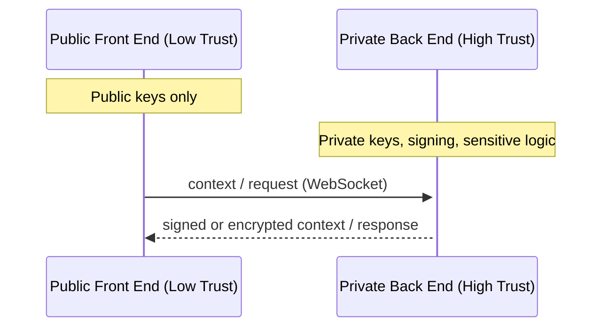
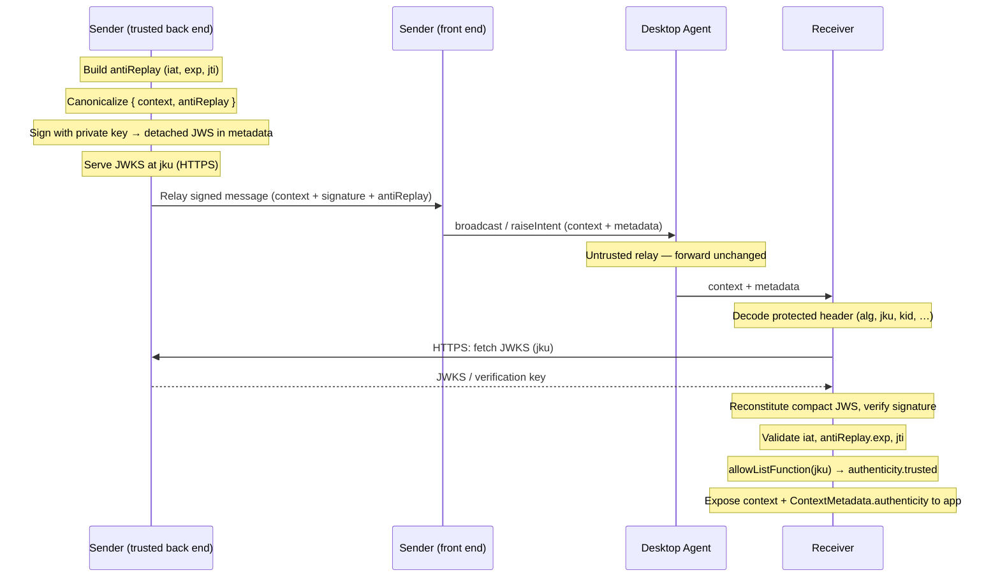
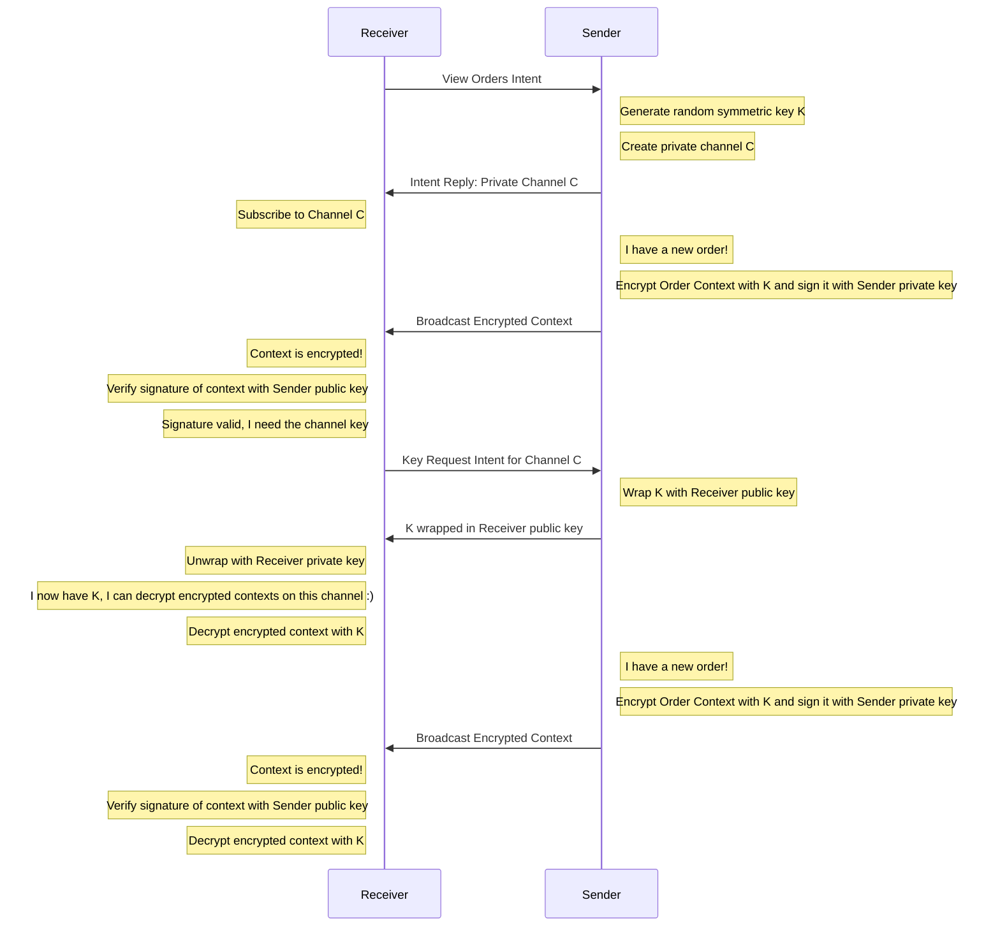
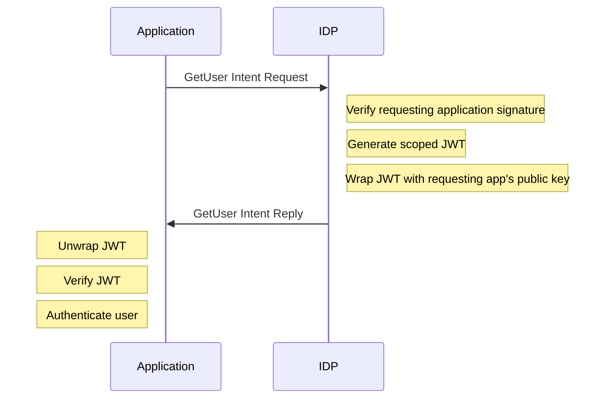

import Tabs from '@theme/Tabs';
import TabItem from '@theme/TabItem';

:::info _[@experimental](../fdc3-compliance#experimental-features)_

Security and Identity features are experimental additions to FDC3. Limited aspects of their design may change in future.

:::

As FDC3 evolves from desktop containers to web-based implementations, new security challenges arise in open, decentralized environments. This specification defines mechanisms for **application identity verification**, **encrypted communications**, and **user identity sharing** across FDC3-enabled applications.

## Overview

FDC3 Security addresses the following key challenges:

1. **Shift to Web**: Web environments are more hostile than controlled desktop containers, requiring robust identity verification
2. **App Identity**: Applications need verifiable identities to establish trust
3. **User Authentication**: Users need portable identity across heterogeneous applications  
4. **Data Integrity**: Context data requires authenticity guarantees
5. **Scalable Trust**: Moving beyond bilateral trust relationships to circles of trust

The security framework introduces:

- **Digital Signatures** for proving data authenticity and app identity
- **Encrypted Channels** for private communications
- **JWT-based User Identity** for portable authentication


### Context Types

The following context types support security features:

| Context Type | Description |
|-------------|-------------|
| [`fdc3.security.user`](../context/ref/security/User) | User identity with JWT |
| [`fdc3.security.userRequest`](../context/ref/security/UserRequest) | Request for user identity |
| [`fdc3.security.symmetricKeyRequest`](../context/ref/security/SymmetricKeyRequest) | Request for encryption key |
| [`fdc3.security.symmetricKeyResponse`](../context/ref/security/SymmetricKeyResponse) | Encryption key response |
| [`fdc3.security.encryptedContext`](../context/ref/security/EncryptedContextWrapper) | Encrypted context wrapper |

### Intents

| Intent | Input Context | Output Context | Description |
|--------|---------------|----------------|-------------|
| `GetUser` | `fdc3.security.userRequest` | `fdc3.security.user` | Request user identity from an IDP |

## Trust Boundaries

Web applications split into a _front end_ (browser) and _back end_ (server) because servers are trusted and can hold private keys safely. The FDC3 Security API therefore has public and private parts: the front end holds only public keys and delegates signing, verification, and sensitive logic to the back end. 

The diagram below shows how context and requests flow over a WebSocket (or similar secure boundary): the front end sends context or requests; the back end signs, processes, and returns signed context or responses.



:::tip 

### Security Implementations

The FDC3 Security implementations provides various helpers to make it easy to communicate across the boundary.

| Language                | Documentation   |
|-------------------------|-----------------|
| JavaScript / TypeScript | [README](https://github.com/finos/FDC3/blob/main/packages/fdc3-security/README.md) |

:::

### Public / Private Keys

To enable verification, applications publish their public keys at a stable HTTPS endpoint. The conventional location is `/.well-known/jwks.json` on the application's origin—a path established by [RFC 8615](https://datatracker.ietf.org/doc/html/rfc8615) for well-known URIs. The URL serves both as the key delivery mechanism and as an identifier for the publisher: the `jku` in a JWS header points to this endpoint so receivers know where to fetch the verification key.

:::note
Keys in the JWKS MUST include a `kid` (key ID) so signers can reference them in JWS headers and receivers can select the correct key for verification.
:::

1. Generate a public/private key pair
2. Publish the public key at an HTTPS endpoint as a [JSON Web Key Set (JWKS)](https://datatracker.ietf.org/doc/html/rfc7517).  The URL on which the JWKS identifies the entity of the publisher. 

### Key Management

- Private keys MUST be stored securely and never transmitted
- JWKS endpoints MUST be served over HTTPS with valid certificates
- Key rotation SHOULD be performed periodically
- Old keys SHOULD remain available for verification during transition periods
- Applications SHOULD log authentication and authorization decisions for audit
- Handle unsigned contexts gracefully with appropriate user prompts

## Trust Model

Trust is determined and enforced by applications, not by the Desktop Agent. Each application defines its own circle of trust. Desktop Agents are untrusted intermediaries: they route context and metadata but MUST NOT be relied upon for cryptographic operations or trust decisions. Application front-ends (browser contexts) are untrusted: private keys MUST NOT be sent to or stored in front-end code; signing and other sensitive operations MUST be performed in a trusted back-end.

### Trust Function

Receiving apps provide an `allowListFunction(jku, iss?)` when configuring their security implementation. This function determines whether a signer is trusted: given the signer's JWKS URL (`jku`) from the JWS header—and optionally the issuer (`iss`) for JWT verification—it returns `true` if the signer is in the receiver's circle of trust. When verifying a signature, the security layer sets `authenticity.trusted` to the result of this function, so apps can decide who they trust without bilateral configuration.

```typescript
// Example: allow list for three trusted apps
const TRUSTED_JWKS_URLS = new Set([
  'https://app-a.example.com/.well-known/jwks.json',
  'https://app-b.example.com/.well-known/jwks.json',
  'https://data-provider.example.com/.well-known/jwks.json',
]);

const allowListFunction = (jku: string, iss?: string): boolean => {
  // jku: JWKS URL from the signer's JWS/JWT header (where to fetch public keys)
  // iss: issuer claim from JWT payload (only passed when verifying JWT tokens, e.g. for user identity)
  return TRUSTED_JWKS_URLS.has(jku);
};
```

```typescript
// Example: using iss for JWT verification (e.g. user identity)
// Restrict which issuers are trusted per JWKS URL—useful when an IdP hosts multiple issuers
const TRUSTED_ISSUERS_BY_JKU: Record<string, Set<string>> = {
  'https://idp.example.com/.well-known/jwks.json': new Set(['https://idp.example.com', 'tenant-a.idp.example.com']),
  'https://enterprise-sso.corp.com/.well-known/jwks.json': new Set(['https://enterprise-sso.corp.com']),
};

const allowListFunction = (jku: string, iss?: string): boolean => {
  if (!TRUSTED_ISSUERS_BY_JKU[jku]) return false;
  // For detached JWS (context signing), iss is undefined—trust jku alone
  if (!iss) return true;
  return TRUSTED_ISSUERS_BY_JKU[jku].has(iss);
};
```

## App Identity and Signatures

### Signing Context Data

Applications can sign the context objects they broadcast using their private key. This allows receiving applications to verify:

1. **Origin**: Which application sent the data
2. **Integrity**: Whether the data was tampered with in transit

### Signature Metadata

When a context is signed, the signature is provided in metadata (via [`AppProvidableContextMetadata`](ref/Metadata#contextmetadata) on broadcast/raiseIntent, or [`ContextMetadata`](ref/Metadata#contextmetadata) when received), not on the context object itself.

| Context Metadata field | Description |
|------------------------|-------------|
| `signature` | The detached JWS (`protected` + `signature`) |
| `antiReplay` | Claims (`iat`, `exp`, `jti`) used for replay detection; must be included when signing |

### Flow Diagram



### Example

```typescript
// When broadcasting or raising an intent, include signature and antiReplay in metadata
channel.broadcast(
  { type: "fdc3.instrument", id: { ticker: "AAPL" } },
  {
    signature: {
      protected: "<base64url-encoded JWS protected header>",  // contains alg, jku, kid, iat, exp, jti
      signature: "<base64url-encoded digital signature>"
    },
    antiReplay: { iat: 1739692800, exp: 1739696100, jti: "unique-token-id" }
  }
);
```
### Generating The Signature

To generate a signature, the signer:

1. Creates `antiReplay` claims: `iat` (current time), `exp` (iat + validity window), and `jti` (random UUID).
2. Canonicalizes `{ context, antiReplay }` and signs it with the private key using [JOSE](https://github.com/panva/jose) (or any [JWS](https://datatracker.ietf.org/doc/html/rfc7515)-compliant library). Use `CompactSign` to produce a compact JWS; the protected header includes `alg`, `jku`, `kid`, and `iat`.
3. Extracts the detached form: the compact JWS (`header.payload.signature`) yields `protected` (header) and `signature`—the payload is omitted since the signed data is the context itself. Returns `{ protected, signature }` plus `antiReplay` in metadata.

### Signature Structure

The `signature` is a detached [JSON Web Signature (JWS)](https://datatracker.ietf.org/doc/html/rfc7515). The `protected` header, when base64url-decoded, contains:

| Header field | Description |
|--------------|-------------|
| `alg` | Signature algorithm (e.g., `EdDSA`) |
| `jku` | URL of the JWKS containing the public key for verification |
| `kid` | Key identifier within the JWKS |
| `iat` | Issued-at time (Unix timestamp), prevents replay |
| `exp` | Expiration time (Unix timestamp) |
| `jti` | Unique token ID for replay protection |

### Checking the Signature

To verify a signature, the receiver:

1. Extracts `alg`, `jku`, `kid`, and `iat` from the JWS protected header.
2. Resolves the public key from the `jku` JWKS URL (via a resolver or [JOSE](https://github.com/panva/jose) remote JWKS).
3. Reconstitutes the full JWS: canonicalizes `{ context, antiReplay }`, base64url-encodes it as the payload, and forms `header.payload.signature`. Uses `compactVerify` (or equivalent) to verify the signature.
4. Validates freshness (`iat`), context expiry (`antiReplay.exp`), and anti-replay claims (`jti`).
5. Populates the `authenticity` object in context metadata.

### Authenticity Metadata

When a signed context is received, the FDC3 security layer verifies the signature and populates the `authenticity` field in [`ContextMetadata`](ref/Metadata#contextmetadata):

```typescript
{
  authenticity: {
    signed: true,           // A signature was present
    valid: true,            // The signature cryptographically verified
    jku: "https://myapp.example.com/.well-known/jwks.json",
    trusted: true           // allowListFunction(jku) returned true
  }
}
```

Applications receiving context can check these fields to make trust decisions:

<Tabs groupId="lang">
<TabItem value="ts" label="TypeScript/JavaScript">

```ts
fdc3.addContextListener("fdc3.instrument", (context, metadata) => {
  const auth = metadata?.authenticity;

  if (!auth?.signed) {
    // No signature present - treat as untrusted
    console.warn("Received unsigned context");
    handleUntrustedContext(context);
  } else if (!auth.valid) {
    // Signature present but verification failed (tampered, stale, or bad key)
    console.warn("Signature verification failed", auth.errors);
    rejectContext(context);
  } else if (!auth.trusted) {
    console.warn(`Untrusted context from: ${auth.jku}`);
    promptUserForConfirmation(context, auth.jku);
  } else {   
    // this is trusted - continue without user intervention
    processVerifiedInstrument(context);
  }
});
```

</TabItem>
</Tabs>

## Encrypted Communications

### Private Channel Encryption

Applications communicating over a [`PrivateChannel`](ref/PrivateChannel) can negotiate encryption to ensure their communications remain confidential. This is particularly important when sharing sensitive data such as positions, pricing, or user information.

### Symmetric Key Exchange

Encryption uses a symmetric key (e.g. AES-GCM) created by the channel owner and distributed via [JWE](https://datatracker.ietf.org/doc/html/rfc7516). See [encrypted-private-channel-example.ts](pathname:///packages/fdc3-security/samples/encrypted-private-channel-example.ts) for a working flow.

**Key owner (broadcaster):** Creates and holds the symmetric key. Encrypts context payloads with it and broadcasts them as JWE in `encryptedPayload`. When a key request arrives, verifies the requestor's JWS (signature valid and `allowListFunction(jku)` returns true), reads `jku` from their JWS protected header, fetches their public key from that JWKS, wraps the symmetric key in a JWE using that public key (e.g. RSA-OAEP), signs the response with JWS, and broadcasts it.

**Key requestor (listener):** Broadcasts a signed key request (JWS). When the response arrives, verifies the JWS, unwraps the JWE with their private key to obtain the symmetric key, then decrypts subsequent encrypted payloads. If an encrypted message arrives before the key, the requestor sends a key request.

Both the key request and response **must be signed** (JWS). The key owner uses the requestor's `jku` from the JWS header to target the JWE—only that requestor's private key can unwrap it.

### Flow Diagram



#### Context Types

| Type | Description |
|------|-------------|
| [`fdc3.security.symmetricKeyRequest`](../context/ref/security/SymmetricKeyRequest) | Request for the channel symmetric key (optional `id.kid`). Must be signed. |
| [`fdc3.security.symmetricKeyResponse`](../context/ref/security/SymmetricKeyResponse) | Response containing `wrappedKey` (JWE) and `id.{kid,pki}`. Must be signed. |
| [`fdc3.security.encryptedContext`](../context/ref/security/EncryptedContextWrapper) | Wrapper with `encryptedPayload` (JWE); `originalType` and `id.kid` preserved for routing. |

**Examples:**

```typescript
// fdc3.security.symmetricKeyRequest (broadcast with metadata—must be signed)
channel.broadcast(
  { type: "fdc3.security.symmetricKeyRequest", id: { kid: "channel-key-abc123" } },
  {
    signature: { protected: "eyJhbGc...", signature: "TjDgrB6k..." },
    antiReplay: { iat: 1739692800, exp: 1739696100, jti: "req-uuid-123" }
  }
);

// fdc3.security.symmetricKeyResponse (broadcast with metadata—must be signed)
channel.broadcast(
  {
    type: "fdc3.security.symmetricKeyResponse",
    id: { kid: "key-id-123", pki: "https://requestor.example.com/.well-known/jwks.json" },
    wrappedKey: "u4jvA7Gx8LdH...=="  // JWE
  },
  {
    signature: { protected: "eyJhbGc...", signature: "a1b2c3d4..." },
    antiReplay: { iat: 1739692810, exp: 1739696110, jti: "resp-uuid-456" }
  }
);

// fdc3.security.encryptedContext (broadcast with metadata; typically signed)
channel.broadcast(
  {
    type: "fdc3.security.encryptedContext",
    originalType: "fdc3.instrument",
    id: { kid: "channel-key-abc123" },
    encryptedPayload: "eyJuYW1lIjoiQXBwbGUiLCJpZCI6eyJ0aWNrZXIiOiJBQVBMIn19..."  // JWE
  },
  {
    signature: { protected: "eyJhbGc...", signature: "e5f6g7h8..." },
    antiReplay: { iat: 1739692820, exp: 1739696120, jti: "ctx-uuid-789" }
  }
);
```

## User Identity

In a multi-app FDC3 environment, applications often need to know who the user is—for personalization, access control, audit trails, or to share session state across tools. Instead of each app authenticating the user separately, an **Identity Provider (IDP)** can issue a portable, verifiable identity that any trusted app can consume. The IDP signs a JWT containing user claims; receiving apps verify the signature and trust the identity. 

**Audience scoping** ensures each JWT is bound to a specific requesting application (`aud`), so if a token is intercepted, it cannot be reused by another app. This enables single sign-on (SSO) across FDC3 applications while keeping tokens narrowly scoped.

### The User Context Type

The [`fdc3.security.user`](../context/ref/security/User) context type represents a verified user identity:

```typescript
{
  type: "fdc3.security.user",
  wrappedJwt: "--some encrypted content --"
}
```

### JWT Token Structure

The `wrappedJwt` field contains a signed JSON Web Token.  Once you decrypt this with your application's private key, it will have the following structure:

**Header:**
```json
{
  "alg": "EdDSA",
  "jku": "https://idp.example.com/.well-known/jwks.json",
  "kid": "key-1"
}
```

**Payload:**
```json
{
  "iss": "https://idp.example.com",
  "sub": "john.doe@example.com",
  "aud": "https://requesting-app.example.com",
  "exp": 1739750400,
  "iat": 1739746800,
  "jti": "unique-token-id-123"
}
```

| Claim | Description |
|-------|-------------|
| `iss` | Issuer - the identity provider that created the token |
| `sub` | Subject - the user's unique identifier |
| `aud` | Audience - the specific application this token was issued for |
| `exp` | Expiration time (Unix timestamp) |
| `iat` | Issued at time (Unix timestamp) |
| `jti` | JWT ID - unique identifier for this token (replay prevention) |

The token is scoped to a specific application (`aud`) to prevent token reuse if leaked.

### Requesting User Identity

1. The requester raises the [`GetUser`](../intents/ref/GetUser.md) intent with a signed [`fdc3.security.userRequest`](../context/ref/security/UserRequest) context. The context includes an `aud` field (the audience claim for the returned JWT—typically the requesting app's URL). The request must be signed to prevent forgery by third parties.

2. The IDP verifies the requester's signature on the request.

3. The IDP creates a JWT containing the claims described above, scoped to the requested audience.

4. The IDP wraps the JWT with the requester's public key and returns the `fdc3.security.user` context as the intent result.

5. The requester decrypts the wrapped JWT with their private key and verifies the JWT signature using the IDP's public keys (from `{idpBaseUrl}/.well-known/jwks.json`). It also verifies expiry and must verify that the `jti` has not been used recently (i.e. in the expiry window)



### Token Security

- JWT tokens are scoped to specific audiences to prevent misuse if leaked
- Short expiration times reduce the window for token theft attacks
- Unique token identifiers (jti) must be used to prevent token theft attacks
- Tokens SHOULD be transmitted over encrypted channels when possible

## Desktop Agent Requirements

No changes are expected of Desktop Agents to work with security - just that they pass on context and metadata untampered-with.
