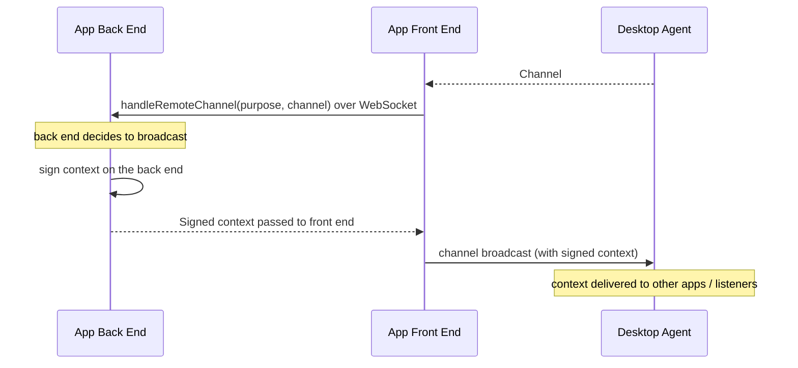
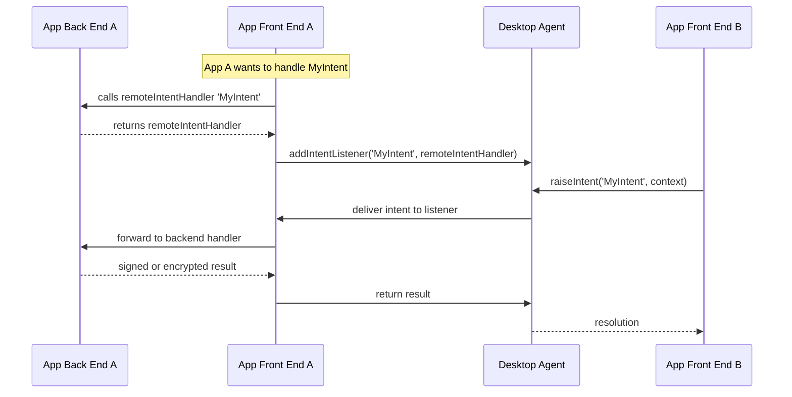
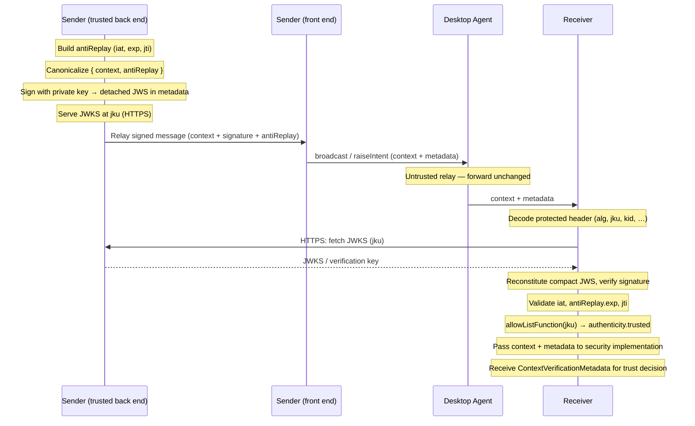
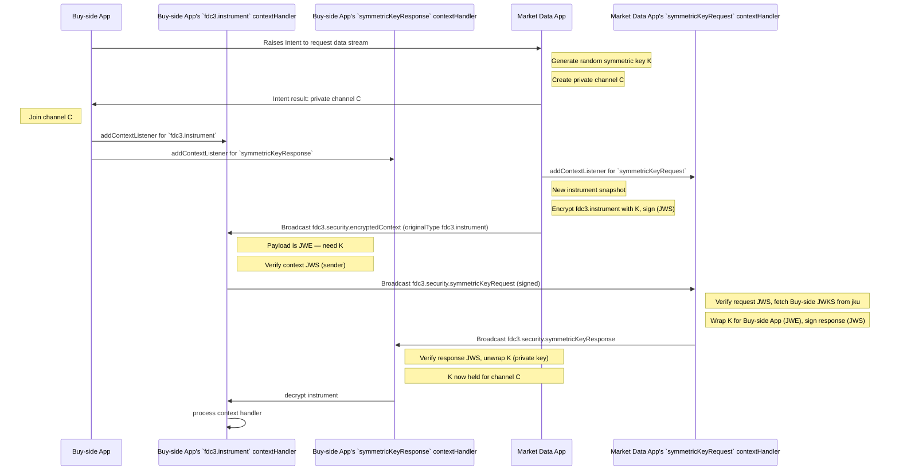
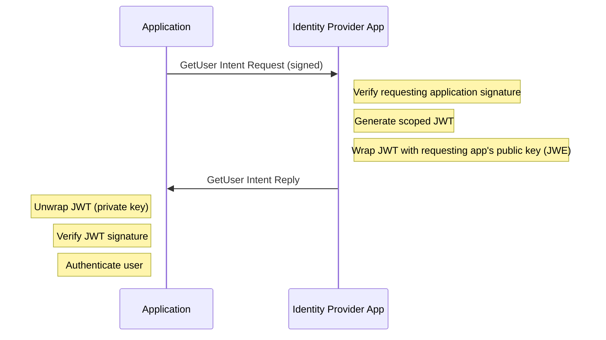

import Tabs from '@theme/Tabs';
import TabItem from '@theme/TabItem';

:::info _[@experimental](../fdc3-compliance#experimental-features)_

Security and Identity features are experimental additions to FDC3. Limited aspects of their design may change in future.

:::

As FDC3 evolves from desktop containers to web-based implementations, new security challenges arise in open, decentralized environments. This specification defines mechanisms for **application identity verification**, **encrypted communications**, and **user identity sharing** across FDC3-enabled applications.

The security model is built on **asymmetric cryptography**: each participating application holds a private key (kept secret) and publishes a corresponding public key at a stable HTTPS endpoint. Other applications use that public key to verify the application's digital signatures and to encrypt data that only it can read. All cryptographic operations that involve a private key MUST be performed in a trusted backend (server), not in the browser frontend.

## Overview

FDC3 Security addresses the following key challenges:

1. **Shift to Web**: Web environments are more hostile than controlled desktop containers, requiring robust identity verification
2. **App Identity**: Applications need verifiable identities to establish trust
3. **User Authentication**: Users need portable identity across heterogeneous applications  
4. **Data Integrity**: Context data requires authenticity guarantees
5. **Scalable Trust**: Moving beyond bilateral trust relationships to independently maintained allowlists

The security framework introduces:

- **Digital Signatures** for proving data authenticity and app identity
- **Encrypted Channels** for private communications
- **JWT-based User Identity** for portable authentication


### Context Types

The following context types support security features:

| Context Type | Description |
|-------------|-------------|
| [`fdc3.security.user`](../context/ref/security/User) | User identity with JWT |
| [`fdc3.security.userRequest`](../context/ref/security/UserRequest) | Request for user identity |
| [`fdc3.security.symmetricKeyRequest`](../context/ref/security/SymmetricKeyRequest) | Request for encryption key |
| [`fdc3.security.symmetricKeyResponse`](../context/ref/security/SymmetricKeyResponse) | Encryption key response |
| [`fdc3.security.encryptedContext`](../context/ref/security/EncryptedContextWrapper) | Encrypted context wrapper |

### Intents

| Intent | Input Context | Output Context | Description |
|--------|---------------|----------------|-------------|
| `GetUser` | `fdc3.security.userRequest` | `fdc3.security.user` | Request user identity from an identity provider app |

## Desktop Agent Requirements

Desktop Agents MUST forward context objects and their associated metadata to receiving applications without modification. Desktop Agents MUST NOT inspect, strip, or alter `signature`, `antiReplay`, or any other security-related metadata fields. The security model defined in this document relies on this guarantee: cryptographic verification is performed end-to-end between applications, not by the Desktop Agent.

## Trusted Backend Contract

Web applications are split into a *front end* (browser context) and a *back end* (server). Because servers can hold private keys securely, all cryptographic operations — signing, key generation, decryption — MUST be performed in the trusted backend. The frontend holds only public keys and delegates sensitive operations to the backend over a secure channel (e.g. a WebSocket).

The contract between the frontend and backend is application-defined, but must cover at minimum:

- Signing outbound context objects
- Generating or holding symmetric encryption keys
- Unwrapping JWE-wrapped keys received from other applications

:::tip Reference implementation

`@finos/fdc3-security` provides `FDC3Handlers` (a TypeScript interface) and matching `ClientSideHandlersImpl` / `ServerSideHandlersImpl` helpers that implement this pattern over a WebSocket. See the [README](https://github.com/finos/FDC3/blob/main/packages/fdc3-security/README.md) for details.

| Language                | Documentation   |
|-------------------------|-----------------|
| JavaScript / TypeScript | [README](https://github.com/finos/FDC3/blob/main/packages/fdc3-security/README.md) |

Runnable example apps that demonstrate the trusted backend pattern:

| App | What it shows |
|-----|---------------|
| [`signed-sender`](https://github.com/finos/FDC3/tree/main/toolbox/fdc3-example-apps/server-apps/signed-sender) | Backend signs `fdc3.instrument` via `BasicSignedBroadcaster`; frontend calls `handleRemoteChannel` to share the channel with the server |
| [`signed-receiver`](https://github.com/finos/FDC3/tree/main/toolbox/fdc3-example-apps/server-apps/signed-receiver) | Frontend delegates key requests over WebSocket; signature verification runs in the browser against JWKS fetched from the sender |
| [`encrypted-channel-sender`](https://github.com/finos/FDC3/tree/main/toolbox/fdc3-example-apps/server-apps/encrypted-channel-sender) | Symmetric key is created in the browser; backend exposes only a JWKS endpoint and a secure-boundary unwrap helper |
| [`encrypted-channel-receiver`](https://github.com/finos/FDC3/tree/main/toolbox/fdc3-example-apps/server-apps/encrypted-channel-receiver) | Backend unwraps the symmetric key and signs key requests; frontend holds the unwrapped key for low-latency decryption (frontend-key pattern) |

:::

### `FDC3Handlers`

[`FDC3Handlers`](https://github.com/finos/FDC3/blob/main/packages/fdc3-security/src/secure-boundary/FDC3Handlers.ts) is the contract the trusted backend implements in the `@finos/fdc3-security` reference implementation. This enables the front-end part of your application to get contexts signed, generate encryption keys or deal with any secure operations that might involve the application's private key or sensitive data.

:::tip

It is not a requirement for applications to use this code, but it is provided to simplify the efforts required to export the parts of FDC3 functionality your app needs to run in a "high-trust" environment onto the server side.  


:::

<Tabs groupId="fdc3-handlers-lang">
<TabItem value="js-backend" label="JavaScript FDC3Handlers">

```typescript
/**
 * Contract for **application** code that must run in a high-trust environment (private keys,
 * JWS/JWE, symmetric key material).
 *
 * Two library modules implement opposite sides of the same wire protocol:
 *
 * - **`ClientSideHandlersImpl`** — Implements `FDC3Handlers` on the **low-trust** side as a
 *   remote stub. {@link connectRemoteHandlers} constructs it over a WebSocket.
 *
 * - **`ServerSideHandlersImpl`** — `setupWebsocketServer` takes an application-provided
 *   implementation of `FDC3Handlers` to run on the **high-trust** server side.
 *
 */
export interface FDC3Handlers {
  /**
   * Called on the client so that the server has a version of the channel to which it can attach
   * listeners and broadcast from the **high-trust** part of the application. This means you can attach
   * signing or encryption helpers that need private keys.
   *
   * **Samples**
   * - `signing-broadcast-example.ts` — shows how you can wrap the channel on the server side with
   *   `BasicSignedBroadcaster` so every broadcast is JWS-signed on the server.
   * - `backend-encrypted-channel-example.ts` — shows how you can use `EncryptedBroadcastSupport` to
   *   encrypt context on the backend and send across FDC3.
   *
   * @param purpose — Allows the client to tell the server the purpose for which it is sharing the
   *   channel. This is up to applications to define and use.
   * @param channel — Proxy `Channel`/`PrivateChannel` bridged from the client agent.
   */
  handleRemoteChannel(purpose: string, channel: Channel): Promise<void>;

  /**
   * Called on the client so that the server can provide the real `IntentHandler` for a given intent
   * name. You `await handlers.remoteIntentHandler(intent)` once to register; every later call with
   * `(context, metadata)` runs on the **high-trust** side over the WebSocket.
   *
   * **Samples**
   * - `get-user-example.ts` — shows how you can handle `GetUser`: take
   *   `fdc3.security.userRequest`, mint a JWT, build `fdc3.security.user`, encrypt for the requestor's
   *   JWKS, and return `fdc3.security.encryptedContext`.
   * - `signing-intent-example.ts` — shows how you can wire `DataTransfer` with
   *   `PublicSignatureCheckingHandlerSupport` and `PrivateSignedIntentResultSupport` so the handler
   *   verifies the raiser's JWS and signs the response (the raiser signs its outbound context via
   *   `exchangeData` instead of holding the private key in the browser).
   * - `backend-encrypted-channel-example.ts` — shows how you can handle `ShareEncryptedChannel` by
   *   returning `PRIVATE_CHANNEL_SIGNAL` so the client opens a private channel and calls
   *   `handleRemoteChannel`, then runs `EncryptedBroadcastSupport` on the server.
   *
   * @param intent — The intent name the server should bind (must match the client's
   *   `remoteIntentHandler` calls).
   */
  remoteIntentHandler(intent: string): Promise<BackendIntentHandler>;

  /**
   * A convenience function. Called on the client so that the server can return it items of data it needs. The client calls
   * `handlers.exchangeData(purpose, o)`; the server returns an object or `void`. Use stable `purpose`
   * strings so both sides agree on the payload shape.
   *
   * **Samples**
   * - `signing-intent-example.ts` — shows how you can implement `sign-context` when raising an intent so the browser
   *   never sees the private key.
   * - `frontend-encrypted-channel-example.ts` — shows how you can implement `sign-context` and
   *   `unwrap-symmetric-key` on the receiver backend so key-request signing and symmetric-key
   *   unwrapping stay off the frontend (`fdc3.security.symmetricKeyResponse` in, unwrapped JWK out).
   * - `get-user-example.ts` — also implements `get-user-identity` on the requesting backend so JWE decryption,
   *   JWT verification, and projection to `fdc3.contact` stay server-side (the JWT never reaches the client).
   *
   * @param purpose — Tells the server which operation this call represents; defined by your app.
   * @param o — The payload for that operation (for example `{ context }` or an object compatible with
   *   `fdc3.security.symmetricKeyResponse`).
   */
  exchangeData(purpose: string, o: object): Promise<object | void>;
}
```

#### Example 1: Bridging a channel with `handleRemoteChannel`

The front end keeps the live `Channel` from the Desktop Agent; `handleRemoteChannel` mirrors it to the back end so signing can run where private keys live. Broadcasts initiated on the server flow through the proxy to the real channel.



#### Example 2: Resolving intents with `remoteIntentHandler`

App A registers an intent listener in the browser using a handler obtained from its back end. When App B raises the intent, the Desktop Agent delivers it to App A's front end, which forwards handling to **App Back End A** and returns the result.



</TabItem>
</Tabs>

:::tip Reference implementation samples
Working samples (signed broadcasts, encrypted channels, identity, intents) live under [`packages/fdc3-security/samples/`](https://github.com/finos/FDC3/tree/main/packages/fdc3-security/samples).

Runnable example apps demonstrating the full trusted backend contract end-to-end:

| App | What it shows |
|-----|---------------|
| [`signed-sender`](https://github.com/finos/FDC3/tree/main/toolbox/fdc3-example-apps/server-apps/signed-sender) | `handleRemoteChannel` + `BasicSignedBroadcaster` — signing on the server, broadcasting from the frontend |
| [`signed-receiver`](https://github.com/finos/FDC3/tree/main/toolbox/fdc3-example-apps/server-apps/signed-receiver) | `exchangeData` for key requests — keeping private-key operations off the frontend |
| [`encrypted-channel-sender`](https://github.com/finos/FDC3/tree/main/toolbox/fdc3-example-apps/server-apps/encrypted-channel-sender) | `EncryptedBroadcastSupport` wired through `FDC3Handlers` |
| [`encrypted-channel-receiver`](https://github.com/finos/FDC3/tree/main/toolbox/fdc3-example-apps/server-apps/encrypted-channel-receiver) | `exchangeData` for `sign-context` and `unwrap-symmetric-key` |
| [`security-demo-app1`](https://github.com/finos/FDC3/tree/main/toolbox/fdc3-example-apps/server-apps/security-demo-app1) | `remoteIntentHandler` + `handleRemoteChannel` for the full buy-side security flow |
| [`security-demo-app2`](https://github.com/finos/FDC3/tree/main/toolbox/fdc3-example-apps/server-apps/security-demo-app2) | `remoteIntentHandler` — intent handling and private-channel encryption on the server |
| [`security-demo-idp-app`](https://github.com/finos/FDC3/tree/main/toolbox/fdc3-example-apps/server-apps/security-demo-idp-app) | `remoteIntentHandler` for `GetUser` — JWT minting, JWE wrapping, and `fdc3.security.encryptedContext` response |
:::

### Public / Private Keys

To participate in the FDC3 security model, an application needs a public/private key pair. The private key is used to sign outbound context objects and to decrypt data encrypted for this application by others. The public key is shared so that other applications can verify signatures and encrypt data that only this application can read.

To enable verification, applications publish their public keys at a stable HTTPS endpoint. The conventional location is `/.well-known/jwks.json` on the application's origin—a path established by [RFC 8615](https://datatracker.ietf.org/doc/html/rfc8615) for well-known URIs. The URL serves both as the key delivery mechanism and as an identifier for the publisher: the `jku` in a JWS header points to this endpoint so receivers know where to fetch the verification key.

:::note
Keys in the JWKS MUST include a `kid` (key ID) so signers can reference them in JWS headers and receivers can select the correct key for verification.
:::

To participate in the FDC3 security model, an application should:

1. Generate a public/private key pair.
2. Publish the public key at an HTTPS endpoint as a [JSON Web Key Set (JWKS)](https://datatracker.ietf.org/doc/html/rfc7517). The URL at which the JWKS is served identifies the entity of the publisher.

### Key Management

Applications participating in the FDC3 security model are responsible for the following key management practices:

- Private keys MUST be stored securely and never transmitted
- JWKS endpoints MUST be served over HTTPS with valid certificates
- Key rotation SHOULD be performed periodically
- Old keys SHOULD remain available for verification during transition periods
- Applications SHOULD log authentication and authorization decisions for audit
- Handle unsigned contexts gracefully with appropriate user prompts

## Trust Model

In this context, *trust* means that a receiving application has decided that a particular sender's identity claims and signed data are credible and should be acted upon. Trust is determined and enforced by applications, not by the Desktop Agent. Each application independently maintains an allowlist of senders it trusts. Desktop Agents are untrusted intermediaries: they route context and metadata but MUST NOT be relied upon for cryptographic operations or trust decisions. Application front-ends (browser contexts) are untrusted: private keys MUST NOT be sent to or stored in front-end code; signing and other sensitive operations MUST be performed in a trusted back-end.

### Trust Function

Receiving applications define an allowlist of trusted senders — other applications whose signed data they are willing to accept. Each application independently decides which senders it trusts; there is no shared membership mechanism. Given the signer's JWKS URL (`jku`) from the JWS header — and optionally the issuer (`iss`) for JWT verification — the allowlist function returns `true` if the signer is trusted. When verifying a signature, the receiving application's security implementation sets `authenticity.trusted` to the result of this function.

:::tip Example implementation

The `@finos/fdc3-security` library supports an `allowListFunction(jku, iss?)` callback when configuring signature verification. The following are example implementations:

```typescript
/**
 * Determines whether a signing application is trusted by this application.
 * @param jku - The JWKS URL from the signer's JWS protected header, identifying the signer.
 * @param iss - The issuer claim from a JWT payload; only present when verifying user identity tokens.
 * @returns true if the signer should be trusted; false otherwise.
 */
const allowListFunction = (jku: string, iss?: string): boolean => {
  return TRUSTED_JWKS_URLS.has(jku);
};

// Example: allow list for three trusted apps
const TRUSTED_JWKS_URLS = new Set([
  'https://app-a.example.com/.well-known/jwks.json',
  'https://app-b.example.com/.well-known/jwks.json',
  'https://data-provider.example.com/.well-known/jwks.json',
]);
```

```typescript
/**
 * Determines whether a signing application is trusted, with per-issuer restrictions.
 * @param jku - The JWKS URL from the signer's JWS protected header, identifying the signer.
 * @param iss - The issuer claim from a JWT payload; only present when verifying user identity tokens.
 * @returns true if the signer should be trusted; false otherwise.
 */
const allowListFunction = (jku: string, iss?: string): boolean => {
  // Example: using iss for JWT verification (e.g. user identity)
  // Restrict which issuers are trusted per JWKS URL—useful when an identity provider app hosts multiple issuers
  if (!TRUSTED_ISSUERS_BY_JKU[jku]) return false;
  // For detached JWS (context signing), iss is undefined—trust jku alone
  if (!iss) return true;
  return TRUSTED_ISSUERS_BY_JKU[jku].has(iss);
};

const TRUSTED_ISSUERS_BY_JKU: Record<string, Set<string>> = {
  'https://idp.example.com/.well-known/jwks.json': new Set(['https://idp.example.com', 'tenant-a.idp.example.com']),
  'https://enterprise-sso.corp.com/.well-known/jwks.json': new Set(['https://enterprise-sso.corp.com']),
};
```

:::

## App Identity and Signatures

### Signing Context Data

Applications can sign the context objects they broadcast using their private key. This allows receiving applications to verify:

1. **Origin**: Which application sent the data
2. **Integrity**: Whether the data was tampered with in transit

### Signature Metadata

When signing a context, the sender includes the `signature` and `antiReplay` fields in the `metadata` parameter passed to `broadcast()` or `raiseIntent()` (typed as [`AppProvidableContextMetadata`](ref/Metadata#appprovidablecontextmetadata)). The signature is therefore carried separately from the context object itself. When a receiving application's [`ContextHandler`](ref/Types#contexthandler) or [`IntentHandler`](ref/Types#intenthandler) is invoked, those fields are present in the [`ContextMetadata`](ref/Metadata#contextmetadata) argument alongside the Desktop Agent-provided `source` field.

| Context Metadata field | Description |
|------------------------|-------------|
| `signature` | The detached JWS (`protected` + `signature`) |
| `antiReplay` | Claims (`iat`, `exp`, `jti`) used for replay detection; must be included when signing |

### Signature Structure

The `signature` is a detached [JSON Web Signature (JWS)](https://datatracker.ietf.org/doc/html/rfc7515). The `protected` header, when base64url-decoded, contains:

| Header field | Description |
|--------------|-------------|
| `alg` | Signature algorithm (e.g., `EdDSA`) |
| `jku` | URL of the JWKS containing the public key for verification |
| `kid` | Key identifier within the JWKS |
| `iat` | Issued-at time (Unix timestamp), prevents replay |
| `exp` | Expiration time (Unix timestamp) |
| `jti` | Unique token ID for replay protection |

### Generating The Signature

To generate a signature, the signer:

1. Creates `antiReplay` claims: `iat` (current time), `exp` (iat + validity window), and `jti` (random UUID).
2. Canonicalizes `{ context, antiReplay }` and signs it with the private key using [JOSE](https://github.com/panva/jose) (or any [JWS](https://datatracker.ietf.org/doc/html/rfc7515)-compliant library). Use `CompactSign` to produce a compact JWS; the protected header includes `alg`, `jku`, `kid`, and `iat`.
3. Extracts the detached form: the compact JWS (`header.payload.signature`) yields `protected` (header) and `signature`—the payload is omitted since the signed data is the context itself. Returns `{ protected, signature }` plus `antiReplay` in metadata.

### Flow Diagram



### Example

```typescript
// When broadcasting or raising an intent, include signature and antiReplay in metadata
channel.broadcast(
  { type: "fdc3.instrument", id: { ticker: "AAPL" } },
  {
    signature: {
      protected: "<base64url-encoded JWS protected header>",  // contains alg, jku, kid, iat, exp, jti
      signature: "<base64url-encoded digital signature>"
    },
    antiReplay: { iat: 1739692800, exp: 1739696100, jti: "unique-token-id" }
  }
);
```

### Checking the Signature

To verify a signature, the receiver:

1. Extracts `alg`, `jku`, `kid`, and `iat` from the JWS protected header.
2. Resolves the public key from the `jku` JWKS URL (via a resolver or [JOSE](https://github.com/panva/jose) remote JWKS).
3. Reconstitutes the full JWS: canonicalizes `{ context, antiReplay }`, base64url-encodes it as the payload, and forms `header.payload.signature`. Uses `compactVerify` (or equivalent) to verify the signature.
4. Validates freshness (`iat`), context expiry (`antiReplay.exp`), and anti-replay claims (`jti`).
5. Returns an authenticity result object for the application to use in trust decisions.

### Authenticity Metadata

After receiving a signed context, the application passes the received [`ContextMetadata`](ref/Metadata#contextmetadata) to its security implementation's verification function. That function returns a `ContextVerificationMetadata` object (exported from `@finos/fdc3-security`) containing the outcome of signature verification:

```typescript
{
  authenticity: {
    signed: true,           // A signature was present
    valid: true,            // The signature cryptographically verified
    jku: "https://myapp.example.com/.well-known/jwks.json",
    trusted: true           // allowListFunction(jku) returned true
  }
}
```

Applications can check these fields to make trust decisions:

<Tabs groupId="lang">
<TabItem value="ts" label="TypeScript/JavaScript">

```ts
fdc3.addContextListener("fdc3.instrument", (context, metadata) => {
  const verification = securityImpl.verify(metadata);
  const auth = verification?.authenticity;

  if (!auth?.signed) {
    // No signature present - treat as untrusted
    console.warn("Received unsigned context");
    handleUntrustedContext(context);
  } else if (!auth.valid) {
    // Signature present but verification failed (tampered, stale, or bad key)
    console.warn("Signature verification failed", auth.errors);
    rejectContext(context);
  } else if (!auth.trusted) {
    console.warn(`Untrusted context from: ${auth.jku}`);
    promptUserForConfirmation(context, auth.jku);
  } else {   
    // this is trusted - continue without user intervention
    processVerifiedInstrument(context);
  }
});
```

</TabItem>
</Tabs>

:::tip Reference implementation samples

| Sample | What it shows |
|--------|---------------|
| [`signing-broadcast-example.ts`](https://github.com/finos/FDC3/blob/main/packages/fdc3-security/samples/signing-broadcast-example.ts) | Signing and verifying a broadcast: `BasicSignedBroadcaster` on the sender's backend, `PublicSignatureCheckingHandlerSupport` on the receiver's frontend |
| [`signing-intent-example.ts`](https://github.com/finos/FDC3/blob/main/packages/fdc3-security/samples/signing-intent-example.ts) | Mutual authentication for intents: raiser signs the request via `BasicSignedRaiseIntentSupport`, handler verifies and signs the response via `PrivateSignedIntentResultSupport` |

| App | What it shows |
|-----|---------------|
| [`signed-sender`](https://github.com/finos/FDC3/tree/main/toolbox/fdc3-example-apps/server-apps/signed-sender) | Signs `fdc3.instrument` on the backend with `BasicSignedBroadcaster` and broadcasts on the user channel |
| [`signed-receiver`](https://github.com/finos/FDC3/tree/main/toolbox/fdc3-example-apps/server-apps/signed-receiver) | Verifies incoming signatures with `PublicSignatureCheckingHandlerSupport`; rejects contexts that fail |
| [`security-demo-app1`](https://github.com/finos/FDC3/tree/main/toolbox/fdc3-example-apps/server-apps/security-demo-app1) | Signs an `fdc3.instrument` on the backend before raising `demo.GetPrices` |
| [`security-demo-app2`](https://github.com/finos/FDC3/tree/main/toolbox/fdc3-example-apps/server-apps/security-demo-app2) | Verifies the inbound `fdc3.instrument` signature before returning the private channel |
:::

## Encrypted Communications

While digital signatures prove *who* sent a message, they do not prevent the Desktop Agent or other intermediaries from reading it. To keep context data confidential, applications can encrypt messages so that only the intended recipient can decrypt them.

FDC3 encrypted communications use a **symmetric key** (e.g. AES-GCM) to encrypt the data stream. The key itself is distributed securely using asymmetric cryptography: the broadcaster wraps it in a [JSON Web Encryption (JWE)](https://datatracker.ietf.org/doc/html/rfc7516) token addressed to the recipient's public key, so only the recipient — holding the corresponding private key — can unwrap it. Both the key request and key response **MUST be signed** (JWS) so each party can verify the other's identity before exchanging key material.

Encrypted messages are wrapped in [`fdc3.security.encryptedContext`](../context/ref/security/EncryptedContextWrapper), which preserves `originalType` for routing and stores the encrypted payload as a JWE compact serialization in `encryptedPayload`.

### Why Symmetric Encryption?

Encrypting every message directly with the recipient's asymmetric public key is computationally expensive and impractical for a stream of context messages. The approach used here mirrors TLS: asymmetric cryptography is used once to securely exchange a symmetric key, then the much cheaper symmetric cipher encrypts the data stream itself.

### Symmetric Key Exchange Protocol

The key exchange is driven reactively: the broadcaster starts encrypting and broadcasting immediately. When the receiver encounters a message it cannot decrypt, it broadcasts a signed [`fdc3.security.symmetricKeyRequest`](../context/ref/security/SymmetricKeyRequest). The broadcaster verifies the request signature, wraps the symmetric key as a JWE addressed to the requestor's public key (`jku` from their JWS header), signs the response, and broadcasts the [`fdc3.security.symmetricKeyResponse`](../context/ref/security/SymmetricKeyResponse). The receiver verifies the response JWS, unwraps the JWE with its private key, and decrypts any buffered messages.

**Broadcaster responsibilities:**

- Creates and holds the symmetric key.
- Encrypts context payloads and broadcasts them as `fdc3.security.encryptedContext`. The `originalType` field preserves the original context type for routing; `id.kid` identifies the symmetric key.
- When a `symmetricKeyRequest` arrives: verifies the requestor's JWS, reads `jku` from their JWS protected header to fetch their public key, wraps the symmetric key in a JWE using that public key (e.g. RSA-OAEP), signs the response, and broadcasts it.

**Receiver responsibilities:**

- Listens for `fdc3.security.encryptedContext` (checking `type` before dispatching to the appropriate handler).
- On receiving an encrypted message without a key: broadcasts a signed `symmetricKeyRequest`.
- On receiving the `symmetricKeyResponse`: verifies the JWS, unwraps the JWE to obtain the symmetric key, and decrypts any buffered messages.

### Where Should the Symmetric Key Live?

Once the key has been unwrapped, the receiver must decide whether to hold it in the browser frontend or only in the trusted backend. This is a trade-off between latency and threat model:

**Frontend key (lower latency):** The unwrapping operation happens once on the backend (the only step requiring the private key), and the unwrapped symmetric key is returned to the frontend. All subsequent message decryption happens in the browser using the cheap symmetric cipher, with no per-message backend round-trip. This mirrors the TLS pattern most closely and is the right choice when the browser is considered a sufficiently trusted environment for a short-lived session key.

**Backend key (stricter boundary):** The symmetric key never leaves the backend. Every received message is forwarded from the frontend to the backend for decryption, and the plaintext is returned to the frontend. This adds a per-message WebSocket round-trip, which largely offsets the latency advantage of symmetric encryption. However, it is the correct choice when the threat model requires that decrypted plaintext *never* exists in browser memory — for example, when handling highly regulated data or when the browser environment itself is not considered trusted.

Both patterns use exactly the same key exchange protocol. The choice affects only what happens to the key after it is unwrapped.

### Flow Diagram



#### Context Types

| Type | Description |
|------|-------------|
| [`fdc3.security.symmetricKeyRequest`](../context/ref/security/SymmetricKeyRequest) | Request for the channel symmetric key (optional `id.kid`). MUST be signed. |
| [`fdc3.security.symmetricKeyResponse`](../context/ref/security/SymmetricKeyResponse) | Response containing `wrappedKey` (JWE) and `id.{kid,pki}`. MUST be signed. |
| [`fdc3.security.encryptedContext`](../context/ref/security/EncryptedContextWrapper) | Wrapper with `encryptedPayload` (JWE compact serialization); `originalType` and `id.kid` preserved for routing. |

:::tip Reference implementation samples

| Sample | What it shows |
|--------|---------------|
| [`backend-encrypted-channel-example.ts`](https://github.com/finos/FDC3/blob/main/packages/fdc3-security/samples/backend-encrypted-channel-example.ts) | **Backend key** — the symmetric key is held entirely on both apps' backends. Every message decryption incurs a backend round-trip. Use this pattern when decrypted plaintext must never exist in browser memory |
| [`frontend-encrypted-channel-example.ts`](https://github.com/finos/FDC3/blob/main/packages/fdc3-security/samples/frontend-encrypted-channel-example.ts) | **Frontend key** — the symmetric key is unwrapped once on the receiving app's backend, then returned to the frontend for low-latency per-message decryption. Use this pattern when the browser is a sufficiently trusted environment for a short-lived session key |

| App | What it shows |
|-----|---------------|
| [`encrypted-channel-sender`](https://github.com/finos/FDC3/tree/main/toolbox/fdc3-example-apps/server-apps/encrypted-channel-sender) | **Frontend key** — `EncryptedBroadcastSupport` with the symmetric key held in the browser; backend only handles JWKS and secure-boundary unwrapping |
| [`encrypted-channel-receiver`](https://github.com/finos/FDC3/tree/main/toolbox/fdc3-example-apps/server-apps/encrypted-channel-receiver) | **Frontend key** — backend unwraps the symmetric key once via `exchangeData('unwrap-symmetric-key')`; frontend decrypts each message directly |
| [`security-demo-app1`](https://github.com/finos/FDC3/tree/main/toolbox/fdc3-example-apps/server-apps/security-demo-app1) | Receives encrypted `fdc3.valuation` snapshots over a private channel obtained from `demo.GetPrices` |
| [`security-demo-app2`](https://github.com/finos/FDC3/tree/main/toolbox/fdc3-example-apps/server-apps/security-demo-app2) | Broadcasts encrypted `fdc3.valuation` snapshots over the private channel using `EncryptedBroadcastSupport` |
:::

## User Identity

In a multi-app FDC3 environment, applications often need to know who the user is—for personalization, access control, audit trails, or to share session state across tools. Instead of each app authenticating the user separately, an **identity provider app** — an FDC3 application with the ability to authenticate the current user and issue signed identity tokens (not to be confused with an OAuth 2.0 / OIDC identity provider; no redirect flows or token endpoints are involved) — can issue a portable, verifiable identity that any trusted app can consume. The identity provider app signs a JWT containing user claims; receiving apps verify the signature and trust the identity.

**Audience scoping** ensures each JWT is bound to a specific requesting application via the `aud` (audience) claim — a standard JWT field ([RFC 7519 §4.1.3](https://datatracker.ietf.org/doc/html/rfc7519#section-4.1.3)) that identifies the intended recipient of the token. By setting `aud` to the requesting application's URL, the token cannot be reused by a different application even if intercepted. This enables single sign-on (SSO) across FDC3 applications while keeping tokens narrowly scoped.

### The User Context Type

The [`fdc3.security.user`](../context/ref/security/User) context type carries a verified user identity. The `wrappedJwt` field contains a JWT that has been encrypted (wrapped as a JWE) using the *requesting application's public key*, so that only the requesting application — which holds the corresponding private key — can decrypt and read it. This prevents the token from being read by the Desktop Agent or any other application that may observe the intent result.

```typescript
{
  type: "fdc3.security.user",
  wrappedJwt: "<JWE-wrapped JWT — decrypt with your application's private key>"
}
```

### JWT Token Structure

The `wrappedJwt` field, once decrypted with the application's private key, contains a signed JSON Web Token with the following structure:

**Header:**
```json
{
  "alg": "EdDSA",
  "jku": "https://idp.example.com/.well-known/jwks.json",
  "kid": "key-1"
}
```

**Payload:**
```json
{
  "iss": "https://idp.example.com",
  "sub": "john.doe@example.com",
  "aud": "https://requesting-app.example.com",
  "exp": 1739750400,
  "iat": 1739746800,
  "jti": "unique-token-id-123"
}
```

| Claim | Description |
|-------|-------------|
| `iss` | Issuer - the identity provider app that created the token |
| `sub` | Subject - the user's unique identifier |
| `aud` | Audience - the URL of the application this token was issued for |
| `exp` | Expiration time (Unix epoch seconds — see note below) |
| `iat` | Issued at time (Unix epoch seconds — see note below) |
| `jti` | JWT ID - unique identifier for this token (replay prevention) |

:::note
`exp` and `iat` use Unix epoch seconds (NumericDate as defined in [RFC 7519](https://datatracker.ietf.org/doc/html/rfc7519)), rather than the ISO 8601 format used elsewhere in FDC3. This is mandated by the JWT specification.
:::

The token is scoped to a specific application (`aud`) to prevent token reuse if leaked.

### Requesting User Identity

1. The requester raises the [`GetUser`](../intents/ref/GetUser.md) intent with a signed [`fdc3.security.userRequest`](../context/ref/security/UserRequest) context. The context includes an `aud` field set to the requesting application's URL — the identity provider app embeds this in the JWT's `aud` claim so the requester can verify the token was issued specifically for it. The request MUST be signed to prevent forgery by third parties.

2. The identity provider app verifies the requester's signature on the request.

3. The identity provider app creates a JWT containing the claims described above, scoped to the requested audience.

4. The identity provider app wraps the JWT with the requester's public key (as a JWE) and returns the `fdc3.security.user` context as the intent result.

5. The requester decrypts the wrapped JWT with their private key and verifies the JWT signature using the identity provider app's public keys (from `{idpBaseUrl}/.well-known/jwks.json`). It also verifies expiry and MUST verify that the `jti` has not been used recently (i.e. within the expiry window).



### Token Security

- JWT tokens are scoped to specific audiences to prevent misuse if leaked
- Short expiration times reduce the window for token theft attacks
- Unique token identifiers (`jti`) MUST be used to prevent token replay attacks
- Tokens SHOULD be transmitted over encrypted channels when possible

:::tip Reference implementation samples

| Sample | What it shows |
|--------|---------------|
| [`get-user-example.ts`](https://github.com/finos/FDC3/blob/main/packages/fdc3-security/samples/get-user-example.ts) | Full end-to-end `GetUser` flow: signing the `fdc3.security.userRequest`, returning an encrypted `fdc3.security.user` response, and decrypting and verifying the JWT on the requesting application's backend |

| App | What it shows |
|-----|---------------|
| [`security-demo-idp-app`](https://github.com/finos/FDC3/tree/main/toolbox/fdc3-example-apps/server-apps/security-demo-idp-app) | Lightweight local identity provider app: handles `GetUser`, mints a signed JWT, wraps it as JWE in `fdc3.security.encryptedContext` |
| [`security-demo-entra-app`](https://github.com/finos/FDC3/tree/main/toolbox/fdc3-example-apps/server-apps/security-demo-entra-app) | Same `GetUser` flow backed by Microsoft Entra ID via MSAL — a real-world identity provider app integration |
| [`login-poc`](https://github.com/finos/FDC3/tree/main/toolbox/fdc3-example-apps/server-apps/login-poc) | Raises `GetUser` with a signed `fdc3.security.userRequest`, decrypts the response, and verifies the JWT on its backend |
:::
