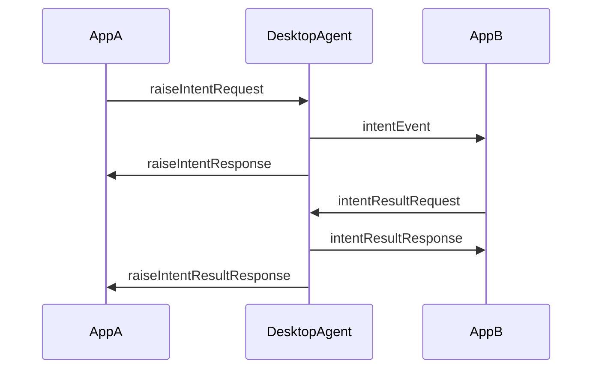
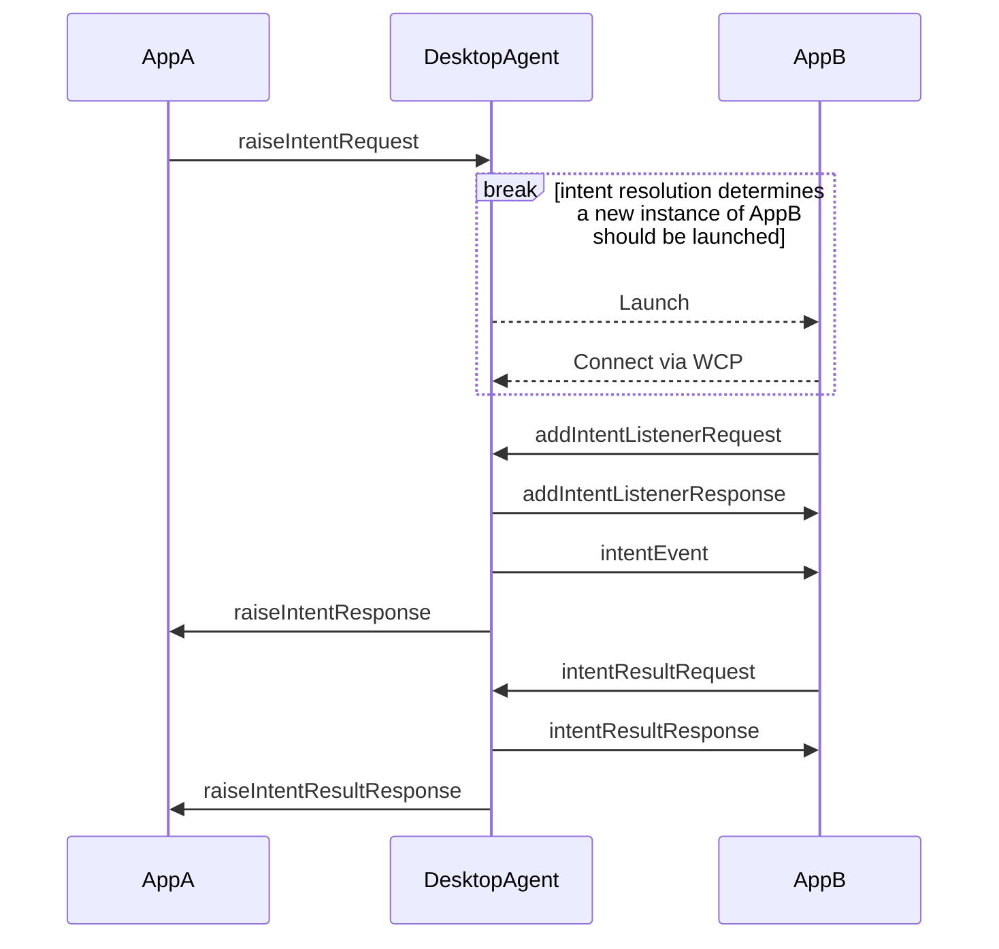
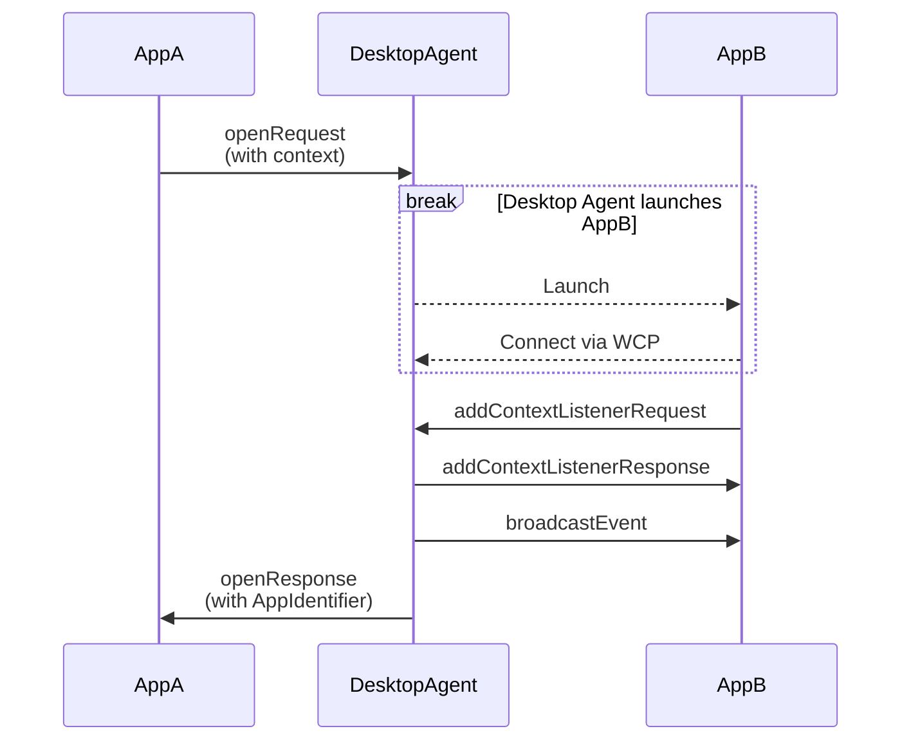
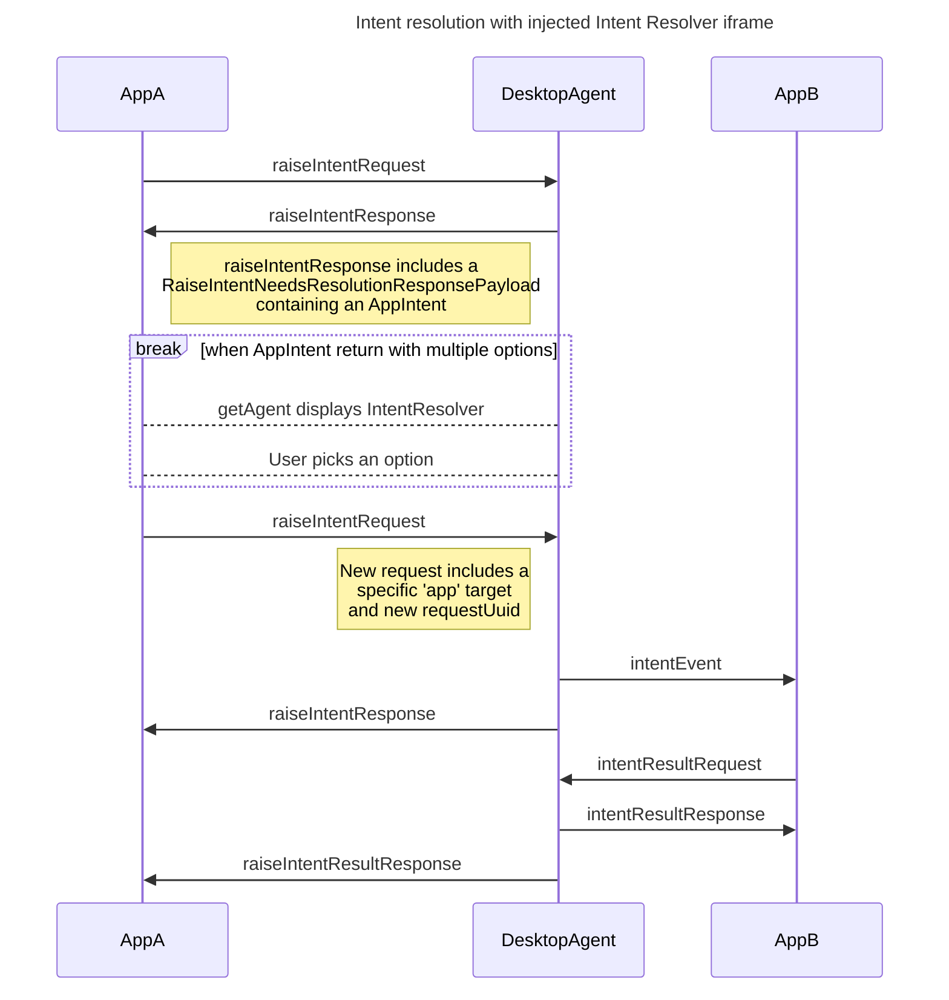
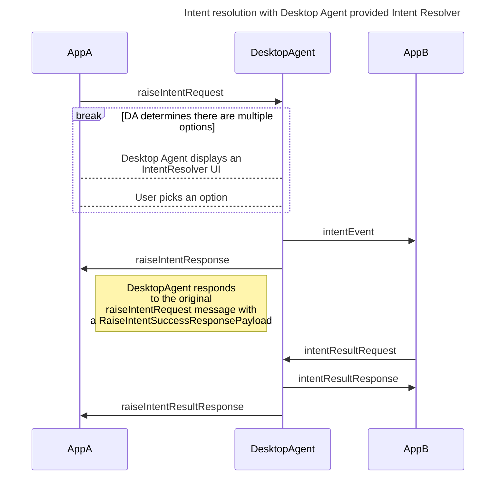

:::info _[@experimental](../fdc3-compliance#experimental-features)_

FDC3's Desktop Agent Communication Protocol (DACP) is an experimental feature added to FDC3 in 2.2. Limited aspects of its design may change in future versions and it is exempted from the FDC3 Standard's normal versioning and deprecation polices in order to facilitate any necessary change.

:::

The Desktop Agent Communication Protocol (DACP) constitutes a set of standardized JSON messages or 'wire protocol' that can be used to implement an interface to a Desktop Agent, encompassing all API calls events defined in the [Desktop Agent API](../ref/DesktopAgent.md). For example, the DACP is used by the [`@finos/fdc3` npm module](https://www.npmjs.com/package/@finos/fdc3) to communicate with Browser-Resident Desktop Agents or a connection setup via the [FDC3 Web Connection Protocol](./webConnectionProtocol).

## Protocol conventions

DACP messages are defined in [JSON Schema](https://json-schema.org/) in the [FDC3 github repository](https://github.com/finos/FDC3/tree/fdc3-for-web/schemas/api).

:::tip

TypeScript types representing all DACP and WCP messages are generated from the JSON Schema source and can be imported from the [`@finos/fdc3` npm module](https://www.npmjs.com/package/@finos/fdc3):

```ts
import { BrowserTypes } from "@finos/fdc3";
```

:::

The protocol is composed of several different classes of message, each governed by a message schema:

1. **App Request Messages** ([`AppRequest` schema](https://fdc3.finos.org/schemas/next/api/appRequest.schema.json)):
    - Messages sent by an application representing an API call, such as [`DesktopAgent.broadcast`](../ref/DesktopAgent#broadcast), [`Channel.addContextListener`](../ref/Channel#addcontextlistener), or [`Listener.unsubscribe`](../ref/Types#listener).
    - Message names all end in 'Request'.
    - Each instance of a request message sent is uniquely identified by a `meta.requestUuid` field.

2. **Agent Response Messages** ([`AgentResponse` schema](https://fdc3.finos.org/schemas/next/api/agentResponse.schema.json)):
    - Response messages sent from the DA to the application, each relating to a corresponding _App Request Message_.
    - Message names all end in 'Response'.
    - Each instance of an Agent Response Message is uniquely identified by a `meta.responseUuid` field.
    - Each instance of an Agent Response Message quotes the `meta.requestUuid` value of the message it is responding to.

3. **Agent Event Messages** ([`AgentEvent` schema](https://fdc3.finos.org/schemas/next/api/agentEvent.schema.json)):
    - Messages sent from the DA to the application that are due to actions in other applications, such as an inbound context resulting from another app's broadcast.
    - Message names all end in 'Event'.
    - Each instance of an Agent Response Message is uniquely identified by a `meta.eventUuid` field.

Each individual message is also governed by a message schema, which is composed with the schema for the message type.

:::info

In rare cases, the payload of a request or event message may quote the `requestUuid` or `eventUuid` of another message that it represents a response to, e.g. `intentResultRequest` quotes the `eventUuid` of the `intentEvent` that delivered the intent and context to the app, as well as the `requestUuid` of the `raiseIntentRequest` message that originally raised the intent.

:::

All messages defined in the DACP follow a common structure:

```json
{
    "type": "string", // string identifying the message type
    "payload": {
        //message payload fields defined for each message type 
    },
    "meta": {
        "timestamp": "2024-09-17T10:15:39+00:00"
        //other meta fields determined by each 'class' of message
        //  these include requestUuid, responseUuid and eventUuid
        //  and a source field identifying an app where appropriate
    }
}
```

`meta.timestamp` fields are formatted as strings, according to the format defined by [ISO 8601-1:2019](https://www.iso.org/standard/70907.html), which is produced in JavaScript via the `Date` class's `toISOString()` function, e.g. `(new Date()).toISOString()`.

### Routing, Registering Listeners & Multiplexing

The design of the Desktop Agent Communication Protocol is guided by the following sentence from the introduction to the Desktop Agent overview:

> A Desktop Agent is a desktop component (or aggregate of components) that serves as a launcher and message router (broker) for applications in its domain.

Hence, that design is based on the assumption that all messaging between applications passes through an entity that acts as the 'Desktop Agent' and routes those messages on to the appropriate recipients (for example, a context message broadcast by an app to a channel is routed onto other apps that have added a listener to that channel, or an intent and context pair raised by an application is routed to another app chosen to resolve that intent). While implementations based on a shared bus are possible, they have not been specifically considered in the design of the DACP messages.

Further, the design of the DACP is based on the assumption that applications will interact with an implementation of the [`DesktopAgent`](../ref/DesktopAgent) interface, with the DACP used behind the scenes to support communication between the implementation of that interface and an entity acting as the Desktop Agent which is running in another process or location, necessitating the use of a 'wire protocol' for communication. For example, [Browser-Resident Desktop Agent](./browserResidentDesktopAgents) implementations use the [FDC3 Web Communication Protocol (WCP)](./webConnectionProtocol.md) to connect a 'Desktop Agent Proxy', provided by the `getAgent()` implementation in the [`@finos/fdc3` npm module](https://www.npmjs.com/package/@finos/fdc3), and a Desktop Agent running in another frame or window which is communicated with via the DACP.

As a Desktop Agent is expected to act as a router for messages sent through the Desktop Agent API, the DACP provides message exchanges for the registration and un-registration of listeners for particular message types (e.g. events, contexts broadcast on user channels, contexts broadcast on other channel types, raised intents etc.). In most cases, apps can register multiple listeners for the same messages (often filtered for different context or event types). However, where multiple listeners are present, only a single DACP message should be sent representing the action taken in the FDC3 API (e.g. broadcasting a message to a channel) and any multiplexing to multiple listeners should be applied at the receiving end. For example, when working with the WCP, this should be handled by the Desktop Agent Proxy implementation provided by the `getAgent()` implementation.

### Timeouts for Message Exchanges

As the DACP is used to communicate with a different browsing context, timeouts are applied to message exchanges allowing them to fail and for the Desktop Agent Proxy to return an error to the caller. A default timeout of 10 seconds is applied to all message exchanges, with the exception of those that may involve the launch of an application (`open()`, `raiseIntent()` and `raiseIntentForContext()`). Implementations of the FDC3 Desktop Agent API are required to allow a minimum timeout of 15 seconds for an application to launch and add any necessary context or intent listeners (see [Desktop Agent API Compliance](../spec#desktop-agent-api-standard-compliance) for further details). However, no upper bound for the timeout is currently specified. Message exchanges that involve the launch of an application use a default timeout of 100 seconds.

Desktop Agents may specify custom values for both the default message exchange timeout and the timeout used for exchanges that may involve the launch of an application. Custom values are passed to the Desktop Agent proxy by setting the optional `payload.defaultTimeout` and `payload.appLaunchTimeout` fields in the `WCP3Handshake` Response sent by the Desktop Agent to an application connecting to it. `payload.defaultTimeout` must be set to a value greater than or equal to 100 ms, and `payload.appLaunchTimeout`  must be set to a value greater than or equal to 15,000 ms.

## Message Definitions Supporting FDC3 API calls

This section provides details of the messages defined in the DACP, grouped according to the FDC3 API functions that they support, and defined by JSON Schema files. Many of these message definitions make use of JSON versions of [metadata](../ref/Metadata) and other [types](../ref/Types) defined by the Desktop Agent API, the JSON versions of which can be found in [api.schema.json](https://fdc3.finos.org/schemas/next/api/api.schema.json), while a number of DACP specific object definitions that are reused through the messages can be found in [common.schema.json](https://fdc3.finos.org/schemas/next/api/common.schema.json).

### `DesktopAgent`

#### `addContextListener()`

Request and response used to implement the [`DesktopAgent.addContextListener()`](../ref/DesktopAgent#addcontextlistener) and [`Channel.addContextListener()`](../ref/Channel#addcontextlistener) API calls:

- [`addContextListenerRequest`](https://fdc3.finos.org/schemas/next/api/addContextListenerRequest.schema.json)
- [`addContextListenerResponse`](https://fdc3.finos.org/schemas/next/api/addContextListenerResponse.schema.json)

Event message used to deliver context objects that have been broadcast to listeners:

- [`broadcastEvent`](https://fdc3.finos.org/schemas/next/api/broadcastEvent.schema.json)

Request and response for removing the context listener ([`Listener.unsubscribe()`](../ref/Types#listener)):

- [`contextListenerUnsubscribeRequest`](https://fdc3.finos.org/schemas/next/api/contextListenerUnsubscribeRequest.schema.json)
- [`contextListenerUnsubscribeResponse`](https://fdc3.finos.org/schemas/next/api/contextListenerUnsubscribeResponse.schema.json)

#### `addEventListener()`

Request and response used to implement the [`addEventListener()`](../ref/DesktopAgent#addeventlistener) API call:

- [`addEventListenerRequest`](https://fdc3.finos.org/schemas/next/api/addEventListenerRequest.schema.json)
- [`addEventListenerResponse`](https://fdc3.finos.org/schemas/next/api/addEventListenerResponse.schema.json)

Event messages used to deliver events that have occurred:

- [`channelChangedEvent`](https://fdc3.finos.org/schemas/next/api/channelChangedEvent.schema.json)

Request and response for removing the event listener ([`Listener.unsubscribe()`](../ref/Types#listener)):

- [`eventListenerUnsubscribeRequest`](https://fdc3.finos.org/schemas/next/api/eventListenerUnsubscribeRequest.schema.json)
- [`eventListenerUnsubscribeResponse`](https://fdc3.finos.org/schemas/next/api/eventListenerUnsubscribeResponse.schema.json)

#### `addIntentListener()`

Request and response used to implement the [`addIntentListener()`](../ref/DesktopAgent#addintentlistener) API call:

- [`addIntentListenerRequest`](https://fdc3.finos.org/schemas/next/api/addIntentListenerRequest.schema.json)
- [`addIntentListenerResponse`](https://fdc3.finos.org/schemas/next/api/addIntentListenerResponse.schema.json)

Event message used to a raised intent and context object from another app to the listener:

- [`intentEvent`](https://fdc3.finos.org/schemas/next/api/intentEvent.schema.json)

An additional request and response used to deliver an [`IntentResult`](../ref/Types#intentresult) from the intent handler to the Desktop Agent, so that it can convey it back to the raising application:

- [`intentResultRequest`](https://fdc3.finos.org/schemas/next/api/intentResultRequest.schema.json)
- [`intentResultResponse`](https://fdc3.finos.org/schemas/next/api/intentResultResponse.schema.json)

Please note this exchange (and the `IntentResolution.getResult()` API call) support `void` results from a raised intent and hence this message exchange should occur for all raised intents, including those that do not return a result. In such cases, the void intent result allows resolution of the `IntentResolution.getResult()` API call and indicates that the intent handler has finished running.

Request and response for removing the intent listener ([`Listener.unsubscribe()`](../ref/Types#listener)):

- [`intentListenerUnsubscribeRequest`](https://fdc3.finos.org/schemas/next/api/intentListenerUnsubscribeRequest.schema.json)
- [`intentListenerUnsubscribeResponse`](https://fdc3.finos.org/schemas/next/api/intentListenerUnsubscribeResponse.schema.json)

A typical exchange of messages between an app raising an intent, a Desktop agent and an app resolving an intent is:



The above flow assumes that AppB has already been launched and added an intent listener. As apps can be launched to resolve an intent a typical message exchange (that includes registration of the intent listener) is:



:::tip

See [`raiseIntent`](#raiseintent) below for further examples of message exchanges involved in raising intents and intent resolution.

:::

#### `broadcast()`

Request and response used to implement the [`DesktopAgent.broadcast()`](../ref/DesktopAgent#broadcast) and [`Channel.broadcast()`](../ref/Channel#broadcast) API calls:

- [`broadcastRequest`](https://fdc3.finos.org/schemas/next/api/broadcastRequest.schema.json)
- [`broadcastResponse`](https://fdc3.finos.org/schemas/next/api/broadcastResponse.schema.json)

See [`addContextListener()`](#addcontextlistener) above for the `broadcastEvent` used to deliver the broadcast to other apps.

#### `createPrivateChannel()`

Request and response used to implement the [`createPrivateChannel()`](../ref/DesktopAgent#createprivatechannel) API call:

- [`createPrivateChannelRequest`](https://fdc3.finos.org/schemas/next/api/createPrivateChannelRequest.schema.json)
- [`createPrivateChannelResponse`](https://fdc3.finos.org/schemas/next/api/createPrivateChannelResponse.schema.json)

#### `findInstances()`

Request and response used to implement the [`findInstances()`](../ref/DesktopAgent#findinstances) API call:

- [`findInstancesRequest`](https://fdc3.finos.org/schemas/next/api/findInstancesRequest.schema.json)
- [`findInstancesResponse`](https://fdc3.finos.org/schemas/next/api/findInstancesResponse.schema.json)

#### `findIntent()`

Request and response used to implement the [`findIntent()`](../ref/DesktopAgent#findintent) API call:

- [`findIntentRequest`](https://fdc3.finos.org/schemas/next/api/findIntentRequest.schema.json)
- [`findIntentResponse`](https://fdc3.finos.org/schemas/next/api/findIntentResponse.schema.json)

#### `findIntentsByContext()`

Request and response used to implement the [`findIntentsByContext()`](../ref/DesktopAgent#findintentsbycontext) API call:

- [`findIntentsByContextRequest`](https://fdc3.finos.org/schemas/next/api/findIntentsByContextRequest.schema.json)
- [`findIntentsByContextResponse`](https://fdc3.finos.org/schemas/next/api/findIntentsByContextResponse.schema.json)

#### `getAppMetadata()`

Request and response used to implement the [`getAppMetadata()`](../ref/DesktopAgent#getappmetadata) API call:

- [`getAppMetadataRequest`](https://fdc3.finos.org/schemas/next/api/getAppMetadataRequest.schema.json)
- [`getAppMetadataResponse`](https://fdc3.finos.org/schemas/next/api/getAppMetadataResponse.schema.json)

#### `getCurrentChannel()`

Request and response used to implement the [`getCurrentChannel()`](../ref/DesktopAgent#getcurrentchannel) API call:

- [`getCurrentChannelRequest`](https://fdc3.finos.org/schemas/next/api/getCurrentChannelRequest.schema.json)
- [`getCurrentChannelResponse`](https://fdc3.finos.org/schemas/next/api/getCurrentChannelResponse.schema.json)

#### `getInfo()`

Request and response used to implement the [`getInfo()`](../ref/DesktopAgent#getinfo) API call:

- [`getInfoRequest`](https://fdc3.finos.org/schemas/next/api/getInfoRequest.schema.json)
- [`getInfoResponse`](https://fdc3.finos.org/schemas/next/api/getInfoResponse.schema.json)

#### `getOrCreateChannel()`

Request and response used to implement the [`getOrCreateChannel()`](../ref/DesktopAgent#getorcreatechannel) API call:

- [`getOrCreateChannelRequest`](https://fdc3.finos.org/schemas/next/api/getOrCreateChannelRequest.schema.json)
- [`getOrCreateChannelResponse`](https://fdc3.finos.org/schemas/next/api/getOrCreateChannelResponse.schema.json)

#### `getUserChannels()`

Request and response used to implement the [`getUserChannels()`](../ref/DesktopAgent#getuserchannels) API call:

- [`getUserChannelsRequest`](https://fdc3.finos.org/schemas/next/api/getUserChannelsRequest.schema.json)
- [`getUserChannelsResponse`](https://fdc3.finos.org/schemas/next/api/getUserChannelsResponse.schema.json)

#### `joinUserChannel()`

Request and response used to implement the [`joinUserChannel()`](../ref/DesktopAgent#joinchannel) API call:

- [`joinUserChannelRequest`](https://fdc3.finos.org/schemas/next/api/joinUserChannelRequest.schema.json)
- [`joinUserChannelResponse`](https://fdc3.finos.org/schemas/next/api/joinUserChannelResponse.schema.json)

#### `leaveCurrentChannel()`

Request and response used to implement the [`leaveCurrentChannel()`](../ref/DesktopAgent#leavecurrentchannel) API call:

- [`leaveCurrentChannelRequest`](https://fdc3.finos.org/schemas/next/api/leaveCurrentChannelRequest.schema.json)
- [`leaveCurrentChannelResponse`](https://fdc3.finos.org/schemas/next/api/leaveCurrentChannelResponse.schema.json)

#### `open()`

Request and response used to implement the [`open()`](../ref/DesktopAgent#open) API call:

- [`openRequest`](https://fdc3.finos.org/schemas/next/api/openRequest.schema.json)
- [`openResponse`](https://fdc3.finos.org/schemas/next/api/openResponse.schema.json)

Where a context object is passed (e.g. `fdc3.open(app, context)`) the `broadcastEvent` message described above in [`addContextListener`](#addcontextlistener) should be used to deliver it after the context listener has been added:



However, if the app opened doesn't add a context listener within a timeout (defined by the Desktop Agent) then the `openResponse` should be sent with `AppTimeout` error from the [`OpenError`](../ref/Errors#openerror) enumeration.

:::tip

Desktop Agents MUST allow at least 15 seconds for an app to add a context listener before timing out (see [Desktop Agent API Standard Compliance](https://fdc3.finos.org/docs/next/api/spec#desktop-agent-api-standard-compliance) for more detail) and applications SHOULD add their listeners as soon as possible to keep the delay short (see the [addContextListener reference doc](https://fdc3.finos.org/docs/next/api/ref/DesktopAgent#addcontextlistener)).

:::

#### `raiseIntent()`

Request and response used to implement the [`raiseIntent()`](../ref/DesktopAgent#raiseintent) API call:

- [`raiseIntentRequest`](https://fdc3.finos.org/schemas/next/api/raiseIntentRequest.schema.json)
- [`raiseIntentResponse`](https://fdc3.finos.org/schemas/next/api/raiseIntentResponse.schema.json)

An additional response message is provided for the delivery of an `IntentResult` from the resolving application to the raising application (which is collected via the [`IntentResolution.getResult()`](../ref/Metadata#intentresolution) API call), which should quote the `requestUuid` from the original `raiseIntentRequest`:

- [`raiseIntentResultResponse`](https://fdc3.finos.org/schemas/next/api/raiseIntentResultResponse.schema.json)

There is no request message to indicate a call to the `resolution.getResult()` function of `IntentResolution`. Hence, Desktop Agents MUST send this additional response message to indicate the status of the intent handling function and to deliver its result (or void if none was returned).

:::tip

See [`addIntentListener`](#addintentlistener) above for details of the messages used for the resolving app to deliver the result to the Desktop Agent.

:::

Where there are multiple options for resolving a raised intent, there are two possible versions of the resulting message exchanges. Which to use depends on whether the Desktop Agent uses an intent resolver user interface (or other suitable mechanism) that it controls, or one injected into the application (for example an iframe injected by a `getAgent()` implementation into an application window) to perform resolution.

When working with an injected interface, the Desktop Agent should respond with a `raiseIntentResponse` containing a `RaiseIntentNeedsResolutionResponsePayload`:



Alternatively, if the Desktop Agent is able to provide its own user interface or another suitable means of resolving the intent, then it may do so and respond with a `raiseIntentResponse` containing a `RaiseIntentSuccessResponsePayload`:



#### `raiseIntentForContext()`

Request and response used to implement the [`raiseIntentForContext()`](../ref/DesktopAgent#raiseintentforcontext) API call:

- [`raiseIntentForContextRequest`](https://fdc3.finos.org/schemas/next/api/raiseIntentForContextRequest.schema.json)
- [`raiseIntentForContextResponse`](https://fdc3.finos.org/schemas/next/api/raiseIntentForContextResponse.schema.json)

Message exchanges for handling `raiseIntentForContext()` are the same as for `raiseIntent`, except for the substitution of `raiseIntentForContextRequest` for `raiseIntentRequest` and `raiseIntentForContextResponse` for `raiseIntentResponse`. Hence, please see [`raiseIntent`](#raiseintent) and [`addIntentListener`](#addintentlistener) for further details.

### `Channel`

Owing to the significant overlap between the FDC3 [`DesktopAgent`](../ref/DesktopAgent) and [`Channel`](../ref/Channel) interfaces, which includes the ability to retrieve and work with User channels as App Channels, most of the messaging for the `Channel` API is shared with `DesktopAgent`. Specifically, all messages defined in the the [`broadcast`](#broadcast) and [`addContextListener`](#addcontextlistener) sections above are reused, with a few minor differences to note:

- When working with a specific channel, the `channelId` property in `addContextListenerRequest` should be set to the ID of the channel, where it is set to `null` to work with the current user channel.
- When receiving a `broadcastEvent` a `channelId` that is `null` indicates that the context was sent via a call to `fdc3.open` and does not relate to a channel.

The following additional function is unique to the `Channel` interface:

#### `getCurrentContext()`

Request and response used to implement the [`Channel.getCurrentContext()`](../ref/Channel#getcurrentcontext) API call:

- [`getCurrentContextRequest`](https://fdc3.finos.org/schemas/next/api/getCurrentContextRequest.schema.json)
- [`getCurrentContextResponse`](https://fdc3.finos.org/schemas/next/api/getCurrentContextResponse.schema.json)

### `PrivateChannel`

The [`PrivateChannel`](../ref/PrivateChannel) interface extends [`Channel`](../ref/Channel) with a number of additional functions that are supported by the following messages:

#### `addEventListener()`

Request and response used to implement the [`PrivateChannel.addEventListener`](../ref/PrivateChannel#addeventlistener) API call:

- [`privateChanneladdEventListenerRequest`](https://fdc3.finos.org/schemas/next/api/privateChanneladdEventListenerRequest.schema.json)
- [`privateChanneladdEventListenerResponse`](https://fdc3.finos.org/schemas/next/api/privateChanneladdEventListenerResponse.schema.json)

Event messages used to deliver events that have occurred:

- [`privateChannelOnAddContextListenerEvent`](https://fdc3.finos.org/schemas/next/api/privateChannelOnAddContextListenerEvent.schema.json)
- [`privateChannelOnDisconnectEvent`](https://fdc3.finos.org/schemas/next/api/privateChannelOnDisconnectEvent.schema.json)
- [`privateChannelOnUnsubscribeEvent`](https://fdc3.finos.org/schemas/next/api/privateChannelOnUnsubscribeEvent.schema.json)

:::tip

The above messages may also be used to implement the deprecated [`onAddContextListener()`](../ref/PrivateChannel#onaddcontextlistener), [`onUnsubscribe`](../ref/PrivateChannel#onunsubscribe) and [`onDisconnect`](../ref/PrivateChannel#ondisconnect) functions of the `PrivateChannel` interface.

:::

Message exchange for removing the event listener [`Listener.unsubscribe`](../ref/Types#listener):

- [`privateChannelUnsubscribeEventListenerRequest`](https://fdc3.finos.org/schemas/next/api/privateChannelUnsubscribeEventListenerRequest.schema.json)
- [`privateChannelUnsubscribeEventListenerResponse`](https://fdc3.finos.org/schemas/next/api/privateChannelUnsubscribeEventListenerResponse.schema.json)

#### `disconnect()`

Request and response used to implement the [`PrivateChannel.disconnect()`](../ref/PrivateChannel#disconnect) API call:

- [`privateChannelDisconnectRequest`](https://fdc3.finos.org/schemas/next/api/privateChannelDisconnectRequest.schema.json)
- [`privateChannelDisconnectResponse`](https://fdc3.finos.org/schemas/next/api/privateChannelDisconnectResponse.schema.json)

### Checking apps are alive

Depending on the connection over which the Desktop Agent and app are connected, it may be necessary for the Desktop Agent to check whether the application is still alive. This can be done, either periodically or on demand (for example to validate options that will be provided in an [`AppIntent`](../ref/Metadata#appintent) as part of a `findIntentResponse` or `raiseIntentResponse` and displayed in an intent resolver interface), using the following message exchange:

- [`heartbeatEvent`](https://fdc3.finos.org/schemas/next/api/heartbeatEvent.schema.json)
- [`heartbeatAcknowledgment`](https://fdc3.finos.org/schemas/next/api/heartbeatAcknowledgment.schema.json)

As a Desktop Agent initiated exchange, it is initiated with an `AgentEvent` message and completed via an `AppRequest` message as an acknowledgement.

:::tip

Additional procedures are defined in the [Browser Resident Desktop Agents specification](./browserResidentDesktopAgents#disconnects) and [Web Connection Protocol](./webConnectionProtocol#step-5-disconnection) for the detection of app disconnection or closure. Implementations will often need to make use of multiple procedures to catch all forms of disconnection in a web browser.

:::

### Controlling injected User Interfaces

Desktop Agent implementations, such as those based on the [Browser Resident Desktop Agents specification](./browserResidentDesktopAgents) and [Web Connection Protocol](./webConnectionProtocol), may either provide their own user interfaces (or other appropriate mechanisms) for the selection of User Channels or Intent Resolution, or they may work with implementations injected into the application (for example, as described in the [Web Connection Protocol](./webConnectionProtocol#providing-channel-selector-and-intent-resolver-uis) and implemented in [`getAgent()`](../ref/GetAgent)).

Where injected user interfaces are used, standardized messaging is needed to communicate with those interfaces. This is provided in the DACP via the following 'iframe' messages, which are governed by the [`Fdc3UserInterfaceMessage`](https://fdc3.finos.org/schemas/next/api/fdc3UserInterface.schema.json) schema. The following messages are provided:

- [`Fdc3UserInterfaceHello`](https://fdc3.finos.org/schemas/next/api/fdc3UserInterfaceHello.schema.json): Sent by the iframe to its `window.parent` frame to initiate communication and to provide initial CSS to apply to the frame. This message should have a `MessagePort` appended over which further communication will be conducted.
- [`Fdc3UserInterfaceHandshake`](https://fdc3.finos.org/schemas/next/api/fdc3UserInterfaceHandshake.schema.json):  Response to the `Fdc3UserInterfaceHello` message sent by the application frame, which should be sent over the `MessagePort`. Includes details of the FDC3 version that the application is using.
- [`Fdc3UserInterfaceDrag`](https://fdc3.finos.org/schemas/next/api/fdc3UserInterfaceDrag.schema.json): Message sent by the iframe to indicate that it is being dragged to a new position and including offsets to indicate direction and distance.
- [`Fdc3UserInterfaceRestyle`](https://fdc3.finos.org/schemas/next/api/fdc3UserInterfaceRestyle.schema.json): Message sent by the iframe to indicate that its frame should have updated CSS applied to it, for example to support a channel selector interface that can be 'popped open' or an intent resolver that wishes to resize itself to show additional content.

Messages are also provided that are specific to each user interface type provided by a Desktop Agent. The following messages are specific to Channel Selector user interfaces:

- [`Fdc3UserInterfaceChannels`](https://fdc3.finos.org/schemas/next/api/fdc3UserInterfaceChannels.schema.json): Sent by the parent frame to initialize a Channel Selector user interface by providing metadata for the Desktop Agent's user channels and details of any channel that is already selected. This message will typically be sent by a `getAgent()` implementation immediately after the `fdc3UserInterfaceHandshake` and before making the injected iframe visible.
- [`Fdc3UserInterfaceChannelSelected`](https://fdc3.finos.org/schemas/next/api/fdc3UserInterfaceChannelSelected.schema.json): Sent by the Channel Selector to indicate that a channel has been selected or deselected.

Messages specific to Intent Resolver user interfaces:

- [`Fdc3UserInterfaceResolve`](https://fdc3.finos.org/schemas/next/api/fdc3UserInterfaceResolve.schema.json): Sent by the parent frame to initialize an Intent Resolver user interface to resolve a raised intent, before making the iframe visible. The message includes the context object sent with the intent and an array of one or more [`AppIntent`](../ref/Metadata#appintent) objects representing the resolution options for the intent ([`raiseIntent`](../ref/DesktopAgent#raiseintent)) or context ([`raiseIntentForContext`](../ref/DesktopAgent#raiseintentforcontext)) that was raised.
- [`Fdc3UserInterfaceResolveAction`](https://fdc3.finos.org/schemas/next/api/fdc3UserInterfaceResolveAction.schema.json): Sent by the Intent Resolver to indicate actions taken by the user in the interface, including hovering over an option, clicking a cancel button, or selecting a resolution option. The Intent Resolver should be hidden by the `getAgent()` implementation after a resolution option is selected to ensure that it does not interfere with user's ongoing interaction with the app's user interface.
