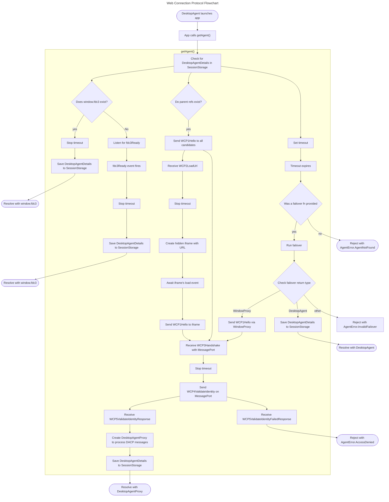
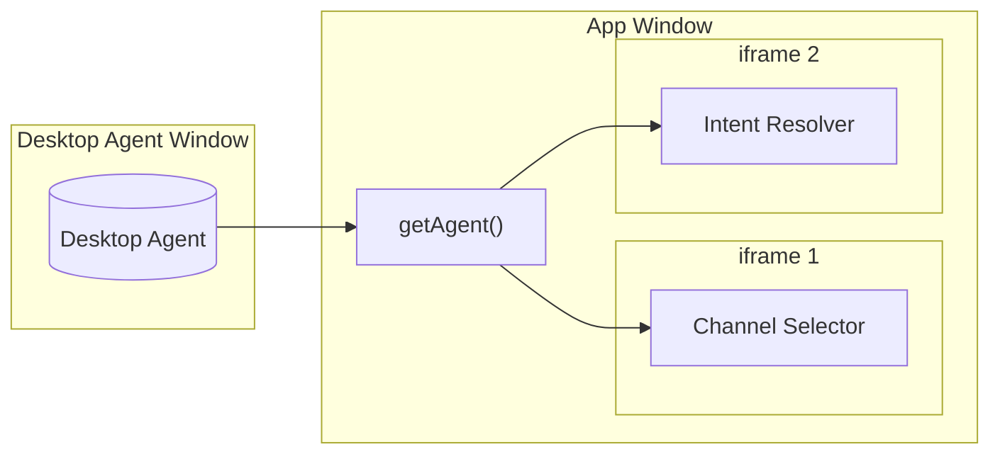

:::info _[@experimental](../fdc3-compliance#experimental-features)_

FDC3's Web Connection Protocol (WCP) is an experimental feature added to FDC3 in 2.2. Limited aspects of its design may change in future versions and it is exempted from the FDC3 Standard's normal versioning and deprecation polices in order to facilitate any necessary change.

:::

The FDC3 Web Connection Protocol (WCP) defines the procedure for a web-application to connect to an FDC3 Desktop Agent. The WCP is used to implement a [`getAgent()`](../ref/GetAgent) function in the [`@finos/fdc3` npm module](https://www.npmjs.com/package/@finos/fdc3), which is the recommended way for web applications to connect to a Desktop Agent. This specification details how it retrieves and provides the FDC3 [`DesktopAgent`](../ref/DesktopAgent) interface object and requirements that Desktop Agents MUST implement in order to support discovery and connection via `getAgent()`. Please see the [`getAgent` reference document](../ref/GetAgent.md) for its TypeScript definition and related types.

:::tip

The [`@finos/fdc3` npm module](https://www.npmjs.com/package/@finos/fdc3) provides a `getAgent()` implementation which app can use to connect to a Desktop Agent without having to interact with or understand the WCP directly. See [Supported Platforms](../supported-platforms) and the [`getAgent()`](../ref/GetAgent) reference page for more details on using `getAgent()` in an application.

:::

The WCP supports both interfaces to web-based Desktop Agents defined in the FDC3 Standard:

- **Desktop Agent Preload**: An 'injected' or 'preloaded' Desktop Agent API implementation, typically provided by an [Electron](https://www.electronjs.org/) (or similar) container or browser extension, which is made available to web applications at `window.fdc3`.
- **Desktop Agent Proxy**: An interface to a web-based Desktop Agent (implementation of the Desktop Agent API) that uses the [Desktop Agent Communication Protocol (DACP)](./desktopAgentCommunicationProtocol) to communicate with a Desktop Agent implementation running in another frame or window, via the HTML Standard's Channel Messaging API ([MDN](https://developer.mozilla.org/en-US/docs/Web/API/Channel_Messaging_API), [HTML Living Standard](https://html.spec.whatwg.org/multipage/web-messaging.html)).

The WCP allows FDC3-enabled applications to detect which FDC3 web-interface is present at runtime and returns a `DesktopAgent` interface implementation that the application can use to communicate, without the import of proprietary libraries or code. Hence, the WCP enables FDC3-enabled applications to be run within the scope of any standards compliant Desktop Agent without modification, enabling their developers to Write Once Run Anywhere (WORA).

:::tip

See the FDC3 [Glossary](../../fdc3-glossary) and [References](../../references.md) pages for definitions of terms and links to external APIs used throughout this document.

:::

:::tip

Further details for implementing Preload Desktop Agents (which use a Desktop Agent Preload interface) or a Browser Resident Desktop Agent (which use a Desktop Agent Proxy interface) are available in the [Preload Desktop Agent](./preloadDesktopAgents) or [Browser Resident Desktop Agent Specification](./browserResidentDesktopAgents), respectively.

:::

## WCP Message Schemas

There are a number of messages defined as part of the Web Connection Protocol. Definitions are provided in [JSON Schema](https://json-schema.org/) in the [FDC3 github repository](https://github.com/finos/FDC3/tree/fdc3-for-web/schemas/api).

:::tip

TypeScript types representing all DACP and WCP messages are generated from the JSON Schema source and can be imported from the [`@finos/fdc3` npm module](https://www.npmjs.com/package/@finos/fdc3):

```ts
import { BrowserTypes } from "@finos/fdc3";
```

:::

WCP messages are derived from a base schema, [`WCPConnectionStep`](https://fdc3.finos.org/schemas/next/api/.schema.json), which defines a common structure for the messages:

```json
{
    "type": "string", // string identifying the message type
    "payload": {
        //message payload fields defined for each message type 
    },
    "meta": {
        "connectionAttemptUuid": "79be3ff9-7c05-4371-842a-cf08427c174d",
        "timestamp": "2024-09-17T10:15:39+00:00"
    }
}
```

A value for `meta.connectionAttemptUuid` should be generated as a version 4 UUID according to [IETF RFC 4122](https://datatracker.ietf.org/doc/html/rfc4122) at the start for the connection process and quoted in all subsequent messages, as described later in this document.

`meta.timestamp` fields are formatted as strings, according to the format defined by [ISO 8601-1:2019](https://www.iso.org/standard/70907.html), which is produced in JavaScript via the `Date` class's `toISOString()` function, e.g. `(new Date()).toISOString()`.

Messages defined as part of the Web Connection Protocol, which will be referenced later in this document, these are:

- [`WCP1Hello`](https://fdc3.finos.org/schemas/next/api/WCP1Hello.schema.json)
- [`WCP2LoadUrl`](https://fdc3.finos.org/schemas/next/api/WCP2LoadUrl.schema.json)
- [`WCP3Handshake`](https://fdc3.finos.org/schemas/next/api/WCP3Handshake.schema.json)
- [`WCP4ValidateAppIdentity`](https://fdc3.finos.org/schemas/next/api/WCP4ValidateAppIdentity.schema.json)
- [`WCP5ValidateAppIdentityFailedResponse`](https://fdc3.finos.org/schemas/next/api/WCP5ValidateAppIdentityFailedResponse.schema.json)
- [`WCP5ValidateAppIdentityResponse`](https://fdc3.finos.org/schemas/next/api/WCP5ValidateAppIdentityResponse.schema.json)
- [`WCP6Goodbye`](https://fdc3.finos.org/schemas/next/api/WCP6Goodbye.schema.json)

## Establishing Connectivity Using the Web Connection Protocol (WCP)

The WCP algorithm (coordinated between the `getAgent()` implementation and Desktop Agent implementations) has four steps, followed by an optional disconnection step. Each step may contain sub-steps.

1. Locate a Desktop Agent interface
2. Validate app & instance identity
3. Persist connection details to SessionStorage
4. Return Desktop Agent interface
5. Disconnect

### Step 1: Locate a Desktop Agent interface

#### 1.1 Check for a possible navigation or refresh event

Check the SessionStorage key `FDC3-Desktop-Agent-Details` for a `DesktopAgentDetails` record. If it exists, then a navigation or refresh event may have occurred and the stored data MUST be sent when attempting to establish a connection to the DA. This ensures that the window can maintain a consistent `instanceId` between navigation or refresh events within an app. If it doesn't exist then proceed to step (2).

Any data stored under the `FDC3-Desktop-Agent-Details` MUST conform to the [DesktopAgentDetails](../ref/GetAgent#persisted-connection-data) type.

Existing `DesktopAgentDetails` records MUST be used to limit discovery actions (in the next step) to the same mechanism as previously used or to skip the discovery step entirely if an `agentUrl` exists, indicating that the connection should be established by loading the URL into a hidden iframe and initiating communication with that instead.

If use of the persisted data fails to establish a connection to the DA then `getAgent()` should reject its promise with `AgentNotFound` error from the [`AgentError`](../ref/Errors#agenterror) enumeration.

#### 1.2 Desktop Agent Discovery

Next, attempt to discover whether Desktop Agent Preload or Desktop Agent Proxy interfaces are available, within a specified timeout. The optional `params.timeoutMs` argument to `getAgent()` allows an application to specify the timeout that should be used, with a default value of 750ms. Discovery of Desktop Agent Preload or Desktop Agent Proxy interfaces should be conducted in parallel where possible and the timeout cancelled as soon as an interface is discovered. If a `DesktopAgentDetails` record was found in the previous step, limit discovery to the interface specified, or, if an `agentUrl` property was specified in the `DesktopAgentDetails` record, skip the discovery step entirely and proceed to the next step.

To discover a Desktop Agent Preload interface, check for the presence of an `fdc3` object in the global scope (i.e. `window.fdc3`). If it exists return it immediately. If it does not exist then add a listener for the global `fdc3Ready` event with the the specified timeout, e.g.:

```ts
const discoverPreloadDA = async (timeoutMs: number): Promise<DesktopAgent> => {
  return new Promise((resolve, reject) => {
    // if the global is already available resolve immediately
    if (window.fdc3) {
      resolve(window.fdc3);
    } else {
      // Setup a timeout to return a rejected promise
      const timeoutId = setTimeout(
        () => {
          //clear the event listener to ignore a late event
          window.removeEventListener("fdc3Ready", listener);
          if (window.fdc3){ 
            resolve(window.fdc3);
          } else {
            reject("Desktop Agent Preload not found!");
          }
        }, 
        timeoutMs
      );
      //`fdc3Ready` event listener function
      const listener = () => {
        clearTimeout(timeoutId);
        if (window.fdc3) {
          resolve(window.fdc3);
        } else {
          reject("The `fdc3Ready` event fired, but `window.fdc3` Was not set!");
        }
      };
      
      // listen for the fdc3Ready event
      window.addEventListener("fdc3Ready", listener, { once: true });
    }
  });
};
```

To discover a Desktop Agent Proxy interface, locate all candidates for a `parent` window or frame by first checking the values of `window.opener` and `window.parent`. If `window.opener !== null` or `window.parent !== window` then they are candidates for a parent window or frame. As iframes can be nested we can also search for candidates that are parents of a parent frame, e.g.:

```ts
/**
 * Recursive search for all possible parent frames (windows) that we may
 * target with the WCP.
 * @param startWindow window object to search
 * @param found window objects found so far
 * @return An array of Window Objects representing 'parent' frames of the
 * specified window.
 */
function discoverProxyCandidates(startWindow: Window, found: Window[]) {
  _recursePossibleTargets(startWindow, startWindow, found);
  Logger.debug(`Possible parent windows/frames found: ${found.length}`);
  return found;
}

function _recursePossibleTargets(startWindow: Window, w: Window, found: Window[]) {
  if (w) {
    if (found.indexOf(w) == -1 && w != startWindow) {
      found.push(w);
    }

    if (!!w.opener) {
      _recursePossibleTargets(startWindow, w.opener, found);
    }

    if (w.parent != w) {
      _recursePossibleTargets(startWindow, w.parent, found);
    }
  }
}
```

Setup a timer for specified timeout, and then for each `candidate` found, attempt to establish communication with it as follows:

  1. Add a listener (`candidate.addEventListener("message", (event) => {})`) to receive response messages from the `candidate`.
  2. Send a [`WCP1Hello`](https://fdc3.finos.org/schemas/next/api/WCP1Hello.schema.json) message to it via `postMessage`.

  ```ts
  const hello = {
    type: "WCP1Hello",
    payload: {
      identityUrl: identityUrl,
      actualUrl: actualUrl,
      fdc3Version: "2.2",
      intentResolver: true,
      channelSelector: true
    },
    meta: {
      connectionAttemptUuid: "bc96f1db-9b2b-465f-aab3-3870dc07b072",
      timestamp: "2024-09-09T11:44:39+00:00"
    }
  };
  candidate.postMessage(hello, { targetOrigin: "*" });
  ```

  Note that the `targetOrigin` is set to `*` as the origin of the Desktop Agent is not known at this point.
  3. Accept the first correct response received from a candidate. Correct responses MUST correspond to either the [`WCP2LoadUrl`](https://fdc3.finos.org/schemas/next/api/WCP2LoadUrl.schema.json) or [`WCP3Handshake`](https://fdc3.finos.org/schemas/next/api/WCP3Handshake.schema.json) message schemas and MUST quote the same `meta.connectionAttemptUuid` value provided in the original `WCP1Hello` message. Stop the timeout when a correct response is received. If no response is received from any candidate, the `getAgent()` implementation MAY retry sending the `WCP1Hello` message periodically until the timeout is reached.
  4. If a [`WCP3Handshake`](https://fdc3.finos.org/schemas/next/api/WCP3Handshake.schema.json) was received in the previous step, skip this step and move on to step 5. However, If a [`WCP2LoadUrl`](https://fdc3.finos.org/schemas/next/api/WCP2LoadUrl.schema.json) was received in the previous step:
      - Create a hidden iframe within the page, set its URL to the URL provided by the `payload.iframeUrl` field of the message and add a handler to run when the iframe has loaded:
          ```ts
          const loadIframe = (url: string, loadedHandler: () => void): WindowProxy => {
            const ifrm = document.createElement("iframe");
            iframe.onload = loadedHandler;
            ifrm.src = url;
            ifrm.style.width = "0";
            ifrm.style.height = "0";
            ifrm.style.visibility = "0";
            ifrm.ariaHidden = "true";
            document.body.appendChild(ifrm);
            return ifrm.contentWindow;
          };
          ```
      - Once the frame has loaded (i.e. when the `loadedHandler` in the above example runs), repeat steps 1-3 above substituting the  iframe's `contentWindow` for the candidate window objects before proceeding to step 5. A new timeout should be used to limit the amount of time that the `getAgent()` implementation waits for a response. If the event that this subsequent timeout is exceeded, reject Error with the `ErrorOnConnect` message from the [`AgentError`](../ref/Errors#agenterror) enumeration.

        :::tip

        To ensure that the iframe is ready to receive the `WCP1Hello` message when the `load` event fires, implementations should call `window.addEventListener` for the `message` event synchronously and as early as possible.

        :::

  5. At this stage, a [`WCP3Handshake`](https://fdc3.finos.org/schemas/next/api/WCP3Handshake.schema.json) message should have been received from either a candidate parent or a hidden iframe created in step 4 above. This message MUST have a `MessagePort` appended to it, which is used for further communication with the Desktop Agent. It MUST also contain URLs for any Intent Resolver or Channel Selector UIs to be injected into the page (or `false` to indicate that they are not in use) and MAY contain custom timeout settings to use for API message exchanges.

  Add a listener (`port.addEventListener("message", (event) => {})`) to receive messages from the selected `candidate`, before moving on to the next stage.
  6. If no candidates were found or no [`WCP3Handshake`](https://fdc3.finos.org/schemas/next/api/WCP3Handshake.schema.json) has been received by the time that the timeout expires, then neither a Desktop Agent Preload or Desktop Agent Proxy interface has been discovered. If this occurs, the `getAgent()` implementation will run any `failover` function provided as a parameter to `getAgent()`, allowing the application to provide an alternative means of connecting to or starting up a Desktop Agent.
  
  An async failover function may resolve to either a `DesktopAgent` implementation or the application may create either an iframe or open a new window, load an appropriate URL for a Desktop Agent implementation and resolve to its `WindowProxy` reference (e.g. `iframe.contentWindow` or the result of a call to `window.open(...)`).
  
  If the failover function resolves to a `DesktopAgent` implementation it should be immediately returned in the same way as a `window.fdc3` reference was and handled as if it represents a Desktop Agent Preload interface.

  If the failover function resolves to a `WindowProxy` object, repeat steps 1-3 & 5 above substituting the `WindowProxy` for the candidate window objects before proceeding to the next step.

  :::tip

  Where possible, iframe failover functions should wait for the iframe or window represented by a `WindowProxy` object to be ready to receive messages before resolving. For an iframe this is a case of waiting for the `load` event to fire.

  :::

### Step 2: Validate app & instance identity

Apps and instances of them identify themselves so that DAs can positively associate them with their corresponding AppD records and any existing instance identity.

In the current FDC3 version, no identity validation procedures are provided for Desktop Agent Preload interfaces. Hence, it is the responsibility of such implementations to validate the identity of apps within their scope and to ensure that they update their own record of the identity if it changes during the life of the window hosting the application (i.e. due to a navigation event). It is expected that FDC3 will adopt identity validation procedures for Desktop Agent Preload interfaces in future.

#### 2.1 Determine App Identity

In Desktop Agent Proxy interfaces, identity is ascertained via the [`WCP4ValidateAppIdentity`](/schemas/next/api/WCP4ValidateAppIdentity.schema.json) message, which should be the first message sent on the `MessagePort` received by the `getAgent()` implementation after receiving it via [`WCP3Handshake`](https://fdc3.finos.org/schemas/next/api/WCP3Handshake.schema.json). Any other messages sent via the `MessagePort` prior to successful validation of a [`WCP4ValidateAppIdentity`](/schemas/next/api/WCP4ValidateAppIdentity.schema.json) message should be ignored.

An app identity is determined and an `appId` assigned by matching the application to an AppD record already known to the Desktop Agent, based on the `identityUrl` provided in the [`WCP4ValidateAppIdentity`](/schemas/next/api/WCP4ValidateAppIdentity.schema.json) message. An additional `actualUrl` field MUST also be provided to indicate whether the app overrode its `identityUrl` and to allow for logging. The origin (protocol, domain and port) of the `identityUrl`, `actualUrl` and the `MessageEvent.origin` field of the original `WCP1Hello` message that started the connection flow MUST all match. See the [Browser-Resident Desktop Agent Specification](./browserResidentDesktopAgents#validating-app-identity) for details of how to match an `identityUrl` to the `details.url` field of an AppD record.

If the app identity is not recognized, the Desktop Agent MUST respond with a [`WCP5ValidateAppIdentityFailedResponse`](https://fdc3.finos.org/schemas/next/api/WCP5ValidateAppIdentityFailedResponse.schema.json) message and stop handling further messages on the `MessagePort`. On receiving this message, the `getAgent()` implementation should reject with an Error object with the `AccessDenied` message from the [`AgentError`](../ref/Errors#agenterror) enumeration.

If the app identity is recognized the Desktop Agent will assign the appropriate appId and move on to determining the instance identity.

#### 2.2 Determine Instance Identity

If this instance of the application has connected to a Desktop Agent before and is reconnecting (due to a navigation or refresh event) then the optional `instanceId` and `instanceUuid` should be set in the [`WCP4ValidateAppIdentity`](/schemas/next/api/WCP4ValidateAppIdentity.schema.json) message. The Desktop Agent MUST use these values to determine if it recognizes the app instance identity and that it was previously applied to application with the same `appId`.

An `instanceUuid` is used to validate instance identity because `instanceId` of an application is available to other apps through the FDC3 API and might be used to 'spoof' an identity. On the other hand, `instanceUuid` is only issued through the WCP to the specific app instance and is used as a shared secret to enable identity validation. However, as `SessionStorage` data may be cloned when new windows on the same origin are opened via `window.open()`, Desktop Agents MUST also compare the `WindowProxy` object (via the `==` operator) that the original `WCP1Hello` messages were received on to determine if they represent the same window.

See the [Browser-Resident Desktop Agent Specification](./browserResidentDesktopAgents#validating-instance-identity) for further details of how instance identity is assigned.

If no existing instance identity (`instanceId` and `instanceUuid`) is provided, or instance identity validation fails (as the `instanceUuid` is not known, or either the `appId` or `WindowProxy` objects don't match the previous connection), then the Desktop Agent MUST assign new `instanceId` and `instanceUuid` values.

The Desktop Agent MUST then respond with a [`WCP5ValidateAppIdentityResponse`](https://fdc3.finos.org/schemas/next/api/WCP5ValidateAppIdentityResponse.schema.json) message containing the assigned `appId`, `instanceId` and `instanceUuid` values and the [`ImplementationMetadata`](../ref/Metadata#implementationmetadata) object for the Desktop Agent. This message indicates that the Desktop Agent will accept the application and we can begin processing [Desktop Agent Communication Protocol (DACP)](./desktopAgentCommunicationProtocol) messages relating to FDC3 API calls over the `MessagePort`.

### Step 3: Persist DesktopAgentDetails to SessionStorage

Once a connection is established, and the app and instance identity determined, a `DesktopAgentDetails` record MUST be stored in SessionStorage under the `FDC3-Desktop-Agent-Details` key by the `getAgent()` implementation. This record includes:

- The `identityUrl` and `actualUrl` passed to `getAgent()`.
- The `appId`, `instanceId`, and `instanceUuid` assigned by the DA.
- An `agentUrl` field with the URL provided in any [`WCP2LoadUrl`](https://fdc3.finos.org/schemas/next/api/WCP2LoadUrl.schema.json) message that was received
  - Used to skip sub-steps 1-3 in the discovery process described in Step 1.2.
  - If no [`WCP2LoadUrl`](https://fdc3.finos.org/schemas/next/api/WCP2LoadUrl.schema.json) message was received, omit this field.
- An `agentType` field which indicates what type of connection to the DA was established
  - Used to limit the discovery process in Step 1.2 above to only allow agents of the same type.
  - the `getAgent()` implementation should determine what value to set, from the `WebDesktopAgentType` enumeration for this field based on what happened during the discovery process.

See the [reference documentation for getAgent()](../ref/GetAgent#persisted-connection-data) for further details of the `DesktopAgentDetails` record that should be saved to SessionStorage.

:::tip

SessionStorage is ephemeral, only existing for the duration of the window's life. Hence, there is no concern with the key being overwritten or conflicting with other DAs.

:::

### Step 4: Resolve promise with DesktopAgent interface (step 4)

Resolve the `getAgent()` promise with an object containing either a `DesktopAgent` implementation (that was found at `window.fdc3` or returned by a `failover` function) or a 'Desktop Agent Proxy' implementation (a class implementing the `DesktopAgent` interface that uses the [Desktop Agent Communication Protocol (DACP)](./desktopAgentCommunicationProtocol) to communicate with a Desktop Agent over the `MessagePort`).

Where a `DesktopAgent` or 'Desktop Agent Proxy' implementation was successfully returned, any subsequent calls to `getAgent()` that are not preceded by a navigation or refresh event, should resolve to the same instance.

### Step 5: Disconnection

Desktop Agent Preload interfaces, as used in container-based Desktop Agent implementations, are usually able to track the lifecycle and current URL of windows that host web apps in their scope. Hence, there is currently no requirement nor means for an app to indicate that it is closing, rather it is the responsibility of the Desktop Agent to update its internal state when an app closes or changes identity.

However, Browser Resident Desktop Agents working with a Desktop Agent Proxy interface may have more trouble tracking child windows and frames. Hence, a specific WCP message ([`WCP6Goodbye`](https://fdc3.finos.org/schemas/next/api/WCP6Goodbye.schema.json)) is provided for the `getAgent()` implementation to indicate that an app is disconnecting from the Desktop Agent and will not communicate further unless and until it reconnects via the WCP. The `getAgent()` implementation MUST listen for the `pagehide` event from the HTML Standard's [Page Life Cycle API](https://html.spec.whatwg.org/multipage/document-lifecycle.html#document-lifecycle) ([MDN](https://developer.mozilla.org/en-US/docs/Web/API/Window/pagehide_event), [Chrome for Developers](https://developer.chrome.com/docs/web-platform/page-lifecycle-api#developer-recommendations-for-each-state)) and send [`WCP6Goodbye`](https://fdc3.finos.org/schemas/next/api/WCP6Goodbye.schema.json) if it receives an event where the `persisted` property is `false`.

As it is possible for a page to close without firing this event in some circumstances (e.g. where a browser render thread crashes), other procedures for detecting disconnection may also be used, these are described in the [Browser Resident Desktop Agents specification](./browserResidentDesktopAgents#disconnects) and [Desktop Agent Communication Protocol](./desktopAgentCommunicationProtocol#checking-apps-are-alive).

### `getAgent()` Workflow Diagram

The workflow defined in the Web Connection protocol for `getAgent()` is summarized in the below diagram:



## Providing Channel Selector and Intent Resolver UIs

Users of FDC3 Desktop Agents often need access to UI controls that allow them to select user channels or to resolve intents that have multiple resolution options. Whilst apps can implement these UIs on their own via data and API calls provided by the `DesktopAgent` API, Desktop Agents typically provide these interfaces themselves.

However, Browser Resident Desktop Agents may have difficulty displaying user interfaces over applications for a variety of reasons (inability to inject code, lack of permissions to display popups, user gestures not following cross-origin comms, etc.), or may not (e.g. because they render applications in iframes within windows they control and can therefore display content over the iframe). The Web Connection Protocol and the `getAgent()` implementation based on it and incorporated into apps via the [`@finos/fdc3` npm module](https://www.npmjs.com/package/@finos/fdc3), is intended to help Desktop Agents deliver these UIs where necessary.



The WCP allows applications to indicate to the `getAgent()` implementation whether they need the UIs (they may not need one or the other based on their usage of the FDC3 API, or because they implement UIs themselves) and for Desktop Agents to provide custom implementations of them, or defer to reference implementations provided by the FDC3 Standard. This is achieved via the following messages:

- [`WCP1Hello`](https://fdc3.finos.org/schemas/next/api/WCP1Hello.schema.json): Sent by an application and incorporating boolean `payload.intentResolver` and `payload.channelSelector` fields, which are set to `false` if either UI is not needed (defaults to `true`).
- [`WCP3Handshake`](https://fdc3.finos.org/schemas/next/api/WCP3Handshake.schema.json): Response sent by the Desktop Agent and incorporating `payload.intentResolverUrl` and `payload.channelSelectorUrl` fields, which should be set to the URL for each UI implementation that should be loaded into an iframe to provide the UI (defaults to URLs for reference UI implementations provided by the FDC3 project), or set to `false` to indicate that the respective UI is not needed. Setting these fields to `true` will cause the `getAgent()` implementation to use its default URLs representing a reference implementation of each UI.

When UI iframes are created, the user interfaces may use the `Fdc3UserInterface` messages incorporated into the [Desktop Agent Communication Protocol (DACP)](./desktopAgentCommunicationProtocol#controlling-injected-user-interfaces) to communicate with the `getAgent()` implementation and through it the Desktop Agent.
