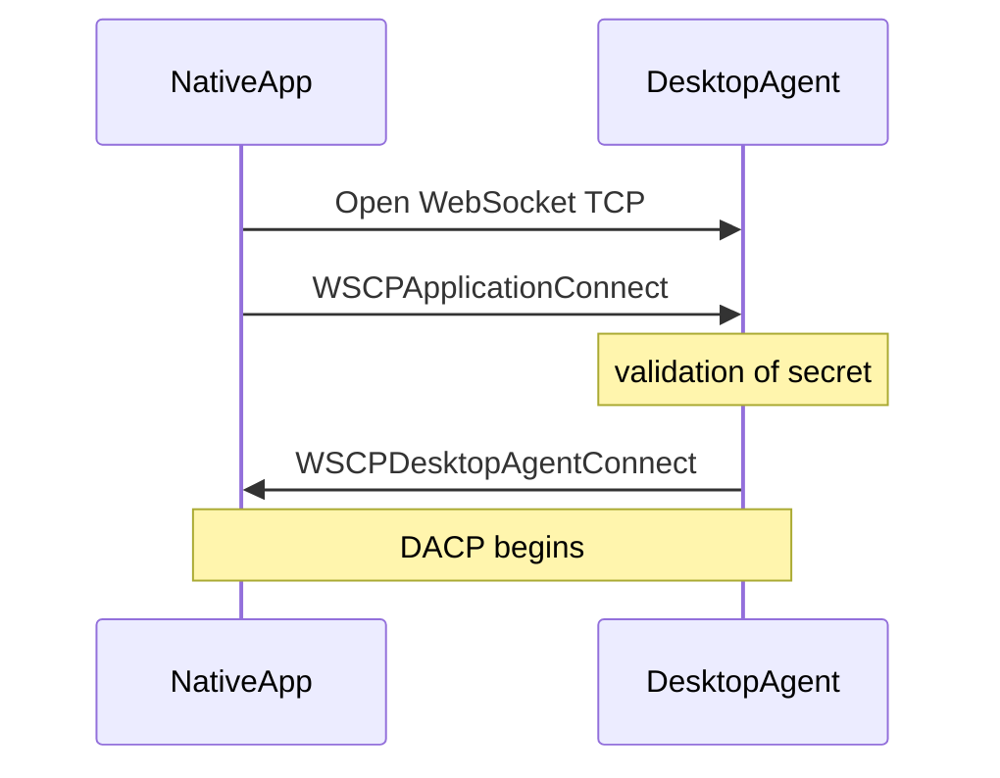
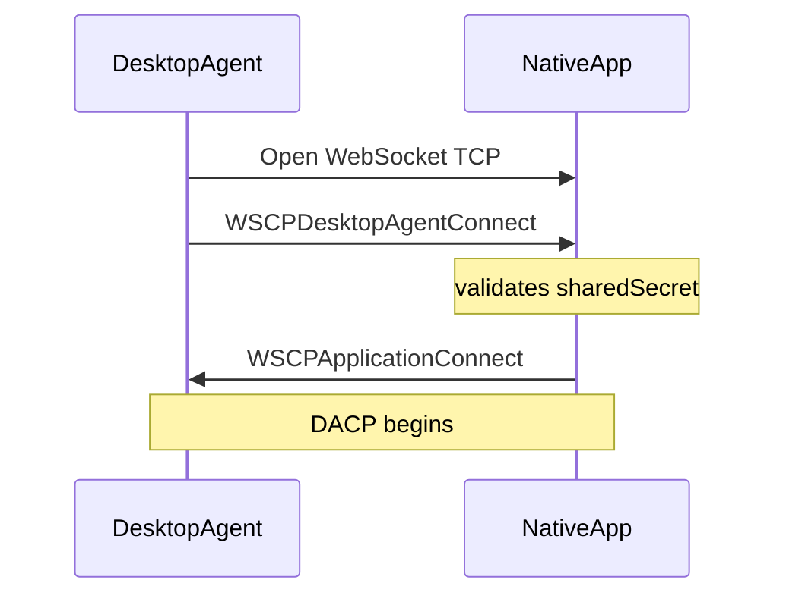
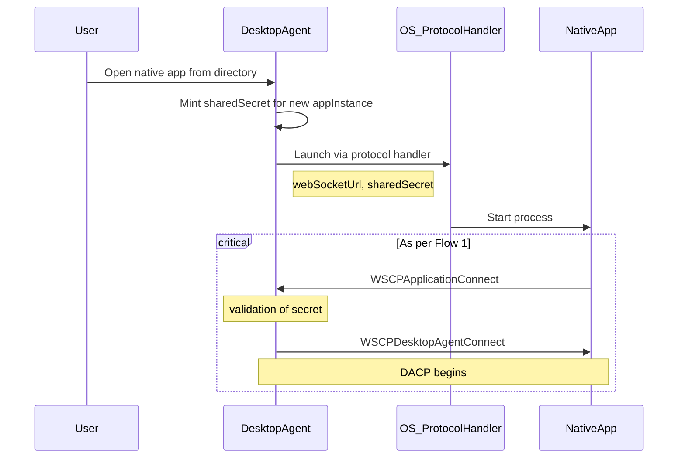

:::info _[@experimental](../../fdc3-compliance#experimental-features)_

FDC3's WebSocket Connection Protocol (WSCP) is an experimental feature. Limited aspects of its design may change in future versions.

:::

# WebSocket Connection Protocol (WSCP)

WSCP establishes identity and instance binding between a **native application** and a **Desktop Agent (DA)** over a WebSocket transport. After the handshake completes, the connection carries [Desktop Agent Communication Protocol (DACP)](./desktopAgentCommunicationProtocol.md) messages unchanged.

WSCP is distinct from the [Web Connection Protocol (WCP)](./webConnectionProtocol.md), which is used for browser `postMessage` / iframe discovery only. Native and other non-browser clients MUST use WSCP (not WCP) for the WebSocket handshake.

## Messages

| Type | Sent by | Purpose |
|------|---------|---------|
| [`WSCPApplicationConnect`](pathname:///schemas/next/api/WSCPApplicationConnect.schema.json) | Native application | Application connect message |
| [`WSCPDesktopAgentConnect`](pathname:///schemas/next/api/WSCPDesktopAgentConnect.schema.json) | Desktop Agent | Desktop Agent connect message |
| [`WSCPConnectFailed`](pathname:///schemas/next/api/WSCPConnectFailed.schema.json) | Acceptor | Handshake failure |
| [`WSCPGoodbye`](pathname:///schemas/next/api/WSCPGoodbye.schema.json) | Either | Graceful disconnect |

The handshake uses **two role-specific connect messages**. Each party always sends its own connect message shape; only the **order** depends on who opened the WebSocket TCP connection:

- The **TCP initiator** sends its role's connect message first, **including `sharedSecret`**.
- The **acceptor** validates the initiator's `sharedSecret` and responds with its own role's connect message (**without `sharedSecret`**), or with [`WSCPConnectFailed`](#wscpconnectfailed) on failure.

Connect messages include `meta.connectionAttemptUuid` and `meta.timestamp`, following the same conventions as WCP.

### `sharedSecret` Field

The `sharedSecret` is the **pairing credential** that binds a WebSocket handshake to a specific native application instance within a specific FDC3 user session. It is minted and held by the Desktop Agent (for example when launching an app or when the user pairs an app in the DA UI) and presented on the wire by whichever party opens the TCP connection.

Each `sharedSecret` is scoped to exactly one `(fdc3Session, appInstance)` pair. It implicitly identifies the FDC3 session — there is no separate `sessionId` field in WSCP messages. The acceptor uses the secret to:

1. **Authenticate the initiator** — confirm that the connecting party is allowed to join this session.
2. **Route to the correct FDC3 session** — associate the WebSocket with the right user context on the Desktop Agent (this is useful in web contexts, where perhaps the domain is hosting multiple different users' sessions).
3. **Bind or resume an app instance** — if the connection is interrupted, the initiator can reconnects with the same secret, reattach the existing instance (superseding any prior WebSocket for that instance).

The TCP **initiator** MUST include `sharedSecret` in its connect message. The **acceptor** MUST validate the secret from that message and MUST NOT echo it back in its response message.   Both parties MUST persist the `sharedSecret` locally for the lifetime of the app instance so that reconnection after interruption repeats the same two-message handshake, with the initiator presenting the same secret again.

### `WSCPApplicationConnect`

Sent by the **native application** during the handshake.  In the example below, the native application is **initiating** the connection:

```json
{
  "type": "WSCPApplicationConnect", // identifies this message type
  "payload": {
    "protocolVersion": "1.0", // WSCP version; MUST be "1.0" for this specification
    "sharedSecret": "a1b2c3d4-e5f6-7890-abcd-ef1234567890" // pairing credential scoped to one (fdc3Session, appInstance) pair
  },
  "meta": {
    "connectionAttemptUuid": "79be3ff9-7c05-4371-842a-cf08427c174d", // generated by the TCP initiator; quoted in the acceptor's response
    "timestamp": "2026-06-11T14:30:00.000Z" // ISO 8601 time the message was sent
  }
}
```

Alternatively, when the application is **accepting** the connection, it sends the message in this shape (excluding shared secret):

```json
{
  "type": "WSCPApplicationConnect",
  "payload": {
    "protocolVersion": "1.0"
  },
  "meta": {
    "connectionAttemptUuid": "79be3ff9-7c05-4371-842a-cf08427c174d", // MUST match the initiator's connect message
    "timestamp": "2026-06-11T14:30:00.200Z"
  }
}
```

### `WSCPDesktopAgentConnect`

Sent by the Desktop Agent during the handshake.  When the DA is the **TCP initiator** it follows this form:

```json
{
  "type": "WSCPDesktopAgentConnect", // identifies this message type
  "payload": {
    "protocolVersion": "1.0",
    "sharedSecret": "b2c3d4e5-f6a7-8901-bcde-f12345678901",
    "implementationMetadata": {
      // same shape as fdc3.getInfo() — see ImplementationMetadata in the API spec
      "fdc3Version": "2.2",
      "provider": "ExampleDA",
      "providerVersion": "1.0.0",
      "optionalFeatures": {
        "OriginatingAppMetadata": true
      },
      "appMetadata": {
        // assigned app identity — MUST include appId and instanceId
        "appId": "my-native-app",
        "instanceId": "instance-42"
      }
    }
  },
  "meta": {
    "connectionAttemptUuid": "79be3ff9-7c05-4371-842a-cf08427c174d", // generated by the TCP initiator
    "timestamp": "2026-06-11T14:30:00.100Z"
  }
}
```

When the DA is **accepting** the handshake, it follows this form:

```json
{
  "type": "WSCPDesktopAgentConnect",
  "payload": {
    "protocolVersion": "1.0",
    "implementationMetadata": {
      "fdc3Version": "2.2",
      "provider": "ExampleDA",
      "providerVersion": "1.0.0",
      "optionalFeatures": {
        "OriginatingAppMetadata": true
      },
      "appMetadata": {
        "appId": "my-native-app",
        "instanceId": "instance-42"
      }
    }
  },
  "meta": {
    "connectionAttemptUuid": "79be3ff9-7c05-4371-842a-cf08427c174d", // MUST match the initiator's connect message
    "timestamp": "2026-06-11T14:30:00.100Z"
  }
}
```

- On reconnect, `implementationMetadata.appMetadata.appId` and `implementationMetadata.appMetadata.instanceId` MUST match the values previously assigned to the `sharedSecret` presented by the initiator.

### `WSCPConnectFailed`

Sent by the acceptor (either desktop agent or application) when the handshake fails or is rejected due to a secret mismatch. The initiator MUST NOT send DACP messages on the WebSocket after receiving this message.

```json
{
  "type": "WSCPConnectFailed", // identifies this message type
  "payload": {
    "message": "Invalid or unknown sharedSecret" // human-readable reason for the failure
  },
  "meta": {
    "connectionAttemptUuid": "79be3ff9-7c05-4371-842a-cf08427c174d", // MUST match the initiator's connect message
    "timestamp": "2026-06-11T14:30:00.100Z"
  }
}
```

- The acceptor SHOULD close the WebSocket after sending this message.

### `WSCPGoodbye`

Sent by either party to indicate a graceful disconnect. This message has no `payload`.

```json
{
  "type": "WSCPGoodbye", // identifies this message type
  "meta": {
    "timestamp": "2026-06-11T15:00:00.000Z" // ISO 8601 time the message was sent
  }
}
```

- Unlike connect messages, `WSCPGoodbye` does not include `connectionAttemptUuid`.
- The acceptor SHOULD close the WebSocket after receiving `WSCPGoodbye` but SHOULD retain the `sharedSecret` mapping so a subsequent connect can resume the app instance.

## Connection scenarios

There are two connection (or reconnection) scenarios, determined by which party opens the WebSocket TCP connection. 

| # | TCP initiator | First message (request) | Second message (response) |
|---|---------------|---------------|----------------|
| 1 | Application | `WSCPApplicationConnect` | `WSCPDesktopAgentConnect` |
| 2 | Desktop Agent | `WSCPDesktopAgentConnect` | `WSCPApplicationConnect` |

---

### Flow 1: Application-initiated connection

A native application opens a WebSocket to the Desktop Agent.



**Steps**

1. The user obtains `webSocketUrl` and `sharedSecret` from their DA UI, or the DA supplies them when launching the application (see [Launching native apps via protocol handlers](#launching-native-apps-via-protocol-handlers)).
2. The native application opens a WebSocket TCP connection to `webSocketUrl`.
3. The application sends `WSCPApplicationConnect` as described above.
4. The DA validates `sharedSecret`:
   - If the secret is recognized as belonging to an existing app instance, the DA reassigns the existing app instance to the new WebSocket and MUST supersede any prior WebSocket connection for that instance.
   - If the secret is new, the DA resolves the native `appId` from the pairing, creates a new app instance, and assigns a new `instanceId`.
5. The DA sends `WSCPDesktopAgentConnect` containing `implementationMetadata` (including `appMetadata` with the assigned `appId` and `instanceId`). 
6. Both parties exchange DACP messages on the same WebSocket.

---

### Flow 2: Desktop Agent-initiated connection

The Desktop Agent opens a WebSocket to a native application that is **listening** as a WebSocket server (reverse direction).



**Steps**

1. The user provides the native app's listen `webSocketUrl` and `sharedSecret` to the DA from the app's UI or config.
2. The DA opens a WebSocket TCP connection to the application's `webSocketUrl`.
3. The DA sends `WSCPDesktopAgentConnect` as described above.
4. The application reads assigned identity from `implementationMetadata.appMetadata`.
5. The application validates `sharedSecret` from the DA's message. If the secret is recognized as belonging to an existing app instance, the application MUST supersede any prior WebSocket connection for that instance.
6. DACP begins.

---

## Disconnection

Either party MAY send `WSCPGoodbye` before closing the WebSocket. The acceptor SHOULD close the connection after receiving `WSCPGoodbye` but SHOULD retain the `sharedSecret` mapping for the app instance so that a subsequent connect with the same `sharedSecret` can resume the session (mirroring WCP `WCP6Goodbye` behaviour).

## Security considerations

- `sharedSecret` SHOULD NOT appear in logs.

## Launching native apps via protocol handlers

When the DA **launches** a native application (via a protocol handler, process spawn, or `open` call), it MAY pass WSCP parameters so the app can connect its FDC3 session as in Flow 1 above.



**Example: Java application launched by the DA**

1. The DA mints a `sharedSecret` and launches the app via a protocol handler URL, embedding `webSocketUrl` and `sharedSecret` as query parameters. For example:

   ```
   fdc3-java-app://launch?webSocketUrl=ws%3A%2F%2Flocalhost%3A8090%2Ffdc3%2Fws&sharedSecret=a1b2c3d4e5f67890
   ```

   (`webSocketUrl` MUST be percent-encoded because it contains reserved characters.)

2. The app unpacks the parameters and calls `GetAgent`.
