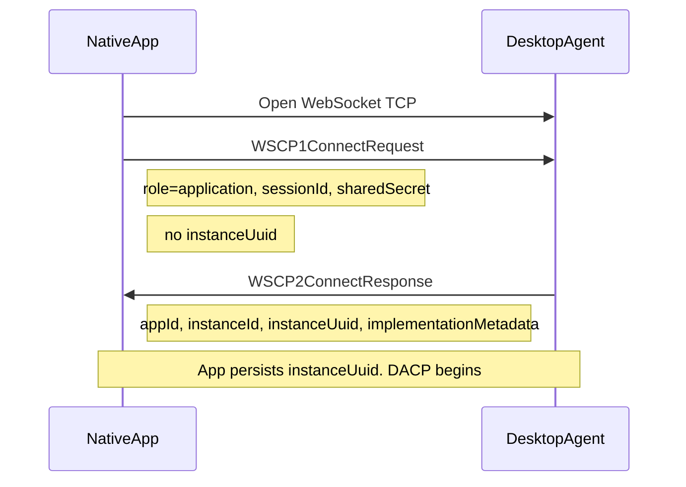
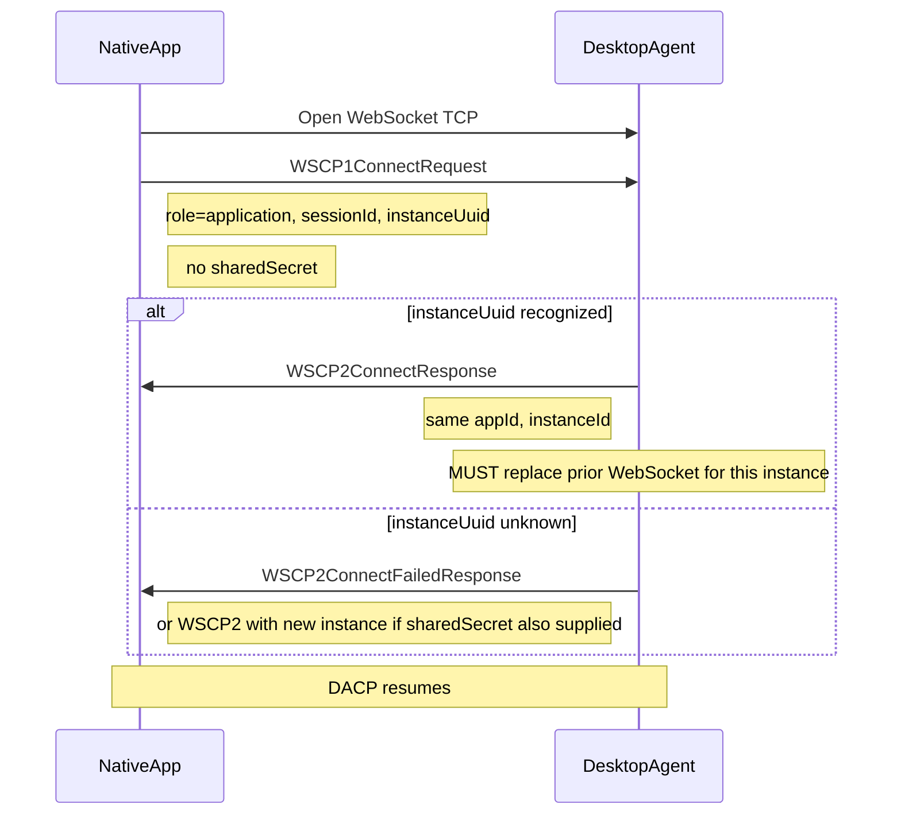
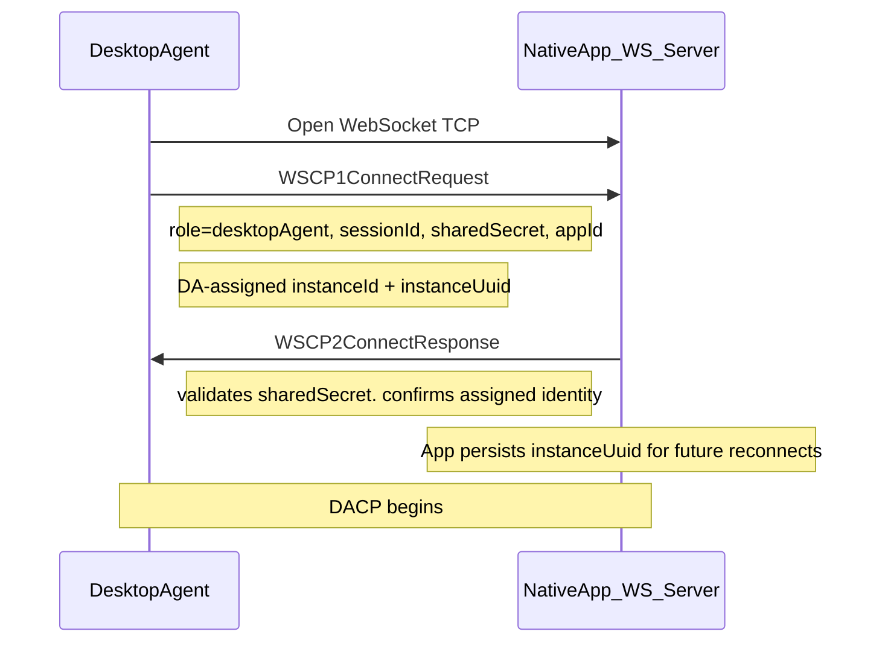
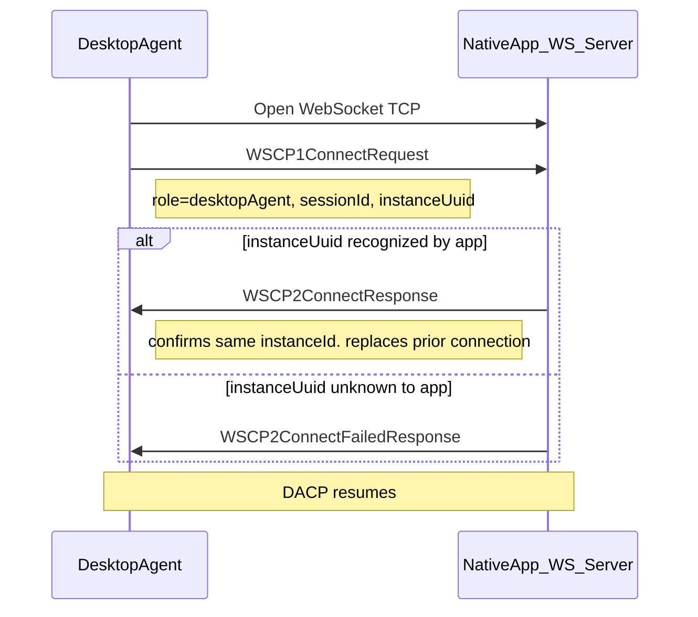
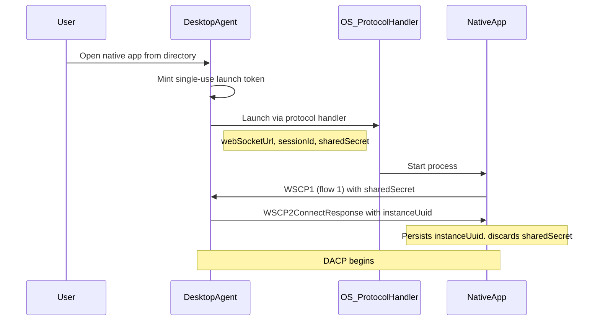

:::info _[@experimental](../../fdc3-compliance#experimental-features)_

FDC3's WebSocket Connection Protocol (WSCP) is an experimental feature. Limited aspects of its design may change in future versions.

:::

# WebSocket Connection Protocol (WSCP)

WSCP establishes identity and instance binding between a **native application** and a **Desktop Agent (DA)** over a WebSocket transport. After the handshake completes, the connection carries [Desktop Agent Communication Protocol (DACP)](./desktopAgentCommunicationProtocol.md) messages unchanged.

WSCP is distinct from the [Web Connection Protocol (WCP)](./webConnectionProtocol.md), which is used for browser `postMessage` / iframe discovery only. Native and other non-browser clients MUST use WSCP (not WCP) for the WebSocket handshake.

## Messages

| Type | Direction | Purpose |
|------|-----------|---------|
| [`WSCP1ConnectRequest`](pathname:///schemas/next/api/WSCP1ConnectRequest.schema.json) | TCP initiator → acceptor | Handshake request |
| [`WSCP2ConnectResponse`](pathname:///schemas/next/api/WSCP2ConnectResponse.schema.json) | Acceptor → initiator | Success |
| [`WSCP2ConnectFailedResponse`](pathname:///schemas/next/api/WSCP2ConnectFailedResponse.schema.json) | Acceptor → initiator | Failure |
| [`WSCP3Goodbye`](pathname:///schemas/next/api/WSCP3Goodbye.schema.json) | Either | Graceful disconnect |

All WSCP messages derive from [`WSCPConnectionStep`](pathname:///schemas/next/api/WSCPConnectionStep.schema.json). Handshake messages (`WSCP1`, `WSCP2`) include `meta.connectionAttemptUuid` and `meta.timestamp`, following the same conventions as WCP.

## Message fields

The table below describes each field in WSCP request and response messages. `webSocketUrl` is not carried in any message; it is deployment configuration used only when opening the TCP connection (e.g. `ws://host/fdc3/ws`).

| Field | Purpose |
|-------|---------|
| `type` | Identifies the message (`WSCP1ConnectRequest`, `WSCP2ConnectResponse`, `WSCP2ConnectFailedResponse`, or `WSCP3Goodbye`). |
| `meta.connectionAttemptUuid` | UUID generated by the TCP initiator at the start of the handshake; quoted in the corresponding response so both parties correlate the exchange. |
| `meta.timestamp` | ISO 8601 timestamp of when the message was sent. |
| `payload.role` | On connect request: role of the TCP initiator — `application` (native app connecting to a DA) or `desktopAgent` (DA connecting to a native app WS server). |
| `payload.protocolVersion` | On connect request: WSCP version; MUST be `1.0` for this specification. |
| `payload.sessionId` | On connect request: routes the connection to the correct DA user session. Required on every connect request. |
| `payload.sharedSecret` | On connect request: pairing credential for **initial** connection (flow 1). Authenticates the initiator to the acceptor for `(sessionId, appId)`. MUST be omitted on application-initiated **reconnect** (flow 2) when `instanceUuid` is supplied.  |
| `payload.appId` | App Directory identifier.  |
| `payload.instanceId` | DA-assigned instance ID.  |
| `payload.instanceUuid` | DA-assigned instance binding (mirrors WCP — see [identity validation](./webConnectionProtocol.md)). Issued in `WSCP2ConnectResponse`; used on **reconnect**. The non-DA party MUST persist it in order to reconnect sessions after interruption. |
| `payload.implementationMetadata` | DA-provided implementation metadata, including a copy of the app's own metadata in `appMetadata`. |
| `payload.message` | On connect failed response: human-readable description of why the handshake failed. |

`WSCP3Goodbye` has no `payload`; only `type` and `meta.timestamp` are sent.

### Credential roles

| Credential | When used | Purpose |
|------------|-----------|---------|
| `sharedSecret` | (initial connect) | Admission ticket — proves the app is allowed to connect for this `(sessionId, appId)` pairing |
| `instanceUuid` | (reconnect) | Reconnect ticket — proves this is the same instance that already completed the initial connect flow (same model as WCP) |

## Connection scenarios

There are four connection scenarios: two TCP initiators (application or Desktop Agent) × two handshake types (initial connection or reconnection).

| # | TCP initiator | Handshake type |
|---|---------------|----------------|
| 1 | Application | Initial connection |
| 2 | Application | Reconnection |
| 3 | Desktop Agent | Initial connection |
| 4 | Desktop Agent | Reconnection |

---

### Flow 1: Application-initiated initial connection

A native application opens a WebSocket to the Desktop Agent and connects for the first time (no prior `instanceUuid`).



**Steps**

1. The user obtains `webSocketUrl`, `sessionId`, and `sharedSecret` from their DA UI.
2. The native application opens a WebSocket TCP connection to `webSocketUrl`.
3. The application sends `WSCP1ConnectRequest` with:
   - `role`: `application`
   - `protocolVersion`: `1.0`
   - `sessionId` and `sharedSecret` (required)
   - `instanceUuid`: omitted
4. The DA validates `sessionId` and `sharedSecret`, resolves the native `appId` from the pairing, and assigns a new `instanceId` and `instanceUuid`.
5. The DA sends `WSCP2ConnectResponse` containing `appId`, `instanceId`, `instanceUuid`, and `implementationMetadata`.
6. The application persists `instanceUuid` for future reconnection.
7. Both parties exchange DACP messages on the same WebSocket.

**Failure outcomes**

- Invalid or unknown `sessionId` → `WSCP2ConnectFailedResponse`
- Missing or invalid `sharedSecret` → `WSCP2ConnectFailedResponse`
- DACP messages sent before handshake completes → MUST be rejected

---

### Flow 2: Application-initiated reconnection

The same native application instance reconnects after a network drop or process restart, using the persisted `instanceUuid`.



**Steps**

1. The application opens a new WebSocket TCP connection to `webSocketUrl`.
2. The application sends `WSCP1ConnectRequest` with:
   - `role`: `application`
   - `sessionId` (required)
   - `instanceUuid` from the prior `WSCP2ConnectResponse` (required)
3. If the DA recognizes `instanceUuid`:
   1. The DA reassigns the existing `instanceId` and `appId` to the new WebSocket.
   2. The DA MUST supersede any prior WebSocket connection for that instance.
   3. The DA sends `WSCP2ConnectResponse` with the same `appId` and `instanceId`.
4. If the DA does not recognize `instanceUuid` (e.g. DA restarted and lost in-memory state):
   1. The DA SHOULD send `WSCP2ConnectFailedResponse`.
   2. The application MUST repeat flow 1 with a valid `sharedSecret` (or obtain a new launch token from the DA).
5. DACP traffic resumes on the new WebSocket.

---

### Flow 3: Desktop Agent-initiated initial connection

The Desktop Agent opens a WebSocket to a native application that is **listening** as a WebSocket server (reverse direction).

The DA assigns `instanceId` and `instanceUuid`. These values are carried in `WSCP1ConnectRequest`; the application acknowledges them in `WSCP2ConnectResponse`.



**Steps**

1. The user provides the native app's listen `webSocketUrl` and `sharedSecret` to the DA.
2. The DA opens a WebSocket TCP connection to the application's `webSocketUrl`.
3. The DA sends `WSCP1ConnectRequest` with `role: desktopAgent`, `sessionId`, `sharedSecret`, `appId`, and DA-assigned `instanceId` + `instanceUuid`.
4. The application validates `sharedSecret` and sends `WSCP2ConnectResponse` confirming the assigned identity.
5. The application persists `instanceUuid` for flow 4.
6. DACP begins.

**Failure outcomes**

- Invalid `sharedSecret` → `WSCP2ConnectFailedResponse`

---

### Flow 4: Desktop Agent-initiated reconnection

The Desktop Agent reconnects to a native application after a prior DA-initiated session ended.



**Steps**

1. The DA and application retain `instanceId` and `instanceUuid` from flow 3.
2. The DA opens a new WebSocket and sends `WSCP1ConnectRequest` with `sessionId`, prior `instanceId` + `instanceUuid`, and **no** `sharedSecret`.
3. If the application recognizes `instanceUuid`, it sends `WSCP2ConnectResponse` and replaces any prior connection for that instance.
4. If `instanceUuid` is not recognized, the application SHOULD send `WSCP2ConnectFailedResponse`; the DA must repeat flow 3 with a valid `sharedSecret`.

---

## Disconnection

Either party MAY send `WSCP3Goodbye` before closing the WebSocket. The acceptor SHOULD close the connection after receiving `WSCP3Goodbye` but SHOULD retain instance details in case the application reconnects (mirroring WCP `WCP6Goodbye` behaviour).

## Security considerations

- `sharedSecret` SHOULD NOT appear in logs.
- On initial connect, `sessionId` + `sharedSecret` are both required.
- On reconnect, `sessionId` + `instanceUuid` are both required.
- `instanceUuid` SHOULD be unguessable and treated as a reconnect shared secret, as in WCP.
- On reconnect, the acceptor MUST replace the prior WebSocket for the recognized `instanceUuid`.

## Launching native apps via protocol handlers

When the DA **launches** a native application (via a protocol handler, process spawn, or `open` call), it MAY pass WSCP parameters so the app can connect immediately — [flow 1](#flow-1-application-initiated-initial-connection).

For launch, the DA SHOULD mint a **transient, single-use** `sharedSecret` (a launch token) scoped to one connection attempt. The token is consumed on successful handshake and need not be persisted by the application. Leakage via a protocol-handler URL (e.g. `myapp://launch?sessionId=...&sharedSecret=...`) is acceptable because the token expires or is invalidated after use.

After flow 1 completes, the application persists only `instanceUuid`. Subsequent reconnects use [flow 2](#flow-2-application-initiated-reconnection) with `sessionId` + `instanceUuid` — no `sharedSecret` required.



**Example: Java application launched by the DA**

1. The DA mints a `sharedSecret` and launches the app via a protocol handler URL, embedding `webSocketUrl`, `sessionId`, and `sharedSecret` as query parameters. For example:

   ```
   fdc3-java-app://launch?webSocketUrl=ws%3A%2F%2Flocalhost%3A8090%2Ffdc3%2Fws&sessionId=some-user-session-42&sharedSecret=a1b2c3d4e5f67890
   ```

   (`webSocketUrl` MUST be percent-encoded because it contains reserved characters.)

2. The app unpacks the parameters and calls `GetAgent`.

