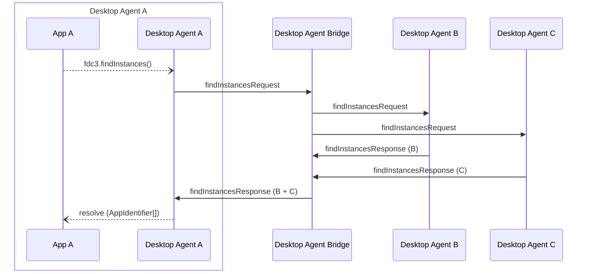

Desktop Agent bridging message exchange for a `findInstances` API call on the [`DesktopAgent`](../../api/ref/DesktopAgent). Generated by API calls:

- [`findInstances(app: AppIdentifier): Promise<Array<AppIdentifier>>`](../../api/ref/DesktopAgent#findinstances)

[Message Exchange Type](../spec#individual-message-exchanges): **Request Response (collated)** or **Request Response (single)**

A Desktop Agent's [`findInstances`](../../api/ref/DesktopAgent#findinstances) API call should return an empty array for known applications and [`ResolveError.NoAppsFound`](../../api/ref/Errors#resolveerror) for unknown apps. Hence, if a findInstances request is received through bridging for a known app with no instances then a normal response should be returned with an empty array. The bridge should add the responding agent to the `sources` array in the collated response as this is a valid response. If the application is not known to the agent an error response should be used instead with the `ResolveError.NoAppsFound` message and the responding Desktop Agent should be added to the `meta.errorSources` of the bridge response.

In the event that all agents returned an error response, then the bridge will also return an error response, which is passed back to the calling application. However, if any agent returned a valid response (including with an empty array) then the application was known, but had no instances, resulting in an empty array being returned to the calling application.
E.g.

```javascript
// Retrieve a list of all instances of an application
let instances = await fdc3.findInstances({appId: "MyAppId"});

// Retrieve a list of instances of an application on a specified Desktop Agent
let instances = await fdc3.findInstances({appId: "MyAppId", desktopAgent: "agent-A"});
```

## Message exchange



## Request format

### Request message schemas

- [https://fdc3.finos.org/schemas/2.1/bridging/findInstancesAgentRequest.schema.json](pathname:///schemas/2.1/bridging/findInstancesAgentRequest.schema.json)
- [https://fdc3.finos.org/schemas/2.1/bridging/findInstancesBridgeRequest.schema.json](pathname:///schemas/2.1/bridging/findInstancesBridgeRequest.schema.json)

### Example

Outward message to the bridge:

```json
// agent-A -> DAB
{
    "type": "findInstancesRequest",
    "payload": {
        "app": {
            "appId": "myApp"
        }
    },
    "meta": {
        "requestUuid": "<requestUuid>",
        "timestamp": "2020-03-...",
        "source": {
            "appId": "AChatApp",
            "instanceId": "02e575aa-4c3a-4b66-acad-155073be21f6"
        }
    }
}
```

which is repeated on to the target agent as:

```json
// DAB -> agent-B
{
    "type": "findInstancesRequest",
    "payload": {
        "app": {
            "appId": "myApp"
        }
    },
    "meta": {
        "requestUuid": "<requestUuid>",
        "timestamp": 2020-03-...,
        "source": {
            "appId": "AChatApp",
            "instanceId": "02e575aa-4c3a-4b66-acad-155073be21f6",
            "desktopAgent": "agent-A" //added by DAB
        }
    }
}
```

:::note
If the `findInstancesRequest` from the requesting agent does not include a `meta.source` field then the Bridge MUST set the `meta.source.desktopAgent` field to attribute the request to the requesting agent. This is the case for all agent request messages that don't require application details.
:::

If results should be constrained to a particular Desktop Agent, then set a `desktopAgent` field in `payload.app` and a matching `destination` field in `meta`:

```json
// agent-A -> DAB
{
    "type": "findInstancesRequest",
    "payload": {
        "app": {
            "appId": "myApp",
            "desktopAgent": "agent-B" // destination agent
        }
    },
    "meta": {
        "requestUuid": "<requestUuid>",
        "timestamp": "2020-03-...",
        "destination": { "desktopAgent": "agent-B" }, //destination agent
        "source": {
            "appId": "AChatApp",
            "instanceId": "02e575aa-4c3a-4b66-acad-155073be21f6"
        }
    }
}
```

The Desktop Agent Bridge should only forward the request to the requested Desktop Agent and handle the message exchange as a **Request Response (single)**.

## Response format

### Response message schemas

- [https://fdc3.finos.org/schemas/2.1/bridging/findInstancesAgentResponse.schema.json](pathname:///schemas/2.1/bridging/findInstancesAgentResponse.schema.json)
- [https://fdc3.finos.org/schemas/2.1/bridging/findInstancesAgentErrorResponse.schema.json](pathname:///schemas/2.1/bridging/findInstancesAgentErrorResponse.schema.json)
- [https://fdc3.finos.org/schemas/2.1/bridging/findInstancesBridgeResponse.schema.json](pathname:///schemas/2.1/bridging/findInstancesBridgeResponse.schema.json)
- [https://fdc3.finos.org/schemas/2.1/bridging/findInstancesBridgeErrorResponse.schema.json](pathname:///schemas/2.1/bridging/findInstancesBridgeErrorResponse.schema.json)

### Example

Response message from a Desktop Agent:

```json
// agent-B -> DAB
{
    "type":  "findInstancesResponse",
    "payload": {
        "appIdentifiers":  [
            { "appId": "myApp", "instanceId": "4bf39be1-a25b-4ad5-8dbc-ce37b436a344" },
            { "appId": "myApp", "instanceId": "4f10abb7-4df4-4fc6-8813-bbf0dc1b393d" },
        ]
    },
    "meta": {
        "requestUuid": "<requestUuid>",
        "responseUuid":  "<responseUuidAgentB>",
        "timestamp":  "2020-03-...",
    }
}
```

The bridge receives and collates the responses, augmenting each appIdentifier with a `desktopAgent` field, producing the following collated response which it sends back to agent-A:

```json
// DAB -> agent-A
{
    "type":  "findInstancesResponse",
    "payload": {
        "appIdentifiers":  [
            { "appId": "myApp", "instanceId": "4bf39be1-a25b-4ad5-8dbc-ce37b436a344", "desktopAgent": "agent-B" },
            //"desktopAgent" added by DAB
            { "appId": "myApp", "instanceId": "4f10abb7-4df4-4fc6-8813-bbf0dc1b393d", "desktopAgent": "agent-B" },
            { "appId": "myApp", "instanceId": "920b74f7-1fef-4076-adef-63b82bae0dd9", "desktopAgent": "agent-C" },
        ]
    },
    "meta": {
        "requestUuid": "<requestUuid>",
        "responseUuid":  "<responseUuidDAB>", 
        "timestamp":  "2020-03-...",
        "sources": [ //added by DAB
            { "desktopAgent": "agent-A" },
            { "desktopAgent": "agent-B" },
        ]
    }
}
```

:::info
If a target Desktop Agent was specified in the request (via a `desktopAgent` field in `payload.app`), then the DAB is not collating responses and does not need to generate a unique `meta.responseUuid` and MUST quote that given by the responding Desktop Agent.
:::

:::note
In the event that an agent times out or returns an error, where others respond, its `DesktopAgentIdentifier` should be added to the `meta.errorSources` element instead of `meta.sources`.
:::

Finally, agent-A combines the data received from the bridge, with its own local response to produce the response to the requesting application:

```json
// DAB -> agent-A
[
    { "appId": "myApp", "instanceId": "4bf39be1-a25b-4ad5-8dbc-ce37b436a344", "desktopAgent": "agent-B" },
    { "appId": "myApp", "instanceId": "4f10abb7-4df4-4fc6-8813-bbf0dc1b393d", "desktopAgent": "agent-B" },
    { "appId": "myApp", "instanceId": "920b74f7-1fef-4076-adef-63b82bae0dd9", "desktopAgent": "agent-C" },
    { "appId": "myApp", "instanceId": "688dbd5e-21dc-4469-b8cf-4b6a606f9a27" } //local response
]
```
