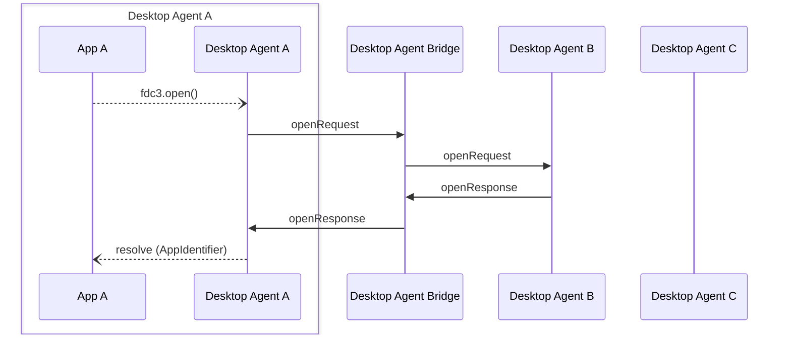

Desktop Agent bridging message exchange for a `open` API call on the [`DesktopAgent`](../../api/ref/DesktopAgent). Generated by API calls:

- [`open(app: AppIdentifier, context?: Context): Promise<AppIdentifier>`](../../api/ref/DesktopAgent#open)

[Message Exchange Type](../spec#individual-message-exchanges): **Request Response (single)**

E.g.

```javascript
// Open an app without context, using an AppIdentifier object to specify the target and Desktop Agent
let AppIdentifier = {appId: 'myApp-v1.0.1', desktopAgent:"DesktopAgentB"};
let instanceMetadata = await fdc3.open(AppIdentifier);

// Open an app with context, using an AppIdentifier object to specify the target and Desktop Agent
let AppIdentifier = {appId: 'myApp-v1.0.1', desktopAgent:"DesktopAgentB"};
let instanceMetadata = await fdc3.open(AppIdentifier, contextObj);
```

Note that it is not currently possible to identify resolve all available applications within a Desktop Agent via the FDC3 API. Hence, `fdc3.open` calls without a specified `desktopAgent` field in their `AppIdentifier`, e.g.:

```javascript
// Open a target app via AppIdentifier, without a specified Desktop Agent 
let AppIdentifier = {appId: 'myApp-v1.0.1'};
let instanceMetadata = await fdc3.open(AppIdentifier);
```

should always be processed locally without be passed to the bridge.

The `fdc3.open` command should result in a single copy of the specified app being opened and its instance data returned, or an error if it could not be opened. When receiving a response from invoking `fdc3.open` via the Desktop Agent Bridge, the new app instances MUST be initialized before responding as the responding Desktop Agent will need to return an `AppIdentifier` with an `instanceId` field set.

If the remote Desktop Agent is not currently connected from the bridge, the [`OpenError.DesktopAgentNotFound` error](../../api/ref/Errors#openerror) should be returned in the response from the bridge and the promise returned  from the call to `fdc3.open` rejected with it.

## Message exchange



## Request format

### Request message schemas

- [https://fdc3.finos.org/schemas/2.1/bridging/openAgentRequest.schema.json](pathname:///schemas/2.1/bridging/openAgentRequest.schema.json)
- [https://fdc3.finos.org/schemas/2.1/bridging/openBridgeRequest.schema.json](pathname:///schemas/2.1/bridging/openBridgeRequest.schema.json)

### Example

Outward message to the bridge:

```json
// agent-A -> DAB
{
    "type": "openRequest",
    "payload": {
        "app": {
            "appId": "myApp",
            "desktopAgent":"agent-B"
        },
        "context": {/*contextObj*/}
    },
    "meta": {
        "requestUuid": "<requestUuid>",
        "timestamp": "2020-03-...",
        "source": {
            "appId": "AChatApp",
            "instanceId": "02e575aa-4c3a-4b66-acad-155073be21f6"
        }
    }
}
```

which is repeated on to the target agent as:

```json
// DAB -> agent-B
{
    "type": "openRequest",
    "payload": {
        "app": {
            "appId": "myApp",
            "desktopAgent":"DesktopAgentB"
        },
        "context": {/*contextObj*/}
    },
    "meta": {
        "requestUuid": "<requestUuid>",
        "timestamp": 2020-03-...,
        "source": {
            "appId": "AChatApp",
            "instanceId": "02e575aa-4c3a-4b66-acad-155073be21f6",
            "desktopAgent": "agent-A" //added by DAB
        }
    }
}
```

## Response format

### Response message schemas

- [https://fdc3.finos.org/schemas/2.1/bridging/openAgentResponse.schema.json](pathname:///schemas/2.1/bridging/openAgentResponse.schema.json)
- [https://fdc3.finos.org/schemas/2.1/bridging/openAgentErrorResponse.schema.json](pathname:///schemas/2.1/bridging/openAgentErrorResponse.schema.json)
- [https://fdc3.finos.org/schemas/2.1/bridging/openBridgeResponse.schema.json](pathname:///schemas/2.1/bridging/openBridgeResponse.schema.json)
- [https://fdc3.finos.org/schemas/2.1/bridging/openBridgeErrorResponse.schema.json](pathname:///schemas/2.1/bridging/openBridgeErrorResponse.schema.json)

### Example

Response message from target Desktop Agent:

```json
// agent-B -> DAB
{
    "type": "openResponse",
    "payload": {
        "appIdentifier": {
            "appId": "myApp",
            "instanceId": "e36d43e1-4fd3-447a-a227-38ec48a92706"
        }
    },
    "meta": {
        "requestUuid": "<requestUuid>",
        "responseUuid": "<responseUuid>",
        "timestamp": "2020-03-..."
    }
}
```

which is augmented and repeated on by the bridge as:

```json
// agent-B -> DAB
{
    "type": "openResponse",
    "payload": {
        "appIdentifier": {
            "appId": "myApp",
            "instanceId": "e36d43e1-4fd3-447a-a227-38ec48a92706"
        }
    },
    "meta": {
        "requestUuid": "<requestUuid>",
        "responseUuid": "<responseUuid>",
        "timestamp": "2020-03-...",
        "sources": [{ "desktopAgent": "agent-B" }] // added by DAB
    }
}
```
