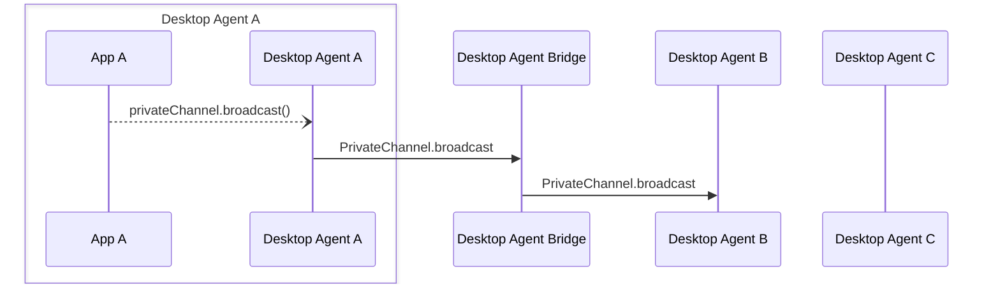

Desktop Agent bridging message exchange for a `broadcast` API call on a [`PrivateChannel`](../../api/ref/PrivateChannel). Generated by API calls:

- [`PrivateChannel.broadcast(context: Context)`](../../api/ref/Channel#broadcast) (inherited from the [Channel](../../api/ref/Channel#broadcast) class)

[Message Exchange Type](../spec#individual-message-exchanges): **Request only**

:::caution

Some additional tracking of PrivateChannel metadata is required on the Desktop Agent that created each PrivateChannel and on any Desktop Agent interacting with it, in order to use these message exchanges. Please see the [relevant section of the Agent Bridging overview](../spec#privatechannels) for more details.

:::

## Message exchange



## Request format

### Request message schemas

- [https://fdc3.finos.org/schemas/2.2/bridging/privateChannelBroadcastAgentRequest.schema.json](pathname:///schemas/2.2/bridging/privateChannelBroadcastAgentRequest.schema.json)
- [https://fdc3.finos.org/schemas/2.2/bridging/privateChannelBroadcastBridgeRequest.schema.json](pathname:///schemas/2.2/bridging/privateChannelBroadcastBridgeRequest.schema.json)

### Example

```javascript
fdc3.addIntentListener("QuoteStream", async (context) => {
    const privateChannel: PrivateChannel = await fdc3.createPrivateChannel();
    const symbol = context.id.ticker;

    // This gets called when the remote side adds a context listener
    const addContextListener = privateChannel.onAddContextListener((contextType) => {
        // broadcast price quotes as they come in from our quote feed
        feed.onQuote(symbol, (price) => {
            privateChannel.broadcast({ type: "price", price});
        });
    });

    ...

    return channel;
});
```

Broadcast messages that are sent from Agents that received the private channel from a remote agent are sent to the Desktop Agent that created the channel and returned it as an `IntentResult`, which is responsible for forwarding them onto other subscribers. If a broadcast message is generated on the Agent that created the channel it simply forwards it onto each subscriber.

Hence, the broadcast message should be repeated once for each subscriber, and modified such that it includes a destination, specified as a full `AppIdentifier`, and the `type` should indicate that it is a `PrivateChannel` broadcast:

```json
// DAB -> agent-B
{
    "type": "PrivateChannel.broadcast", //modified type for PrivateChannel broadcasts
    "payload": {
        "channelId": "private-channel-ABC123",
        "context": { /*contextObj*/}
    },
    "meta": {
        "requestUuid": "<requestUuid>",
        "timestamp": "2020-03-...",
        "source": {
            "appId": "AChatApp",
            "instanceId": "02e575aa-4c3a-4b66-acad-155073be21f6",
            "desktopAgent": "agent-A" //added by DAB
        },
        "destination": {
            "appId": "AnotherApp",
            "instanceId": "02e235ba-acad-4b66-4c3a-547073be23f1",
            "desktopAgent": "agent-B"
        }
    }
}
```
