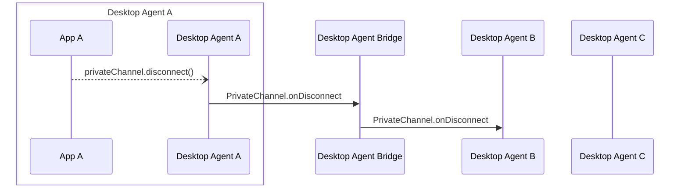

Desktop Agent bridging message exchange for a `disconnect()` API call on  [`PrivateChannel`](../../api/ref/PrivateChannel). Generated by API call:

- [`PrivateChannel.disconnect(): void`](../../api/ref/PrivateChannel#disconnect)

[Message Exchange Type](../spec#individual-message-exchanges): **Request only**

:::caution

Some additional tracking of PrivateChannel metadata is required on the Desktop Agent that created each PrivateChannel and on any Desktop Agent interacting with it, in order to use these message exchanges. Please see the [relevant section of the Agent Bridging overview](../spec#privatechannels) for more details.

:::

When the `disconnect` function is is called on a `PrivateChannel` any applications that have added an `onDisconnect` handler or an `onUnsubscribe` handler (which is automatically called when an application disconnects) MUST be notified. If the listener is on the agent that created that channel, it should forward the message onto all the registered listeners. If the listener is added on a remote agent it MUST send the message to the agent that created the channel which will repeat it onto the other listeners without modifying the source information. If the `PrivateChannel` was created by a remote agent, only the single `PrivateChannel.onDisconnect` is required. It is the responsibility of the Desktop Agent that created the channel to ensure that any relevant `onUnsubscribe` handlers are also called by sending additional `PrivateChannel.onUnsubscribe` messages to them before forwarding the `PrivateChannel.onDisconnect`. This applies whether the disconnection occurred on that agent or on a remote agent.

## Message exchange



### Request message schemas

### Schema

- [https://fdc3.finos.org/schemas/2.2/bridging/privateChannelOnDisconnectAgentRequest.schema.json](/schemas/2.2/bridging/privateChannelOnDisconnectAgentRequest.schema.json)
- [https://fdc3.finos.org/schemas/2.2/bridging/privateChannelOnDisconnectBridgeRequest.schema.json](/schemas/2.2/bridging/privateChannelOnDisconnectBridgeRequest.schema.json)

### Example

```json
// agent-A -> DAB
{
    "type": "PrivateChannel.onDisconnect",
    "payload": {
        "channelId": "private-channel-ABC123"
    },
    "meta": {
        "requestUuid": "<requestUuid>",
        "timestamp": "2020-03-...",
        "source": {
            "appId": "AnotherApp",
            "instanceId": "02e235ba-acad-4b66-4c3a-547073be23f1",
            "desktopAgent": "agent-B" //added by DAB
        },
        "destination": {
            "appId": "AChatApp",
            "instanceId": "02e575aa-4c3a-4b66-acad-155073be21f6",
            "desktopAgent": "agent-A"
        }
    }
}
```
