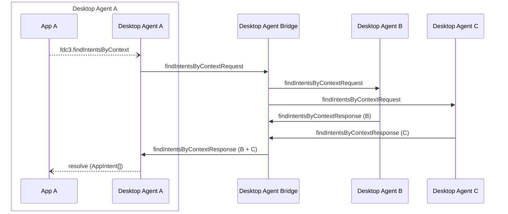

Desktop Agent bridging message exchange for a `findIntent` API call on the [`DesktopAgent`](../../api/ref/DesktopAgent). Generated by API call:

- [`findIntentsByContext(context: Context, resultType?: string): Promise<Array<AppIntent>>`](../../api/ref/DesktopAgent#findintentsbycontext)

[Message Exchange Type](../spec#individual-message-exchanges): **Request Response (collated)**

E.g. An application with appId `agentA-app1` makes the following API call:

```javascript
let appIntentArr = await fdc3.findIntentsByContext(context);
```

:::note
The message exchanges for this API call are nearly identical to that used for [`findIntent()`](findIntent), differing only by the lack of an `intent` field in the request message payload and the structure of the response message (where an array of `AppIntents` is returned).
:::

## Message exchange



## Request format

### Request message schemas

- [https://fdc3.finos.org/schemas/2.2/bridging/findIntentsByContextAgentRequest.schema.json](/schemas/2.2/bridging/findIntentsByContextAgentRequest.schema.json)
- [https://fdc3.finos.org/schemas/2.2/bridging/findIntentsByContextBridgeRequest.schema.json](/schemas/2.2/bridging/findIntentsByContextBridgeRequest.schema.json)

### Example

Outward message to the DAB:

```json
// agent-A -> DAB
{
    "type": "findIntentsByContextRequest",
    "payload": {
        "context": {/*contextObj*/},
        "resultType": "fdc3.instrument"
    },
    "meta": {
        "requestUuid": "<requestUuid>",
        "timestamp": "2020-03-...",
        "source": {
            "appId": "agentA-app1",
            "instanceId": "c6ad5174-6f78-4582-8e96-728d93a4d7d7"
        }
    }
}
```

The DAB fills in the `source.desktopAgent` field and forwards the request to the other Desktop Agents (agent-B AND agent-C).

```json
// DAB -> agent-B
// DAB -> agent-C
{
    "type": "findIntentsByContextRequest",
    "payload": {
        "context": {/*contextObj*/},
        "resultType": "fdc3.instrument"
    },
    "meta": {
        "requestUuid": "<requestUuid>",
        "timestamp": "2020-03-...",
        "source": {
            "appId": "agentA-app1",
            "instanceId": "c6ad5174-6f78-4582-8e96-728d93a4d7d7",
            "desktopAgent": "agent-A" //added by DAB
        }
    }
}
```

## Response format

### Response message schemas

- [https://fdc3.finos.org/schemas/2.2/bridging/findIntentsByContextAgentResponse.schema.json](/schemas/2.2/bridging/findIntentsByContextAgentResponse.schema.json)
- [https://fdc3.finos.org/schemas/2.2/bridging/findIntentsByContextAgentErrorResponse.schema.json](/schemas/2.2/bridging/findIntentsByContextAgentErrorResponse.schema.json)
- [https://fdc3.finos.org/schemas/2.2/bridging/findIntentsByContextBridgeResponse.schema.json](/schemas/2.2/bridging/findIntentsByContextBridgeResponse.schema.json)
- [https://fdc3.finos.org/schemas/2.2/bridging/findIntentsByContextBridgeErrorResponse.schema.json](/schemas/2.2/bridging/findIntentsByContextBridgeErrorResponse.schema.json)

### Example

An individual agent (for example agentB) would generate a local response as an array of `AppIntent` objects:

```json
[
    {
        "intent": { "name": "StartChat" },
        "apps": [
            { "appId": "Skype", "title": "Skype" /* other AppMetadata fields may be included */},
            { "appId": "Symphony", "title": "Symphony" },
            { "appId": "Symphony", 
                "instanceId": "93d2fe3e-a66c-41e1-b80b-246b87120859", 
                "title": "Symphony" },
            { "appId": "Slack", "title": "Slack" }
        ]
    },
    {
        "intent": { "name": "ViewProfile" },
        "apps": [
            { "appId": "myCRM", "title": "My CRM" },
            { "appId": "myCRM", 
            "instanceId": "93d2fe3e-a66c-41e1-b80b-246b87120859", 
            "title": "My CRM" }
        ]
    }
]
```

This response is encoded and sent to the bridge as:

```json
// agent-B -> DAB
{
    "type":  "findIntentsByContextResponse",
    "payload": {
        "appIntents": [
            {
                "intent": { "name": "StartChat" },
                "apps": [
                    { "appId": "Skype", "title": "Skype" /* other AppMetadata fields may be included */},
                    { "appId": "Symphony", "title": "Symphony" },
                    { "appId": "Symphony", 
                        "instanceId": "93d2fe3e-a66c-41e1-b80b-246b87120859", 
                        "title": "Symphony" },
                    { "appId": "Slack", "title": "Slack" }
                ]
            },
            {
                "intent": { "name": "ViewProfile" },
                "apps": [
                    { "appId": "myCRM", "title": "My CRM" },
                    { "appId": "myCRM", 
                    "instanceId": "93d2fe3e-a66c-41e1-b80b-246b87120859", 
                    "title": "My CRM" }
                ]
            }
        ]
    },
    "meta": {
        "requestUuid": "<requestUuid>",
        "responseUuid":  "<responseUuidAgentB>",
        "timestamp":  "2020-03-...",
    }
}
```

Each `AppMetadata` object is augmented by the bridge with a `desktopAgent` field, the responding `DesktopAgentIdentifier` value is added to the `meta.sources` element and the message payload is collated with responses from other agents into a response to the requesting agent:

```json
// DAB -> agent-A
{
    "type":  "findIntentsByContextResponse",
    "payload": {
        "appIntents": [
            {
                "intent": { "name": "StartChat" },
                "apps": [
                    //agent-B responses
                    { "appId": "Skype", "title": "Skype", "desktopAgent": "agent-B" },
                    { "appId": "Symphony", "title": "Symphony", "desktopAgent": "agent-B" },
                    { "appId": "Symphony", 
                        "instanceId": "93d2fe3e-a66c-41e1-b80b-246b87120859", 
                        "title": "Symphony", 
                        "desktopAgent": "agent-B" },
                    { "appId": "Slack", "title": "Slack", "desktopAgent": "agent-B" },
                    //agent-C response
                    { "appId": "WebIce", "desktopAgent": "agent-C"}
                ]
            },
            {
                "intent": { "name": "ViewProfile" },
                "apps": [
                    //agent-A responses
                    { "appId": "myCRM", "title": "My CRM", "desktopAgent": "agent-B" },
                    { "appId": "myCRM", 
                    "instanceId": "93d2fe3e-a66c-41e1-b80b-246b87120859", 
                    "title": "My CRM",
                    "desktopAgent": "agent-B" }
                    //agent-C responses
                    { "appId": "riskToolkit", "title": "Client Risk Toolkit", "desktopAgent": "agent-C" },
                    { "appId": "linkedIn", "title": "LinkedIn", "desktopAgent": "agent-C" }
                ]
            }
        ]
    },
    "meta": {
        "requestUuid": "<requestUuid>",
        "responseUuid":  "<responseUuidDAB>",
        "timestamp":  "2020-03-...",
        "sources": [
            { "desktopAgent": "agent-B" }, 
            { "desktopAgent": "agent-C" }
        ]
    }
}
```

Finally agent-A combines the payload received with it own response and returns it to the requesting application.
