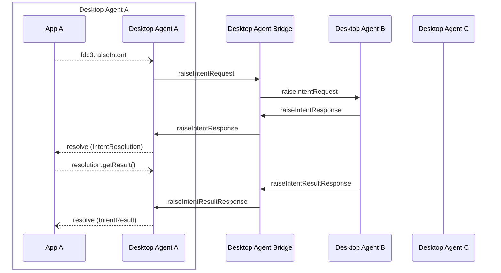

Desktop Agent bridging message exchange for a `raiseIntent` API call on the [`DesktopAgent`](../../api/ref/DesktopAgent). Generated by API calls:

- [`raiseIntent(intent: string, context: Context, app: AppIdentifier): Promise<IntentResolution>`](../../api/ref/DesktopAgent#raiseintent)
- [`raiseIntentForContext(context: Context, app: AppIdentifier): Promise<IntentResolution>`](../../api/ref/DesktopAgent#raiseintentforcontext)

[Message Exchange Type](../spec#individual-message-exchanges): **Request Multiple Response (single)**

For Desktop Agent Bridging, a `raiseIntent` message exchange MUST always pass an `app: AppIdentifier` argument to target the intent. Further, if no `instanceId` is set in the `AppIdentifier`, then it should be interpreted to mean *'spawn a new instance of the target application'*. A local FDC3 API implementation call would normally defer to a resolver UI or similar if there are multiple options for resolving a specified `appId` (i.e. existing instance(s) and the option spawning a new instance), whereas this message exchange assumes that resolution has already taken place on the source Desktop Agent.

Hence, if a target [`AppIdentifier`](../../api/ref/Types#appidentifier) is not passed in the original `DesktopAgent` API call, then the [`findIntent`](findIntent) message exchange should be used to collect options for the local resolver to use. Once an option has been selected (for example because there is only one option, or because the user selected an option in a local intent resolver UI), the `raiseIntent` message exchange may then be used (if a remote option was selected as the resolution) to raise the intent.

:::info

The same approach applies to `fdc3.raiseIntentForContext` calls, in that a [`findIntentByContext`](findIntentsByContext) message exchange should be used to collect options for the local resolver to use. Once an option has been selected (for example because there is only one option, or because the user selected an option in a local intent resolver UI), the `raiseIntent` message exchange is then used (if a remote option was selected as the resolution) to raise the intent.

:::

e.g. An application with appId `agentA-app1` makes the following API call:

```javascript
let appIntent = await fdc3.raiseIntent("StartChat", context);
```

Agent A should then conduct the `findIntent` message exchange as described above, displaying its Intent resolver UI if necessary. Once an option is selected, the `raiseIntent` message exchange is conducted as if the API call had been made with a target app:

```javascript
let appIntent = await fdc3.raiseIntent("StartChat", context, {"appId": "Slack", "desktopAgent": "agent-B"});
```

In the event that an agent referred to in the API call is not connected to the bridge, it is connected but times out or returns an error, its `DesktopAgentIdentifier` should be added to the `meta.errorSources` element instead of `meta.sources` in the `raiseIntentResponse` and the appropriate error (which might include any error from the [`ResolveError`](../../api/ref/Errors#resolveerror) enumeration, [`BridgingError.ResponseTimedOut`](../../api/ref/Errors#bridgingerror) or [`BridgingError.AgentDisconnected`](../../api/ref/Errors#bridgingerror)) should be added to `meta.errorDetails`.

:::tip

Desktop Agents MAY support the deprecated `raiseIntent` signature that uses the app `name` field by using the `findIntent` message exchange to attempt to resolve the `name` to an `AppIdentifier`.

:::

## Message exchange

:::note

Agent-C is not involved in the diagram below as the `raiseIntent` is always specified with a target application and Desktop Agent.

:::



## Request format

### Request message schemas

- [https://fdc3.finos.org/schemas/2.2/bridging/raiseIntentAgentRequest.schema.json](pathname:///schemas/2.2/bridging/raiseIntentAgentRequest.schema.json)
- [https://fdc3.finos.org/schemas/2.2/bridging/raiseIntentBridgeRequest.schema.json](pathname:///schemas/2.2/bridging/raiseIntentBridgeRequest.schema.json)

### Example

Outward message to the DAB:

```json
// agent-A -> DAB
{
    "type": "raiseIntentRequest",
    "payload": {
        "intent": "StartChat",
        "context": {/*contextObj*/},
        "app": { // AppIdentifier for chosen resolution including desktopAgent value
            "appId": "Slack",
            "desktopAgent": "agent-B"
            //Note an instanceId may be included to target an already running instance
        }
    },
    "meta": {
        "requestUuid": "<requestUuid>",
        "timestamp": "2020-03-...",
        "source": {
            "appId": "agentA-app1",
            "instanceId": "c6ad5174-6f78-4582-8e96-728d93a4d7d7"
        },
        "destination": { // duplicates the app argument so that the message is routed like any other
            "appId": "Slack",
            "desktopAgent": "agent-B"
        }
    }
}
```

The bridge fills in the `source.desktopAgent` field and forwards the request to the target Desktop Agent:

```json
// DAB -> agent-B
{
    "type": "raiseIntentRequest",
    "payload": {
        "intent": "StartChat",
        "context": {/*contextObj*/},
        "app": {
            "appId": "Slack",
            "desktopAgent": "agent-B"
            //Note an instanceId may be included to target an already running instance
        }
    },
    "meta": {
        "requestUuid": "<requestUuid>",
        "timestamp": "2020-03-...",
        "source": {
            "appId": "agentA-app1",
            "instanceId": "c6ad5174-6f78-4582-8e96-728d93a4d7d7",
            "desktopAgent": "agent-A" //added by DAB
        },
        "destination": { // duplicates the app argument so that the message is routed like any other
            "appId": "Slack",
            "desktopAgent": "agent-B"
        }
    }
}
```

## Response format

### Response message schemas

- [https://fdc3.finos.org/schemas/2.2/bridging/raiseIntentAgentResponse.schema.json](pathname:///schemas/2.2/bridging/raiseIntentAgentResponse.schema.json)
- [https://fdc3.finos.org/schemas/2.2/bridging/raiseIntentAgentErrorResponse.schema.json](pathname:///schemas/2.2/bridging/raiseIntentAgentErrorResponse.schema.json)
- [https://fdc3.finos.org/schemas/2.2/bridging/raiseIntentResultAgentResponse.schema.json](pathname:///schemas/2.2/bridging/raiseIntentResultAgentResponse.schema.json)
- [https://fdc3.finos.org/schemas/2.2/bridging/raiseIntentResultAgentErrorResponse.schema.json](pathname:///schemas/2.2/bridging/raiseIntentResultAgentErrorResponse.schema.json)
- [https://fdc3.finos.org/schemas/2.2/bridging/raiseIntentBridgeResponse.schema.json](pathname:///schemas/2.2/bridging/raiseIntentBridgeResponse.schema.json)
- [https://fdc3.finos.org/schemas/2.2/bridging/raiseIntentBridgeErrorResponse.schema.json](pathname:///schemas/2.2/bridging/raiseIntentBridgeErrorResponse.schema.json)
- [https://fdc3.finos.org/schemas/2.2/bridging/raiseIntentResultBridgeResponse.schema.json](pathname:///schemas/2.2/bridging/raiseIntentResultBridgeResponse.schema.json)
- [https://fdc3.finos.org/schemas/2.2/bridging/raiseIntentResultBridgeErrorResponse.schema.json](pathname:///schemas/2.2/bridging/raiseIntentResultBridgeErrorResponse.schema.json)

### Example

If the `raiseIntent` request were made locally, agent-B would deliver the intent and context to the target app's `IntentHandler` and respond to the raising application with an `IntentResolution`:

```javascript
{
    "intent": "StartChat",
    "source": {
        "appId": "Slack",
        "instanceId": "e36d43e1-4fd3-447a-a227-38ec48a92706"   
    },
    getResult: ƒ
}
```

This is encoded and sent to the bridge (omitting the `getResult()` function) as:

```json
// agent-B -> DAB
{
    "type": "raiseIntentResponse",
    "payload": {
        "intentResolution": {
            "intent": "StartChat",
            "source": {
                "appId": "Slack",
                "instanceId": "e36d43e1-4fd3-447a-a227-38ec48a92706"      
            }
        }
    },
    "meta": {
        "requestUuid": "<requestUuid>",
        "responseUuid": "<responseUuid>",
        "timestamp": "2020-03-..."
    }
}
```

:::tip

When producing a response to a `raiseIntent` request, the instance of the receiving application MUST be initialized (if it does not already exist) and an `instanceId` generated for it before the `IntentResolution` is generated so that it can include the `instanceId`.

:::

The bridge will fill in the `intentResolution.source.DesktopAgent` & `source.desktopAgent` and relay the message back to agent-A:

```json
// DAB -> agent-A
{
    "type": "raiseIntentResponse",
    "payload": {
        "intentResolution": {
            "intent": "StartChat",
            "source": {
                "appId": "Slack",
                "instanceId": "e36d43e1-4fd3-447a-a227-38ec48a92706",
                "desktopAgent": "agent-B" // added by DAB
            }  
        }
    },
    "meta": {
        "requestUuid": "<requestUuid>",
        "responseUuid": "<responseUuid>",
        "timestamp": "2020-03-...",
        "sources": [{ "desktopAgent": "agent-B" }] // added by DAB
    }
}
```

When `Slack` produces an `IntentResult` from its `IntentHandler`, or the intent handler finishes running without returning a result, it should send a further `raiseIntentResultResponse` message to indicate that it's finished running and to pass any `IntentResult` onto the raising application (setting either `payload.intentResult.context` or `payload.intentResult.channel` to indicate the type of the `IntentResult`, or leaving `payload.intentResult` empty to indicate a `void` result). There is no need to provide a `source` field in this response as the source information was already provided in the `raiseIntentResponse` message preceding it.

```json
// agent-B -> DAB
{
    "type": "raiseIntentResultResponse",
    "payload": {
        "intentResult": {
            "context": {/*contextObj*/}
            /* for a channel IntentResult use:
            "channel": {
                "id": "app-channel xyz",
                "type": "user"
            }

            or for a void result use leave this object empty.
            */

    },
    "meta": {
        "requestUuid": "<requestUuid>",
        "responseUuid": "<responseUuid 2>", //a different UUID should be used for the result response
        "timestamp": "2020-03-..."
    }
}
```

:::tip

If intent result is private channel see [PrivateChannels](../spec#privatechannels) for additional message exchanges that may be needed.

:::

Finally, the bridge augments the response with `sources[0].desktopAgent` and passes it back to Agent-A.

```json
// DAB -> agent-A
{
    "type": "raiseIntentResultResponse",
    "payload": {
        "context": {/*contextObj*/}
    },
    "meta": {
        "requestUuid": "<requestUuid>",
        "responseUuid": "<responseUuid 2>",
        "timestamp": "2020-03-...",
        "sources": [{ "desktopAgent": "agent-B" }] // added by DAB
    }
}
```

If the `IntentHandler` returned `void` rather than an intent result `payload` should be empty, e.g.:

```json
// DAB -> agent-A
{
    "type": "raiseIntentResultResponse",
    "payload": {},
    "meta": {
        "requestUuid": "<requestUuid>",
        "responseUuid": "<responseUuid 2>",
        "timestamp": "2020-03-...",
        "sources": [{ "desktopAgent": "agent-B" }] // added by DAB
    }
}
```
